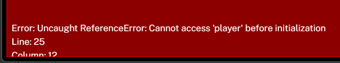

 ở 

# 🚀 BẢN THIẾT KẾ TRÒ CHƠI (GAME DESIGN DOCUMENT)

**Dự án:** [Tên Dự Kiến: NEON SYNAPSE / BIO-CORE PROTOCOL]
**Thể loại:** 2D Action-Platformer / Metroidvania (Mang linh hồn của Hollow Knight nhưng bối cảnh Sci-fi Bio-Punk)

---

## 1. CỐT TRUYỆN VÀ THẾ GIỚI (LORE & ATMOSPHERE)

**Cảm hứng từ Hollow Knight:** Cảm giác cô độc trong một vương quốc tàn lụi, những câu chuyện được kể qua cảnh vật (Environmental Storytelling) hơn là những đoạn hội thoại dài dòng.

* **Bối cảnh (The World):** Bạn không ở trong một vương quốc côn trùng, mà đang ở sâu bên trong **"The Macro-Organism"** - một siêu máy tính sinh học (Bio-mechanical Supercomputer) khổng lồ đã bị lãng quên hàng ngàn năm. Thế giới này là sự pha trộn giữa các mạch điện rỉ sét, cáp quang đứt gãy và những mô sinh học đang bị hoại tử (Toxic Depths, X-ray Labs, Neon Synapse).
* **Nhân vật chính (The Protagonist):** Bạn là **Probe X-7** (Thực thể Thăm dò sinh học). Một kháng thể cơ khí siêu nhỏ vừa tỉnh giấc. Bạn không có ký ức, không có giọng nói (Hollow), chỉ mang trong mình một nguồn năng lượng rực sáng (Cyan Energy).
* **Kẻ thù và Mối đe dọa (The Infection):** **"The Glitch" (Lỗi Đột Biến)** - Một loại virus vừa mang tính kỹ thuật số vừa mang tính sinh học. Nó ăn mòn hệ thống, khiến các robot phòng thủ phát điên và các sinh vật lai máy móc trở nên hung hãn. (Khá giống khái niệm Infection màu cam của Hollow Knight, nhưng ở đây là mã độc sinh học màu xanh acid / đỏ thẫm).
* **Mục tiêu:** Khám phá nguyên nhân sụp đổ của "The Macro-Organism", tiêu diệt các Lõi Nhiễm Độc (Corrupted Cores - Boss) và mở khóa cánh cửa dẫn đến "Trung tâm Não bộ" (Central Cortex).

---

## 2. CƠ CHẾ GAMEPLAY LÕI: SỰ KHÁC BIỆT (THE "NOT-A-CLONE" FACTOR)

Để tránh bị gọi là "Bản nhái Hollow Knight", chúng ta giữ lại **cấu trúc khám phá (Metroidvania)** nhưng thay đổi hoàn toàn **Nhịp độ chiến đấu (Combat Flow)**. Game của chúng ta sẽ dồn dập, bạo lực và cơ động hơn rất nhiều:

### A. Hệ Thống Nhiệt Năng (Overdrive / Heat System thay cho Soul)

* Ở HK, bạn chém quái để lấy năng lượng xài phép. Ở game này, bạn có một thanh **Overdrive (Quá Tải)**.
* Mỗi khi bạn chém trúng địch, thanh Overdrive sẽ tăng lên. Khi thanh này đạt mức cao (Trên 50%), bạn bước vào trạng thái **"Neon Surge"**: Tốc độ đánh, tốc độ chạy tăng 30%, và đòn chém tạo ra kiếm khí bắn xa.
* **Đánh đổi:** Các kỹ năng siêu mạnh (Laser K, Ground Smash) sẽ **tiêu thụ toàn bộ thanh Overdrive**.
* **Hồi máu (Reboot):** Thay vì đứng yên gồng máu như HK, bạn có thể bấm phím Q để tiêu thụ 50% Overdrive và tạo ra một vụ nổ nhỏ đẩy lùi địch, đồng thời hồi 1 Lõi Máu. Đậm chất hành động không ngắt nhịp!

### B. Chuyển Động Điện Từ (Magnetic Tether & Grapple)

* HK nổi tiếng với trò Pogo (chém xuống nảy lên). Chúng ta VẪN GIỮ Pogo, nhưng bổ sung thêm **Magnetic Tether (Dây Móc Điện Từ)**.
* Bạn có thể phóng dây móc vào tường, trần nhà hoặc **kéo bản thân lao thẳng vào kẻ địch** từ khoảng cách xa. Khả năng không chiến (Aerial Combat) của game sẽ đa dạng hơn HK rất nhiều, tạo ra các pha combo bay lượn trên không trung cực kỳ đẹp mắt.

### C. Cơ Chế Chuyển Dạng (Bio & Cyber Phase)

* Bạn là một thực thể lai. Bằng một nút bấm (Ví dụ phím C), bạn đổi giữa 2 form:
  - **Bio-Form (Màu Xanh Lá - Acid):** Chém chậm, sát thương diện rộng, kháng đòn tốt. Có thể đập vỡ đá.
  - **Cyber-Form (Màu Xanh Dương - Neon):** Chém siêu tốc, lướt nhanh, có thể đi xuyên qua các bức tường laser. Bị nhận thêm sát thương.
* Việc đổi Form liên tục để giải đố và đánh Boss sẽ là điểm nhấn ĐỘC QUYỀN của tựa game này.

### B. Hệ thống Chuyển động (Metroidvania Movement)

* **Tight Controls:** Cảm giác điều khiển phải sắc bén, dừng lại ngay khi thả phím, hitbox cực kỳ chính xác.
* **Pogo Strike (Chém Cắm Xuống):** Khi đang nhảy, ấn `S + J` (Đánh xuống). Nếu chém trúng kẻ địch, gai nhọn, hoặc vật thể nảy, bạn sẽ bị nảy ngược lên không trung. Kỹ năng này cho phép bạn "nhảy lò cò" trên đầu kẻ địch để qua các hồ Acid khổng lồ (Core mechanic không thể thiếu của HK).
* **Kỹ năng mở rộng bản đồ (Abilities):** Bắt đầu game bạn chỉ biết đi và chém. Dần dần khi đánh bại Boss, bạn sẽ nhận được các Mô-đun nâng cấp mở đường:
  1. *Plasma Dash (Tương đương Mothwing Cloak).*
  2. *Magnetic Claws (Bám tường / Mantis Claw).*
  3. *Bio-Drill (Đập đất phá đá / Desolate Dive).*
  4. *Wings (Double Jump / Monarch Wings).*

### C. Cơ chế Trừng Phạt (Death & Penalty)

* **Memory Fragments (Tiền tệ):** Đánh bại kẻ địch rớt ra các mảnh dữ liệu. Dùng để mua Mô-đun (giống Geo).
* **Khi tử nạn:** Bạn hồi sinh tại Trạm Lưu Trữ (Save Terminal) gần nhất. Bạn sẽ đánh rơi toàn bộ số "Memory Fragments" và 1/3 thanh Năng Lượng Tối Đa.
* **Bóng Ma Dữ Liệu (The Echo / Shade):** Tại nơi bạn chết, một bản sao bóng tối của bạn (The Echo) sẽ xuất hiện. Bạn phải quay lại đó, đánh bại chính bản sao của mình để lấy lại tiền và năng lượng.

---

## 3. HỆ THỐNG KỸ NĂNG VÀ COMBAT HIỆN TẠI (Tích hợp)

* **[Phím J] Laser Blade (Nail):** Đòn đánh thường 3 nhịp. Tầm vung kiếm (hitbox) rộng hình vòng cung, chém nhanh, uy lực, có đẩy lùi địch để giữ khoảng cách.
* **[S + J] Pogo Strike:** Đòn đánh từ trên không xuống. Rất cần thiết cho Platforming.
* **[Phím K] Plasma Dash (Skill):** Gồng năng lượng và lướt qua kẻ địch. Nếu trúng địch, bắn ra tia Laser khổng lồ xuyên thấu bản đồ. Sát thương trung bình, nhưng có thể lướt qua đòn đánh của địch (i-frames).
* **[Phím L] Lightning Nova (Spell):** Tiêu hao Core Charge. Gồng và giải phóng một vụ nổ sóng điện từ (EMP) hình tròn, gây sát thương cực lớn xung quanh.
* **[W + I] Rising Blast:** Đánh hất tung kẻ địch lên không (Juggle).
* **[W + J / S + L] Ground Smash (Spell):** Tiêu hao Core Charge. Lao vút lên không và giáng đòn sập đất, tạo ra luồng sóng xung kích màu Cyan tiêu diệt địch 2 bên. Dùng để phá vỡ các mặt sàn mục nát để xuống các khu vực bí mật.

---

## 4. HỆ THỐNG NÂNG CẤP (Tương đương "Charms")

* **System Modules (Mô-đun Hệ Thống):** Bạn có một "Bo mạch chủ" (Motherboard) với số "Khe cắm" (Slots) hạn chế (giống Charm Notches).
* Tại các Trạm Lưu Trữ (Băng ghế/Save point), bạn có thể tháo lắp các Mô-đun để thay đổi lối chơi tùy vào tình huống:
  * *Vampire Code:* Hồi nhiều Core Charge hơn từ đòn đánh. (Chiếm 2 Slots).
  * *Thorns Overload:* Bắn ra tia điện khi bị nhận sát thương. (Chiếm 1 Slot).
  * *Longnail Extension:* Kéo dài tầm chém của vũ khí. (Chiếm 2 Slots).
  * *Dashmaster Chip:* Giảm Cooldown của kỹ năng lướt (K), cho phép lướt nhanh hơn. (Chiếm 2 Slots).

---

## 5. KẾ HOẠCH PHÁT TRIỂN TIẾP THEO (ROADMAP)

### Giai đoạn 1: Hoàn thiện Core Feel (Trải nghiệm Điều khiển)

- Tinh chỉnh `Pogo Strike`: Lập trình logic để khi đòn chém chĩa xuống (S+J) quét trúng hitbox của quái vật hoặc vật thể đặc biệt, `vy` của nhân vật bị ép ngay thành `-600` (Nảy vút lên).
- Hit-stop (Juice): Khi chém trúng quái vật, đóng băng cả hai (player và quái) trong khoảng `0.05s` để đòn đánh có sức nặng. Lùi quái vật về sau một chút (Knockback).

### Giai đoạn 2: Thiết kế Quái vật & AI

- **Swarmer (Crawler):** Quái bò dưới mặt đất, tốc độ chậm. Hành vi: đi tuần tra, đụng tường thì quay lại.
- **Turret (Flyer):** Bay lơ lửng, khi người chơi vào tầm nhìn sẽ bắn đạn theo chu kỳ.
- **Charger (Husk):** Phóng thẳng về phía người chơi với tốc độ cao khi phát hiện mục tiêu. Cần lướt (Dash) để né và chém từ phía sau.

### Giai đoạn 3: Metroidvania Level Design (Thiết kế Màn Chơi Liên Kết)

- Bỏ khái niệm qua màn (Stage 1, Stage 2). Toàn bộ game là 1 màn chơi khổng lồ được chia thành các Room (Phòng).
- Khi đi hết biên (Edge) của một phòng, camera chuyển cảnh sang phòng tiếp theo.
- Tạo những lối đi bị chặn (Blockers) yêu cầu phải có kỹ năng mới để qua:
  * Bức tường đất nứt gãy -> Cần `Ground Smash`.
  * Hố Acid siêu dài -> Cần `Dash` hoặc nhảy `Pogo` trên các con quái bay lơ lửng để qua bờ bên kia.

### Giai đoạn 4: UI & Đánh Bóng (Polish)

- Thay đổi thanh máu thành dạng UI biểu tượng (Lõi năng lượng). Ví dụ: 5 Lõi. Trúng đòn mất 1 Lõi. Rất dễ nhìn và tạo căng thẳng.
- UI Core Charge: Một bình chứa (Vial) bên góc màn hình, dâng nước từ từ khi chém trúng địch, và nhấp nháy khi đủ mana xài phép.

---

## 6. CỐT TRUYỆN: DỰ ÁN SYMBIOSIS (DARK YANDERE BỘI CẢNH)

**Thời lượng dự kiến:** 4 tiếng chơi chính, 5 tiếng khám phá 100%.
**Định hướng:** Dark Sci-fi, Biopunk, Psychological Horror. Sự ám ảnh, biến đổi nhân dạng, và tình yêu độc hại (Yandere).

* **Bối cảnh (Aegis Abyss):** Cơ sở nghiên cứu khổng lồ dưới lòng đất bị phong tỏa sau "Rò rỉ thảm họa". Không còn con người sống sót, chỉ có quái vật và an ninh mạng.
* **Nhân vật chính (Zero - Tức "Bạn"):** Bị lai tạp giữa máy (Dạng Cyber) và quái vật sinh học (Dạng Bio). Tỉnh dậy mất trí nhớ.
* **Nữ chính Yandere (Tiến sĩ Eleanor / "El"):** Cô gái duy nhất sống sót, liên lạc với bạn qua chip não bộ. Cô ta có vẻ ngoài cực kỳ xinh đẹp, giọng điệu ngọt ngào, quan tâm chăm sóc, gọi bạn là "Người thương duy nhất".

**Các Plot Twist (Nút Thắt Câu Chuyện):**
1. **Sự thật về tai nạn:** Không hề có tai nạn nào. Eleanor đã tự tay thả virus và thảm sát toàn bộ nhân sự vì họ định tiêu diệt bạn (vốn là một vật thí nghiệm bị coi là thất bại/nguy hiểm).
2. **Ảo giác tàn khốc:** Những "quái vật" mà bạn đang xé xác từ đầu game thực chất là Lực lượng Đặc nhiệm Cứu hộ từ mặt đất cử xuống. Con chip của Eleanor đã hack hệ thống thần kinh của bạn, bóp méo hình ảnh họ thành quái vật để bạn tàn sát đồng loại mà không hề áy náy.
3. **Thân phận thật (Darkest Twist):** Zero từng là người yêu/nhà nghiên cứu cùng Eleanor, đã chết 2 năm trước. Cô ta điên loạn đào xác anh lên, giữ lại não bộ và ghép nối nó vào cái xác quái vật này để "hồi sinh" tình yêu của mình.
4. **Mục đích cuối cùng:** Con đường Eleanor chỉ dẫn không phải để thoát lên mặt đất, mà đâm thẳng xuống The Sanctuary (Tầng hầm phong ấn sâu nhất), nơi cô ta muốn nhốt bạn lại sống bên cô ta mãi mãi.

**Kết cục (Endings):**
- **Bad End (Không tìm đủ mảnh ghép ký ức):** Bạn bước vào hầm, cánh cửa đóng sầm lại. Màn hình tắt ngấm với tiếng cười của Eleanor. Bạn mãi là súc vật nuôi của cô ta trong bóng tối.
- **True End (Khám phá 100% bản đồ):** Bạn tự tay xé nát con chip, đối mặt với Eleanor. Cô ta tự tiêm virus tối thượng vào người, biến thành một Nữ Chúa nửa người/nửa máy khổng lồ để giữ bạn lại (Final Boss Fight). Sau khi hạ gục cô ta, cô ta chết trong vòng tay bạn. Bạn trốn thoát lên mặt đất, nhưng nhận ra cơ thể sinh-cơ học này không thể sống thiếu không khí của phòng thí nghiệm, gục ngã dưới bình minh. 

---

## 7. DANH SÁCH TÀI NGUYÊN (ASSET REQUIREMENTS) CẦN THIẾT

Để tạo hình cốt truyện này và thu hút người chơi (với hình tượng Yandere 2 dạng), dưới đây là danh sách các ảnh/Sprite cần chuẩn bị. Hãy dùng AI hoặc tự vẽ các tài nguyên này:

### A. Nhân Vật Nữ Chính Yandere (Eleanor)
*Để thu hút người chơi (đặc biệt là phái nam), dạng Người (Human Form) cần phải rất xinh đẹp, phong cách anime sắc sảo nhưng ánh mắt có phần vô hồn, ám ảnh. Dạng Quái (Monster Form) thì mang nét kinh dị sinh học (Biopunk/Body Horror).*

1. **Avatar Hội Thoại (Human Form - Dạng người):**
   - *Mô tả:* Chân dung (Portrait) một nữ khoa học gia trẻ tuổi, mặc áo blouse trắng xộc xệch hoặc đồ bó sát công nghệ. Tóc dài rối màu trắng hoặc xanh nhạt. Khuôn mặt anime xinh đẹp, ánh mắt sâu thẳm, có thể có chút máu vương trên má. Nụ cười mỉm dịu dàng nhưng đáng sợ.
   - *Kích thước:* 512x512 hoặc lớn hơn (Hình vuông có nền trong suốt, PNG).
2. **Avatar Hội Thoại (Glitch Form - Khi tức giận):**
   - *Mô tả:* Cùng một góc mặt như trên, nhưng ánh mắt trợn trừng điên loạn, con ngươi thu nhỏ, nụ cười méo mó. Hình ảnh có hiệu ứng giật nhiễu (Glitch) đỏ rực.
3. **Sprite Boss Cuối (Monster Form - Nữ Chúa Biopunk):**
   - *Mô tả:* Sprite khổng lồ (kích thước gấp 4 lần nhân vật chính). Nửa trên vẫn giữ lại khuôn mặt và phần thân trên xinh đẹp của Eleanor (có thể bị rách rưới nứt nẻ lòi cả lõi máy), nhưng từ hông trở xuống là một khối nhầy nhụa xúc tu sinh học màu xanh lục kết hợp với các chi tiết kim loại gỉ sét màu đỏ.
   - *Animation cần:* Idle (Thở dốc), Đập xúc tu (Attack 1), Bắn Laser từ mắt (Attack 2), Chết (Tan chảy).

### B. Môi trường & Giao diện (UI & Backgrounds)
1. **Khung Chat Hội Thoại (Dialogue Box):**
   - *Mô tả:* Một dải nền UI màu đen bán trong suốt, viền màu Cyan neon (phong cách Cyberpunk) hoặc gỉ sét. Để text chạy bên trong.
2. **Background - Khu Lưu Trữ (Memory Fragment Background):**
   - *Mô tả:* Các mảnh giấy hoặc băng ghi âm dính máu.
3. **Background - "The Sanctuary" (Phòng Boss Cuối):**
   - *Mô tả:* Tầng hầm sâu nhất. Trông giống một căn phòng tân hôn điên rồ: Vừa có giường ngủ, nến, vừa có hàng ngàn dây cáp cắm vào tường, bình chứa dung dịch ngâm nội tạng, bệ thờ tôn giáo lai tạp máy móc. Tông màu đỏ tối (Dark Red) và Đen.

### C. Quái vật (Kẻ thù) - Cần 2 phiên bản
*Do tính chất ảo giác, chúng ta cần 2 set quái vật. Khi người chơi chưa biết sự thật, nó là quái vật. Khi UI bị nhiễu sóng (glitch), nó lộ ra hình dạng thật chớp nhoáng.*

1. **Enemy Set 1 (Quái Vật Đột Biến - Ảo Giác):**
   - Dáng đi khom lưng, toàn thân là khối thịt nhầy nhụa hoặc lắp ghép với lưỡi cưa máy. Trông rùng rợn.
2. **Enemy Set 2 (Đội Cứu Hộ - Sự thật):**
   - Sprite chớp nhoáng (Glitch sprite). Hình dáng giống hệt các binh lính đặc nhiệm mặc giáp bảo hộ (Hazmat suit) hoặc giáp SWAT tương lai, cầm súng chĩa vào bạn. Dáng đi của Set 1 sẽ khớp với hình dáng này, tạo cảm giác họ đang giơ súng chống cự chứ không phải vồ lấy bạn.

*(Nếu bạn không có các Sprite này, hãy cho tôi biết, tôi có thể cung cấp đoạn mã để tạo khối vuông giả lập (placeholder) hoặc dùng công cụ sinh ảnh AI `generate_image` nếu hệ thống cho phép).*
