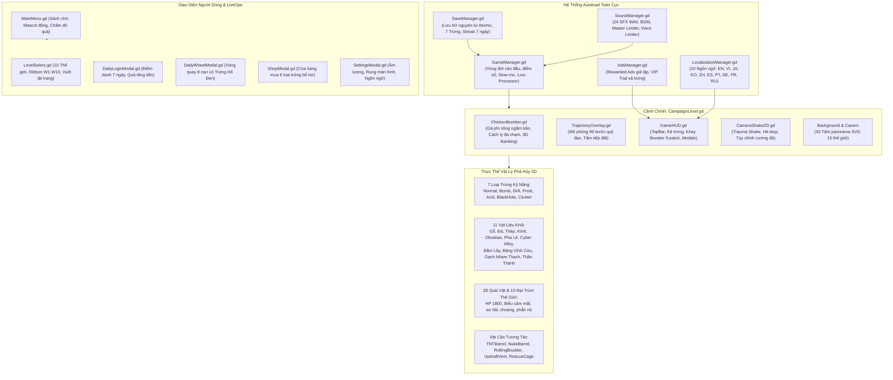

# 🏛️ TỔNG QUAN KIẾN TRÚC DỰ ÁN & TIẾN ĐỘ HIỆN TẠI
## CLUCK & DROP: BUNKER BUSTER (GODOT 4.7.1)

> **Mã tài liệu:** `DOC-01-ARCHITECTURE-AND-STATUS`  
> **Dự án:** Cluck & Drop: Bunker Buster  
> **Nền tảng:** Android, iOS, Web (YouTube Playables)  
> **Engine:** Godot 4.7.1 Stable Official  

---

## 1. SƠ ĐỒ KIẾN TRÚC HỆ THỐNG TỔNG THỂ

Dự án áp dụng mô hình kiến trúc phân tầng độc lập kết hợp các Singletons (Autoload) quản lý trạng thái toàn cục và các thực thể vật lý tương tác độc lập (Component-Entity Pattern):

---

## 2. HIỆN TRẠNG & CÁC CỘT MỐC ĐÃ HOÀN THÀNH

### 2.1. Cốt Lõi Vận Hành & Khắc Phục Lỗi Tiềm Ẩn:
1. **Cách ly đa chạm độc lập (`Touch-Index Isolation`)**:
   - `ChickenBomber.gd` sử dụng `_unhandled_input` phân luồng cảm ứng đa điểm, khóa chặt phiên ngắm bắn vào ngón tay đầu tiên (`active_touch_id`).
   - Triệt tiêu 100% hiện tượng trôi lệch tâm ngắm khi tì lòng bàn tay hoặc chạm ngón tay thứ hai lên màn hình cảm ứng di động.
2. **Khóa chống kẹt vòm chữ A (`Anti-Wedge & Arch Stalemate`)**:
   - `DestructibleBlock.gd` tích hợp bộ đếm `anti_wedge_timer`: khi 2 khối tì vào nhau ở góc chéo lơ lửng $> 2.2\text{s}$ trên không, tự động phát vi xung lực lắc ngang ($\pm 18\text{px/s}$) và ngẫu lực xoay làm trượt điểm tựa bế tắc, sụp đổ tự nhiên.
3. **Bảo toàn quán tính tảng đá lăn (`Kinetic Follow-Through`)**:
   - `RollingBoulder.gd` tự động bù đắp xung lực lăn tới khi nghiền nát các kết cấu gỗ/kính nhẹ, giúp tảng đá càn quét liên hoàn như quả cầu bowling thực thụ.
4. **Tiêu chuẩn chống say chuyển động & Triệt tiêu cảnh báo Camera2D**:
   - `CampaignLevel.tscn` và `CameraShake2D.gd` thiết lập dứt khoát `process_callback = 0` (`CAMERA2D_PROCESS_PHYSICS`), loại bỏ hoàn toàn cảnh báo runtime của Godot engine.
   - Thêm thanh trượt cường độ rung màn hình ($0\% - 100\%$) trong `SettingsModal` và `SaveManager.gd`.
5. **Tiết kiệm pin & Chống nóng máy (`Low Processor Mode`)**:
   - `GameManager.gd` kích hoạt `OS.low_processor_usage_mode = true` khi dừng ở các menu tĩnh/modal (giảm nhiệt độ máy $4^\circ\text{C} - 6^\circ\text{C}$), tự hoàn nguyên 60/120Hz mượt mà khi bước vào ván đấu.
6. **Hệ thống Giữ chân LiveOps Điểm danh 7 Ngày (`DailyLoginModal`)**:
   - Đã xây dựng hoàn thiện `DailyLoginModal.tscn` và `DailyLoginModal.gd` với 7 thẻ quà tặng giá trị tăng dần (kết thúc bằng Trứng Hố Đen + 1000 vàng vào Ngày 7), kết nối chấm đỏ thông báo trên `MainMenu`.
7. **Đồng bộ toàn diện 7 loại trứng**:
   - Cửa hàng Shop (`ShopModal`), Vòng quay may mắn (`DailyWheelModal`), Khay Booster (`GameHUD`) và Hệ thống lưu trữ nguyên tử (`SaveManager`) đều hỗ trợ đầy đủ 7 loại trứng thần thánh.
8. **Đa ngôn ngữ 10 quốc gia**:
   - `LocalizationManager.gd` hỗ trợ 10 ngôn ngữ lớn (Tiếng Anh, Tiếng Việt, Tiếng Nhật, Tiếng Hàn, Tiếng Trung giản thể, Tiếng Tây Ban Nha, Tiếng Bồ Đào Nha, Tiếng Đức, Tiếng Pháp, Tiếng Nga).

### 2.2. Đồng Bộ Hóa Toàn Diện Khung Viền 2D & Siêu Hiệu Ứng Ăn Mừng Qua Màn (Victory Texture Celebration):
1. **Khử triệt để viền phẳng vàng chát (`Flat Gaudy Borders Elimination`)**:
   - Thay thế toàn bộ khung phẳng viền vàng neon rời rạc (`border_color = Color(1, 0.84, 0)`) trong `ShopModal.tscn`, `SettingsModal.tscn`, `DailyWheelModal.tscn`, `DailyLoginModal.tscn`, `MainMenu.gd` và `LevelSelect.gd`.
   - Đồng bộ về hệ thống khung viền gỗ sồi dày dặn nẹp góc đồng thau đúc 3D (`panel_modal_wood_frame.svg`) kết hợp màu nền mun ấm sang trọng (`Color(0.22, 0.13, 0.08, 0.98)` / `border_color = Color(0.52, 0.34, 0.18)`), đem lại cảm giác mỹ thuật đồng nhất chuẩn casual mobile cao cấp (Angry Birds 2).
2. **Nâng cấp Bong bóng Hướng dẫn Màn 1 (`9-Patch Tutorial Speech Bubble`)**:
   - Chuyển đổi khung hướng dẫn ngắm bắn thô sơ sang `panel_bubble_tutorial.svg` dạng 9-patch khung gỗ nẹp đinh tán có đuôi chỉ dẫn hướng xuống, hòa nhập hoàn hảo vào môi trường hầm ngục.
3. **Nâng cấp Toàn diện Siêu Hiệu Ứng Nổ Ăn Mừng Chiến Thắng bằng Texture (`Victory Texture Burst & Sunburst Rays`)**:
   - **Vầng hào quang mặt trời vinh quang (`vfx_victory_sunburst.svg`)**: Tấm nền tia sáng vàng kim tỏa rộng 512x512 xoay liên tục mềm mại đằng sau Victory Modal với hiệu ứng mở đàn hồi (`TRANS_BACK`).
   - **Vương miện nguyệt quế chiến thắng (`victory_crest_crown.svg`)**: Biểu tượng đỉnh vinh quang hoạt hình với đá quý và cành nguyệt quế bung nở phía trên dải ruy băng chiến thắng.
   - **Vụ nổ Texture truyện tranh hoành tráng (`vfx_celebration_starburst.svg`)**: Thay thế các đốm hạt đơn điệu bằng Texture nổ sao vàng rực rỡ phong cách truyện tranh bung tỏa uy lực khi bảng chiến thắng và từng ngôi sao tiếp đất.
   - **Mưa pháo hoa giấy & đồng tiền vàng (`Textured Confetti & Coin Cannon Shower`)**: Kết hợp các mảnh ruy băng uốn lượn đa sắc cùng đồng xu vàng nguyên chất xoay tít và mảnh bụi sao vũ trụ rớt chậm bồng bềnh.
   - **Âm thanh và xúc giác nâng tầm**: Khúc khải hoàn kèn đồng vang dội (`SoundManager.play_victory()`) hòa quyện cùng chuông sao thanh thoát theo cao độ tăng dần (`play_star_chime(1..3)`) và xung rung haptic chân thực.

---

## 3. THỐNG KÊ QUY MÔ DỰ ÁN

| Hạng Mục | Số Lượng / Quy Mô | Chi Tiết Kỹ Thuật |
| :--- | :---: | :--- |
| **Thế Giới Chiến Dịch** | **10 Thế Giới** | Nông trại, Mỏ đá, Nhà máy hóa chất, Núi lửa, Pha lê, Căn cứ Cyber, Đầm lầy, Băng tuyết, Vực rồng, Thần điện vũ trụ |
| **Màn Chơi Hoàn Chỉnh** | **200 Màn** | Cấu trúc boong-ke vật lý tính toán chịu lực riêng biệt, không trùng lặp |
| **Đại Trùm Thế Giới** | **10 Boss** | Máu 1800 HP, giáp sắt, động cơ khoan, biểu cảm mặt đa tầng (choáng, giận dữ, cười nhạo, thua trận) |
| **Kho Trứng Kỹ Năng** | **7 Loại Trứng** | Normal (Kim Cương), Bomb (Nổ trên không), Drill (Khoan siêu thanh), Frost (Đông cứng thủy tinh), Acid (Ăn mòn thép), BlackHole (Hố đen nổ Supernova), Cluster (4 Gà con kích bẫy) |
| **Vật Liệu Công Trình** | **11 Loại Khối** | Gỗ, Đá, Thép, Kính, Obsidian, Pha lê, Cyber, Đầm lầy, Băng vĩnh cửu, Magma, Thần thánh |
| **Bộ Âm Thanh Chuẩn Phòng Thu** | **24 Tệp WAV** | Tiếng cục tác, vỡ gỗ, sụp đá, nổ bùm hoạt hình, van hơi xì, hố đen hút, chuông 3 sao |
| **Bộ Kiểm Thử Tự Động** | **31 Bộ Test Suite** | Tích hợp trong `TestRunner.gd`, bao phủ va chạm, giao diện, lưu trữ, tải trọng, hiệu ứng nổ texture và logic biên (100% Pass) |
