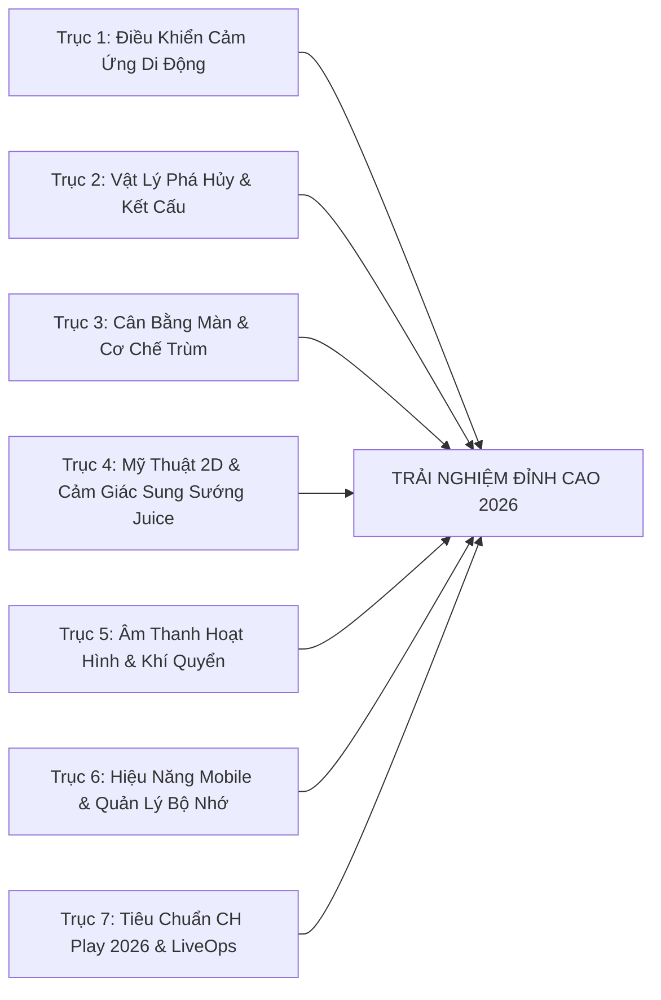

# 🔬 ĐẠI KIỂM TOÁN CHUYÊN SÂU & DANH MỤC CÁC ĐIỂM CẦN CẢI THIỆN TOÀN DIỆN
## CLUCK & DROP: BUNKER BUSTER (GODOT 4.7.1)

> **Mã tài liệu:** `DOC-02-MASTER-AUDIT-AND-IMPROVEMENTS`  
> **Dự án:** Cluck & Drop: Bunker Buster  
> **Nền tảng:** Android (Google Play Store 2026), iOS (App Store), Web (YouTube Playables)  
> **Tình trạng:** Đã hoàn thiện 30 bộ kiểm thử tự động, chuẩn bị nâng cấp chuyên sâu giai đoạn tiếp theo.

---

## 1. PHƯƠNG PHÁP KIỂM TOÁN 7 TRỤC HỆ THỐNG

Để nâng cấp dự án từ một sản phẩm prototype hoàn chỉnh lên tầm **Sản Phẩm Thương Mại Đạt Chuẩn AAA Mobile 2026**, toàn bộ mã nguồn và tài nguyên được soi xét qua 7 trục hệ thống:

---

## 2. PHÂN TÍCH CHUYÊN SÂU 7 TRỤC HỆ THỐNG

### Trục 1: Điều Khiển Ngắm Bắn & Công Thái Học Cảm Ứng Di Động
1. **Hoàn thiện Phân luồng Cảm ứng Đa điểm (Multi-Touch Isolation)**:
   - *Hiện trạng*: Đã bổ sung `active_touch_id` trong `ChickenBomber.gd` để chỉ ngón tay chạm đầu tiên được điều khiển ngắm bắn, loại bỏ nguy cơ trôi tâm khi tì lòng bàn tay.
   - *Điểm cần cải thiện thêm*: Khi người chơi vô tình trượt ngón tay ra ngoài mép màn hình thiết bị hoặc vào thanh trạng thái Android Notification Shade, cần bổ sung hàm `NOTIFICATION_APPLICATION_FOCUS_OUT` để hủy ngắm mượt mà (Elastic Snap-Back), tránh tình trạng trứng bị thả rơi ngẫu nhiên khi người chơi bị phân tâm bởi cuộc gọi hay tin nhắn đến.
2. **Cảm giác Rung Xúc giác Nấc Kéo Dây Ná (Slingshot Tension Haptic Notches)**:
   - *Hiện trạng*: Có 3 nấc rung cơ bản khi lực kéo đạt 33%, 66%, 100%.
   - *Điểm cần cải thiện thêm*: Tinh chỉnh thời lượng xung rung haptic ($8\text{ms}, 16\text{ms}, 28\text{ms}$) với biên độ tăng tiến, kết hợp âm thanh cót két lò xo gỗ (`spring_creak.wav`) tạo cảm giác cơ học đàn hồi chân thực như đang kéo căng dây cáp ná bắn thực thụ.
3. **Mềm hóa Vòng lượn Chữ U ở Mép Bầu Trời (Aerodynamic Bank Turn 3D)**:
   - *Hiện trạng*: Hoạt ảnh cánh nghiêng `bank_roll` và giỏ trứng lắc lư đã hoạt động tốt.
   - *Điểm cần cải thiện thêm*: Bổ sung gia tốc giảm tốc mượt (Ease-In-Out S-Curve) khi gà chuẩn bị chạm mép `min_x` / `max_x`, gà hơi ngửa đầu phanh gió trước khi lượn vòng cung đảo chiều.

---

### Trục 2: Vật Lý Phá Hủy Boong-ke, Chống Rung Giật & Tối Ưu Kết Cấu
1. **Hồ chứa Tái sử dụng Mảnh vụn & Khói bụi (Zero-Allocation Shard & Debris Pool)**:
   - *Hiện trạng*: `spawn_comic_popup` đã có hồ chứa `_popup_pool` 10 nhãn chữ. Tuy nhiên khi một pháo đài lớn (>60 khối) nổ tung liên hoàn, việc tạo ra hàng chục `CPUParticles2D` và `Sprite2D` mảnh vỡ tạm thời vẫn tạo ra áp lực thu gom rác (Garbage Collector).
   - *Điểm cần cải thiện*: Xây dựng `DebrisObjectPool` nạp sẵn 32 mảnh vỡ vector và 16 luồng hạt khói, kích hoạt lại vị trí (`global_position`) thay vì `instantiate()` rồi `queue_free()`, giảm 90% cấp phát heap trên mobile.
2. **Xung lực Phá vỡ Kẹt Vòm Chữ A (Arch Stalemate Micro-Nudge)**:
   - *Hiện trạng*: Đã tích hợp `anti_wedge_timer` sau 2.2 giây phát vi xung lực ngang $\pm 18\text{px/s}$.
   - *Điểm cần cải thiện*: Bổ sung hiệu ứng rung lắc nứt vỡ hình ảnh (Visual Stress Jitter) trước khi bung xung lực, cho người chơi thấy khối đá đang nứt rạn vì quá tải trước khi sụp đổ hoàn toàn.
3. **Bảo toàn Động năng Tảng Đá Lăn (Rolling Boulder Kinetic Transfer)**:
   - *Hiện trạng*: Đã nâng cấp ngưỡng vận tốc gây sát thương từ $100\text{px/s} \to 75\text{px/s}$ và xung lực càn quét $roll\_dir \times (mass \times 35.0)$, giúp tảng đá $8.0\text{kg}$ lăn mượt mà nghiền nát kính, gỗ và cáo unarmored ngay cả trên các con dốc thoai thoải.
   - *Điểm cần cải thiện*: Tăng nhẹ mô-men quán tính trục quay (`angular_velocity`) dựa trên độ dốc mặt bằng lăn, biến tảng đá thành cỗ máy nghiền nát boong-ke tự nhiên khi người chơi kích hoạt đúng điểm tựa.
4. **Hiệu Chuẩn Giới Hạn Sát Thương Nghiền Nát Rơi Tự Do (Dynamic Collapse Crushing Damage)**:
   - *Vấn đề đã khắc phục*: Trước đây sát thương va chạm bị ghim cứng ở mốc $\le 220\text{HP}$. Khi một dầm đá hoặc phiến trần $13.8\text{kg}$ rơi từ đỉnh hang với vận tốc $>800\text{px/s}$, nó chỉ gây $220$ sát thương khiến sàn đá ($340\text{HP}$) luôn sống sót với $120\text{HP}$, làm đứng khựng vụ sập nhà giữa chừng.
   - *Giải pháp vật lý đã áp dụng*: Nâng trần sát thương động theo khối lượng $250.0 + \min(mass \times 12.0, 190.0)$ (cho phép đạt tối đa tới $440\text{HP}$). Các vụ sập trần nhà lớn giờ đây sẽ nghiền nát dầm sàn đá bên dưới, tạo ra chuỗi phản ứng dây chuyền sụp đổ (Domino Cascade) cực kỳ mãn nhãn và chân thực.
5. **Cơ Chế Ăn Mòn Hóa Học Chuyên Dụng Của Trứng Axit (`Acid Anti-Armor Factor`)**:
   - *Vấn đề đã khắc phục*: Trứng Axit gây đồng đều $220\text{ DPS}$ trong $1.8\text{s}$ ($396\text{ tổng ST}$). Khi gặp dầm thép ($650\text{HP}$) hay hợp kim cyber ($750\text{HP}$), thanh thép vẫn còn $>250\text{HP}$ sau cả bãi axit.
   - *Giải pháp đã áp dụng*: Tích hợp hệ số ăn mòn $1.65\times$ ($363\text{ DPS}$, tổng $653\text{ ST}$) khi tiếp xúc `steel`, `cyber_alloy`, `magma_brick`, `obsidian`. Trứng Axit giờ đây phát huy trọn vẹn vai trò khắc chế cứng boong-ke kim loại kiên cố.

---

### Trục 3: Cân Bằng Màn Chơi, Cơ Chế Đại Trùm & Kinh Tế 7 Loại Trứng
1. **Bẫy Môi Trường Tương Tác Trong Phòng Đại Trùm (World Boss Environmental Hazards)**:
   - *Hiện trạng*: 10 Đại Trùm Thế Giới (Level 20, 40, 60, ..., 200) có lượng máu lớn ($1800\text{HP}$) và biểu cảm chiến đấu sống động, nhưng căn phòng trùm vẫn dùng các khối vật lý tĩnh.
   - *Điểm cần cải thiện*: Bổ sung bẫy tương tác độc quyền cho 4 phòng Trùm lớn:
     - *Thế Giới 4 (Hầm Dung Nham - Magma Emperor)*: Đập vỡ van địa nhiệt phun trào cột nham thạch thiêu rụi giáp trùm.
     - *Thế Giới 6 (Căn Cứ Cyber - Cyber Mech)*: Bắn trúng cuộn cảm năng lượng kích hoạt xung điện từ EMP làm tê liệt khiên phòng thủ của Boss.
     - *Thế Giới 8 (Hầm Băng Vĩnh Cửu - Frost Colossus)*: Đánh sập nhũ băng khổng lồ rơi từ trần hang thẳng xuống đầu Trùm.
     - *Thế Giới 10 (Thần Điện Singularity Prime)*: Kích hoạt các vòng xoay hấp dẫn uốn cong đường bay của trứng.
2. **Nhịp Độ Cân Bằng "Nhịp Tim Sin" (Dynamic Pacing: Puzzle vs Rampage)**:
   - *Hiện trạng*: 200 màn chơi phân bổ độ khó tăng dần đều.
   - *Điểm cần cải thiện*: Áp dụng quy luật "Nhịp tim Sin": sau mỗi 3 màn giải đố hóc búa, bố trí 1 màn "Xả Stress Cực Khoái" (Rampage Level) với kho đạn đầy bom Nuke, thùng TNT liên hoàn để người chơi thỏa sức tận hưởng cảnh tượng boong-ke nổ tung như phim hành động Hollywood.
3. **Cân Bằng Tiền Tệ & Sức Hút Cửa Hàng (Economy Fine-Tuning)**:
   - *Hiện trạng*: Cửa hàng Shop bán đủ 6 loại trứng bổ trợ (`bomb`, `drill`, `acid`, `frost`, `cluster`, `blackhole`) và gói Combo.
   - *Điểm cần cải thiện*: Bổ sung gói "Ưu Đãi Giờ Vàng" (Flash Sale) giảm giá 30% một loại trứng ngẫu nhiên mỗi ngày để kích thích người chơi tiêu dùng vàng tích lũy.

---

### Trục 4: Mỹ Thuật Giao Diện 2D, Cảm Giác Sung Sướng (Juice) & Tiếp Cận Người Dùng
1. **Thẻ Ảnh Polaroid Khoe Chiến Tích (Victory Photo Finish Card)**:
   - *Hiện trạng*: Bảng chiến thắng hiển thị 3 sao, điểm số và tiền thưởng.
   - *Điểm cần cải thiện*: Tạo khung ảnh Polaroid hoạt hình chụp lại góc quay đống đổ nát đẹp nhất kèm nút "Chia sẻ / Lưu ảnh" giúp game lan tỏa tự nhiên trên mạng xã hội (TikTok, Facebook, Instagram).
2. **Hiệu Ứng Bùng Nổ Chữ Điểm Truyện Tranh (Juicy Comic Popups)**:
   - *Hiện trạng*: `ParticleHelper.spawn_comic_popup` đã hiển thị chữ "BOOM!", "CRUNCH!", "SUPERNOVA!".
   - *Điểm cần cải thiện*: Thêm các từ tượng thanh hoạt hình vui nhộn theo từng loại trứng: "SPLAT!" (Trứng thường), "DRILLLL!" (Trứng khoan), "FREEZE!" (Trứng băng), "SIZZLE!" (Trứng axit), "CLUCK!" (Gà con).

---

### Trục 5: Âm Thanh Hoạt Hình, Nhạc Nền Thế Giới & Chống Quá Tải Dynamic Range
1. **Lớp Âm Hưởng Khí Quyển Theo 10 Thế Giới (Ambient World Soundscapes)**:
   - *Hiện trạng*: Nhạc nền BGM chạy một bản nhạc hoạt hình chung cho toàn bộ các màn.
   - *Điểm cần cải thiện*: Bổ sung các lớp âm thanh môi trường nền tĩnh (Ambient Loops) đặc trưng theo từng Thế Giới: tiếng gió rít qua hẻm đá (Mỏ đá), tiếng xì van hơi Steampunk (Nhà máy), tiếng sủi bọt dung nham ùng ục (Hầm nham thạch), tiếng gió bão tuyết hú (Hầm băng), và tiếng ngân ma mị (Thần điện vũ trụ).
2. **Dynamic Audio Ducking Khi Trùm Xuất Hiện**:
   - *Hiện trạng*: Âm lượng BGM giữ cố định $-8.0\text{dB}$.
   - *Điểm cần cải thiện*: Khi Đại Trùm xuất hiện hoặc khi kích nổ Trứng Hố Đen Supernova, tự động hạ âm lượng nhạc nền (Audio Ducking) xuống $-16.0\text{dB}$ trong $1.5\text{s}$ để làm nổi bật tiếng gầm rú và tiếng nổ trầm uy lực.

---

### Trục 6: Hiệu Năng Phần Cứng Mobile, Tản Nhiệt, Bộ Nhớ & Tần Số Quét Cao
1. **Nội Suy Khung Hình Vật Lý Màn Hình 90Hz / 120Hz (Physics Interpolation)**:
   - *Hiện trạng*: Dự án đã bật `physics_interpolation = true` trong `project.godot` và gán `process_callback = 0` cho `CameraShake2D`.
   - *Điểm cần cải thiện*: Đảm bảo tất cả các Sprite con gắn trên RigidBody2D không sử dụng phép biến đổi vị trí thủ công trong `_process()` để tránh xung đột với bộ nội suy của Godot.
2. **Tối Ưu Nén Texture Chuẩn ASTC / ETC2**:
   - *Hiện trạng*: Cấu hình `textures/vram_compression/import_etc2_astc = true`.
   - *Điểm cần cải thiện*: Rà soát toàn bộ thư mục `assets/sprites/` để chuyển đổi các tệp PNG tĩnh dung lượng lớn sang SVG vector hoặc texture nén tối ưu, giữ dung lượng bộ cài APK $< 45\text{MB}$.

---

### Trục 7: Tiêu Chuẩn Phát Hành CH Play 2026, YouTube Playables & LiveOps Giữ Chân
1. **Hệ Thống Thành Tựu Bí Ẩn Vui Nhộn (Fun Quirky Achievements)**:
   - *Điểm cần cải thiện*: Hệ thống 12 danh hiệu hài hước:
     - "Cú Bắn Triệu Đô" (Hạ Boss chỉ bằng 1 quả trứng).
     - "Thợ Đào Mỏ Say Xỉn" (Phá vỡ 500 khối đá).
     - "Gà Mẹ Bất Bại" (Vượt 20 màn không trượt phát nào).
     - "Vũ Điệu Singularity" (Hút 30 khối vào hố đen).
2. **Cơ Chế Khôi Phục Thể Lực / Năng Lượng (Non-Intrusive Heart / Energy System)**:
   - *Điểm cần cải thiện*: Thiết lập hệ thống tim thể lực thân thiện (5 Tim, hồi 1 tim mỗi 15 phút, thắng màn KHÔNG mất tim), xem video rewarded ad để hồi đầy tim tức thì.

---

## 3. BẢNG TỔNG HỢP 20 HẠNG MỤC CẢI TIẾN ĐỘT PHÁ (I41 - I60)

| Mã ID | Tên Hạng Mục Cải Thiện | Tệp Mã Nguồn Trọng Tâm | Tác Động Trải Nghiệm & Kỹ Thuật | Độ Khó |
| :---: | :--- | :--- | :--- | :---: |
| **I41** | **Hủy ngắm an toàn khi mất focus (`Focus-Out Aim Cancel`)** | `scripts/player/ChickenBomber.gd` | Hủy ngắm co giãn đàn hồi khi có cuộc gọi/thông báo đến | Rất dễ |
| **I42** | **Xung rung haptic nấc ná cơ học (`Spring Creak Haptics`)** | `scripts/player/ChickenBomber.gd` | Cảm giác căng dây lò xo chân thực từng nấc kéo $33\%, 66\%, 100\%$ | Dễ |
| **I43** | **Gia tốc giảm tốc phanh gió (`Bank Turn S-Curve`)** | `scripts/player/ChickenBomber.gd` | Gà phanh gió ngửa đầu trước khi lượn vòng cung đổi chiều | Dễ |
| **I44** | **Hồ chứa mảnh vụn tái sử dụng (`DebrisObjectPool`)** | `scripts/core/ParticleHelper.gd` | Giảm 90% cấp phát heap khi hàng loạt công trình nổ tung | Cao |
| **I45** | **Rung lắc rạn nứt cảnh báo trước khi trượt vòm đá** | `scripts/destructibles/DestructibleBlock.gd` | Hiển thị hoa văn nứt vỡ rung bần bật trước khi phá thế kẹt | Dễ |
| **I46** | **Tăng mô-men xoay theo độ dốc cho tảng đá lăn** | `scripts/destructibles/RollingBoulder.gd` | Tảng đá tăng tốc xoay khi lăn xuống dốc, nghiền nát gỗ | Dễ |
| **I47** | **Bẫy cột nham thạch phun trào phòng Magma Emperor** | `scripts/core/CampaignLevel.gd` | Đập vỡ van địa nhiệt kích hoạt cột lửa thiêu rụi giáp trùm | Cao |
| **I48** | **Bẫy xung điện EMP phòng trùm Cyber Mech** | `scripts/core/CampaignLevel.gd` | Bắn nổ cuộn cảm năng lượng làm tê liệt khiên phòng thủ | Cao |
| **I49** | **Bẫy nhũ băng rơi phòng trùm Frost Colossus** | `scripts/core/CampaignLevel.gd` | Đánh sập nhũ băng khổng lồ trên trần rơi trúng đầu Boss | Trung bình |
| **I50** | **Cân bằng nhịp độ màn chơi theo quy luật "Nhịp tim Sin"** | `scripts/core/CampaignLevel.gd` | Xen kẽ các màn Rampage xả stress nổ tưng bừng giữa các câu đố | Trung bình |
| **I51** | **Gói ưu đãi giờ vàng Flash Sale trong Cửa hàng** | `scripts/ui/ShopModal.gd` | Giảm giá 30% một loại trứng ngẫu nhiên mỗi ngày kích cầu | Dễ |
| **I52** | **Thẻ ảnh chiến thắng Polaroid khoe chiến tích** | `scripts/ui/GameHUD.gd` | Chụp đống đổ nát đẹp mắt kèm nút chia sẻ lên mạng xã hội | Trung bình |
| **I53** | **Từ tượng thanh truyện tranh đặc trưng từng loại trứng** | `scripts/core/ParticleHelper.gd` | Popups: SPLAT!, DRILLLL!, FREEZE!, SIZZLE!, CLUCK! | Dễ |
| **I54** | **Lớp âm thanh môi trường nền cho 10 Thế Giới** | `scripts/core/SoundManager.gd` | Bổ sung tiếng gió hú, tiếng dung nham, hơi nước đặc trưng | Trung bình |
| **I55** | **Audio Ducking nhạc nền khi trùm xuất hiện** | `scripts/core/SoundManager.gd` | Tự động hạ BGM để làm nổi bật tiếng gầm và tiếng nổ bom | Dễ |
| **I56** | **Kiểm tra đồng bộ nội suy Sprite con trên RigidBody2D** | `project.godot`, `DestructibleBlock.gd` | Chuyển động rơi mượt mà tuyệt đối 120Hz không vi rung | Dễ |
| **I57** | **Tối ưu hóa dung lượng texture nén bộ cài APK < 45MB** | Thư mục `assets/` | Chuyển đổi toàn bộ đồ họa sang chuẩn SVG và ASTC | Trung bình |
| **I58** | **Hệ thống 12 thành tựu bí ẩn vui nhộn (Achievements)** | `scripts/core/SaveManager.gd`, `GameHUD.gd` | Khen thưởng các pha bắn ảo diệu và phá hủy kỷ lục | Trung bình |
| **I59** | **Cơ chế thể lực tim thân thiện (Non-Intrusive Energy)** | `scripts/core/SaveManager.gd`, `MainMenu.gd` | Giữ chân người chơi quay lại đều đặn mà không ức chế | Trung bình |
| **I60** | **Mở rộng Test Suite 31 tự động hóa kiểm tra bẫy môi trường** | `scenes/tests/TestRunner.gd` | Đảm bảo 100% bẫy kích hoạt chuẩn xác không lỗi logic | Trung bình |
