# 🎯 MA TRẬN ƯU TIÊN & LỘ TRÌNH THỰC THI CHI TIẾT
## CLUCK & DROP: BUNKER BUSTER (GODOT 4.7.1)

> **Mã tài liệu:** `DOC-03-PRIORITIZATION-AND-ROADMAP`  
> **Dự án:** Cluck & Drop: Bunker Buster  
> **Nền tảng:** Android (Google Play Store 2026), iOS (App Store), Web (YouTube Playables)  

---

## 1. MA TRẬN PHÂN LOẠI ƯU TIÊN (P0 -> P3)

Để tối ưu hóa thời gian phát triển và tối đa hóa chất lượng trải nghiệm của người chơi, 20 hạng mục cải tiến được phân loại theo ma trận 4 góc phần tư giữa **Độ Khó Kỹ Thuật (Effort)** và **Tác Động Trải Nghiệm (Impact)**:

```mermaid
quadrantChart
    title Ma Trận Phân Bổ Ưu Tiên Triển Khai (I41 - I60)
    x-axis Độ Khó Kỹ Thuật: Thấp --> Cao
    y-axis Tác Động Trải Nghiệm: Thấp --> Cao
    quadrant-1 Triển Khai Chiến Lược (Strategic High-Impact)
    quadrant-2 Ưu Tiên Tuyệt Đối (Quick Wins / Core Polish)
    quadrant-3 Xem Xét Tinh Gọn (Low-Hanging Fruit)
    quadrant-4 Cân Nhắc Kỹ Lưỡng (Complex / Secondary)

    "I41: Focus-Out Aim Cancel": [0.15, 0.90]
    "I42: Spring Creak Haptics": [0.22, 0.85]
    "I45: Stress Jitter Arch": [0.25, 0.88]
    "I46: Boulder Slope Torque": [0.20, 0.82]
    "I51: Shop Flash Sale": [0.28, 0.80]
    "I53: Egg Comic Popups": [0.24, 0.86]
    "I55: Boss Audio Ducking": [0.18, 0.84]

    "I44: Debris Object Pool": [0.75, 0.94]
    "I47: Lava Geyser Boss Hazard": [0.80, 0.92]
    "I48: EMP Burst Cyber Hazard": [0.78, 0.90]
    "I49: Falling Icicle Boss Hazard": [0.65, 0.88]
    "I50: Sin-Wave Level Pacing": [0.60, 0.85]
    "I58: 12 Quirky Achievements": [0.68, 0.87]

    "I43: Bank Turn S-Curve": [0.25, 0.65]
    "I56: Sprite Interpolation Audit": [0.20, 0.60]
    "I57: Texture Compression APK": [0.35, 0.70]

    "I52: Polaroid Photo Finish": [0.70, 0.75]
    "I54: Ambient World Loops": [0.65, 0.72]
    "I59: Non-Intrusive Energy": [0.62, 0.74]
    "I60: Test Suite 31 Hazards": [0.55, 0.78]
```

---

## 2. PHÂN NHÓM THỨ TỰ TRIỂN KHAI

### 🔴 Nhóm P0: Ổn Định Tuyệt Đối & Trải Nghiệm Cốt Lõi (Bắt Buộc)
* **`I41`**: Hủy ngắm an toàn đàn hồi khi mất focus ứng dụng (`ChickenBomber.gd`).
* **`I42`**: Xung rung haptic nấc ná cơ học kết hợp âm thanh cót két (`ChickenBomber.gd`).
* **`I45`**: Rung lắc rạn nứt cảnh báo trước khi trượt vòm đá bế tắc (`DestructibleBlock.gd`).
* **`I46`**: Tăng mô-men xoay theo độ dốc cho tảng đá lăn càn quét (`RollingBoulder.gd`).
* **`I55`**: Audio Ducking hạ nhạc nền làm nổi bật âm thanh bom nổ và quái trùm (`SoundManager.gd`).

### 🟡 Nhóm P1: Cảm Giác Sung Sướng (Juice) & Hiệu Năng Mobile
* **`I44`**: Hồ chứa mảnh vụn tái sử dụng `DebrisObjectPool` giảm 90% cấp phát heap (`ParticleHelper.gd`).
* **`I50`**: Cân bằng nhịp độ 200 màn theo quy luật "Nhịp tim Sin" (xen kẽ màn Rampage xả stress).
* **`I51`**: Gói ưu đãi giờ vàng Flash Sale giảm giá 30% một loại trứng mỗi ngày (`ShopModal.gd`).
* **`I53`**: Bổ sung hệ thống từ tượng thanh truyện tranh theo từng loại trứng (`ParticleHelper.gd`).
* **`I57`**: Tối ưu hóa dung lượng texture nén bộ cài APK $< 45\text{MB}$ (`assets/`).

### 🟢 Nhóm P2: Đột Phá Bẫy Môi Trường Đại Trùm & LiveOps
* **`I47`**: Bẫy cột nham thạch phun trào phòng Magma Emperor (`CampaignLevel.gd`).
* **`I48`**: Bẫy xung điện EMP phòng trùm Cyber Mech (`CampaignLevel.gd`).
* **`I49`**: Bẫy nhũ băng rơi phòng trùm Frost Colossus (`CampaignLevel.gd`).
* **`I58`**: Hệ thống 12 thành tựu bí ẩn vui nhộn (`SaveManager.gd`, `GameHUD.gd`).
* **`I54`**: Lớp âm thanh môi trường nền tĩnh cho 10 Thế Giới (`SoundManager.gd`).

### 🔵 Nhóm P3: Tính Năng Mở Rộng & Hoàn Thiện Thẩm Mỹ
* **`I43`**: Gia tốc giảm tốc phanh gió khi gà chuyển hướng (`ChickenBomber.gd`).
* **`I52`**: Thẻ ảnh chiến thắng Polaroid khoe chiến tích lên mạng xã hội (`GameHUD.gd`).
* **`I59`**: Cơ chế thể lực tim thân thiện xem quảng cáo rewarded (`MainMenu.gd`).
* **`I60`**: Mở rộng Test Suite 31 tự động hóa kiểm tra bẫy môi trường (`TestRunner.gd`).

---

## 3. LỘ TRÌNH THỰC THI 4 GIAI ĐOẠN (ROADMAP)

```mermaid
gantt
    title Lộ Trình Triển Khai Hoàn Thiện 2026
    dateFormat  X
    axisFormat  Giai đoạn %s

    section Giai đoạn 1
    P0 Core Polish & Resilience (I41, I42, I45, I46, I55) :0, 2

    section Giai đoạn 2
    P1 Memory & Comic Juice (I44, I50, I51, I53, I57)     :2, 4

    section Giai đoạn 3
    P2 World Boss Hazards & LiveOps (I47, I48, I49, I58)   :4, 6

    section Giai đoạn 4
    P3 Social Finish & Suite 31 (I43, I52, I54, I59, I60)  :6, 8
```



### Chi tiết các cột mốc thực thi:
1. **Giai đoạn 1 (Cốt lõi vững vàng)**:
   - Cập nhật `ChickenBomber.gd`: Hủy ngắm khi `NOTIFICATION_APPLICATION_FOCUS_OUT`, haptic tension.
   - Cập nhật `DestructibleBlock.gd`: Rung lắc rạn nứt cảnh báo trước khi bung xung lực.
   - Cập nhật `RollingBoulder.gd`: Tăng tốc mô-men lăn theo độ nghiêng địa hình.
   - Cập nhật `SoundManager.gd`: Ducking nhạc nền khi trùm xuất hiện.
2. **Giai đoạn 2 (Tối ưu bộ nhớ & Cảm giác sung sướng)**:
   - Xây dựng `DebrisObjectPool` trong `ParticleHelper.gd`.
   - Bổ sung các nhãn truyện tranh "SPLAT!", "DRILLLL!", "FREEZE!", "SIZZLE!" cho từng loại trứng.
   - Điều chỉnh nhịp độ 200 màn xen kẽ màn Rampage xả đạn.
   - Bổ sung Flash Sale trong `ShopModal.gd`.
3. **Giai đoạn 3 (Bẫy phòng Đại Trùm & Thành tựu)**:
   - Tích hợp 3 bẫy môi trường vật lý vào phòng trùm World 4, World 6, World 8 trong `CampaignLevel.gd`.
   - Triển khai hệ thống 12 thành tựu trong `SaveManager.gd`.
4. **Giai đoạn 4 (Lan tỏa mạng xã hội & Nghiệm thu toàn diện)**:
   - Thêm thẻ ảnh Polaroid chụp khoảnh khắc nổ hoành tráng trong `GameHUD.gd`.
   - Viết Test Suite 31 trong `TestRunner.gd` xác thực tự động toàn bộ 20 cải tiến mới.

---

## 4. TIÊU CHÍ NGHIỆM THU CHẤT LƯỢNG (QA ACCEPTANCE CRITERIA)

Mỗi tính năng sau khi triển khai phải thỏa mãn đầy đủ các điều kiện sau:
1. **Độ ổn định tuyệt đối**: Chạy `TestRunner.tscn` không phát sinh bất kỳ lỗi (`0 errors`) hay cảnh báo runtime (`0 warnings`) nào.
2. **Hiệu năng 60/120 FPS**: Không xảy ra hiện tượng khựng khung hình (Garbage Collection stutter) khi kích nổ hàng loạt khối hoặc hố đen Singularity.
3. **Bảo tồn dữ liệu người chơi**: Tiến trình 200 màn, điểm số 3 sao, vàng và kho trứng bảo lưu an toàn 100% qua các lần cập nhật phiên bản save.
4. **Công thái học cảm ứng chuẩn xác**: Thao tác kéo ngắm và chạm kích nổ trên không (Tap-in-Flight) phản hồi tức thì dưới $16\text{ms}$.
