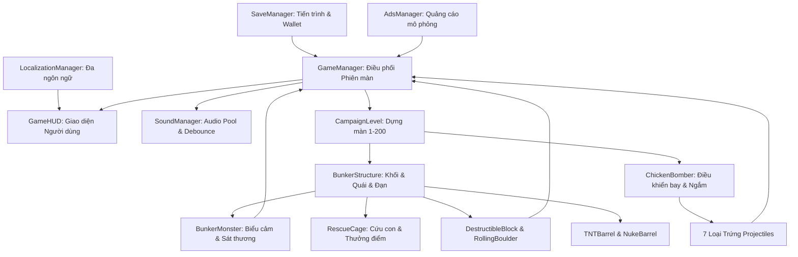

# 01 — Hiện trạng và Kiến trúc Hệ thống

## 1. Bản sắc và Vòng lặp Gameplay (Core Loop)

Cluck & Drop là game giải đố phá hủy vật lý theo màn hình dọc ($540 \times 960$). Người chơi điều khiển vị trí bay của Gà Mẹ, kéo dây ná để định hướng và lực thả trứng, kích hoạt kỹ năng đặc biệt của đạn trên không (Tap-in-Flight), sau đó tận dụng phản ứng dây chuyền từ các khối vật liệu sập đổ, đá lăn và thùng thuốc nổ để tiêu diệt toàn bộ quái vật boong-ke.

```text
Main Menu (Chọn màn / Chơi tiếp / Vòng quay)
  │
  ▼
CampaignLevel (Khởi tạo 1 trong 10 Thế Giới, 200 màn)
  │
  ▼ [Thời gian chuẩn bị - Peacetime Lock 100%]
Gà bay lượn trên bầu trời ──> Kéo ngắm (Dự đoán đường đạn + Co giãn lò xo)
  │
  ▼ [Thả trứng - Current Egg Index > 0]
Trứng bay trên không ──> [Tap-in-Flight: Tăng tốc/Nổ/Tách đạn] ──> Va chạm mục tiêu
  │
  ▼ [Phản ứng dây chuyền]
Khối vật liệu vỡ vụn ──> Mất bệ đỡ ──> Đá lăn đè quái ──> Kích nổ TNT / Nuke
  │
  ├─► Hạ hết quái: Đóng băng điểm Snapshot ──> Ghi Save ──> Modal Chiến thắng (Sao nảy + Chuông ngân)
  │
  └─► Hết trứng: has_active_gameplay_elements() kiên nhẫn đợi tĩnh lặng
        │
        ├─► Quái còn <= 2 (Màn 6+): Cứu thua Last Stand (5s đếm ngược / Xem Ad mô phỏng)
        │
        └─► Quái còn sống: GameManager.fail_level() ──> Modal Thất bại
```

---

## 2. Quy mô Hệ thống Hiện tại

| Thành phần | Thông số hiện trạng |
|---|---|
| **Engine & Renderer** | Godot Engine `4.7.1-stable` — Renderer: `GL Compatibility` (Desktop & Mobile) |
| **Độ phân giải hiển thị** | $540 \times 960$, Stretch Mode: `canvas_items`, Aspect: `expand` |
| **Mã nguồn GDScript** | 33 tệp kịch bản GDScript được cấu trúc theo 5 thư mục chức năng |
| **Cảnh giao diện (TSCN)** | 22 scene TSCN bao gồm cả bộ kiểm thử tự động `TestRunner.tscn` |
| **Autoload Đơn nhân** | `GameManager`, `SoundManager`, `SaveManager`, `LocalizationManager`, `AdsManager` |
| **Quy mô Chiến dịch** | 200 màn chơi phân bổ đều qua 10 Thế giới độc bản (mỗi thế giới 20 màn) |
| **Kho vũ khí đạn trứng** | 7 loại đạn: Normal, Bomb, Drill, Frost, Cluster, Acid, Black Hole |
| **Hệ thống Quái vật** | 28 archetype quái vật (18 lính/tinh anh + 10 Boss đại diện thế giới) |
| **Thư viện Vật liệu** | 10 loại: Wood, Stone, Glass, Steel, Obsidian, Crystal, Cyber Alloy, Swamp Wood, Permafrost, Magma Brick, Celestial Stone |
| **Vật thể tương tác** | Thùng TNT, Thùng Nuke độc hại, Tảng đá lăn, Lồng cứu gà con, Cột khí đẩy ngược Updraft |
| **Hạ tầng Tài nguyên** | 501 tham chiếu tài nguyên tĩnh (100% tệp tồn tại hợp lệ, 0 missing assets) |

---

## 3. Trách nhiệm và Phân tầng Kiến trúc Module



### 3.1 Nhóm Điều phối Toàn cục (Core Autoloads)
- **`GameManager.gd`**: Đóng vai trò hạt nhân điều phối vòng đời màn chơi. Nắm giữ trạng thái duy nhất về thắng/thua qua `fail_level()` và `_trigger_victory_delay()`. Tích hợp bộ đếm an toàn `has_active_gameplay_elements()` bảo đảm không kết thúc màn khi đạn hoặc vật thể còn chuyển động.
- **`SoundManager.gd`**: Quản lý hồ âm thanh 16 kênh (`AudioStreamPlayer`), cơ chế chống chồng âm tần số cao (`can_play_sfx`), chuỗi chuông sao chiến thắng và bộ tổng hợp âm thanh dự phòng.
- **`SaveManager.gd`**: Quản lý lưu trữ JSON bền vững với cơ chế hoán đổi nguyên tử (`.tmp` $\to$ `.bak` $\to$ `.json`), bảo vệ dữ liệu người chơi qua hàm `_migrate_save_version()`.
- **`LocalizationManager.gd`**: Tự động chuyển đổi ngôn ngữ linh hoạt (Tiếng Việt / Tiếng Anh) cho toàn bộ nhãn, nút bấm và thông báo.
- **`AdsManager.gd`**: Mô phỏng xem video quảng cáo có thưởng cho 4 vị trí chiến lược, quản lý vòng đời nút bấm và tween đếm ngược.

### 3.2 Nhóm Gameplay & Vật lý (Physics & Entities)
- **`ChickenBomber.gd`**: Điều khiển chuyển động tuần tra của gà trên bầu trời, tính toán góc kéo và lực bắn ná, hiển thị đường chấm bi dự đoán quỹ đạo bay, đồng thời phân tách rạch ròi giữa cú chạm Tap-in-Flight và bắt đầu ngắm quả kế tiếp.
- **`DestructibleBlock.gd` & `RollingBoulder.gd`**: Nắm giữ các chỉ số vật liệu, độ cứng, điểm nứt và cơ chế kiểm tra bệ đỡ bên dưới (Inside-Out Raycast). Đảm bảo công trình khóa tĩnh tuyệt đối trong thời gian chuẩn bị và chỉ thức giấc khi chịu va đập thực sự hoặc mất trụ đỡ.
- **`BunkerMonster.gd`**: Chịu trách nhiệm về máu, giáp, khối lượng và 11 trạng thái biểu cảm sống động. Quét mục tiêu bay trên không để quái vật thực sự dõi mắt nhìn theo đạn rơi và bộc lộ cảm xúc tương ứng.
- **7 Kịch bản Trứng (`NormalEgg`, `BombEgg`, `DrillEgg`, v.v.)**: Triển khai cơ chế nổ, xuyên phá, hóa băng, rải thảm và tạo hố đen. Đều được tích hợp biên an toàn despawn và cờ chống nổ lặp ngoài biên.

---

## 4. Các Nền tảng Đã được Củng cố Vững chắc

1. **Khóa Tĩnh Tuyệt đối trong Thời gian Chuẩn bị (Peacetime Lock $100\%$)**:
   - Toàn bộ khối, đá, quái và thùng nổ đều có `current_egg_index == 0` guard. Không bao giờ xảy ra hiện tượng công trình tự rung lắc hay sụp đổ trước khi người chơi thả phát đạn đầu tiên.
2. **Khử hoàn toàn sạt lở chân móng khi vừa thả trứng**:
   - Tia raycast kiểm tra bệ đỡ được bắn từ bên trong khối ra ngoài (`hit_from_inside = true`) kết hợp với vùng miễn nhiễm sàn bedrock (`GameManager.current_floor_y - 4.0`), bảo đảm công trình đứng vững chãi khi đạn đang rơi trên không.
3. **Tính Nhất quán của Điểm số và Kết quả Phiên**:
   - Loại bỏ hoàn toàn khả năng vừa hiện modal Thắng vừa hiện modal Thua. Điểm số lưu trong hồ sơ người chơi và điểm số hiển thị trên bảng vàng kết quả luôn trùng khớp 1:1 qua `snapshot_final_score`.
4. **Hạ tầng Âm thanh Sạch sẽ, Không vỡ tiếng**:
   - Các vụ nổ lớn và chuỗi phản ứng dây chuyền sập đổ được kiểm soát âm lượng qua debounce timer, giữ cho âm thanh đanh thép, giòn giã mà không làm chói tai hay rè màng loa.
