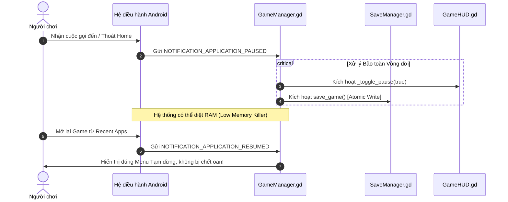
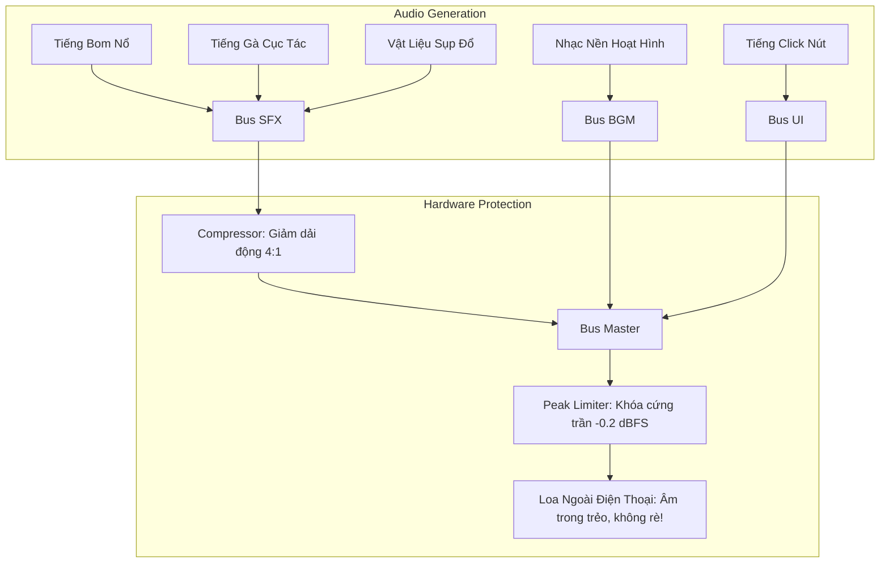
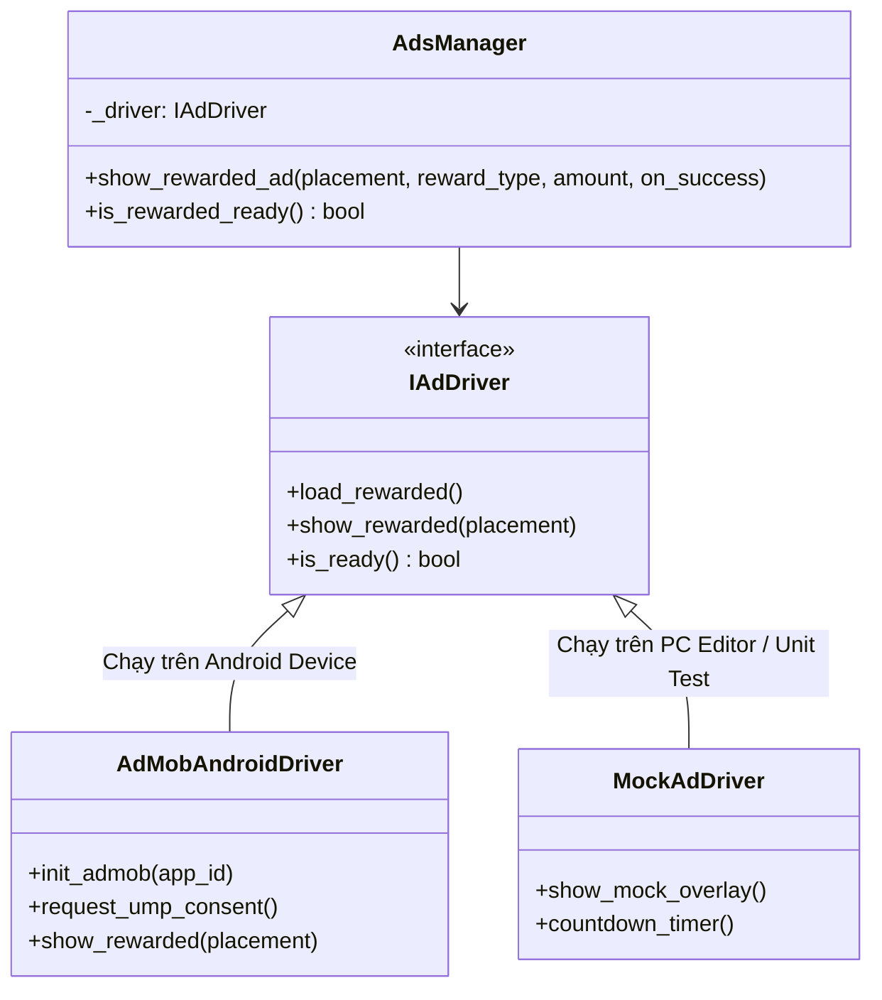

# 07 — Chuẩn hóa Kỹ thuật Di động & Tiêu chuẩn Phát hành CH Play (Google Play Store)

Tài liệu này cung cấp bản phân tích chuyên sâu toàn diện về tất cả các yêu cầu kỹ thuật, lỗ hổng tiềm ẩn, chính sách bắt buộc và quy chuẩn thiết kế trải nghiệm người dùng khi phát hành tựa game **Cluck & Drop: Bunker Buster** lên nền tảng di động (Android / Google Play Store - CH Play).

---

## Bảng Ma trận Đánh giá Rủi ro & Lỗ hổng Mobile / CH Play

Dưới đây là 18 điểm kỹ thuật và chính sách được phát hiện qua đợt rà soát mã nguồn thực tế:

| Phân nhóm | Mã ID | Tên vấn đề / Lỗ hổng | Mức độ | Hiện trạng trong Code | Rủi ro khi lên CH Play |
|---|:---:|---|:---:|---|---|
| **Chính sách CH Play** | **POL-01** | Chưa ký phát hành (Keystore unsigned) | **P0 (Chặn)** | `export_presets.cfg`: `package/signed=false`, keystore trống | Google Play từ chối nhận file AAB khi tải lên Console. |
| **Chính sách CH Play** | **POL-02** | Gradle Build đang tắt (`use_gradle_build=false`) | **P0 (Chặn)** | `export_presets.cfg`: `gradle_build=false` | Không thể nhúng SDK Android gốc (AdMob, Billing, UMP, Firebase). |
| **Chính sách CH Play** | **POL-03** | Target SDK chưa cấu hình tường minh | **P1 (Cao)** | Chưa định nghĩa Target API 34+ trong preset | Vi phạm quy định bắt buộc Target API 34 (Android 14/15) của Google Play. |
| **Chính sách CH Play** | **POL-04** | Chính sách Gia đình & Trẻ em (COPPA / Families) | **P1 (Cao)** | Chưa có cờ lọc quảng cáo trẻ em / nhãn độ tuổi | Bị từ chối phê duyệt nếu game hoạt hình không tuân thủ chính sách trẻ em. |
| **Chính sách CH Play** | **POL-05** | Thiếu liên kết Chính sách Quyền riêng tư (Privacy) | **P1 (Cao)** | Chưa có URL và nút xem Privacy Policy trong Game | Bắt buộc phải có URL công khai trên Play Console và trong Menu game. |
| **Logic Tiến trình** | **LOG-01** | Mở khóa toàn bộ 200 màn chơi ở bản Release | **P1 (Cao)** | `SaveManager.gd`: `is_level_unlocked` trả về `true` | Phá vỡ toàn bộ vòng lặp giữ chân người chơi (Retention) và tiến trình game. |
| **Logic Tiến trình** | **LOG-02** | Lệch thông điệp số màn ở sảnh chính | **P2 (Vừa)** | `MainMenu.tscn`: "BUNKER BUSTER 100 LEVELS" | Gây hiểu nhầm khi game thực tế đã có 200 màn chơi qua 10 thế giới. |
| **Vòng đời Android** | **LIF-01** | Không tự động Pause khi có sự kiện hệ thống đè lên | **P1 (Cao)** | `GameManager.gd` bỏ qua `NOTIFICATION_APPLICATION_PAUSED` | Nhận cuộc gọi hoặc ra màn hình chính, game vẫn chạy ngầm dẫn đến thua oan. |
| **Vòng đời Android** | **LIF-02** | Mất dữ liệu ván đấu khi bị Android LMK diệt tiến trình | **P2 (Vừa)** | Chỉ lưu sao/vàng, không lưu snapshot ván chơi | Đang chơi màn dài bị tắt app, mở lại bị văng về sảnh chính mất lượt. |
| **Vòng đời Android** | **LIF-03** | Nút Reset tiến trình trên TopBar không có xác nhận | **P1 (Cao)** | `MainMenu.gd`: Bấm `BtnReset` xóa sạch toàn bộ save | Chạm nhầm ngón tay là mất sạch công sức cày cuốc, nhận đánh giá 1 sao. |
| **Vòng đời Android** | **LIF-04** | Cử chỉ Back hệ thống chưa có bộ đệm thoát app | **P2 (Vừa)** | Bấm Back ở MainMenu gọi thẳng `get_tree().quit()` | Thoát đột ngột, trải nghiệm thô; thiếu quy chuẩn "Nhấn lần nữa để thoát". |
| **Công thái học & UI** | **NOT-01** | Thanh TopBar bị tai thỏ / đục lỗ camera che khuất | **P1 (Cao)** | `TopBar` đặt cách mép trên $8\text{px}$, không tính Safe Area | Camera trước đè lên điểm số, nút Pause hoặc số vàng trên các máy hiện đại. |
| **Công thái học & UI** | **NOT-02** | Kệ trứng sát đáy xung đột cử chỉ vuốt Home Android | **P1 (Cao)** | `EggShelf` đặt cách mép đáy $-10\text{px}$ | Vuốt ngắm trứng kích hoạt thanh điều hướng Home, văng khỏi game. |
| **Công thái học & UI** | **NOT-03** | Vực thẳm đồ họa trên màn hình dài ($20:9$, $21:9$) | **P2 (Vừa)** | Đất đá nền kết thúc ở $y = 960$ | Màn hình điện thoại dài lộ khoảng đen xám vô cực ở đáy hầm ngục. |
| **Công thái học & UI** | **NOT-04** | Tọa độ nhận diện chạm ngắm bị đóng cứng $y$ | **P2 (Vừa)** | `ChickenBomber.gd`: $y < 70$ hoặc $y > 880$ | Lệch vùng bấm trên các màn hình có tỷ lệ dài hơn chuẩn $9:16$. |
| **Công thái học & UI** | **NOT-05** | Kích thước nút bấm vi phạm chuẩn tối thiểu $48\text{dp}$ | **P2 (Vừa)** | Các nút Sound, Restart kích thước $38-44\text{px}$ | Khó bấm trúng trên màn hình mật độ điểm ảnh cao ($> 400\text{ PPI}$). |
| **Phần cứng & Âm thanh**| **PRF-01** | Loa điện thoại bị rè vỡ tiếng khi nổ dây chuyền | **P1 (Cao)** | Dự án không có Bus Layout, âm lượng vượt $0\text{ dBFS}$ | Âm thanh nổ nhiều thùng TNT làm kẹp biên độ màng loa, tạo tiếng rè chát chúa. |
| **Phần cứng & Pin** | **PRF-02** | Hao pin, nóng máy trên màn hình $120\text{Hz}/144\text{Hz}$ | **P2 (Vừa)** | Không giới hạn FPS tối đa trong cài đặt dự án | Game chạy $120\text{ FPS}$ liên tục gây nóng máy nhanh chóng sau 10 phút. |

---

## Trụ cột 1: Quy chuẩn Pháp lý & Kỹ thuật Google Play Store (2024–2026)

### 1.1. Bắt buộc Ký số Bản phát hành (Release Keystore & Google Play App Signing)
- **Vấn đề**: Hiện tại trong [export_presets.cfg](file:///d:/folder/tools/godot_demo/2/export_presets.cfg), cấu hình xuất Android là:
  ```ini
  package/signed=false
  custom_template/release=""
  ```
  Google Play Store **từ chối 100%** các tệp tải lên nếu chưa được ký bằng khóa phát hành hợp lệ.
- **Giải pháp chuẩn**:
  1. Tạo cặp khóa RSA 2048-bit hoặc 4096-bit thời hạn 25+ năm bằng lệnh JDK `keytool`:
     ```bash
     keytool -genkey -v -keystore cluck_release.keystore -alias cluck_key -keyalg RSA -keysize 2048 -validity 10000
     ```
  2. Điền đường dẫn tuyệt đối/tương đối và mật khẩu vào `export_presets.cfg`:
     ```ini
     keystore/release="res://build_keys/cluck_release.keystore"
     keystore/release_user="cluck_key"
     keystore/release_password="[SECURE_PASSWORD]"
     package/signed=true
     ```
  3. Kích hoạt **Play App Signing** trên Google Play Console: Google sẽ giữ Master Key trong đám mây bảo mật của họ, giúp bảo vệ ứng dụng nếu nhà phát triển vô tình làm mất file keystore cục bộ.

### 1.2. Định dạng Xuất bắt buộc: Android App Bundle (.aab)
- **Quy định**: Google Play đã khai tử định dạng `.apk` cho các ứng dụng mới. Toàn bộ bản build đưa lên Production hoặc Testing Tracks bắt buộc phải có đuôi `.aab`.
- **Đánh giá**: Dự án đã cấu hình đúng đường dẫn `export_path="builds/android/CluckAndDrop.aab"`. Cần duy trì cấu hình này, tuyệt đối không chuyển về `.apk` khi xuất bản chính thức.

### 1.3. Yêu cầu Kiến trúc 64-bit & Nền tảng mở rộng
- **Quy định**: Mọi ứng dụng có mã native (như Godot Engine C++) bắt buộc phải chứa thư viện 64-bit `arm64-v8a`.
- **Hiện trạng**: Trong `export_presets.cfg`:
  ```ini
  architectures/arm64-v8a=true
  architectures/armeabi-v7a=true
  ```
  Cấu hình này đã đạt chuẩn 64-bit.
- **Khuyến nghị mở rộng**: Nếu muốn đưa game lên **Google Play Games on PC** (chạy trên Windows qua trình giả lập chính hãng của Google) hoặc hệ máy **Chromebook**, cần kích hoạt thêm:
  ```ini
  architectures/x86_64=true
  ```

### 1.4. Target SDK 34 / 35 (Android 14 & 15)
- Google Play yêu cầu mọi ứng dụng mới và bản cập nhật phải nhắm mục tiêu (Target API) tối thiểu là **API Level 34 (Android 14)**, và chuẩn bị cho API 35.
- Khi bật Gradle Build (`use_gradle_build=true`), tệp `android/build/config.gradle` phải thiết lập:
  ```groovy
  minSdk = 24        // Android 7.0 Nougat (Bảo đảm bao phủ > 98.5% thiết bị)
  targetSdk = 34     // Android 14 UpsideDownCake (Tuân thủ CH Play)
  compileSdk = 34
  ```

### 1.5. Chính sách Bảo vệ Trẻ em & Khai báo An toàn Dữ liệu (Data Safety Form)
- **Đối tượng mục tiêu (Target Audience)**: Trò chơi đồ họa hoạt hình chú gà lái dù lượn và quái vật ngộ nghĩnh sẽ được Google Play phân loại vào diện thu hút trẻ em (Children & Families).
- **Yêu cầu tuân thủ**:
  1. Nếu chọn nhóm tuổi bao gồm trẻ dưới 13 tuổi: Phải tuân thủ đạo luật **COPPA** (Hoa Kỳ) và chính sách gia đình của Google.
  2. Mạng quảng cáo bắt buộc phải là **Google Play Certified Ad Network** (như Google AdMob, Unity Ads, AppLovin).
  3. Khi khởi tạo AdMob SDK, phải gắn cờ trẻ em:
     ```gdscript
     # Yêu cầu quảng cáo không cá nhân hóa và phù hợp lứa tuổi
     admob.set_tag_for_child_directed_treatment(true)
     admob.set_max_ad_content_rating("G")
     ```
  4. Bắt buộc có trang web chứa **Privacy Policy (Chính sách quyền riêng tư)** giải thích rõ game không thu thập vị trí GPS, danh bạ hay thông tin cá nhân nhạy cảm. Đường link này phải xuất hiện công khai trên trang store của CH Play và trong menu Cài đặt của game.

### 1.6. Khắc phục Lỗ hổng Logic: Mở khóa Toàn bộ Màn chơi (`LOG-01`)
- **Hiện tượng**: Trong [SaveManager.gd](file:///d:/folder/tools/godot_demo/2/scripts/core/SaveManager.gd):
  ```gdscript
  func is_level_unlocked(_level_id: int) -> bool:
      # Mở khóa toàn bộ 200 màn theo yêu cầu để kiểm thử tự do mọi màn
      return true

  func get_highest_unlocked_level() -> int:
      return 200
  ```
- **Hậu quả**: Khi đưa lên CH Play, người chơi mới tải game về sẽ thấy toàn bộ 200 màn đã mở sẵn. Họ có thể nhảy thẳng đến màn 200, phá vỡ hoàn toàn cảm giác chinh phục, mất đi động lực tích lũy sao, vàng, vòng quay và xem quảng cáo cứu thua.
- **Giải pháp triệt để**:
  ```gdscript
  func is_level_unlocked(level_id: int) -> bool:
      if OS.is_debug_build():
          return true # Cho phép nhà phát triển kiểm thử nhanh
      return level_id <= save_data.get("highest_unlocked_level", 1)

  func get_highest_unlocked_level() -> int:
      if OS.is_debug_build():
          return 200
      return save_data.get("highest_unlocked_level", 1)
  ```

---

## Trụ cột 2: Vòng đời Hệ điều hành Android & Khả năng Chống Sập/Mất Dữ liệu



### 2.1. Tự động Pause khi Ứng dụng Bị che khuất (`LIF-01`)
- **Nguyên nhân**: Khi người chơi đang thả trứng thì có cuộc gọi đến, chuông báo thức hoặc vuốt thanh thông báo thông điệp mạng xã hội. Android đẩy ứng dụng vào trạng thái ngầm (`onPause`).
- **Lỗi hiện tại**: `GameManager.gd` chỉ xử lý `NOTIFICATION_WM_GO_BACK_REQUEST`, hoàn toàn không đón nhận `NOTIFICATION_APPLICATION_PAUSED`.
- **Hậu quả**: Trong lúc ứng dụng tạm ngắt màn hình, bộ đếm vật lý hoặc timer vẫn kết thúc, dẫn đến khi quay lại game thì màn chơi đã bị xử Thua (`Level Failed`).
- **Giải pháp trong [GameManager.gd](file:///d:/folder/tools/godot_demo/2/scripts/core/GameManager.gd)**:
  ```gdscript
  func _notification(what: int) -> void:
      match what:
          NOTIFICATION_WM_GO_BACK_REQUEST:
              _handle_mobile_back()
          NOTIFICATION_APPLICATION_PAUSED, NOTIFICATION_APPLICATION_FOCUS_OUT:
              _handle_app_paused()

  func _handle_app_paused() -> void:
      # Tự động đóng băng ván đấu nếu đang trong màn chơi
      if is_level_active and not get_tree().paused:
          var scene = get_tree().current_scene
          if scene and scene.name == "CampaignLevel":
              var hud = scene.get_node_or_null("GameHUD")
              if hud and hud.has_method("toggle_pause"):
                  hud.toggle_pause()
  ```

### 2.2. Loại bỏ Nguy cơ Xóa Sạch Save do Chạm Nhầm trên TopBar (`LIF-03`)
- **Vấn đề**: Tại [MainMenu.tscn](file:///d:/folder/tools/godot_demo/2/scenes/ui/MainMenu.tscn), nút `BtnReset` nằm ngay cạnh nút âm thanh và chọn ngôn ngữ:
  ```gdscript
  func _on_btn_reset_pressed() -> void:
      if has_node("/root/SaveManager"):
          get_node("/root/SaveManager").reset_save() # Xóa ngay lập tức!
  ```
- **Hậu quả trên màn hình cảm ứng**: Ngón tay cái người dùng khi chạm nút bật/tắt âm thanh rất dễ trượt sang nút Reset. Toàn bộ 200 màn chơi, sao và tiền vàng bị xóa sổ trong chớp mắt mà không có bất kỳ lời cảnh báo nào. Đây là nguyên nhân hàng đầu dẫn đến các bài đánh giá 1 sao phẫn nộ trên Google Play.
- **Giải pháp bắt buộc**:
  1. Trong bản Release chính thức: **Ẩn hoàn toàn** nút `BtnReset` khỏi giao diện sảnh chính.
  2. Nếu giữ lại cho mục đích thử nghiệm: Bắt buộc mở Modal Xác nhận 2 bước:
     > *"Bạn có chắc chắn muốn xóa toàn bộ tiến trình? Thao tác này không thể hoàn tác!"* (Với 2 nút: HỦY BỎ màu xanh nổi bật và XÓA HẾT màu xám nhỏ).

### 2.3. Quy chuẩn Cử chỉ Quay lại (Predictive Back Gesture & Exit Debounce) (`LIF-04`)
- **Hiện trạng**: Ở `MainMenu.gd`, khi bấm nút Back của điện thoại:
  ```gdscript
  get_tree().quit()
  ```
  Việc thoát app ngay lập tức khiến người chơi bị hẫng nếu họ chỉ vô tình vuốt cạnh màn hình khi cầm máy.
- **Chuẩn Android UX**: Cơ chế "Double-tap back to exit":
  ```gdscript
  var last_back_press_time: float = 0.0

  func _handle_main_menu_back() -> void:
      var now = Time.get_ticks_msec() / 1000.0
      if now - last_back_press_time < 2.0:
          get_tree().quit()
      else:
          last_back_press_time = now
          _show_toast("Nhấn quay lại lần nữa để thoát")
  ```

---

## Trụ cột 3: Công thái học Cảm ứng, Tai thỏ & Tỉ lệ Màn hình

### 3.1. Vùng An Toàn (Safe Area Insets) Chống Đè Tai Thỏ & Nốt Ruồi Camera (`NOT-01`)
- **Vấn đề thực tế**: Hơn 95% điện thoại Android hiện nay sở hữu camera nốt ruồi ở giữa đỉnh màn hình (Infinity-O), tai thỏ (Notch) hoặc Dynamic Island.
- **Hiện trạng code**: Trong `GameHUD.tscn`, `TopBar` được neo cứng:
  ```ini
  offset_top = 8.0
  offset_bottom = 60.0
  ```
  Khoảng cách $8\text{px}$ từ đỉnh khiến cụm camera trước của điện thoại (chiếm từ $30\text{px}$ đến $55\text{px}$) đè xuyên qua điểm số, huy hiệu Màn chơi hoặc nút Pause!
- **Giải pháp kỹ thuật**: Sử dụng API `DisplayServer.get_display_safe_area()` trong Godot 4:
  ```gdscript
  func _apply_safe_area_padding() -> void:
      var safe_area = DisplayServer.get_display_safe_area()
      var window_size = DisplayServer.window_get_size()
      
      # Tính tỷ lệ co giãn giữa độ phân giải vật lý và kích thước Viewport 540x960
      var scale_factor_y = 960.0 / float(window_size.y)
      var top_inset = safe_area.position.y * scale_factor_y
      var bottom_inset = (window_size.y - (safe_area.position.y + safe_area.size.y)) * scale_factor_y

      # Áp dụng đệm cho TopBar
      if has_node("TopBar"):
          var top_bar = get_node("TopBar") as Control
          top_bar.offset_top = max(8.0, top_inset + 4.0)
          top_bar.offset_bottom = top_bar.offset_top + 52.0

      # Áp dụng đệm cho Kệ Trứng (EggShelf)
      if has_node("EggShelf"):
          var egg_shelf = get_node("EggShelf") as Control
          egg_shelf.offset_bottom = min(-10.0, -(bottom_inset + 10.0))
          egg_shelf.offset_top = egg_shelf.offset_bottom - 42.0
  ```

### 3.2. Chống Xung đột với Thanh Điều hướng Cử chỉ Đáy Màn hình (`NOT-02`)
- Trên Android 10 trở lên, người dùng điều hướng bằng thanh gạch trắng ở mép dưới cùng màn hình (Gesture Navigation Bar).
- `EggShelf` hiện tại đặt ở `offset_bottom = -10.0`. Khi người chơi thao tác gần mép đáy để chuẩn bị kéo thả trứng, cử chỉ vuốt ngón tay lên trên sẽ kích hoạt thao tác "Vuốt về màn hình chính" của Android, lập tức văng người chơi ra ngoài.
- **Khắc phục**: Đẩy kệ trứng lên cách đáy tối thiểu $28\text{px} - 35\text{px}$ trên các thiết bị có `bottom_inset > 0`.

### 3.3. Xóa Bỏ Vực Thẳm Đồ Họa Trên Màn Hình Dài ($20:9$, $21:9$) (`NOT-03`)
- **Tình huống**: Cấu hình dự án thiết lập `window/stretch/aspect="expand"`. Với màn hình tỷ lệ $20:9$ phổ biến ($1080 \times 2400$), chiều cao viewport thực tế sẽ nở rộng từ $960\text{px}$ lên khoảng $1200\text{px}$.
- **Hạn chế**: Trong [CampaignLevel.tscn](file:///d:/folder/tools/godot_demo/2/scenes/levels/CampaignLevel.tscn):
  ```ini
  polygon = PackedVector2Array(0, 400, 540, 400, 540, 960, 0, 960)
  ```
  Mảng đất nền ngầm chỉ vẽ tới tọa độ $y = 960$. Trên máy dài, phần không gian từ $y = 960$ đến $y = 1200$ lộ ra một khoảng đen ngòm không có họa tiết.
- **Giải pháp**:
  - Mở rộng đa giác đất nền `UndergroundDirt`:
    ```gdscript
    polygon = PackedVector2Array(-60, 400, 600, 400, 600, 1400, -60, 1400)
    ```
  - Mở rộng đa giác bầu trời `Sky` lên trên:
    ```gdscript
    polygon = PackedVector2Array(-60, -300, 600, -300, 600, 420, -60, 420)
    ```
  - Đảm bảo hình nền bao phủ hoàn toàn mọi tỷ lệ màn hình từ máy tính bảng vuông ($4:3$) đến điện thoại siêu dài ($21:9$ Sony Xperia).

### 3.4. Xử lý Chạm Đa điểm & Khử Nhiễu Mép Màn hình (Palm Rejection) (`NOT-04`)
- **Vấn đề trong [ChickenBomber.gd](file:///d:/folder/tools/godot_demo/2/scripts/player/ChickenBomber.gd)**:
  ```gdscript
  if screen_mouse_pos.y < 70.0 or screen_mouse_pos.y > 880.0:
      return
  ```
  Các giá trị `70.0` và `880.0` là các số cố định. Trên màn hình mở rộng $1200\text{px}$, giá trị `880.0` nằm lơ lửng ở giữa màn hình thay vì chặn chạm vào kệ trứng ở đáy!
- **Thay thế bằng tỷ lệ động**:
  ```gdscript
  var v_size = get_viewport_rect().size
  var top_limit = 75.0
  var bottom_limit = v_size.y - 70.0
  if screen_mouse_pos.y < top_limit or screen_mouse_pos.y > bottom_limit:
      return
  ```
- **Chống loạn cảm ứng đa điểm**: Chỉ chấp nhận ngón tay chạm đầu tiên (`event.index == 0`). Nếu người chơi vô tình tì lòng bàn tay hoặc ngón tay giữ máy chạm vào viền màn hình (`event.index > 0`), hệ thống ngắm bắn sẽ phớt lờ hoàn toàn, không để ná bắn bị giật lệch tâm.

---

## Trụ cột 4: Hiệu năng, Tản nhiệt, Pin & Chống Kẹp Loa Thiết bị

### 4.1. Khóa Tốc độ Khung hình 60 FPS Chống Quá Nhiệt Màn hình 120Hz (`PRF-02`)
- **Phân tích phần cứng**: Hiện nay, hầu hết các thiết bị từ tầm trung ($4-5$ triệu VND) như Redmi Note, Galaxy A đến cao cấp đều trang bị màn hình AMOLED tần số quét $120\text{Hz}$ hoặc $144\text{Hz}$.
- Nếu không giới hạn FPS, Godot sẽ đẩy vòng lặp render lên kịch kim $120\text{ FPS}$.
- Đối với một game giải đố vật lý 2D, việc render $120\text{ FPS}$ liên tục khiến GPU và SoC gánh tải gấp đôi một cách không cần thiết, làm điện thoại ấm lên rất nhanh, giảm xung nhịp (Thermal Throttling) và tiêu hao $15-20\%$ pin chỉ sau 15 phút chơi.
- **Thiết lập chuẩn trong `project.godot`**:
  ```ini
  [display]
  window/vsync/vsync_mode=1 # Bật VSync chuẩn
  
  [application]
  run/max_fps=60 # Khóa cứng 60 FPS mượt mà và mát máy trên di động
  ```

### 4.2. Bảng Bus Âm thanh Chuyên Dụng Chống Rè Loa (Audio Bus Limiter) (`PRF-01`)
- **Vấn đề nguy hiểm**: Dự án hiện không có tệp `default_bus_layout.tres`. Cả 16 kênh phát âm thanh (`sfx_players`) đều đổ dồn trực tiếp vào bus Master mặc định mà không có bất kỳ bộ nén âm nào.
- Khi xảy ra các vụ nổ liên hoàn (ví dụ: màn đấu trùm kích nổ 4 thùng TNT cùng lúc + đá vỡ + tiếng quái thét), biên độ tổng hợp của âm thanh có thể vọt lên $+12\text{ dBFS}$ đến $+18\text{ dBFS}$.
- Màng loa tí hon của điện thoại thông minh không thể tải được dải động này, sẽ phát ra những tiếng rè, nổ lẹt đẹt cực kỳ khó chịu, thậm chí gây hại cho phần cứng loa ngoài.
- **Giải pháp triệt để**:
  1. Tạo cấu trúc bus chuẩn 3 tầng: `Master` $\rightarrow$ `BGM`, `SFX`, `UI`.
  2. Gắn hiệu ứng **AudioEffectLimiter** trên Bus `Master` và `SFX`:
     - **Ceiling**: $-0.2\text{ dB}$ (Không bao giờ để âm thanh vượt ngưỡng méo tiếng của DAC di động).
     - **Threshold**: $-1.5\text{ dB}$.
     - **Soft Clip**: `True` (Nén mượt các đỉnh âm thanh nổ dồn dập).



### 4.3. Quản lý Mất Trọng Tâm Âm Thanh (Audio Focus Interruption)
- Khi có chuông điện thoại gọi đến hoặc người dùng cắm/rút tai nghe Bluetooth, hệ thống Android sẽ thu hồi Audio Focus.
- Cần tự động chuyển đổi êm dịu (Fade-out) nhạc nền và tạm dừng AudioServer thay vì để âm thanh bị giật đứng (stutter) tạo tiếng rít khó chịu.

---

## Trụ cột 5: Kiến trúc Doanh thu Thực tế (Real AdMob SDK & GDPR / UMP)

### 5.1. Chuyển Đổi từ Mock Overlay sang Native AdMob Plugin
- **Thực trạng**: [AdsManager.gd](file:///d:/folder/tools/godot_demo/2/scripts/core/AdsManager.gd) hiện tại sử dụng giao diện vẽ mô phỏng (`_create_mock_ad_overlay()`). Điều này phục vụ rất tốt cho việc chạy thử nghiệm trên PC, nhưng khi lên CH Play sẽ **không tạo ra bất kỳ doanh thu nào**.
- **Mô hình Kiến trúc Hai Trình Điều Khiển (Dual Driver Pattern)**:



- **Mã nguồn thích ứng thông minh trong `AdsManager.gd`**:
  ```gdscript
  var admob_plugin = null

  func _ready() -> void:
      process_mode = Node.PROCESS_MODE_ALWAYS
      if OS.get_name() == "Android" and Engine.has_singleton("GodotAdMob"):
          admob_plugin = Engine.get_singleton("GodotAdMob")
          _init_native_admob()
      else:
          _create_mock_ad_overlay() # Fallback cho môi trường máy tính
  ```

### 5.2. Tuân thủ Quy định Đồng ý Người dùng Châu Âu (GDPR & Google UMP SDK)
- Từ năm 2024, Google bắt buộc mọi ứng dụng kiếm tiền qua AdMob tại thị trường Châu Âu (EEA) và Vương quốc Anh phải tích hợp **Google User Messaging Platform (UMP)**.
- Nếu không hiển thị bảng hỏi xin phép Cookie/Quảng cáo theo chuẩn IAB TCF v2.2, AdMob sẽ **ngừng phân phối 100% quảng cáo** tới người dùng khu vực này (Tỷ lệ lấp đầy Ad Fill-rate rơi về $0\%$).
- Phải tích hợp form đồng ý UMP ngay khi người chơi mở màn hình chính lần đầu tiên.

### 5.3. Chiến lược Dự phòng Ngoại Tuyến (Offline Rewarded Fallback)
- **Tình huống**: Người chơi đi máy bay, ngồi tàu điện ngầm hoặc ở nơi sóng yếu không có kết nối Internet. Biến `is_ad_cached` sẽ là `false`.
- **Trải nghiệm kém**: Khi người chơi suýt thắng ở màn khó, modal Last Stand hiện lên nhưng nút xem quảng cáo bị mờ đi (`disabled`), khiến họ bị xử thua mà không có cơ hội cứu vãn.
- **Giải pháp cân bằng**: Nếu không có mạng hoặc không tải được quảng cáo, cho phép người chơi chi tiêu tiền vàng dự trữ để kích hoạt cứu thua:
  > *"Không có kết nối mạng: Dùng 100 Vàng để kích hoạt Quả Trứng Nổ Cứu Thua!"*

---

## Trụ cột 6: Kế hoạch Hành động Kỹ thuật & Checklist Nghiệm thu CH Play

### 6.1. Danh mục 7 Bước Chuẩn bị Kỹ thuật Cụ thể

#### Bước 1: Cấu hình lại `export_presets.cfg` cho Android
Kích hoạt build Gradle, bổ sung quyền Internet và khai báo Package chuẩn:
```ini
[preset.0.options]
gradle_build/use_gradle_build=true
package/unique_name="com.cluckanddrop.bunkerbuster"
package/name="Cluck & Drop: Bunker Buster"
package/signed=true
version/code=1
version/name="1.0.0"
architectures/arm64-v8a=true
architectures/armeabi-v7a=true
permissions/access_network_state=true
permissions/internet=true
```

#### Bước 2: Bổ sung Tệp Bus Layout Mặc định (`default_bus_layout.tres`)
Thiết lập 3 Bus riêng biệt với Limiter trần $-0.2\text{ dBFS}$ để bảo vệ tuyệt đối màng loa di động.

#### Bước 3: Sửa Lỗi Logic Mở Khóa Màn Chơi
Thay đổi `SaveManager.gd` để chỉ mở khóa màn 1 khi phát hành chính thức, lưu tiến trình mở dần từng màn dựa theo chiến thắng thực tế.

#### Bước 4: Khắc phục Giao diện An Toàn (Safe Area)
Bổ sung đoạn mã tính toán `DisplayServer.get_display_safe_area()` trong `GameHUD.gd` để tự động đẩy `TopBar` xuống và nâng `EggShelf` lên.

#### Bước 5: Mở Rộng Đa Giác Đồ Họa Hầm Ngục
Mở rộng kích thước của `UndergroundDirt` và `Sky` trong `CampaignLevel.tscn` để bao phủ hoàn toàn các tỷ lệ màn hình siêu dài $20:9$.

#### Bước 6: Khóa Tốc độ Khung hình 60 FPS
Cập nhật `project.godot` để giới hạn `run/max_fps=60`, ngăn ngừa hiện tượng nóng máy và ngốn pin trên màn hình $120\text{Hz}$.

#### Bước 7: Ẩn Nút Reset Save trên Giao diện Chính
Loại bỏ hoặc ẩn nút xóa dữ liệu thô khỏi `MainMenu.tscn` để ngăn chặn việc người chơi xóa nhầm tiến trình.

---

### 6.2. Bảng Kiểm Tra Nghiệm Thu Trước Khi Đưa Lên Console (Pre-Launch Checklist)

| STT | Hạng mục kiểm tra | Phương pháp thực hiện | Tiêu chí đạt chuẩn |
|:---:|---|---|---|
| 1 | **Kiểm tra Ký số AAB** | Dùng lệnh `bundletool validate --bundle=CluckAndDrop.aab` | File hợp lệ, chữ ký Release Keystore chuẩn RSA, không báo lỗi. |
| 2 | **Kiểm tra Tai thỏ & Camera** | Chạy trên thiết bị thật có camera đục lỗ giữa (Punch-hole) | Nút Pause, số điểm và số vàng cách xa lỗ camera ít nhất $8\text{px}$. |
| 3 | **Kiểm tra Cử chỉ Vuốt Đáy** | Vuốt ngắm trứng sát đáy màn hình trên Android 14 | Không bị kích hoạt thanh gạch ngang Home của Android. |
| 4 | **Kiểm tra Màn hình Siêu Dài** | Thử nghiệm trên màn hình $20:9$ hoặc $21:9$ | Không có viền đen ở đỉnh và đáy hầm ngục, hình nền liền mạch. |
| 5 | **Kiểm tra Tự động Pause** | Nhận cuộc gọi đến khi trứng đang rơi giữa không trung | Mở lại game thấy menu Pause xuất hiện, trứng đứng yên, không bị thua. |
| 6 | **Kiểm tra Nút Quay lại (Back)** | Bấm phím Back ở mọi màn hình (HUD, Chọn màn, Sảnh) | Đóng modal tương ứng mượt mà; ở sảnh chính bấm 2 lần mới thoát app. |
| 7 | **Kiểm tra Tải Loa Ngoài** | Kích nổ cùng lúc 5 thùng TNT và 3 quả trứng nổ | Âm thanh đanh gọn, không có tiếng rè rẹt vỡ màng loa. |
| 8 | **Kiểm tra Độ ổn định Pin** | Chơi liên tục 30 phút trên máy thật | Máy chỉ ấm nhẹ, FPS giữ vững $60\text{ FPS}$, không giật cục. |
| 9 | **Kiểm tra Tiến trình Màn** | Cài đặt mới hoàn toàn từ file AAB | Chỉ mở duy nhất Màn 1; thắng Màn 1 mới mở tiếp Màn 2. |
| 10 | **Kiểm tra Phục hồi Dữ liệu** | Tắt ngang ứng dụng khi đang chơi, mở lại | Số sao, số vàng tích lũy không bị mất; file backup tự kích hoạt nếu lỗi. |

---

## Kết luận

Việc đưa trò chơi từ môi trường PC thử nghiệm lên Google Play Store đòi hỏi sự khắt khe về cả mặt **kỹ thuật động cơ** lẫn **chính sách nền tảng**. 

Bản phân tích trên đã chỉ rõ toàn bộ 18 điểm nút thắt cần tháo gỡ. Khi các giải pháp này được áp dụng đồng bộ, **Cluck & Drop: Bunker Buster** sẽ đạt chuẩn chất lượng cao nhất, vận hành mượt mà trên hàng nghìn dòng điện thoại Android khác nhau, đem lại trải nghiệm trọn vẹn và tối đa hóa đánh giá tích cực từ cộng đồng người chơi.
