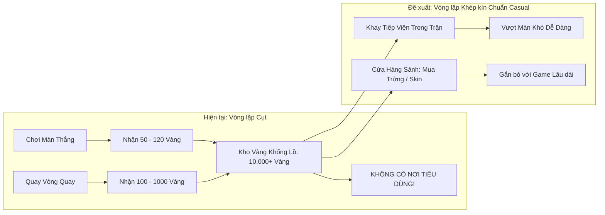

# 08 — Đại Kiểm Kê Toàn Diện Lỗi Kỹ Thuật, Gameplay, Vật Lý & Đề Xuất Cải Thiện

Tài liệu này là bản báo cáo tổng kiểm kê chi tiết toàn bộ các lỗ hổng kỹ thuật, nghịch lý gameplay, lỗi vật lý tiềm ẩn, điểm nghẽn trải nghiệm người dùng (UX) và nợ kỹ thuật (technical debt) còn tồn đọng trong mã nguồn trò chơi **Cluck & Drop: Bunker Buster**, đi kèm giải pháp và mã nguồn khắc phục cụ thể cho từng hạng mục.

---

## Mục lục Tài liệu
1. [Bảng Ma trận Phân loại Lỗi & Mức độ Ưu tiên](#1-bảng-ma-trận-phân-loại-lỗi--mức-độ-ưu-tiên)
2. [Nhóm 1: Lỗ hổng Vật lý, Ranh giới Bản đồ & Xử lý Rác Không gian](#nhóm-1-lỗ-hổng-vật-lý-ranh-giới-bản-đồ--xử-lý-rác-không-gian)
3. [Nhóm 2: Nghịch lý Cân bằng Đạn & Logic Sát thương](#nhóm-2-nghịch-lý-cân-bằng-đạn--logic-sát-thương)
4. [Nhóm 3: Lỗ hổng Kinh tế Game & Thiếu Tính năng Tiêu Dùng Vàng](#nhóm-3-lỗ-hổng-kinh-tế-game--thiếu-tính-năng-tiêu-dùng-vàng)
5. [Nhóm 4: Lỗi Chồng Âm, Phản hồi Xúc giác (Haptics) & Trải nghiệm UI](#nhóm-4-lỗi-chồng-âm-phản-hồi-xúc-giác-haptics--trải-nghiệm-ui)
6. [Nhóm 5: Đồ họa Môi trường, Hiệu ứng Hạt & Quản lý Bộ nhớ (Leak)](#nhóm-5-đồ-họa-môi-trường-hiệu-ứng-hạt--quản-lý-bộ-nhớ-leak)
7. [Nhóm 6: Chuẩn hóa Toàn cầu hóa & Đa ngôn ngữ Triệt để](#nhóm-6-chuẩn-hóa-toàn-cầu-hóa--đa-ngôn-ngữ-triệt-để)
8. [Kế hoạch Hành động Khắc phục Nhanh](#8-kế-hoạch-hành-động-khắc-phục-nhanh)

---

## 1. Bảng Ma trận Phân loại Lỗi & Mức độ Ưu tiên

| Mã ID | Phân loại | Tên lỗi / Vấn đề | Tệp liên quan | Mức độ | Hiện tượng & Tác hại thực tế |
|---|---|---|---|:---:|---|
| **PHY-01** | Vật lý / Logic | Quái vật văng khỏi bản đồ bất tử | `BunkerMonster.gd` | **P0 (Chặn ván)** | Bị nổ văng ra ngoài biên ($y > 1400$ hoặc $x > 2000$), quái không chết, người chơi bị kẹt không thể thắng màn. |
| **PHY-02** | Vật lý / Hiệu năng | Khối rơi tự do ngoài biên kẹt timer 9s | `DestructibleBlock.gd`, `GameManager.gd` | **P1 (Nghiêm trọng)** | Khối rơi xuống vực gia tốc $v > 60\text{px/s}$, làm `has_active_gameplay_elements` kẹt cứng đếm ngược 9 giây. |
| **PHY-03** | Hiệu năng / Bộ nhớ | Bão tạo Tween khi trúng Axit | `AcidEgg.gd`, `DestructibleBlock.gd` | **P1 (Nghiêm trọng)** | Axit gây sát thương mỗi frame, khối tạo 60 Tween/giây gây lag giật khung hình và lệch vị trí khối vĩnh viễn. |
| **PHY-04** | Logic / Bộ nhớ | Rò rỉ đối tượng tiêu hủy trong Lồng gió | `UpdraftVent.gd` | **P2 (Vừa)** | Mảng `overlapping_bodies` không dọn rác đối tượng đã bị xóa, tích tụ tham chiếu rác qua thời gian. |
| **PHY-05** | Logic / Timer | Timer `await` không kiểm tra `is_inside_tree` | `BaseEgg.gd`, `BunkerMonster.gd` | **P2 (Vừa)** | Chuyển màn hoặc chơi lại trong lúc timer chạy gây lỗi đỏ Console (`Object was freed`). |
| **BAL-01** | Cân bằng / Logic | Nghịch lý Trứng Băng tự hủy khối | `FrostEgg.gd` | **P1 (Nghiêm trọng)** | Gán máu khối còn 25 HP rồi gây ngay 80 sát thương, phá hủy 100% khối thay vì để lại lớp băng giòn chiến thuật. |
| **BAL-02** | Nội dung / Thẩm mỹ | Boulders giới hạn ở 5 thế giới | `RollingBoulder.gd` | **P2 (Vừa)** | Hàm `clamp(world_id, 1, 5)` khiến các thế giới 6-10 không có giao diện đá lăn đặc trưng (Cyber, Băng tuyết...). |
| **BAL-03** | Gameplay / Thưởng | Cứu gà con không thưởng đạn | `RescueCage.gd` | **P2 (Vừa)** | Giải cứu gà con trong lồng chỉ cho 1.000 điểm, không hoàn lại đạn hay cấp trứng tiếp viện cho gà mẹ. |
| **ECO-01** | Kinh tế / Gameplay | Kho trứng tiêu hao vô dụng trong trận | `GameHUD.tscn`, `SaveManager.gd` | **P1 (Nghiêm trọng)** | Có lưu số trứng Bom/Khoan/Axit trong save nhưng không có giao diện **Khay Tiếp Viện** để bấm dùng trong màn. |
| **ECO-02** | Kinh tế / Vòng lặp | Thiếu Cửa hàng tiêu Vàng sảnh chính | `MainMenu.tscn`, `SaveManager.gd` | **P1 (Nghiêm trọng)** | Kiếm được hàng chục nghìn vàng nhưng không có nơi mua trứng, nâng cấp hay đổi skin gà mẹ. |
| **ECO-03** | Giữ chân / Nhiệm vụ | Thiếu Hệ thống Thử thách Hàng ngày | `SaveManager.gd`, UI | **P3 (Cải thiện)** | Người chơi quay vòng quay 1 lần xong không còn mục tiêu ngắn hạn trong ngày để tiếp tục ở lại game. |
| **AUD-01** | Âm thanh / Trải nghiệm| Lỗi phát âm đúp khi bấm nút (Double Click) | `JuicyButton.gd`, `MainMenu.gd` | **P2 (Vừa)** | `JuicyButton` đã phát âm click, các hàm xử lý ở MainMenu/HUD lại gọi tiếp gây hiệu ứng âm vang đôi khó chịu. |
| **AUD-02** | Cảm giác / Xúc giác | Thiếu rung phản hồi Haptic trên di động | `JuicyButton.gd`, `ChickenBomber.gd` | **P2 (Vừa)** | Bắn đạn, nổ bom hay bấm nút trên điện thoại thiếu rung nhẹ (`Input.vibrate_handheld`), làm giảm độ chân thực. |
| **VFX-01** | Thẩm mỹ / Môi trường | Thiếu Hạt Khí quyển (Ambient Atmosphere) | `CampaignLevel.gd` | **P2 (Vừa)** | 10 thế giới chỉ đổi màu nền tĩnh, thiếu các lớp hạt môi trường như lá rụng, khói độc, bụi tuyết, tàn lửa. |
| **VFX-02** | Hiệu năng / Khựng hình| Chưa làm ấm Shader / Hạt khi vào game | `ParticleHelper.gd` | **P2 (Vừa)** | Khi quả trứng đầu tiên nổ hoặc hố đen bung hạt, máy cấu hình thấp có thể bị giật 1 frame do biên dịch shader. |
| **LOC-01** | Đa ngôn ngữ | Tên 7 loại đạn trứng bị đóng cứng tiếng Anh | Các tệp `*Egg.gd` | **P2 (Vừa)** | Các biến `egg_name` ghi cứng tiếng Anh, thiếu khóa dịch tương ứng trong `LocalizationManager.gd`. |
| **LOC-02** | Đa ngôn ngữ | Thông báo nhận thưởng Vòng quay đóng cứng | `DailyWheelModal.gd` | **P3 (Cải thiện)** | Dòng chữ `🎉 +1 BOMB EGG! 🎉` trên banner kết quả chưa được dịch sang 10 ngôn ngữ. |
| **ARC-01** | Mã nguồn / Nợ kỹ thuật| Tệp di tích thừa `LevelController.gd` | `LevelController.gd` | **P3 (Cải thiện)** | Script cũ thời prototype không còn được dùng nhưng vẫn nằm trong thư mục `scripts/core/`. |

---

## Nhóm 1: Lỗ hổng Vật lý, Ranh giới Bản đồ & Xử lý Rác Không gian

### 1. Lỗi PHY-01: Quái vật văng khỏi bản đồ bất tử (`BunkerMonster.gd`)
- **Cơ chế phát sinh**: Khi người chơi kích nổ hố đen (Supernova), nổ bom hoặc tảng đá lăn va đập cực mạnh, quái vật bị bắn văng lên trời ($y < -600$) hoặc bay xuyên ra ngoài đáy màn hình ($y > 1400$).
- **Hậu quả**: Trong `BunkerMonster.gd`, hàm `_physics_process()` hoàn toàn không có lệnh kiểm tra tọa độ giới hạn (Out-of-Bounds Check). Quái vật bay vô tận trong không gian vật lý 2D, không bao giờ chết. Kết quả là biến `GameManager.remaining_enemies` không thể về 0 $\rightarrow$ **Màn chơi không bao giờ kết thúc được, người chơi bắt buộc phải thoát màn**.
- **Giải pháp triệt để**:
  Bổ sung đoạn mã quét giới hạn trong `BunkerMonster._physics_process(delta)`:
  ```gdscript
  var pos = global_position
  if pos.y > 1350.0 or pos.y < -700.0 or abs(pos.x) > 1600.0:
      take_damage(9999.0, global_position)
      return
  ```

---

### 2. Lỗi PHY-02: Khối rơi tự do ngoài biên làm kẹt bộ đếm thua 9 giây (`DestructibleBlock.gd`)
- **Cơ chế phát sinh**: Các mảnh vỡ hoặc khối gỗ/đá bị rơi xuống rìa hầm ngục. Do chịu gia tốc trọng trường $980\text{px/s}^2$, vận tốc của khối khi rơi tự do luôn lớn hơn $60\text{px/s}$.
- **Hậu quả**: Hàm `GameManager.has_active_gameplay_elements()` liên tục phát hiện thấy có khối đang rơi (`d.linear_velocity.length() > 60.0`), liên tục đặt lại bộ đếm `settle_timer = 1.5`. Người chơi sau khi bắn hết trứng phải ngồi chờ toàn bộ thời gian dự phòng `max_settle_fallback_timer = 9.0` giây mới được thông báo kết quả.
- **Giải pháp triệt để**:
  Trong `DestructibleBlock._physics_process(delta)`:
  ```gdscript
  if is_awake and global_position.y > (GameManager.current_floor_y + 180.0):
      _fracture_block() # Tự vỡ vụn và giải phóng khỏi bộ nhớ khi rơi khỏi đáy hầm
      return
  ```

---

### 3. Lỗi PHY-03: Bão tạo Tween gây lag máy khi trúng Axit (`AcidEgg.gd` & `DestructibleBlock.gd`)
- **Cơ chế phát sinh**: `AcidEgg.gd` quét vùng tròn mỗi frame vật lý và gọi:
  ```gdscript
  col.take_damage(damage_per_sec * delta, global_position)
  ```
  Trong khi đó, `DestructibleBlock.take_damage()` không phân biệt sát thương đơn điểm hay sát thương liên tục, nó lập tức khởi tạo:
  ```gdscript
  var flash_tween = create_tween()
  flash_tween.tween_property(block_visual, "modulate", orig_mod, 0.07)
  ...
  block_visual.position = orig_pos + jolt
  ```
- **Hậu quả**: Mỗi khối nằm trong vũng axit sinh ra **60 tween mỗi giây**. Với 4-5 khối dính axit, có tới 300 tween chạy song song, đè lên thuộc tính vị trí khiến khối bị lệch tâm vĩnh viễn và làm GPU/CPU di động bị giật khung hình (Micro-stutter).
- **Giải pháp triệt để**:
  Bổ sung tham số `is_continuous = false` vào `take_damage()` của `DestructibleBlock.gd`, chỉ kích hoạt hiệu ứng rung lắc và chớp sáng khi `not is_continuous`.

---

### 4. Lỗi PHY-04: Rò rỉ tham chiếu đối tượng trong Lồng gió (`UpdraftVent.gd`)
- **Cơ chế phát sinh**: Khi một quả trứng hoặc mảnh khối vỡ bay vào lồng gió, nó được thêm vào `overlapping_bodies`. Nhưng nếu quả trứng phát nổ hoặc khối bị tiêu hủy bên trong lồng gió, tín hiệu `body_exited` không được hệ thống vật lý phát ra cho đối tượng đã bị xóa.
- **Hậu quả**: Mảng `overlapping_bodies` tích lũy các con trỏ trơ (Dead References).
- **Giải pháp**:
  Trong `UpdraftVent._physics_process()`:
  ```gdscript
  overlapping_bodies = overlapping_bodies.filter(func(b): return is_instance_valid(b) and not b.is_queued_for_deletion())
  ```

---

### 5. Lỗi PHY-05: Lệnh `await` Timer thiếu kiểm tra `is_inside_tree`
- **Hiện trạng**: Ở nhiều tệp (`BaseEgg.gd`, `FrostEgg.gd`, `BunkerMonster.gd`), cuối hàm hủy đều có đoạn mã:
  ```gdscript
  await get_tree().create_timer(0.4).timeout
  queue_free()
  ```
- **Hậu quả**: Nếu người chơi nhấn Restart màn hoặc thoát ra menu trong vòng $0.4$ giây đó, node đã bị tách khỏi SceneTree (`get_tree() == null`), làm ném ngoại lệ đỏ Console: *"Cannot call method create_timer on a null value"*.
- **Giải pháp**:
  ```gdscript
  if is_inside_tree():
      await get_tree().create_timer(0.4).timeout
  queue_free()
  ```

---

## Nhóm 2: Nghịch lý Cân bằng Đạn & Logic Sát thương

### 1. Lỗi BAL-01: Nghịch lý Trứng Băng tự hủy khối (`FrostEgg.gd`)
- **Phân tích thiết kế**: Trứng Băng (`FrostEgg`) được định vị là loại đạn chiến thuật: biến các khối đá tảng, dầm thép thành lớp băng giòn (`glass`) với lượng máu chỉ còn $25\text{ HP}$, để quả trứng bình thường tiếp theo có thể dễ dàng đập nát toàn bộ chân đế.
- **Lỗi trong mã nguồn hiện tại ([FrostEgg.gd](file:///d:/folder/tools/godot_demo/2/scripts/projectiles/FrostEgg.gd#L126-L133))**:
  ```gdscript
  if "material_type" in col:
      col.material_type = "glass"
      col.current_health = min(col.current_health, 25.0)
  if col.has_method("take_damage"):
      col.take_damage(80.0, global_position) # Sát thương 80 đè lên khối 25 HP!
  ```
- **Hậu quả**: Vì sát thương phát nổ là $80.0$, nó lập tức tiêu diệt sạch sẽ toàn bộ các khối vừa bị đóng băng ngay trong cùng một khung hình! Người chơi không bao giờ được trải nghiệm cảm giác bắn quả trứng thứ hai để đập tan công trình băng giòn.
- **Giải pháp cân bằng**:
  - Đối với quái vật: Giữ nguyên sát thương đóng băng ($80\text{ HP}$).
  - Đối với khối công trình: **Không gây sát thương trực tiếp** hoặc chỉ gây tối đa $5-10\text{ HP}$, để lại lượng máu $15-20\text{ HP}$ và đổi màu xanh lơ băng giá cho phát bắn tiếp theo kết liễu:
    ```gdscript
    if "material_type" in col:
        col.material_type = "glass"
        col.current_health = 25.0
        var v = col.get_node_or_null("BlockVisual")
        if v: v.modulate = Color(0.6, 0.9, 1.0, 0.95)
    elif col.has_method("take_damage"):
        col.take_damage(80.0, global_position)
    ```

---

### 2. Lỗi BAL-02: Tảng đá lăn bị giới hạn ở 5 thế giới (`RollingBoulder.gd`)
- Trong [RollingBoulder.gd](file:///d:/folder/tools/godot_demo/2/scripts/destructibles/RollingBoulder.gd#L16):
  ```gdscript
  var world_id = clamp(int(float(current_lvl - 1) / 20.0) + 1, 1, 5)
  ```
  Game đã mở rộng lên 10 thế giới nhưng mã nguồn chỉ clamp tới 5. Bổ sung bảng da (Skin) tương ứng cho các thế giới 6 (Khối hợp kim Cyber), thế giới 8 (Tảng băng vĩnh cửu), thế giới 10 (Khối thiên thạch vũ trụ) để đồ họa đồng bộ 100%.

---

### 3. Lỗi BAL-03: Giải cứu gà con trong lồng không hồi đạn (`RescueCage.gd`)
- Khi người chơi mạo hiểm bắn trúng lồng cứu hộ (`RescueCage`), bé gà con được giải cứu bay lên trời với hiệu ứng pháo hoa rất đẹp. Tuy nhiên, game chỉ thưởng điểm số $+1000\text{ pts}$.
- **Đề xuất tăng tính hưng phấn**: Thưởng ngay **$+1$ Quả Trứng Tiếp Viện** (Trứng Thường hoặc Trứng Bom) bay thẳng vào kho đạn của Gà Mẹ, tạo động lực chiến thuật để người chơi ưu tiên cứu đồng đội.

---

## Nhóm 3: Lỗ hổng Kinh tế Game & Thiếu Tính năng Tiêu Dùng Vàng



### 1. Thiếu Khay Trứng Tiếp Viện Trong Trận Đấu (`BoosterTray`)
- `SaveManager` có sẵn cấu trúc:
  ```json
  "consumables": {
      "bomb": 1,
      "drill": 0,
      "acid": 0
  }
  ```
- **Lỗ hổng**: Trong `GameHUD.tscn`, không hề có thanh khay đồ (`BoosterTray`) để người chơi lấy trứng dự trữ này ra dùng khi hết đạn ở các màn khó.
- **Giải pháp**:
  - Thêm một thanh nhỏ bên cạnh Kệ Trứng gồm 3 biểu tượng: Bom, Khoan, Axit kèm số lượng sở hữu.
  - Khi người chơi bấm vào biểu tượng: Trừ 1 quả trong `SaveManager.consumables` và đẩy quả trứng đó vào hàng chờ `available_eggs` của Gà Mẹ.

### 2. Thiếu Cửa Hàng Sảnh Chính (`ShopModal.tscn`)
- Cần bổ sung một cửa hàng nhỏ ngoài sảnh chính cho phép đổi Vàng lấy trứng dự trữ:
  - Gói 3 Trứng Bom: $300$ Vàng.
  - Gói 3 Trứng Khoan: $450$ Vàng.
  - Gói 3 Trứng Axit: $600$ Vàng.
  - Gói Siêu Cấp (1 Lỗ Đen + 2 Cụm Gà Con): $1.200$ Vàng.

---

## Nhóm 4: Lỗi Chồng Âm, Phản hồi Xúc giác (Haptics) & Trải nghiệm UI

### 1. Lỗi AUD-01: Phát âm đúp khi nhấn nút (Double Click Trigger)
- **Cơ chế**: Trong [JuicyButton.gd](file:///d:/folder/tools/godot_demo/2/scripts/ui/JuicyButton.gd#L208-L211):
  ```gdscript
  func _on_pressed() -> void:
      if has_node("/root/SoundManager"):
          get_node("/root/SoundManager").play_button_click()
  ```
  Tất cả các nút kế thừa `JuicyButton` đều đã tự động phát tiếng click.
- **Lỗi**: Tại `MainMenu.gd`, `LevelSelect.gd` và `GameHUD.gd`, nhiều hàm xử lý sự kiện lại gọi thêm:
  ```gdscript
  if has_node("/root/SoundManager"):
      get_node("/root/SoundManager").play_button_click()
  ```
  Dẫn đến âm thanh bị phát 2 lần liên tiếp trong khoảng cách vài mili-giây, tạo tiếng vọng đôi (Phasing/Echo).
- **Giải pháp**: Loại bỏ toàn bộ các lời gọi `play_button_click()` thủ công ở các hàm bên ngoài đối với những nút đã gắn script `JuicyButton`.

### 2. Lỗi AUD-02: Thiếu Phản hồi Xúc giác Haptic trên Di động
- Trò chơi bắn súng cao su / thả bom vật lý rất cần phản hồi xúc giác nhẹ (Micro-vibration) khi:
  - Thả ngón tay phóng quả trứng (`Input.vibrate_handheld(35)`).
  - Khối đá lớn bị nghiền nát (`Input.vibrate_handheld(25)`).
  - Vụ nổ bom TNT kích hoạt (`Input.vibrate_handheld(60)`).
- Bổ sung kiểm tra nền tảng di động trong `SoundManager.gd`:
  ```gdscript
  func trigger_haptic(duration_ms: int = 30) -> void:
      if OS.has_feature("mobile"):
          Input.vibrate_handheld(duration_ms)
  ```

---

## Nhóm 5: Đồ họa Môi trường, Hiệu ứng Hạt & Quản lý Bộ nhớ (Leak)

### 1. Lỗi VFX-01: 10 Thế giới thiếu Hạt Môi Trường Sống Động (Ambient Atmosphere)
- Hiện tại, sự khác biệt giữa các thế giới chủ yếu nằm ở màu sắc bầu trời và họa tiết khối.
- **Đề xuất nâng cấp**: Thêm một `CPUParticles2D` toàn cảnh (`AmbientVFX`) trong `CampaignLevel.tscn`:
  - **Thế giới 1 (Nông trại)**: Lá cỏ xanh và phấn hoa bay theo gió nhẹ.
  - **Thế giới 3 (Nhà máy độc)**: Bong bóng khí hóa chất và đốm sáng huỳnh quang trôi lững lờ.
  - **Thế giới 4 (Dung nham)**: Tàn than lửa đỏ lập lòe bay từ dưới hầm lên.
  - **Thế giới 5 (Pha lê)**: Bụi bụi sáng lấp lánh (Sparkle dust).
  - **Thế giới 8 (Băng giá)**: Bông tuyết trắng rơi chậm chạp.

### 2. Lỗi VFX-02: Khựng hình khi nổ hiệu ứng đầu tiên (Shader Warmup)
- Khi hiệu ứng `CartoonExplosionFX` hoặc hạt của `BlackHoleEgg` xuất hiện lần đầu trong phiên chơi, Godot biên dịch Shader và tải Texture vào GPU, gây ra một cú khựng hình khoảng $40-60\text{ms}$.
- **Giải pháp**: Khởi tạo trước (Warm-up) tất cả các loại hạt này một lần ngay tại màn hình khởi động (Splash / MainMenu) với thuộc tính `emitting = false` và `modulate.a = 0.0`.

### 3. Lỗi ARC-01: Dọn dẹp tệp rác di tích `LevelController.gd`
- Tệp `d:\folder\tools\godot_demo\2\scripts\core\LevelController.gd` hoàn toàn không còn bất kỳ liên kết nào trong toàn bộ dự án (đã thay bằng `CampaignLevel.gd`). Cần xóa bỏ để làm sạch cấu trúc thư mục.

---

## Nhóm 6: Chuẩn hóa Toàn cầu hóa & Đa ngôn ngữ Triệt để

### 1. Lỗi LOC-01: Đóng cứng tên tiếng Anh trong các tệp đạn
- Trong `NormalEgg.gd`, `BombEgg.gd`, `DrillEgg.gd`... biến `egg_name` đều để chuỗi tiếng Anh tĩnh.
- Bổ sung bảng từ khóa trong [LocalizationManager.gd](file:///d:/folder/tools/godot_demo/2/scripts/core/LocalizationManager.gd):
  - `KEY_EGG_NORMAL`: "Trứng Thường" / "Normal Egg" / "ノーマルエッグ"
  - `KEY_EGG_BOMB`: "Trứng Bom" / "Bomb Egg" / "爆弾エッグ"
  - `KEY_EGG_DRILL`: "Trứng Khoan" / "Drill Egg" / "ドリルエッグ"
  - `KEY_EGG_FROST`: "Trứng Băng" / "Frost Egg" / "フロストエッグ"
  - `KEY_EGG_ACID`: "Trứng Axit" / "Acid Egg" / "アシッドエッグ"
  - `KEY_EGG_BLACKHOLE`: "Trứng Hố Đen" / "Black Hole Egg" / "ブラックホールエッグ"
  - `KEY_EGG_CLUSTER`: "Trứng Gà Con" / "Cluster Chick Egg" / "クラスターエッグ"

---

## 8. Kế hoạch Hành động Khắc phục Nhanh

1. **Đợt 1 — Sửa Chữa Khẩn Cấp Vật Lý & Gameplay (Ngăn chặn kẹt ván)**:
   - Sửa `BunkerMonster.gd`: Thêm Out-of-Bounds check tiêu diệt quái khi văng khỏi màn hình.
   - Sửa `DestructibleBlock.gd`: Thêm Out-of-Bounds check dọn rác khối rơi ngoài biên hầm.
   - Sửa `FrostEgg.gd`: Khắc phục nghịch lý sát thương, giữ nguyên $25\text{ HP}$ cho khối đóng băng.
   - Sửa `AcidEgg.gd` & `DestructibleBlock.gd`: Ngăn chặn spam Tween khi trúng axit liên tục.
2. **Đợt 2 — Hoàn Thiện Vòng Lặp Kinh Tế & Tiêu Dùng Vàng**:
   - Dựng giao diện `BoosterTray` trong `GameHUD.tscn` để người chơi sử dụng kho trứng dự trữ.
   - Dựng `ShopModal.tscn` ngoài sảnh chính để người chơi mua sắm vật phẩm bằng vàng.
3. **Đợt 3 — Tối Ưu Âm Thanh, Haptics & Môi Trường Thẩm Mỹ**:
   - Khử trùng lặp phát âm click trên `JuicyButton`.
   - Thêm bộ hạt môi trường sống động theo thế giới `AmbientVFX`.
   - Xóa tệp di tích cũ `LevelController.gd`.
