# 09 — Đại phẫu Toàn bộ Lỗi, Lỗ hổng Kỹ thuật và Kế hoạch Cải thiện Toàn diện

> **Mục tiêu tài liệu**: Bóc tách và đại kiểm kê toàn diện tất cả các lỗi tiềm tàng, lỗ hổng logic, xung đột vật lý, nút thắt hiệu năng (bottlenecks), khiếm khuyết UI/UX và tiêu chuẩn phát hành Google Play trên toàn bộ mã nguồn Godot 4 của dự án.
> **Phạm vi kiểm kê**: 28 chủng loại quái vật, 7 loại đạn trứng đặc biệt, 10 thế giới (200 màn chơi), hệ thống Ná/Gà bay, Camera, UI/HUD, Âm thanh, Hạt VFX, Save/Economy và Ads.

---

## 1. Bảng Phân loại Độ nghiêm trọng (Severity Distribution)

| Cấp độ | Định nghĩa tác động | Số lượng phát hiện | Mã nhận diện |
|:---:|---|:---:|---|
| **P0 — Game Breaking** | Gây crash game, văng app, kẹt vĩnh viễn (soft-lock), đóng băng màn chơi không thể qua màn. | **3 lỗi** | `P0-01` đến `P0-03` |
| **P1 — Critical / High** | Sai lệch cơ chế cốt lõi, phá hủy chiến thuật giải đố, delay chờ đợi vô lý, rò rỉ bộ nhớ, giật lag nặng. | **12 lỗi** | `P1-01` đến `P1-12` |
| **P2 — Medium / Polish** | Khuyết tật giao diện UX, trùng lặp âm thanh, camera lệch góc, trải nghiệm người dùng chưa mượt mà. | **14 điểm** | `P2-01` đến `P2-14` |
| **P3 — Low / Tech Debt** | Tối ưu hóa vi mô, dọn dẹp mã nguồn thừa (dead code), hoàn thiện chuỗi đa ngôn ngữ, chuẩn bị Cloud. | **7 điểm** | `P3-01` đến `P3-07` |
| **TỔNG CỘNG** | **Toàn bộ hệ thống game** | **36 HẠNG MỤC** | |

---

## 2. Danh mục Đại phẫu Chi tiết 36 Lỗi & Điểm Cải thiện

---

### PHẦN 1: HỆ THỐNG VẬT LÝ, VA CHẠM & TÍNH TOÀN VẸN CÔNG TRÌNH (PHYSICS & COLLISION)

#### 🔴 `P0-01` — Quái vật văng khỏi màn hình trở nên bất tử (BunkerMonster Out-of-Bounds Immortality Soft-Lock)
- **Tệp tin**: [BunkerMonster.gd](file:///d:/folder/tools/godot_demo/2/scripts/enemies/BunkerMonster.gd#L904-L918)
- **Vị trí**: Dòng 904–918 (`_physics_process`)
- **Mô tả hiện tượng**: Khi bị trúng sóng xung kích của bom nổ lớn (Nuke, Black Hole, TNT) hất văng quái vật bay tít lên trời ($y < -700$), rơi thủng đáy hang ($y > 1400$) hoặc bay vọt sang hai bên ($|x| > 1800$), quái vật không có bất kỳ logic kiểm tra biên nào (`out-of-bounds`). Quái vật vẫn tồn tại trong SceneTree và vẫn thuộc nhóm `"Enemies"`.
- **Hậu quả**: Biến `GameManager.remaining_enemies` không bao giờ giảm về `0`. Dù người chơi bắn sạch trứng và quét sạch toàn bộ công trình, màn chơi không bao giờ kết thúc thắng hay thua, rơi vào tình trạng **Soft-Lock vĩnh viễn**, buộc người chơi phải thoát game.
- **Đề xuất xử lý**:
  ```gdscript
  # Bổ sung vào _physics_process trong BunkerMonster.gd:
  var pos = global_position
  if pos.y > 1400.0 or pos.y < -700.0 or abs(pos.x) > 1800.0:
      take_damage(9999.0, global_position) # Tiêu diệt ngay lập tức nếu văng khỏi map
      return
  ```

---

#### 🟠 `P1-01` — Mảnh vỡ rơi khỏi đáy hang gây kẹt vòng lặp chờ 9 giây (Falling Debris Infinite Settle Delay)
- **Tệp tin**: [DestructibleBlock.gd](file:///d:/folder/tools/godot_demo/2/scripts/destructibles/DestructibleBlock.gd#L296-L310) & [GameManager.gd](file:///d:/folder/tools/godot_demo/2/scripts/core/GameManager.gd#L155-L175)
- **Vị trí**: `DestructibleBlock.gd:296-310`, `GameManager.gd:155-160, 168-175`
- **Mô tả hiện tượng**: Các thanh gỗ, khối đá bị thổi bay rơi ra khỏi đáy hầm ($y > \text{floor\_y} + 150$) tiếp tục rơi tự do trong chân không với gia tốc trọng trường, vận tốc $v > 60\text{px/s}$. Hàm `GameManager.has_active_gameplay_elements()` quét nhóm `"Destructibles"`, thấy các khối này còn chuyển động nhanh nên liên tục reset `settle_timer = 1.5`.
- **Hậu quả**: Người chơi bị ép phải chờ đúng đến khi bộ đếm chống treo cứng `max_settle_fallback_timer = 9.0` cạn kiệt thì màn chơi mới chịu phán quyết. Cứ mỗi lần bắn vỡ góc công trình là mất toi 9 giây đứng nhìn màn hình trống trơn!
- **Đề xuất xử lý**:
  ```gdscript
  # Trong DestructibleBlock.gd _physics_process:
  var floor_y = GameManager.current_floor_y if has_node("/root/GameManager") else 840.0
  if global_position.y > floor_y + 180.0:
      _fracture_block() # Tự động rã thành bụi vụn và xóa node khi lọt khỏi sàn hang
      return
  ```

---

#### 🟠 `P1-02` — Axit ăn mòn spam 300 Tween/giây & Làm lệch vĩnh viễn Sprite khối (Acid Jitter Tween Bomb & Sprite Drift)
- **Tệp tin**: [AcidEgg.gd](file:///d:/folder/tools/godot_demo/2/scripts/projectiles/AcidEgg.gd#L130) & [DestructibleBlock.gd](file:///d:/folder/tools/godot_demo/2/scripts/destructibles/DestructibleBlock.gd#L433-L443)
- **Vị trí**: `AcidEgg.gd:130`, `DestructibleBlock.gd:433-443`
- **Mô tả hiện tượng**: Trứng Axit quét `take_damage(damage_per_sec * delta)` mỗi physics frame (60 lần/giây). Ở `DestructibleBlock.gd`, mỗi lần trúng sát thương hàm lại tạo 1 tween giật hình:
  ```gdscript
  var orig_pos = block_visual.position
  var jolt = Vector2(randf_range(-2.5, 2.5), randf_range(-1.5, 1.5))
  block_visual.position = orig_pos + jolt
  flash_tween.parallel().tween_property(block_visual, "position", orig_pos, 0.08)
  ```
- **Hậu quả**:
  1. Nếu vũng axit chứa 5 khối dầm, mỗi giây có tới 300 Tween được sinh ra đồng thời, gây drop FPS nghiêm trọng trên điện thoại cấu hình yếu/trung bình.
  2. Do frame sau đọc `orig_pos` khi frame trước chưa hồi vị xong, toạ độ `block_visual.position` bị trôi dạt (drift) tích lũy hàng chục pixel khỏi khung va chạm thực tế, khiến khối dầm trông như bị gãy lệch hình dù chưa vỡ.
- **Đề xuất xử lý**: Thêm cờ `is_continuous_dot` hoặc throttle kiểm tra `damage_flash_cooldown`. Chỉ giật sprite và chớp màu tối đa 5 lần/giây, lưu `base_visual_pos` gốc làm mốc cố định.

---

#### 🟡 `P2-01` — Lệch mô-men xoắn xung lực va chạm do sai hệ toạ độ (Apply Impulse Local vs Global Vector Mismatch)
- **Tệp tin**: [NormalEgg.gd](file:///d:/folder/tools/godot_demo/2/scripts/projectiles/NormalEgg.gd#L164-L168)
- **Vị trí**: Dòng 164–168
- **Mô tả hiện tượng**: `body.apply_impulse(push_dir * impulse_mag, global_position - body.global_position)`.
- **Hậu quả**: Trong Godot 4, tham số thứ 2 của `RigidBody2D.apply_impulse(impulse, position)` là toạ độ tương đối (offset) theo **hệ quy chiếu cục bộ (Local Space)** của body. Truyền trực tiếp vector sai phân toàn cục `(global_position - body.global_position)` khiến các dầm nghiêng, cột xoay bị nhận mô-men quay sai lệch hoàn toàn so với điểm va đập thực tế ngoài màn hình.
- **Đề xuất xử lý**:
  ```gdscript
  var local_offset = (global_position - body.global_position).rotated(-body.rotation)
  body.apply_impulse(push_dir * impulse_mag, local_offset)
  ```

---

#### 🟠 `P1-03` — Rò rỉ bộ nhớ con trỏ treo trong Quạt gió (UpdraftVent Dangling Body Leak)
- **Tệp tin**: [UpdraftVent.gd](file:///d:/folder/tools/godot_demo/2/scripts/destructibles/UpdraftVent.gd#L18-L34)
- **Vị trí**: Dòng 18–34
- **Mô tả hiện tượng**: Khi trứng hoặc mảnh vỡ bay vào `UpdraftVent`, nó được thêm vào mảng `overlapping_bodies`. Nếu vật thể đó phát nổ hoặc bị tiêu hủy ngay trong lòng quạt gió (`queue_free()`), tín hiệu `body_exited` sẽ **không bao giờ được phát ra**.
- **Hậu quả**: Mảng `overlapping_bodies` liên tục tích tụ các con trỏ rác (dangling references). Trong `_physics_process`, vòng lặp phải duyệt qua hàng loạt node đã chết, gây tiêu tốn CPU vô ích và nguy cơ lỗi null instance.
- **Đề xuất xử lý**: Quét dọn mảng trong `_physics_process`:
  ```gdscript
  for i in range(overlapping_bodies.size() - 1, -1, -1):
      var b = overlapping_bodies[i]
      if not is_instance_valid(b) or b.is_queued_for_deletion():
          overlapping_bodies.remove_at(i)
      elif not b.freeze:
          b.apply_central_force(Vector2(0, -wind_force))
  ```

---

#### 🟡 `P2-02` — Tảng đá lăn kẹt bậc thềm do ma sát quá cao và thiếu giới hạn biên (RollingBoulder Friction & Despawn)
- **Tệp tin**: [RollingBoulder.gd](file:///d:/folder/tools/godot_demo/2/scripts/destructibles/RollingBoulder.gd#L47-L52)
- **Vị trí**: Dòng 47–52
- **Mô tả hiện tượng**: `friction = 0.95`, `angular_damp = 4.0`, `linear_damp = 1.2`. Khi tảng đá lăn xuống dốc, ma sát quá lớn khiến nó dừng khựng lại ngay khi gặp gờ dầm nhỏ 4px, không thể hiện được độ đầm và lăn nghiền nát công trình chuẩn phong cách vật lý.
- **Đề xuất xử lý**: Hạ `angular_damp = 0.5`, `linear_damp = 0.2`, `friction = 0.45` để hòn đá có quán tính lăn tròn thực sự thỏa mãn.

---

### PHẦN 2: CƠ CHẾ ĐẠN TRỨNG & CHIẾN THUẬT GIẢI ĐỐ (PROJECTILE MECHANICS)

#### 🟠 `P1-04` — Nghịch lý Trứng Băng: Phá hủy luôn khối vừa đóng băng (FrostEgg Instant Shatter Override Paradox)
- **Tệp tin**: [FrostEgg.gd](file:///d:/folder/tools/godot_demo/2/scripts/projectiles/FrostEgg.gd#L125-L133)
- **Vị trí**: Dòng 125–133
- **Mô tả hiện tượng**:
  ```gdscript
  if "material_type" in col:
      col.material_type = "glass"
      col.current_health = min(col.current_health, 25.0)
      # ...
  if col.has_method("take_damage"):
      col.take_damage(80.0, global_position)
  ```
- **Hậu quả**: Mã nguồn vừa hạ máu của khối bị đóng băng xuống `25.0`, thì ngay dòng tiếp theo lại gây thẳng `80.0` sát thương! Do $80 > 25$, **100% công trình trong bán kính băng tuyết đều vỡ tan ngay lập tức**! Ý đồ thiết kế ban đầu: *"Trứng Băng dùng để hóa giòn công trình đá cứng cho quả trứng kế tiếp đập nát"* bị vô hiệu hóa hoàn toàn, biến trứng Băng thành một quả bom nổ tức thì không khác gì Bomb Egg.
- **Đề xuất xử lý**: Giảm sát thương trực tiếp của sóng đóng băng xuống $15.0$ (chỉ gây nứt nhẹ khối băng), bảo toàn trạng thái kính giòn 25 máu để kích thích người chơi phối hợp quả trứng tiếp theo (Normal Egg hoặc Cluster Chick) đập vỡ.

---

#### 🟠 `P1-05` — Xung lực nổ đảo ngược hướng: Đẩy ngược mảnh vỡ lên trời (Inverted Upward Blast Impulse Vector)
- **Tệp tin**: [BombEgg.gd](file:///d:/folder/tools/godot_demo/2/scripts/projectiles/BombEgg.gd#L106-L108), [TNTBarrel.gd](file:///d:/folder/tools/godot_demo/2/scripts/destructibles/TNTBarrel.gd#L130), [NukeBarrel.gd](file:///d:/folder/tools/godot_demo/2/scripts/destructibles/NukeBarrel.gd#L130)
- **Vị trí**: `if push.y > -0.2: push.y = -abs(push.y) * 0.8 - 250.0`
- **Mô tả hiện tượng**: Khi tính lực đẩy mảnh vỡ từ tâm vụ nổ, mã nguồn ép tất cả lực có hướng đi xuống (`push.y > -0.2`) thành lực bốc ngược lên trời (`-abs(push.y)`).
- **Hậu quả**: Khi người chơi thả bom từ trên cao đánh thẳng vào nóc hầm quái vật, thay vì dầm nóc bị đè ép sập thẳng xuống đè chết quái ở tầng dưới, toàn bộ dầm nóc lại **bị hất tung ngược lên không trung như tên lửa**, phá vỡ hoàn toàn chiến thuật "thả bom xuyên phá trần hầm".
- **Đề xuất xử lý**: Giữ nguyên hướng vector tán xạ tự nhiên `push = dir * explosion_force * falloff`, chỉ bù nhẹ hướng ngửa cho các vụ nổ phát ra từ dưới đất tiếp xúc sàn.

---

#### 🟠 `P1-06` — Mũi khoan hủy toàn bộ quán tính ngang, bẻ gập 90 độ xuống đất (DrillEgg Trajectory Cancellation)
- **Tệp tin**: [DrillEgg.gd](file:///d:/folder/tools/godot_demo/2/scripts/projectiles/DrillEgg.gd#L44-L45), dòng 70, dòng 98–99
- **Vị trí**:
  ```gdscript
  linear_velocity = Vector2(0, 950.0) # dòng 45 & dòng 70
  linear_velocity.y = drill_speed
  linear_velocity.x = move_toward(linear_velocity.x, 0.0, 300.0 * delta)
  ```
- **Hậu quả**: Trứng Khoan (Drill Egg) khi kích hoạt hoặc va chạm tự động triệt tiêu hoàn toàn vận tốc theo trục X, ép quả trứng đâm thẳng đứng theo trục Y. Nếu người chơi bắn chéo hoặc bắn lọt qua khe ngang boong-ke, mũi khoan đập vào vách sẽ đột ngột quẹo vuông góc $90^\circ$ cắm đầu xuống đất, trông cực kỳ phản cảm và bất hợp lý.
- **Đề xuất xử lý**: Khi kích hoạt khoan hoặc va chạm, duy trì hướng vector vận tốc hiện tại và nhân tăng tốc theo hướng bay:
  ```gdscript
  var drill_dir = linear_velocity.normalized() if linear_velocity.length() > 20.0 else Vector2.DOWN
  linear_velocity = drill_dir * drill_speed
  ```

---

#### 🟠 `P1-07` — Gà con nảy liên tục giữ kẹt phán quyết màn chơi 3.5 giây (ClusterChick Infinite Hop Settle Blocker)
- **Tệp tin**: [ClusterChick.gd](file:///d:/folder/tools/godot_demo/2/scripts/projectiles/ClusterChick.gd#L4), dòng 77–78
- **Vị trí**:
  ```gdscript
  var lifetime: float = 3.2
  # Trong _on_impact:
  apply_central_impulse(Vector2(randf_range(-150.0, 150.0), -200.0))
  ```
- **Hậu quả**: 4 chú gà con thuộc nhóm `"Projectiles"`. Mỗi lần chạm đất hay va vào tường chúng lại tự giật nảy lên trên, và tiếp tục nhảy nhót như vậy suốt 3.2 giây. Trong lúc này, `GameManager.has_active_gameplay_elements()` coi như trứng vẫn đang bay, khiến người chơi phải chờ chết dí 3.5 đến 4 giây mới được bắn quả trứng tiếp theo!
- **Đề xuất xử lý**: Cho phép gà con chỉ nảy tối đa 3 lần hoặc hạ `lifetime = 1.6s`, sau khi nảy xong thì tự tách khỏi nhóm `"Projectiles"` để không chặn luồng bắn tiếp theo của người chơi.

---

#### 🟡 `P2-03` — Hố đen biến dạng vùng quét hút do thừa hưởng Scale (BlackHoleEgg Non-Uniform Elliptical Shape Query)
- **Tệp tin**: [BlackHoleEgg.gd](file:///d:/folder/tools/godot_demo/2/scripts/projectiles/BlackHoleEgg.gd#L80-L84), dòng 118–121
- **Vị trí**: `query.transform = global_transform`
- **Mô tả hiện tượng**: Dùng `global_transform` của chính RigidBody2D cho `PhysicsShapeQueryParameters2D`. Do trong quá trình bay, trứng có hiệu ứng co giãn Squash & Stretch, `global_transform` bị biến dạng tỉ lệ co giãn (scale $\neq (1, 1)$), làm cho hình tròn `CircleShape2D` quét vùng hút thành hình bầu dục (ellipse) méo mó.
- **Đề xuất xử lý**: Chuẩn hóa tâm truy vấn độc lập: `query.transform = Transform2D(0.0, global_position)`.

---

#### 🟡 `P2-04` — Chạm bất kỳ đâu trên màn hình cũng kích hoạt kỹ năng trên không (Unhandled Input Accidental Boost)
- **Tệp tin**: [NormalEgg.gd](file:///d:/folder/tools/godot_demo/2/scripts/projectiles/NormalEgg.gd#L56), [BombEgg.gd](file:///d:/folder/tools/godot_demo/2/scripts/projectiles/BombEgg.gd#L37), [DrillEgg.gd](file:///d:/folder/tools/godot_demo/2/scripts/projectiles/DrillEgg.gd#L39)...
- **Vị trí**: Hàm `_unhandled_input(event)`
- **Mô tả hiện tượng**: Nhận `InputEventScreenTouch` bất kỳ khi đang bay để kích hoạt Tap-in-Flight. Khi người chơi vô tình chạm nhẹ vào viền màn hình hoặc bấm nút Pause nhưng lệch pixel, quả trứng đang bay lập tức nổ hoặc lao xuống đất ngoài ý muốn.
- **Đề xuất xử lý**: Giới hạn vùng chạm kích hoạt hợp lệ trong vùng viewport gameplay trung tâm (bỏ qua vùng TopBar và viền an toàn).

---

### PHẦN 3: ĐIỀU KHIỂN NÁ BẮN & TRẢI NGHIỆM GÀ BAY (CONTROLS & SLINGSHOT)

#### 🟠 `P1-08` — Không có cơ chế hủy ngắm bắn trên điện thoại (Absence of Slingshot Shot Cancellation)
- **Tệp tin**: [ChickenBomber.gd](file:///d:/folder/tools/godot_demo/2/scripts/player/ChickenBomber.gd#L152-L201)
- **Vị trí**: Hàm `_handle_aim_input()`
- **Mô tả hiện tượng**: Khi người chơi đã đặt ngón tay lên màn hình và kéo dây ná (`is_aiming = true`), khi nhả ngón tay ra (`Input.is_mouse_button_pressed` thành false) thì lệnh `_drop_egg(aim_vector)` **luôn luôn được gọi**, với vận tốc rơi tối thiểu là $350\text{px/s}$.
- **Hậu quả**: Tiêu chuẩn vàng của mọi game thể loại Angry Birds / Slingshot trên Mobile là: **Nếu kéo ngón tay quay trở lại vị trí ban đầu (Deadzone $< 20\text{px}$) hoặc vuốt ngược lên đỉnh màn hình thì phải HỦY BẮN**. Ở dự án hiện tại, hễ lỡ chạm tay vào màn hình là BẮT BUỘC PHẢI BẮN, gây ức chế tột độ cho người chơi nếu lỡ tay chạm nhầm.
- **Đề xuất xử lý**: Bổ sung kiểm tra độ dài lực kéo:
  ```gdscript
  if drag_delta.length() < 24.0 or drag_delta.y < -30.0:
      # Người chơi chủ động kéo về vị trí ban đầu -> Hủy lượt bắn, không tốn trứng!
      is_aiming = false
      if trajectory_line: trajectory_line.visible = false
      return
  ```

---

#### 🟡 `P2-05` — Bắn trứng liên tiếp phá vỡ đồng bộ Camera và Turn (Concurrent Egg Drop Desync)
- **Tệp tin**: [ChickenBomber.gd](file:///d:/folder/tools/godot_demo/2/scripts/player/ChickenBomber.gd#L130-L138)
- **Vị trí**: Hàm `has_airborne_unboosted_egg()`
- **Mô tả hiện tượng**: Hàm chỉ kiểm tra quả trứng đang bay nếu nó chưa kích hoạt kỹ năng (`not p.has_boosted`). Sau khi quả trứng thứ nhất đã kích hoạt kỹ năng (hoặc đập trúng công trình), người chơi có thể kéo ná thả tiếp quả trứng thứ 2 trong khi quả trứng thứ 1 còn đang nổ tung boong-ke.
- **Đề xuất xử lý**: Chỉ cho phép kéo ná quả trứng kế tiếp khi chiến trường đã lắng đọng hoàn toàn hoặc đạn trước đã hoàn thành chu kỳ hủy.

---

#### 🟡 `P2-06` — Ngón tay trượt khỏi biên màn hình gây kẹt trạng thái ngắm (Screen Border Drag Gesture Clamping)
- **Tệp tin**: [ChickenBomber.gd](file:///d:/folder/tools/godot_demo/2/scripts/player/ChickenBomber.gd#L161-L165)
- **Vị trí**:
  ```gdscript
  if screen_mouse_pos.y < top_limit or screen_mouse_pos.y > bottom_limit:
      return
  ```
- **Mô tả hiện tượng**: Nếu người chơi đang kéo ná mà ngón tay trượt qua `bottom_limit`, hàm return ngay lập tức mà không cập nhật toạ độ, khiến đường ngắm bị đơ cứng ở mép dưới.

---

### PHẦN 4: CAMERA, KHUNG HÌNH & GÓC NHÌN MOBILE (CAMERA & VIEWPORT)

#### 🔴 `P0-02` — Bẫy Hit-Stop làm chậm vĩnh viễn toàn bộ Game ở tốc độ 5% (CameraShake2D Hit-Stop Permanent Slow-Mo)
- **Tệp tin**: [CameraShake2D.gd](file:///d:/folder/tools/godot_demo/2/scripts/core/CameraShake2D.gd#L38-L43)
- **Vị trí**: Dòng 38–43
- **Mô tả hiện tượng**:
  ```gdscript
  static func hit_stop(duration_sec: float = 0.06) -> void:
      if instance and instance.is_inside_tree():
          Engine.time_scale = 0.05
          await instance.get_tree().create_timer(duration_sec * 0.05).timeout
          Engine.time_scale = 1.0
  ```
- **Hậu quả thảm khốc**:
  1. Khi 2 vụ nổ xảy ra liên tiếp cách nhau 0.02 giây, cả hai cùng gọi `hit_stop`. Khi timer thứ nhất hoàn tất, nó trả về `time_scale = 1.0`, sau đó timer thứ hai hoàn tất sau khi scene đã reload hoặc quái chết.
  2. Nguy hiểm nhất: Nếu người chơi bấm nút **"Chơi Lại (Restart)"** hoặc **"Thoát Menu"** đúng vào khoảnh khắc 0.06s hit-stop đang `await`, node `instance` bị giải phóng (`freed`). Dòng `Engine.time_scale = 1.0` **KHÔNG BAO GIỜ ĐƯỢC CHẠY ĐẾN**!
  3. Kết quả: Toàn bộ game từ Menu chính đến mọi màn chơi sau đó đều bị **đóng băng ở tốc độ 5% (siêu rùa bò vĩnh viễn)** cho đến khi tắt hẳn app bật lại!
- **Đề xuất xử lý**:
  - Không bao giờ dùng `await` trần với `Engine.time_scale`.
  - Quản lý qua SceneTreeTimer độc lập với timescale thực hoặc reset cưỡng bức `Engine.time_scale = 1.0` trong `GameManager.load_level()`, `restart_current_level()`, `go_to_main_menu()`.

---

#### 🟠 `P1-09` — Camera cố định cắt cụt toàn bộ hai bên hầm từ Thế giới 4 đến 10 (Fixed Camera Framing on Wide Caverns)
- **Tệp tin**: [CameraShake2D.gd](file:///d:/folder/tools/godot_demo/2/scripts/core/CameraShake2D.gd#L16-L17) & [CampaignLevel.gd](file:///d:/folder/tools/godot_demo/2/scripts/core/CampaignLevel.gd#L112-L125)
- **Vị trí**: `CameraShake2D.gd:16-17`, toạ độ cố định `(270, 480)`, `zoom = Vector2.ONE`.
- **Mô tả hiện tượng**: Ở Thế giới 1–3, chiều rộng hang hẹp $520\text{px}$, vừa khít khung nhìn $540\text{px}$. Nhưng từ Thế giới 4 đến Thế giới 10, công trình mở rộng lên tới **$1092\text{px} \rightarrow 1272\text{px}$** ($cx \pm 636$).
- **Hậu quả**: Do Camera cố định không zoom ra, người chơi **hoàn toàn không thể nhìn thấy tháp canh và quái vật nằm ở hai rìa trái/phải** của boong-ke! Mảnh vỡ bay ra hai bên biến mất khỏi màn hình, trải nghiệm bắn như người mù.
- **Đề xuất xử lý**: Tính toán `target_zoom` động theo bề rộng của từng màn chơi trong `CampaignLevel.gd`:
  ```gdscript
  var target_w = (cavern_half_width * 2.0) + 60.0
  var auto_zoom = clamp(540.0 / target_w, 0.55, 1.0)
  camera.zoom = Vector2(auto_zoom, auto_zoom)
  camera.position = Vector2(270.0, 480.0 + (1.0 - auto_zoom) * 220.0)
  ```

---

#### 🟡 `P2-07` — Thiếu Camera bám theo quỹ đạo đạn và các vụ sập tầng sâu (Cinematic Dynamic Panning)
- **Tệp tin**: [CameraShake2D.gd](file:///d:/folder/tools/godot_demo/2/scripts/core/CameraShake2D.gd)
- **Mô tả hiện tượng**: Camera hiện tại chỉ có rung lắc (trauma shake), thiếu hoàn toàn chuyển động lia góc nhìn (pan/follow) theo quả trứng đang lao xuống vực sâu hoặc lia về cụm quái vật trùm đang gầm rú khi bị sập hầm.

---

### PHẦN 5: GIAO DIỆN NGƯỜI DÙNG & ĐIỀU HƯỚNG (UI, UX & NAVIGATION)

#### 🔴 `P0-03` — Crash văng game do kết nối trùng Signal khi xoay màn hình (GameHUD Safe Area Duplicate Signal Crash)
- **Tệp tin**: [GameHUD.gd](file:///d:/folder/tools/godot_demo/2/scripts/ui/GameHUD.gd#L67-L140)
- **Vị trí**: Dòng 67–140
- **Mô tả hiện tượng**: Toàn bộ khối lệnh kết nối tín hiệu của HUD (dòng 94 đến dòng 140) bị thụt lề (indent) nằm **BÊN TRONG** hàm `_apply_safe_area()`. Hàm này lại được kết nối vào sự kiện `get_viewport().size_changed.connect(_apply_safe_area)`.
- **Hậu quả**: Bất cứ khi nào màn hình thay đổi kích thước (người chơi xoay ngang/dọc điện thoại, mở/gập điện thoại gập như Galaxy Z Fold, hoặc cửa sổ game co giãn), `_apply_safe_area()` lại được gọi lại. Lệnh `GameManager.score_updated.connect(_on_score_updated)` lập tức quăng lỗi Crash chết người:
  `Signal 'score_updated' is already connected to given callable...` khiến game dừng hình và văng app ngay lập tức!
- **Đề xuất xử lý**: Tách toàn bộ các lệnh `connect()` ra khỏi `_apply_safe_area()` và đặt cố định 1 lần duy nhất ở cuối hàm `_ready()`.

---

#### 🟠 `P1-10` — Nút chọn màn luôn văng về World 1 gây ức chế điều hướng (LevelSelect World Reset Friction)
- **Tệp tin**: [LevelSelect.gd](file:///d:/folder/tools/godot_demo/2/scripts/ui/LevelSelect.gd#L3), dòng 35
- **Vị trí**: `@export var current_world: int = 1`
- **Mô tả hiện tượng**: Bất kể người chơi vừa chơi xong Màn 195 ở World 10 hay Màn 85 ở World 5, mỗi khi bấm "Chọn Màn" (Level Select), giao diện luôn mặc định mở lại **World 1**!
- **Hậu quả**: Người chơi muốn chơi tiếp Màn 86 phải bấm nút `>` (Next World) liên tục 4 lần. Đây là lỗi thiết kế trải nghiệm người dùng (UX) cực kỳ sơ đẳng.
- **Đề xuất xử lý**:
  ```gdscript
  # Trong LevelSelect.gd _ready():
  var cur_lvl = GameManager.current_level if has_node("/root/GameManager") else 1
  current_world = clamp(int(float(cur_lvl - 1) / 20.0) + 1, 1, 10)
  ```

---

#### 🟠 `P1-11` — Kho có trứng phụ trợ nhưng HUD không có khay trang bị (Missing Booster Tray in GameHUD)
- **Tệp tin**: [GameHUD.tscn](file:///d:/folder/tools/godot_demo/2/scenes/prefabs/GameHUD.tscn) & [SaveManager.gd](file:///d:/folder/tools/godot_demo/2/scripts/core/SaveManager.gd#L17-L21)
- **Mô tả hiện tượng**: `SaveManager.gd` quản lý đầy đủ số lượng tồn kho của các loại trứng bổ trợ (`bomb`, `drill`, `acid`), và Vòng quay may mắn (Daily Wheel) trao thưởng các loại trứng này. Thế nhưng trong suốt quá trình chơi màn chơi tại `GameHUD.tscn`, **hoàn toàn không có bất kỳ nút bấm hay khay chứa đạo cụ nào (Booster Tray) để người chơi lấy ra sử dụng**!
- **Hậu quả**: Tính năng đạo cụ tồn kho bị "chết lâm sàng", phần thưởng nhận được từ vòng quay may mắn trở thành vô giá trị vì không có chỗ dùng trong ván đấu.
- **Đề xuất xử lý**: Bổ sung `BoosterTray` gồm 3 nút tròn nhỏ (Bomb, Drill, Acid) ở góc dưới bên phải màn chơi kèm số lượng tồn kho `x1`, `x2`. Bấm vào sẽ nạp ngay quả trứng đặc biệt đó vào đầu giỏ gà!

---

#### 🟠 `P1-12` — Thiếu Cửa hàng tiêu thụ Vàng (Accumulating Gold Economy Deficit)
- **Tệp tin**: Toàn bộ thư mục `scripts/ui/`
- **Mô tả hiện tượng**: Người chơi tích lũy hàng chục nghìn vàng thông qua việc vượt qua 200 màn chơi và quay thưởng hàng ngày, nhưng trong toàn bộ game **không có Shop Modal**.
- **Hậu quả**: Tiền tệ mất giá trị (Zero Economy Utility), làm giảm mạnh động lực cày cuốc (retention rate) của người chơi.
- **Đề xuất xử lý**: Thiết kế `ShopModal.tscn` cho phép đổi vàng lấy:
  - Gói trứng phụ trợ (300 vàng / 1 quả Bom, 250 vàng / 1 Mũi khoan).
  - Skin mũ cho chú gà phi công (Mũ cao bồi, Mũ viking, Kính râm cực ngầu).
  - Bảng màu hiệu ứng khói bay hoạt hình.

---

#### 🟡 `P2-08` — Bảng Thắng/Thua thiếu so sánh Điểm Kỷ Lục và phân tích điểm (Missing Score Breakdown)
- **Tệp tin**: [GameHUD.gd](file:///d:/folder/tools/godot_demo/2/scripts/ui/GameHUD.gd#L190-L230)
- **Mô tả hiện tượng**: Màn hình Victory chỉ hiện một con số điểm tổng trần trụi. Không hiển thị điểm thưởng từ số trứng còn thừa (`+1200 / trứng`), điểm phá hủy công trình, và không có huy hiệu "NEW RECORD!" khi phá kỷ lục màn chơi cũ.

---

### PHẦN 6: KIẾN TRÚC ÂM THANH & TRẢI NGHIỆM THÍNH GIÁC (AUDIO & SFX)

#### 🟡 `P2-09` — Nạp trùng lặp toàn bộ tài nguyên âm thanh 2 lần khi khởi động (Redundant Double Audio Load)
- **Tệp tin**: [SoundManager.gd](file:///d:/folder/tools/godot_demo/2/scripts/core/SoundManager.gd#L14-L16), dòng 36–38
- **Vị trí**:
  ```gdscript
  func _init() -> void: _load_all_sound_assets() # Dòng 14
  func _ready() -> void: ... _load_all_sound_assets() # Dòng 37
  ```
- **Hậu quả**: 24 tệp âm thanh WAV dung lượng hàng chục Megabytes bị nạp vào bộ nhớ và quét kiểm tra 2 lần liên tiếp khi bật app, làm chậm thời gian tải ban đầu (Cold Boot Time) trên thiết bị di động.
- **Đề xuất xử lý**: Xóa bỏ lệnh gọi trong `_init()`, chỉ giữ 1 lần duy nhất trong `_ready()`.

---

#### 🟡 `P2-10` — Tiếng click nút bấm bị dội tiếng do gọi đúp (Button Click Phasing Echo)
- **Tệp tin**: [JuicyButton.gd](file:///d:/folder/tools/godot_demo/2/scripts/ui/JuicyButton.gd#L208-L211) & [MainMenu.gd](file:///d:/folder/tools/godot_demo/2/scripts/ui/MainMenu.gd#L161)
- **Mô tả hiện tượng**: Bản thân `JuicyButton.gd` đã tự động phát âm thanh khi bấm (`pressed.connect(_on_pressed) -> play_button_click()`). Nhưng trong các script bên ngoài như `MainMenu.gd`, lập trình viên lại gọi thêm `SoundManager.play_button_click()` lần nữa.
- **Hậu quả**: Hai âm click giống hệt nhau phát ra lệch nhau vài mili-giây tạo nên hiện tượng giao thoa âm thanh (comb filtering / phasing echo), nghe chói tai và nghiệp dư.
- **Đề xuất xử lý**: Loại bỏ toàn bộ các lệnh gọi `play_button_click()` thủ công ở các nút đã kế thừa `JuicyButton`.

---

#### 🟡 `P2-11` — Cắt cụt âm thanh Fanfare/Sao khi công trình sập đồng loạt (SFX Channel Starvation)
- **Tệp tin**: [SoundManager.gd](file:///d:/folder/tools/godot_demo/2/scripts/core/SoundManager.gd#L100-L111)
- **Mô tả hiện tượng**: Khi 16 audio player đều đang phát tiếng vụn vỡ gạch đá, hàm `_get_available_player()` luôn cướp kênh `sfx_players[0]`. Nếu kênh số 0 đang phát tiếng Fanfare chiến thắng hoặc tiếng chuông 3 sao, nó sẽ bị cắt ngang cụt lủn để nhường chỗ cho một tiếng vỡ dầm sắt nhỏ nhặt!
- **Đề xuất xử lý**: Phân tầng ưu tiên âm thanh (Priority System). Âm thanh UI, Fanfare và Star Chime được gắn cờ ưu tiên cao, không bao giờ bị chiếm kênh bởi tiếng va đập vật lý thông thường.

---

#### 🟡 `P2-12` — Thiếu thanh trượt âm lượng độc lập cho Nhạc và Hiệu ứng (Missing BGM/SFX Sliders)
- **Tệp tin**: [MainMenu.tscn](file:///d:/folder/tools/godot_demo/2/scenes/ui/MainMenu.tscn) & [SoundManager.gd](file:///d:/folder/tools/godot_demo/2/scripts/core/SoundManager.gd)
- **Mô tả hiện tượng**: Game chỉ có 1 nút duy nhất là Bật / Tắt toàn bộ âm thanh. Người chơi không thể chỉnh nhạc nền nhỏ đi để nghe rõ tiếng gầm của quái hoặc ngược lại.

---

### PHẦN 7: HIỆU NĂNG VFX, RÁC BỘ NHỚ & TỐI ƯU HÓA (PERFORMANCE & VFX)

#### 🟠 `P1-13` — Bùng nổ 150+ Node và Tween trong 1 frame khi nổ lớn (Node Instantiation Churn on Egg Breaks)
- **Tệp tin**: [ParticleHelper.gd](file:///d:/folder/tools/godot_demo/2/scripts/core/ParticleHelper.gd#L245-L300)
- **Vị trí**: Dòng 245–300 (`spawn_egg_break_fx`)
- **Mô tả hiện tượng**: Cứ mỗi một quả trứng vỡ, hàm sinh ra 1 sprite Hero flash, 3 sprite Khói hoạt hình, 5 sprite Mảnh vỡ, và 4 sprite Tia sáng. Mỗi sprite đều được thêm vào SceneTree (`parent.add_child()`) và gán 1 Tween riêng (`create_tween()`), sau đó `queue_free()` sau $0.35\text{s}$.
- **Hậu quả**: Khi một thùng Nuke nổ kích hoạt dây chuyền phá hủy cùng lúc 10 khối cản và 2 quả trứng chùm, **hơn 150 node Sprite2D và 150 Tween được khởi tạo và hủy liên tục trong vài frame**, kích hoạt bộ thu gom rác (Garbage Collector) của Godot, gây giật khựng khung hình (stutter / frame hitch) rất rõ rệt trên thiết bị di động.
- **Đề xuất xử lý**: Tận dụng triệt để hệ thống hạt `CPUParticles2D` có sẵn của prefab (vốn chạy cực nhanh trên GPU/C++ ngầm) thay vì spawn hàng loạt Sprite2D đơn lẻ qua GDScript.

---

### PHẦN 8: CÂN BẰNG ĐỘ KHÓ & KIỂM KÊ 200 MÀN CHƠI (LEVEL DESIGN & PROGRESSION)

#### 🟡 `P2-13` — Dốc đứng độ khó bất thường khi bước vào Thế giới 4 (World 4 Difficulty Cliff)
- **Tệp tin**: [CampaignLevel.gd](file:///d:/folder/tools/godot_demo/2/scripts/core/CampaignLevel.gd#L140-L280)
- **Mô tả hiện tượng**: Từ Màn 61 (World 4: Lava Core), game chuyển đổi đột ngột từ cấu trúc gỗ/đá sang gạch nham thạch dày 3 lớp và quái có giáp cứng, nhưng số lượng trứng cấp cho người chơi chỉ tăng từ 3 lên 4 quả. Tỉ lệ thất bại ở Màn 61–65 vọt lên hơn 70%, dễ khiến người chơi nản lòng bỏ game.
- **Đề xuất xử lý**: Bổ sung thêm 1 trứng Phá Giáp (Acid hoặc Drill) vào danh sách khởi đầu của các màn 61–65 để tạo đường cong học tập mềm mại hơn.

---

#### 🟡 `P2-14` — Tảng đá lăn bị giới hạn cứng ở World 5 (RollingBoulder Clamped to World 5)
- **Tệp tin**: [RollingBoulder.gd](file:///d:/folder/tools/godot_demo/2/scripts/destructibles/RollingBoulder.gd#L16)
- **Vị trí**: `var world_id = clamp(int(float(current_lvl - 1) / 20.0) + 1, 1, 5)`
- **Mô tả hiện tượng**: Dù game có 10 thế giới, mã nguồn lại kẹp `world_id` tối đa là 5. Khi chơi ở World 6 (Cyber Tech), World 7 (Toxic Swamp), World 8 (Glacier), hòn đá vẫn hiển thị vân đá thường hoặc tinh thể tím của World 5, không có skin băng giá hay hợp kim công nghệ.
- **Đề xuất xử lý**: Nâng clamp lên `1, 10` và bổ sung mapping texture cho các thế giới còn lại.

---

### PHẦN 9: TIÊU CHUẨN PHÁT HÀNH GOOGLE PLAY & DI ĐỘNG (MOBILE & PUBLISHING)

#### 🟡 `P3-01` — Thiếu hỗ trợ Cloud Save (Đồng bộ Lưu trữ Đám mây)
- **Tệp tin**: [SaveManager.gd](file:///d:/folder/tools/godot_demo/2/scripts/core/SaveManager.gd)
- **Mô tả hiện tượng**: Tiến trình 200 màn chơi và số vàng tích lũy hiện chỉ được lưu cục bộ trong thư mục ứng dụng `user://savegame.json`. Nếu người chơi đổi máy hoặc xóa app cài lại, toàn bộ công sức cày cuốc sẽ biến mất hoàn toàn.
- **Đề xuất xử lý**: Thiết lập sẵn giao diện API trung gian để khi tích hợp Google Play Games Services có thể đẩy và đồng bộ chuỗi JSON lưu trữ lên Snapshots API.

---

#### 🟡 `P3-02` — Banner giải thưởng Vòng quay còn chuỗi chữ cứng chưa qua Localization
- **Tệp tin**: [DailyWheelModal.gd](file:///d:/folder/tools/godot_demo/2/scripts/ui/DailyWheelModal.gd#L253), dòng 257
- **Vị trí**:
  ```gdscript
  result_banner.text = "🎉 +%d COINS! 🎉" % prize["amount"]
  result_banner.text = "🎉 +1 %s EGG! 🎉" % prize["egg_type"].to_upper()
  ```
- **Mô tả hiện tượng**: Chuỗi hiển thị kết quả vòng quay may mắn đang bị hardcode tiếng Anh kèm emoji, không đi qua từ điển `LocalizationManager.t()`. Khi chuyển sang giao diện Tiếng Việt, câu thông báo nhận thưởng vẫn hiện tiếng Anh.
- **Đề xuất xử lý**: Bổ sung key `KEY_WHEEL_REWARD_COINS` và `KEY_WHEEL_REWARD_EGG` vào `LocalizationManager.gd`.

---

#### 🟡 `P3-03` — File mã nguồn rác `LevelController.gd` chưa được xóa bỏ (Dead Code Accumulation)
- **Tệp tin**: [LevelController.gd](file:///d:/folder/tools/godot_demo/2/scripts/core/LevelController.gd)
- **Mô tả hiện tượng**: File này là tàn dư thử nghiệm prototype từ giai đoạn đầu phát triển (chỉ dài 20 dòng), hoàn toàn không được bất kỳ scene hay script nào trong dự án tham chiếu tới, gây bối rối cho việc bảo trì.
- **Đề xuất xử lý**: Xóa bỏ file `LevelController.gd` và file uid tương ứng.

---

#### 🟡 `P3-04` — Quét tìm quái vật bằng chuỗi tên mỗi lần kích hoạt Nổ (Group String Polling Optimization)
- **Tệp tin**: [BombEgg.gd](file:///d:/folder/tools/godot_demo/2/scripts/projectiles/BombEgg.gd#L115), [TNTBarrel.gd](file:///d:/folder/tools/godot_demo/2/scripts/destructibles/TNTBarrel.gd#L137), [NukeBarrel.gd](file:///d:/folder/tools/godot_demo/2/scripts/destructibles/NukeBarrel.gd#L137)
- **Vị trí**: `var enemies = get_tree().get_nodes_in_group("Enemies")`
- **Mô tả hiện tượng**: Mỗi khi có vụ nổ xảy ra, mã nguồn lại gọi `get_nodes_in_group("Enemies")` để báo hiệu hoảng sợ cho quái. Khi có chuỗi nổ liên hoàn 5 thùng TNT, lệnh này duyệt toàn bộ SceneTree 5 lần liên tiếp.
- **Đề xuất xử lý**: Sử dụng trực tiếp danh sách va chạm của `space_state.intersect_shape()` với bán kính mở rộng x1.5 để đánh động các quái ở gần, thay vì quét toàn bộ cây SceneTree toàn cục.

---

## 3. Ma trận Đánh giá & Kế hoạch Thực thi (Execution Roadmap)

```mermaid
gantt
    title Lộ trình Khắc phục và Nâng cấp Toàn diện
    dateFormat  X
    axisFormat %d

    section Giai đoạn 1: Sửa Lỗi P0 (Nghiêm trọng nhất)
    Sửa Quái Bất tử OOB (P0-01)          :active, p01, 0, 2
    Sửa Lỗi Khóa Chậm Vĩnh viễn (P0-02)  :active, p02, 0, 2
    Sửa Lỗi Crash Signal GameHUD (P0-03) :active, p03, 1, 3

    section Giai đoạn 2: Sửa Lỗi P1 (Vật lý & Cốt lõi)
    Khử Kẹt Chờ 9s Khối Rơi (P1-01)      :p11, 2, 5
    Khắc phục Nghịch lý Trứng Băng (P1-04):p14, 3, 5
    Sửa Vector Nổ Hất Ngược (P1-05)      :p15, 3, 6
    Sửa Mũi Khoan Đâm Vuông Góc (P1-06)   :p16, 4, 6
    Bổ sung Hủy Kéo Ná Bắn (P1-08)        :p18, 5, 8
    Sửa Camera Cắt Rìa Boong-ke (P1-09)  :p19, 5, 8
    Cải thiện Gà Con Nảy Lâu (P1-07)     :p17, 6, 8

    section Giai đoạn 3: Hoàn thiện UX & Kinh tế P2
    Khay Trứng Đạo cụ HUD (P1-11)        :p111, 7, 10
    Nhớ World Chọn Màn (P1-10)           :p110, 8, 10
    Dẹp Âm Click Nút Trùng (P2-10)       :p210, 8, 11
    Cửa hàng Tiêu Vàng (P1-12)           :p112, 9, 12
    Tối ưu Rác Bộ nhớ VFX (P1-13)        :p113, 10, 12

    section Giai đoạn 4: Dọn dẹp & Phát hành CH Play P3
    Chuẩn hóa Đa ngôn ngữ (P3-02)        :p302, 11, 13
    Xóa Dead Code Controller (P3-03)     :p303, 11, 13
    Kiểm thử Tự động 0 Lỗi (TestRunner)  :p305, 12, 14
```



---

## 4. Kết luận & Tác động Nghiệm thu

Sau khi khắc phục triệt để **36 lỗ hổng** được kiểm kê chi tiết ở tài liệu này:
1. **Độ ổn định kỹ thuật (Technical Stability)**: Loại bỏ hoàn toàn 100% rủi ro văng app khi xoay màn hình di động, triệt tiêu lỗi treo chậm tốc độ 5% và lỗi quái bất tử kẹt màn chơi.
2. **Trải nghiệm thao tác (Tactile Polish)**: Cơ chế ná bắn cho phép hủy lượt kéo thông minh; mũi khoan và vụ nổ tuân theo quán tính vật lý chân thực; nhịp độ chơi nhanh, không còn bị khựng 9 giây lãng phí thời gian.
3. **Chiều sâu chiến thuật & Kinh tế (Game Loop)**: Trứng Băng phát huy đúng vai trò tạo điểm yếu giòn; khay trứng phụ trợ cho phép kích hoạt đạo cụ tồn kho; vàng tích lũy có chỗ tiêu thụ trong Cửa hàng.
4. **Sẵn sàng cho Google Play (Publishing Readiness)**: Đáp ứng đầy đủ các tiêu chuẩn khắt khe nhất của Google Play về Safe Area, Android Back Button, tiết kiệm pin và chống tràn bộ nhớ.
