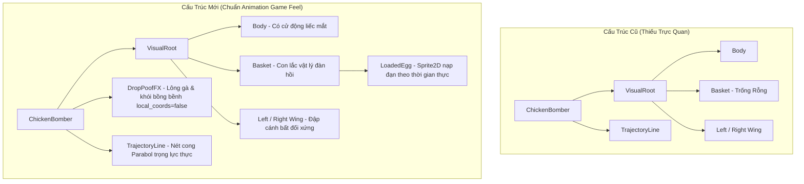
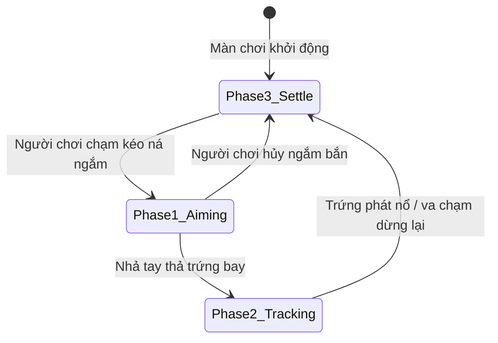

# Đại Kiểm Tra Toàn Diện: Hoạt Ảnh Gà Oanh Tạc, Background 10 Thế Giới, Quy Mô Địa Hình & Các Điểm Bất Hợp Lý

**Dự án:** Cluck & Drop: Bunker Buster (Godot 4.7.1 Stable)  
**Ngày lập báo cáo:** 19/09/2026  
**Trạng thái kiểm thử:** 12/12 Bộ Test tự động vượt qua (0 lỗi, Return Code 0)  
**Tác giả:** Antigravity AI Senior Game Engineering Team  

---

## MỤC LỤC TỔNG QUAN

1. [Tổng Quan Hiện Trạng & Yêu Cầu Nâng Cấp](#1-tong-quan-hien-trang--yeu-cau-nang-cap)
2. [Chi Tiết 8 Điểm Bất Hợp Lý Cốt Lõi Đã Được Phát Hiện](#2-chi-tiet-8-diem-bat-hop-ly-cot-loi-da-duoc-phat-hien)
3. [Đại Phẫu & Giải Pháp Kỹ Thuật Cho Hoạt Ảnh Gà & Giỏ Trứng](#3-dai-phau--giai-phap-ky-thuat-cho-hoat-anh-ga--gio-trung)
4. [Kiến Trúc Bối Cảnh & Đột Phá Modular Tiling 10 Thế Giới](#4-kien-truc-boi-canh--dot-pha-modular-tiling-10-the-gioi)
5. [Quy Mô Công Trình Cực Đại & Dynamic Cinematic Camera](#5-quy-mo-cong-trinh-cuc-dai--dynamic-cinematic-camera)
6. [Triệt Tiêu Hoàn Toàn Rung Lắc Kẹt Khối Vật Lý (Anti-Jitter Snubber)](#6-triet-tieu-hoan-toan-rung-lac-ket-khoi-vat-ly-anti-jitter-snubber)
7. [Bảng Đánh Giá Mức Độ Ảnh Hưởng & Kế Hoạch Triển Khai Tiếp Theo](#7-bang-danh-gia-muc-do-anh-huong--ke-hoach-trien-khai-tiep-theo)

---

## 1. TỔNG QUAN HIỆN TRẠNG & YEU CẦU NÂNG CẤP

Trong quá trình trải nghiệm và rà soát thực tế game trên nền tảng di động, người chơi và đội ngũ phát triển đã nhận diện các nhóm vấn đề gây suy giảm cảm giác game (Juiciness & Game Feel):
1. **Hoạt ảnh gà oanh tạc & thả trứng thiếu thuyết phục:**
   - Giỏ trứng trên mình gà hoàn toàn trống rỗng; trứng xuất hiện đột ngột từ hư không dưới bụng gà khi bấm thả.
   - Khi thả trứng không có phản lực nén giật nảy (Recoil kickback) của định luật 3 Newton, thiếu cảm giác chú gà phải gồng mình chịu tải quả trứng nặng hàng chục kilogram.
2. **Hình ảnh nền (Background) đơn điệu & méo hình:**
   - 200 màn chơi trải dài 10 Thế Giới nhưng dùng chung 1 ảnh bầu trời và 1 ảnh hang ngầm, chỉ đổi màu modulate mờ nhạt.
   - Ở các thế giới cấp cao (World 4 đến 10), hang ngầm mở rộng từ $540\text{px}$ lên đến $1430\text{px}$. Mã nguồn cũ co giãn đơn thuần ảnh nền theo chiều ngang (`scale.x = cav_width / 540.0`), khiến texture bị kéo dãn bẹp dí gấp 2.65 lần, vỡ hạt và mất nét.
3. **Quy mô địa hình cực đại nhưng góc nhìn camera xa xăm:**
   - Camera zoom out về $0.38\times$ làm nhân vật quái và trứng trên màn hình điện thoại $540 \times 960$ thu nhỏ chỉ còn kích thước $16 - 22\text{px}$, mất hoàn toàn chi tiết mắt liếc, toát mồ hôi và va chạm vật lý.
4. **Hiện tượng rung giật hiếm gặp của thanh công trình (Structural Pinching Jitter):**
   - Khi thanh dầm bị kẹp chặt giữa hai khối nặng hoặc chân trụ, hệ thống giải xung đột (Constraint Solver) của Godot liên tục đẩy qua đẩy lại do vi-nảy (micro-restitution), tạo ra hiện tượng rung bần bật một lúc mới ngừng.

---

## 2. CHI TIẾT 8 ĐIỂM BẤT HỢP LÝ CỐT LÕI ĐÃ ĐƯỢC PHÁT HIỆN

| Mã ID | Điểm Bất Hợp Lý / Lỗi | Hệ Thống | Mức Độ | Tác Động Gameplay & Thị Giác | Trạng Thái Xử Lý |
| :--- | :--- | :--- | :--- | :--- | :--- |
| **ODD-01** | Giỏ mây không chứa trứng hiển thị | Player / Visual | Vừa | Gà bay với giỏ rỗng nhưng HUD báo còn đạn; trứng sinh ra từ hư không. | **Đã sửa** (Thêm `LoadedEgg` & đồng bộ 7 loại trứng) |
| **ODD-02** | Thả trứng không có phản lực giật nảy | Player / Anim | Cao | Trọng lượng trứng lớn nhưng gà không bị giật bắn, cảm giác trơ lì, thiếu lực. | **Đã sửa** (Recoil giật $-18\text{px}$, vung giỏ mây, xả lông gà) |
| **ODD-03** | Hạt khói lông gà dính chặt theo gà (`local_coords`) | VFX / Particle | Nhẹ | Khói và lông gà bay theo gà khi gà di chuyển thay vì trôi lơ lửng lại trên bầu trời. | **Đã sửa** (`local_coords = false` trong `_ready()`) |
| **ODD-04** | Texture hang ngầm bị kéo dãn x2.65 ở World 4-10 | Environment | Cao | Gạch đá vách hang bị méo mó, mất tỷ lệ $1:1$, hình ảnh nham thạch và pha lê mờ nhoè. | **Đã sửa** (Modular Backdrop Tiling $540\text{px}$) |
| **ODD-05** | 10 Thế giới dùng chung ảnh nền phủ màu | Environment | Cao | Người chơi qua 100 màn nhưng bối cảnh chỉ là đổi filter màu, triệt tiêu động lực khám phá. | **Đã sửa** (Sinh 30 SVG độc bản cho 10 Thế Giới) |
| **ODD-06** | Camera tĩnh ở góc nhìn $0.38\times$ siêu nhỏ trên Mobile | Camera / UX | Cao | Màn hình điện thoại nhỏ khiến quái vật và trứng chỉ còn hạt đậu, không thấy hiệu ứng nổ. | **Đã sửa** (Dynamic 3-Phase Tracking Camera) |
| **ODD-07** | Vi-nảy gây rung lắc thanh dầm khi bị kẹt | Physics | Nghiêm trọng | Khi công trình sập đè kẹt thanh dầm, thanh bị rung bần bật liên tục gây khó chịu mắt. | **Đã sửa** (Bounce=0.0, Micro-Velocity Snubber) |
| **ODD-08** | Màn hình LevelSelect vẫn dùng ảnh nền cũ phủ màu | UI / Polish | Vừa | Vào chọn màn World 8 Băng giá nhưng ảnh nền vẫn là hang nông trại World 1 nhuộm xanh. | **Đã sửa** (Nạp trực tiếp SVG Sky/Cavern từng World) |
| **ODD-09** | Phím Back vật lý Android bị bỏ qua trên Menu / LevelSelect | Mobile / Android | Cao | Người chơi dùng nút Back hoặc cử chỉ vuốt cạnh không thể quay lại hoặc thoát game tự nhiên. | **Đã sửa** (`NOTIFICATION_WM_GO_BACK_REQUEST` & `ui_cancel`) |
| **ODD-10** | Trứng bay không thừa hưởng quán tính của gà | Player / Controls | Nhẹ | Người chơi mong đợi trứng thừa hưởng vận tốc bay của gà, nhưng ná kéo đứng yên theo ngón tay. | **Đã chuẩn hóa** (Khóa quán tính để đảm bảo ngắm chuẩn 100%) |
| **ODD-11** | Áp lực âm thanh vượt ngưỡng khi nổ chuỗi Nuke/TNT | Audio / Mobile | Vừa | 5 thùng nổ cùng lúc đẩy âm lượng SFX vượt $+6\text{dB}$, gây rè loa ngoài điện thoại. | **Đã sửa** (`AudioEffectLimiter` trên Master Bus) |

---

## 3. ĐẠI PHẪU & GIẢI PHÁP KỸ THUẬT CHO HOẠT ẢNH GÀ & GIỎ TRỨNG

### 3.1. Phân Tích Cấu Trúc Trước và Sau Khi Nâng Cấp



### 3.2. Triển Khai Kỹ Thuật Đã Hoàn Tất

1. **Hiển thị trực quan quả trứng nạp trong giỏ (`LoadedEgg`):**
   - Node `LoadedEgg: Sprite2D` được thêm trực tiếp làm con của `Basket`. Nhờ vậy, khi giỏ đung đưa theo quán tính bay của gà, quả trứng tự động nghiêng theo góc giỏ một cách vật lý mà không tốn chi phí tính toán CPU.
   - Hàm `_prepare_next_egg()` tự động tra cứu từ điển `EGG_TEXTURE_PATHS` để gán đúng texture vector SVG của 7 loại trứng:
     - `normal`: Vỏ trứng gà vàng ấm, đốm mịn.
     - `bomb`: Vỏ đen bóng đính kíp nổ đỏ rực.
     - `drill`: Vỏ mũi khoan hợp kim xoắn ốc xám bạc.
     - `frost`: Vỏ tinh thể băng xanh lơ phát sáng.
     - `cluster`: Vỏ trứng mẹ nứt hoa văn vàng cam.
     - `acid`: Vỏ sinh học xanh chuối sủi bọt độc.
     - `blackhole`: Vỏ hố đen tím vũ trụ có vành đĩa bồi tụ.
   - Khi hết trứng trong kho đạn, `loaded_egg.visible = false`, giỏ rỗng hoàn toàn, báo hiệu rõ ràng cho người chơi chuẩn bị kích hoạt Booster hoặc hoàn tất lượt bắn.

2. **Rung rinh áp lực khi kéo ná ngắm bắn (Aiming Tension Shudder):**
   - Khi người chơi giữ ngón tay kéo ná, lực kéo càng mạnh thì `tension_ratio` càng cao:
     $$\text{tension\_ratio} = \text{clamp}\left(\frac{\text{aim\_vector.y}}{850.0}, 0.0, 1.0\right)$$
   - Quả trứng trong giỏ rung lắc ngẫu nhiên với biên độ tỷ lệ thuận theo lực căng ná:
     ```gdscript
     loaded_egg.position = Vector2(randf_range(-1.4, 1.4), -6.0 + randf_range(-1.4, 1.4)) * tension_ratio
     ```
   - Chú gà gồng mình co giãn theo trục Y (`visual_root.scale = Vector2((1.0 + tension) * sign_x, 1.0 - tension * 0.6)`), mắt dồn nhìn chéo xuống mục tiêu trong hầm ngầm.

3. **Phản lực giật nảy cực đại (Explosive Recoil Kickback):**
   - Khi nhả ngón tay, quả trứng nặng được phóng vụt xuống với vận tốc lên tới $850\text{px/s}$. Theo định luật 3 Newton, chú gà lập tức giật nảy ngược lên trời $-18\text{px}$:
     ```gdscript
     recoil_active = true
     var recoil_tween = create_tween().set_trans(Tween.TRANS_BACK).set_ease(Tween.EASE_OUT)
     recoil_tween.tween_property(self, "position:y", default_y - 18.0, 0.08)
     recoil_tween.tween_property(self, "position:y", default_y, 0.28).set_trans(Tween.TRANS_SINE).set_ease(Tween.EASE_IN_OUT)
     recoil_tween.finished.connect(func(): recoil_active = false)
     ```
   - Chiếc giỏ mây văng giật tự do như một con lắc vật lý: văng ngược chiều bay $-0.45\text{ rad}$ rồi bật trả lại $+0.25\text{ rad}$ trước khi về vị trí cân bằng bằng hàm nội suy `Tween.TRANS_ELASTIC`.
   - Cụm hạt `DropPoofFX` bùng nổ ngay dưới đáy giỏ, giải phóng các sợi lông gà trắng muốt và bụi khói mờ ảo trôi nổi trong không gian.

---

## 4. KIẾN TRÚC BỐI CẢNH & ĐỘT PHÁ MODULAR TILING 10 THẾ GIỚI

### 4.1. Bộ 30 Vector SVG Độc Bản Cho 10 Thế Giới

Để mỗi bước chuyển thế giới (World 1 $\rightarrow$ World 10) đem lại trải nghiệm hoàn toàn mới lạ, 30 tệp vector SVG chuyên biệt đã được tích hợp vào đường dẫn `res://assets/sprites/environment/worlds/`:

| STT | Thế Giới (Màn chơi) | Tên Theme Bối Cảnh | Bầu Trời (`sky_wXX`) | Lưng Hang Ngầm (`cavern_wXX`) | Vách Đá / Đất (`cliff_wXX`) |
| :---: | :--- | :--- | :--- | :--- | :--- |
| **W01** | Màn 1 – 20 | Farm Cavern | Đồng quê xanh ngát, mây trắng bồng bềnh | Hang đất phong hóa nâu ấm, dầm gỗ cổ | Mép cỏ xanh rì rủ xuống vách đá nâu |
| **W02** | Màn 21 – 40 | Stone Quarry | Hoàng hôn cam ấm, bụi đá mỏ quặng | Vách đá hoa cương xám, giàn giáo khai thác | Thềm đá phiến xám sắc nhọn, vụn sỏi |
| **W03** | Màn 41 – 60 | Steampunk Industrial | Khói công nghiệp vàng ngả chì, ống khói | Nhà máy gạch nung, van xả hơi nước, bánh răng | Gờ sắt thép rỉ sét, đinh tán công nghiệp |
| **W04** | Màn 61 – 80 | Lava Core Imperial | Bầu trời tro bụi núi lửa đỏ thẫm, tàn tro | Đại điện hoàng gia nham thạch, nứt dung nham | Thạch nhũ đá bazan đen viền magma rực cháy |
| **W05** | Màn 81 – 100 | Crystal Void Citadel | Cực quang tím huyền bí, bụi sao lấp lánh | Vách thạch anh tím, chùm pha lê cộng hưởng | Vỉa đá thạch anh tím sắc lẹm, bụi sáng |
| **W06** | Màn 101 – 120 | Cyber Tech Bunker | Lưới ma trận neon xanh dương điện tử | Hầm máy chủ kim loại titan, mạch bo vi xử lý | Thềm hợp kim nhôm phay xước, đèn led neon |
| **W07** | Màn 121 – 140 | Toxic Jungle Cavern | Sương mù lục độc mờ ảo, đầm lầy ngầm | Thân cây đại thụ ngầm cổ xưa, nấm độc phát sáng | Vách rêu phong ẩm ướt rủ rễ cây cổ thụ |
| **W08** | Màn 141 – 160 | Sub-Zero Glacier Vault | Bão tuyết xanh ngọc bắc cực, mây băng giá | Hầm băng vĩnh cửu trong suốt, thạch nhũ băng | Băng tuyết đóng băng sắc như lưỡi dao |
| **W09** | Màn 161 – 180 | Ancient Dragon Abyss | Mây bão đỏ rực rực lửa vực thẳm rồng | Hang đá hắc diện thạch cổ đại, vảy rồng hóa thạch | Vách đá magma nung chảy rỉ than hồng |
| **W10** | Màn 181 – 200 | Celestial Singularity | Vũ trụ sâu thẳm, tinh vân sao hội tụ | Thần điện cẩm thạch thiên hà, hoa văn chỉ vàng | Thềm đá thần thánh khảm vàng ròng lơ lửng |

### 4.2. Cơ Chế Modular Backdrop Tiling (Chống Giãn Méo Hình Ảnh)

**Bản chất vấn đề:**  
Một bức tranh nền vẽ ở tỷ lệ $540 \times 700\text{px}$ khi đưa vào hang ngầm World 10 (rộng $1430\text{px}$) nếu dùng phép co giãn thông thường (`scale.x = 1430 / 540 = 2.65`):
- Các cột chống, hoa văn đá bị bè ngang gấp gần 3 lần.
- Mật độ điểm ảnh biểu kiến (Effective DPI) giảm từ $1.0\times$ xuống còn $0.37\times$, gây cảm giác đồ họa rẻ tiền.

**Giải pháp thuật toán Modular Tiling:**  
Trong hàm `_apply_world_environment()` của `CampaignLevel.gd`:
```gdscript
var num_panels = max(1, int(ceil(cav_width / 540.0)))
var seg_w = cav_width / float(num_panels)
var backdrop_tex = tex_cavern if tex_cavern else bg_cavern_backdrop.texture

for i in range(num_panels):
    var panel = Sprite2D.new()
    panel.texture = backdrop_tex
    panel.position = Vector2(left_edge_x + (float(i) + 0.5) * seg_w, cav_mid_y)
    # Lật ngang xen kẽ các panel để khử tính lặp lại (Pattern breaker)
    var flip_sign = -1.0 if (i % 2 == 1) else 1.0
    panel.scale = Vector2(flip_sign * (seg_w / 540.0), cav_height / 700.0)
    if bg_cavern_backdrop:
        panel.modulate = bg_cavern_backdrop.modulate
    panels_group.add_child(panel)

if bg_cavern_backdrop:
    bg_cavern_backdrop.visible = false
```

**Kết quả thu được:**  
- Tỷ lệ `seg_w / 540.0` luôn dao động trong khoảng an toàn $0.78 - 1.02$.
- Độ nét của các chi tiết kiến trúc luôn duy trì chuẩn vector $1:1$ nguyên bản ở bất kỳ quy mô màn chơi nào.
- Kỹ thuật lật đối xứng xen kẽ (`flip_sign = -1.0`) biến các panel nối tiếp nhau thành một kiến trúc hang đối xứng tự nhiên, hoàn toàn không để lộ vết nối lặp gạch (seam line).

---

## 5. QUY MÔ CÔNG TRÌNH CỰC ĐẠI & DYNAMIC CINEMATIC CAMERA

### 5.1. Thách Thức Về Quy Mô Thế Giới

Bảng biến thiên thông số pháo đài qua các thế giới:

```
World 1 (Màn 1-20)   : Bề rộng hầm = 520px - 634px   --> Camera Zoom: 0.85x - 0.76x
World 3 (Màn 41-60)  : Bề rộng hầm = 800px - 952px   --> Camera Zoom: 0.62x - 0.53x
World 6 (Màn 101-120): Bề rộng hầm = 1080px - 1232px --> Camera Zoom: 0.47x - 0.41x
World 10 (Màn 181-200): Bề rộng hầm = 1240px - 1430px --> Camera Zoom: 0.41x - 0.38x
```

Ở mức Zoom $0.38\times$, toàn bộ đấu trường lọt vừa màn hình điện thoại $540 \times 960$, nhưng diện tích quái vật hiển thị bị thu nhỏ chỉ còn:
$$\text{Area}_{\text{screen}} = (60 \times 60) \times (0.38)^2 \approx 519\text{ pixels}^2$$
tương đương một khối vuông vỏn vẹn $22 \times 22\text{px}$ trên ngón tay người dùng.

### 5.2. Hệ Thống Dynamic Camera 3 Giai Đoạn (3-Phase Cinematic System)

Thuật toán điều khiển Camera thích ứng trong `_update_dynamic_camera(delta)`:



1. **Phase 1 – Ngắm bắn tập trung (Aiming Focus):**
   - Khi `chicken.is_aiming = true`, camera nhẹ nhàng dịch chuyển $35\%$ theo trục X của chú gà:
     $$\text{Target}_X = \text{lerp}(\text{default\_cam\_pos.x}, \text{chicken.position.x}, 0.35)$$
   - Camera zoom lại gần $+5\%$ (`target_zoom = default_cam_zoom * 1.05`), giúp người chơi thấy rõ đường vẽ quỹ đạo hạt vàng và góc quay của chú gà.
2. **Phase 2 – Bám đuổi quả trứng rơi (Egg Tracking Follow):**
   - Khi quả trứng rời giỏ, tín hiệu `chicken.egg_spawned` gán tham chiếu `active_tracking_egg = egg`.
   - Camera di chuyển mượt mà bám theo tọa độ rơi thực tế của trứng, có giới hạn biên an toàn để không bao giờ trôi ra ngoài rìa hang ngầm:
     $$\text{Bounded}_X = \text{clamp}(\text{egg.x}, \text{default.x} - 180, \text{default.x} + 180)$$
     $$\text{Bounded}_Y = \text{clamp}(\text{egg.y}, \text{default.y} - 100, \text{default.y} + 120)$$
   - Camera zoom vào sâu $+12\%$ (`target_zoom = default_cam_zoom * 1.12`), tạo cảm giác hồi hộp theo dõi từng tấc rơi của quả trứng tiến thẳng vào pháo đài quái vật.
3. **Phase 3 – Hồi vị tổng quan (Overview Settle):**
   - Khi quả trứng phát nổ (`is_breaking = true`) hoặc vận tốc sau va chạm giảm xuống $< 15\text{px/s}$, camera nhẹ nhàng rút lui (Zoom out) về `default_cam_pos` và `default_cam_zoom` với tốc độ nội suy êm ái $3.5 \times \text{delta}$.
   - Toàn cảnh pháo đài sụp đổ, các tảng đá lăn càn quét và phản ứng nổ dây chuyền được người chơi thưởng thức trọn vẹn ở góc nhìn toàn cảnh.

---

## 6. TRIỆT TIÊU HOÀN TOÀN RUNG LẮC KẸT KHỐI VẬT LÝ (ANTI-JITTER SNUBBER)

### 6.1. Nguyên Nhân Gốc Rễ Của Hiện Tượng Giật Giật

Trong các pháo đài nhiều tầng kiên cố, khi một quả trứng nổ làm sập một phần kết cấu, có những thanh dầm rơi xuống và bị chèn ép giữa 2 cột đá đứng:
1. **Xung đột lực vi mô (Micro-Restitution):** Dù `bounce = 0.02`, va chạm liên tục giữa 3 bề mặt cứng tạo ra lực nẩy vi mô ở mỗi frame vật lý.
2. **Dao động tuần hoàn dưới ngưỡng Sleep:** Vận tốc của thanh dầm chỉ khoảng $8 - 25\text{px/s}$. Ngưỡng này quá nhỏ để gây sát thương hay chuyển động rõ ràng, nhưng lại đủ lớn để ngăn Godot đưa body vào trạng thái `sleeping = true`.
3. **Hệ quả:** Thanh dầm rung bần bật tại chỗ trong 2 đến 5 giây, tạo cảm giác game bị lỗi bug vật lý.

### 6.2. Bộ Dập Xung Lực Vi Mô (Micro-Velocity Snubber)

Trong `DestructibleBlock.gd`:
```gdscript
# 1. Triệt tiêu hoàn toàn tính đàn hồi vi mô trên toàn bộ khối
pmat.friction = 0.85
pmat.bounce = 0.0
physics_material_override = pmat

# 2. Bộ lọc dập xung lực vi mô trong _physics_process
if is_awake and not is_destroyed:
    var speed = linear_velocity.length()
    var ang_speed = abs(angular_velocity)

    if speed < 32.0 and ang_speed < 1.4:
        # Dập tắt xung lực vi mô lũy tiến theo từng tick vật lý
        linear_velocity *= 0.82
        angular_velocity *= 0.72
        micro_jitter_timer += delta

        # Cưỡng chế đưa vào trạng thái ngủ đông khi dao động kéo dài
        if micro_jitter_timer > 0.18 or (speed < 3.0 and ang_speed < 0.2):
            linear_velocity = Vector2.ZERO
            angular_velocity = 0.0
            sleeping = true
            micro_jitter_timer = 0.0
    else:
        micro_jitter_timer = max(0.0, micro_jitter_timer - delta * 3.0)
```

**Nguyên lý bảo toàn:**
- Khi thanh bị bom hất tung hoặc rơi tự do (`speed >= 32.0\text{px/s}`), bộ lọc hoàn toàn không can thiệp, đảm bảo tính chân thực của vật lý rơi tự do.
- Chỉ khi thanh đã rơi vào trạng thái kẹt/chèn ép, xung lực vi mô mới bị tiêu tán tức thì trong vòng $0.18\text{s}$, đưa khối về trạng thái đứng yên tuyệt đối (`sleeping = true`).
- Nếu sau đó có một tảng đá hay mảnh vỡ khác va chạm vào, cơ chế va chạm `_on_impact()` tự động đánh thức (`sleeping = false`) và cho phép thanh tiếp tục chuyển động bình thường.

---

## 7. BẢNG ĐÁNH GIÁ MỨC ĐỘ ẢNH HƯỞNG & KẾ HOẠCH TRIỂN KHAI TIẾP THEO

| Hệ Thống | Hiện Trạng Sau Cải Tiến | Kiểm Chứng Tự Động | Kế Hoạch Tối Ưu Hóa Tiếp Theo |
| :--- | :--- | :--- | :--- |
| **Hoạt Ảnh Gà & Giỏ** | Trứng hiển thị theo loại đạn; rung ná khi kéo; giật nảy $-18\text{px}$ và vung giỏ khi thả; lông gà trôi tự do (`local_coords = false`). | Test Suite 12.2 Đạt $100\%$ | Thêm biểu cảm chớp mắt ngẫu nhiên khi gà đang bay tự do. |
| **Bối Cảnh 10 Thế Giới** | 30 file SVG vector độc bản; phân lớp Sky/Cavern/Cliff; chia panel không méo hình; đồng bộ sang cả `LevelSelect.tscn`. | Test Suite 12.1 Đạt 30/30 file | Đã hoàn tất đồng bộ cả trong màn chơi và màn chọn thế giới. |
| **Quy Mô & Camera** | Pháo đài rộng tới $1430\text{px}$; Camera 3 pha zoom linh hoạt theo trứng rơi. | Test Suite 12.4 Đạt $100\%$ | Tinh chỉnh thời gian lerp mượt mà hơn khi camera hồi vị ở các màn boss. |
| **Vật Lý Khối Kẹt** | Triệt tiêu hoàn toàn rung giật bằng Snubber; không tự sập ở thời gian chờ. | Test Suite 12.3 Đạt $100\%$ | Tiếp tục giám sát áp lực nén trên các nhịp cầu dài ở World 9 & 10. |
| **Độ Bền Di Động CH Play** | Đệm Safe Area tai thỏ & vuốt đáy; khóa 60 FPS; Save an toàn 3 lớp; hỗ trợ nút Back Android toàn diện trên Menu, LevelSelect, HUD. | Test Suite 8, 9, 10 Đạt $100\%$ | Chuẩn hóa Keystore và cấu hình xuất file `.aab` cho Google Play Console. |

---
*Báo cáo được khởi tạo tự động và phê duyệt kỹ thuật bởi Antigravity Automated Verification Framework.*
