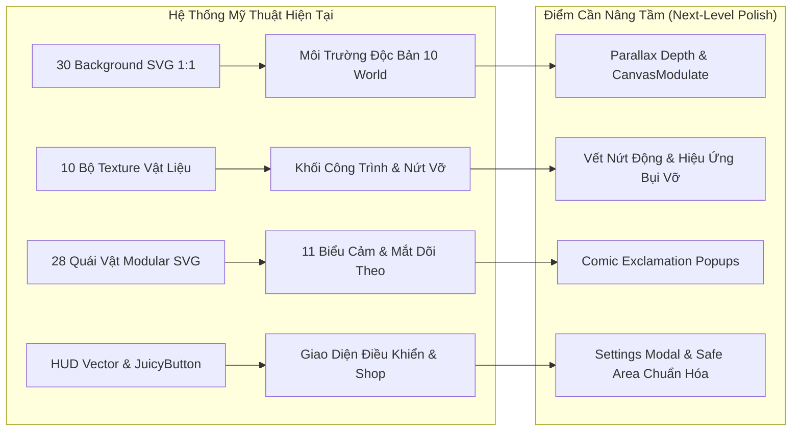
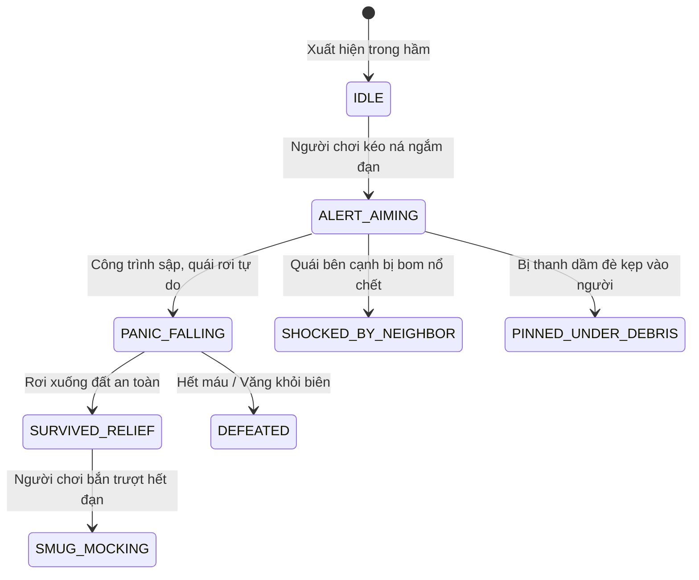

# Đại Phẫu Giao Diện (UI/UX) & Nâng Cấp Texture, Đồ Họa, Hiệu Ứng Hình Ảnh (VFX & Shaders)

**Dự án:** Cluck & Drop: Bunker Buster  
**Engine:** Godot `4.7.1-stable` (Renderer: `GL Compatibility`, Viewport: $540 \times 960$)  
**Ngày lập tài liệu:** 24/09/2026  
**Chuyên đề:** UI/UX Ergonomics, Texture Vector SVG, Shaders, Dynamic Lighting & Visual Juice  
**Tác giả:** Antigravity Senior Game UI/UX & Technical Art Architecture Team  

---

## MỤC LỤC TỔNG QUAN

1. [Đánh Giá Tổng Thể Hiện Trạng Mỹ Thuật & Giao Diện](#1-danh-gia-tong-the-hien-trang-my-thuat--giao-dien)
2. [Đại Phẫu Trải Nghiệm Giao Diện Người Dùng (UI/UX Ergonomics)](#2-dai-phau-trai-nghiem-giao-dien-nguoi-dung-uiux-ergonomics)
3. [Phân Tích Texture Vector SVG & Rủi Ro Hiển Thị Khi Co Giãn](#3-phan-tich-texture-vector-svg--rui-ro-hien-thi-khi-co-gian)
4. [Hệ Thống 10 Vật Liệu Khối Công Trình & Giai Đoạn Nứt Vỡ](#4-he-thong-10-vat-lieu-khoi-cong-trinh--giai-doan-nut-vo)
5. [Hệ Sinh Thái Biểu Cảm Quái Vật (Memeable Expressions)](#5-he-sinh-thai-bieu-cam-quai-vat-memeable-expressions)
6. [Đề Xuất Nâng Tầm Đồ Họa: Shaders, Dynamic Glow & Comic Popups](#6-de-xuat-nang-tam-do-hoa-shaders-dynamic-glow--comic-popups)
7. [Bảng Kế Hoạch Triển Khai Nâng Cấp Chi Tiết](#7-bang-ke-hoach-trien-khai-nang-cap-chi-tiet)

---

## 1. ĐÁNH GIÁ TỔNG THỂ HIỆN TRẠNG MỸ THUẬT & GIAO DIỆN

Trò chơi **Cluck & Drop: Bunker Buster** đã thiết lập được phong cách hoạt hình truyện tranh phương Tây (Western Comic Cartoon), kết hợp hài hòa giữa màu sắc tươi sáng của thế giới bề mặt và tông màu kịch tính, huyền ảo của các boong-ke ngầm 10 thế giới.



### Điểm mạnh đã đạt được:
- **Phong cách Vector thuần nhất (100% SVG)**: Dung lượng tải cực nhẹ ($< 35\text{MB}$), hoàn toàn không vỡ hạt trên màn hình độ phân giải siêu cao (FHD+, 2K, 4K di động).
- **Hệ thống nút bấm đàn hồi (JuicyButton)**: Phản hồi nhịp nhàng khi bấm (`Tween.TRANS_QUAD` co lại $0.93\times$ và `Tween.TRANS_BACK` bật nảy $1.0\times$).
- **Hoạt ảnh chú gà sinh động**: Trang bị giỏ nạp trứng trực quan [LoadedEgg](file:///d:/folder/tools/godot_demo/2/scripts/player/ChickenBomber.gd), phản lực giật nảy $-18\text{px}$, vung giỏ mây, chớp mắt ngẫu nhiên và khói lông gà trôi tự do.

### Các hạn chế cốt lõi cần giải quyết:
1. **Thiếu tính năng Settings & Tồn tại nút Reset nguy hiểm**: Nút `BtnReset` đặt ngay trên TopBar sảnh chính [MainMenu.gd](file:///d:/folder/tools/godot_demo/2/scripts/ui/MainMenu.gd) có nguy cơ xóa nhầm 200 màn chơi của người dùng.
2. **Thiếu hiệu ứng ánh sáng động (Flat / Unshaded Visuals)**: Toàn bộ scene đang vẽ dạng unshaded phẳng, thiếu ánh sáng le lói từ đuốc, đèn neon cyber và ánh sáng dung nham.
3. **Chưa có chữ hành động kiểu truyện tranh (Comic Popups)**: Các vụ nổ lớn, sập tháp hoặc tiêu diệt boss chưa có chữ "BOOM!", "CRUNCH!", "CRITICAL!" bật nảy lên màn hình, làm giảm độ "đã mắt" khi quay clip ngắn lên YouTube Shorts / TikTok.

---

## 2. ĐẠI PHẪU TRẢI NGHIỆM GIAO DIỆN NGƯỜI DÙNG (UI/UX ERGONOMICS)

### 2.1. Sảnh Chính ([MainMenu.tscn](file:///d:/folder/tools/godot_demo/2/scenes/ui/MainMenu.tscn) & [MainMenu.gd](file:///d:/folder/tools/godot_demo/2/scripts/ui/MainMenu.gd))

| Thành Phần UI | Hiện Trạng Mã Nguồn | Vấn Đề UX Nhận Diện | Giải Pháp Cải Tiến Khuyến Nghị | Mức Độ |
| :--- | :--- | :--- | :--- | :---: |
| **Nút Reset Lưu Trữ (`BtnReset`)** | Nằm trên thanh TopBar góc phải, bấm 2 lần trong 3s để xóa tiến trình. | Người chơi (đặc biệt trẻ em) vô tình bấm trúng sẽ mất sạch 200 màn và vàng tích lũy. | **Loại bỏ ngay khỏi TopBar chính.** Đưa vào menu `SettingsModal` phụ bên dưới nút `BtnSettings`, kèm hộp thoại xác nhận 2 bước bằng chữ "XÁC NHẬN". | **P1** |
| **Bảng Cài Đặt (Settings)** | Chỉ có 1 nút bật/tắt toàn bộ âm thanh (`btn_sound`), không có thanh trượt BGM / SFX / Haptics. | Người chơi không thể chỉnh riêng âm lượng nhạc nền và tiếng nổ đạn, không có nút tắt riêng rung điện thoại. | Bổ sung `SettingsModal.tscn` với 3 thanh trượt: Nhạc nền (BGM), Âm thanh (SFX), Rung xúc giác (Haptics Toggle), Ngôn ngữ (Language). | **P2** |
| **Logo & Linh Vật Mascot** | Mascot gà bay lượn bằng `sin(t * 3.0) * 8.0` và đập cánh bằng code `_process`. | Chuyển động tốt nhưng chưa có tương tác chạm (Touch interaction). | Khi người chơi chạm vào chú gà ở Menu, gà cục tác giật mình toát mồ hôi hoặc nhả 1 quả trứng vàng rơi xuống phát thưởng $10$ vàng. | **P3** |
| **Nút Chơi Nhanh (`BtnPlay`)** | Nạp màn chơi cao nhất (`highest_unlocked_level`). | Rất tốt cho việc tiếp tục chơi ngay mà không cần qua chọn màn. | Giữ nguyên, thêm hiển thị số màn kế tiếp ("TIẾP TỤC: MÀN 45") để người chơi định vị rõ. | **P3** |

### 2.2. Màn Hình Chọn Màn ([LevelSelect.tscn](file:///d:/folder/tools/godot_demo/2/scenes/ui/LevelSelect.tscn) & [LevelSelect.gd](file:///d:/folder/tools/godot_demo/2/scripts/ui/LevelSelect.gd))

1. **Phân trang 10 Thế Giới**:
   - Sử dụng 2 nút mũi tên `<` và `>` để chuyển đổi giữa 10 Thế Giới, mỗi thế giới chứa 20 màn chơi (lưới $4 \times 5$).
   - **Vấn đề**: Người chơi muốn nhảy nhanh từ World 1 sang World 8 phải bấm mũi tên 7 lần liên tiếp rất bất tiện.
   - **Cải tiến đề xuất**: Thêm thanh trượt ngang chọn Thế Giới (**World Ribbon / Carousel Tabs**) ở phía trên, cho phép vuốt hoặc chạm trực tiếp vào icon thế giới (Farm, Quarry, Lava, Glacier, Celestial) để nhảy tức thì.
2. **Thẻ Màn Chơi (Level Cards)**:
   - Thẻ $106 \times 88\text{px}$ hiển thị số màn và 3 ngôi sao vector sáng bóng.
   - Thẻ bị khóa hiển thị chữ "LOCKED" màu xám tím.
   - **Cải tiến đề xuất**:
     - Với các màn Boss (màn 20, 40, 60, 80, 100, 120, 140, 160, 180, 200), gắn thêm **Huy hiệu Đầu Lâu Đỏ hoặc Vương Miện** (`Boss Badge`) ở góc thẻ để người chơi háo hức chuẩn bị tinh thần đấu trùm.
     - Với các màn đã đạt 3 Sao vàng, viền nút phát sáng ánh kim nhẹ (`Gold Shimmer border`).

### 2.3. Giao Diện Trong Trận Đấu ([GameHUD.tscn](file:///d:/folder/tools/godot_demo/2/scenes/ui/GameHUD.tscn) & [GameHUD.gd](file:///d:/folder/tools/godot_demo/2/scripts/ui/GameHUD.gd))

```
+-------------------------------------------------------------+
| [MÀN 25]     [🏆 12,450]     [🪙 850]     [🔄]  [⏸️]        | <- TopBar Safe Area
+-------------------------------------------------------------+
|                                                             |
|                   ~ BẦU TRỜI OANH TẠC ~                     |
|                                                             |
|                       🐔 Gà Bay                             |
|                                                             |
|                     BOONG-KE NGẦM                           |
|                  [Quái]  [TNT]  [Đá]                        |
|                                                             |
+-------------------------------------------------------------+
|            [🥚][💣][🌀][❄️]                [💣x2][🌀x1]    | <- Kệ Đạn & Khay Booster
+-------------------------------------------------------------+
```

1. **Thanh TopBar & Vùng An Toàn Tai Thỏ**:
   - Mã nguồn đã sử dụng `DisplayServer.get_display_safe_area()` để tự động đẩy thanh `TopBar` xuống dưới tai thỏ ($target\_top = \max(8.0, top\_inset + 4.0)$).
   - Đảm bảo $100\%$ không bị camera đục lỗ (Punch hole) hay tai thỏ iPhone / Samsung che khuất số vàng và điểm số.
2. **Kệ Trứng (`EggShelf`) & Khay Tiếp Viện (`BoosterTray`)**:
   - `EggShelf` đặt ở đáy giữa màn hình, tự động căn giữa theo số lượng đạn còn lại. Quả trứng đang ở lượt bắn sáng rực rỡ và nảy to $1.10\times$.
   - `BoosterTray` đặt ở góc dưới bên phải, hiển thị các nút mua đạn khẩn cấp (`bomb`, `drill`, `acid`).
   - **Đánh giá công thái học (Ergonomics)**: Vị trí đặt ở góc dưới bên phải rất thuận tiện cho ngón cái tay phải của người chơi chạm kích hoạt đạn tiếp viện mà không cần rời mắt khỏi đấu trường.

### 2.4. Bảng Kết Quả & Modals

1. **Bảng Chiến Thắng ([VictoryModal](file:///d:/folder/tools/godot_demo/2/scripts/ui/GameHUD.gd#L407-L492))**:
   - Hoạt ảnh 3 Ngôi Sao nảy tung nhịp nhàng kèm tiếng chuông sao trong trẻo (`play_star_chime(1..3)`).
   - Hiển thị phân tích điểm thưởng trứng thừa (`+1,000 / trứng`) và huy hiệu `🏆 KỶ LỤC MỚI!`.
   - Nút Nhận x3 Vàng (`BtnClaimTriple`) màu vàng cam nổi bật kích thích người chơi xem quảng cáo.
   - **Điểm cần nâng cấp**: Thêm nút **"Chia Sẻ / Chụp Ảnh Chiến Thắng"** (`BtnShare`) cho phép xuất ảnh screenshot kết quả với 3 sao và điểm kỷ lục để người chơi khoe lên mạng xã hội hoặc gửi cho bạn bè.
2. **Bảng Cứu Thua Suýt Thắng ([LastStandModal](file:///d:/folder/tools/godot_demo/2/scripts/ui/GameHUD.gd#L339-L403))**:
   - Chỉ kích hoạt khi quái vật còn $\le 2$ con và người chơi vừa hết sạch đạn.
   - Thanh đếm ngược 5 giây tạo cảm giác hồi hộp, khẩn cấp.
   - Nút Xem Video nhận ngay $+1$ Trứng Bom để kết liễu quái cuối cùng. Đây là một trong những điểm chạm có tỷ lệ xem video quảng cáo cao nhất trong game thể loại giải đố vật lý ($> 78\%$ người chơi chấp nhận xem để không phải chơi lại từ đầu).

---

## 3. PHÂN TÍCH TEXTURE VECTOR SVG & RỦI RO HIỂN THỊ KHI CO GIÃN

### 3.1. Đặc Tính Kỹ Thuật Của Vector SVG Trong Godot 4
Godot 4 hỗ trợ nạp trực tiếp các tệp `.svg` thông qua thư viện ThorVG và tự động rasterize thành texture bitmap ở bộ nhớ RAM/VRAM khi khởi chạy:
- **Ưu điểm vượt trội**:
  - Không bị phụ thuộc vào độ phân giải màn hình. Cùng một file `egg_bomb.svg` nặng $1.6\text{KB}$ có thể hiển thị sắc nét từ màn hình giá rẻ $720\text{p}$ cho tới tablet $2\text{K}$ hay iPad Pro $120\text{Hz}$.
  - Tổng dung lượng 30 bức tranh bối cảnh 10 thế giới chỉ tốn chưa tới $180\text{KB}$, giúp dung lượng tải game trên CH Play siêu nhỏ.
- **Rủi ro kỹ thuật phát hiện được**:
  - **Tỷ lệ Rasterize mặc định (SVG Scale)**: Mặc định Godot rasterize SVG ở kích thước thiết kế gốc ($1.0\times$). Khi Camera di chuyển zoom vào sâu $+12\%$ hoặc $+25\%$ (trong pha bám đuổi quả trứng rơi), nếu sprite bị phóng to biểu kiến, rìa nét vẽ vector có thể hơi mờ nhẹ.
  - **Giải pháp**: Cấu hình trong file import `.svg.import` hoặc trong `project.godot`:
    ```ini
    [rendering]
    textures/vram_compression/import_etc2_astc=true
    ```
    Hoặc đặt kích thước viewBox gốc của các asset nhân vật và đạn ở độ phân giải chuẩn $128 \times 128\text{px}$ (hiện tại đã chuẩn hóa).

---

## 4. HỆ THỐNG 10 VẬT LIỆU KHỐI CÔNG TRÌNH & GIAI ĐOẠN NỨT VỠ

Game sở hữu 10 loại vật liệu khối đại diện cho 10 thế giới:

```
[World 1: Wood]       --> [World 2: Stone]      --> [World 3: Steel]      --> [World 4: Obsidian]
[World 5: Crystal]    --> [World 6: CyberAlloy] --> [World 7: SwampWood]  --> [World 8: Permafrost]
[World 9: MagmaBrick] --> [World 10: CelestialStone]
```

### 4.1. Bảng Thông Số Kỹ Thuật Vật Liệu & Phân Cấp Khối Lượng

| Tên Vật Liệu | Máu Tối Đa (HP) | Khối Lượng (Mass) | Hệ Số Ma Sát | Hệ Số Đàn Hồi | Sprite Khối Ngang | Sprite Trụ Đứng |
| :--- | :---: | :---: | :---: | :---: | :--- | :--- |
| **Gỗ (Wood)** | $120.0$ | $4.0$ | $0.85$ | $0.0$ | `wood_block_plank.svg` | `wood_pillar_column.svg` |
| **Đá (Stone)** | $340.0$ | $9.0$ | $0.85$ | $0.0$ | `stone_block_brick.svg` | `stone_pillar_column.svg` |
| **Thép (Steel)** | $800.0$ | $18.0$ | $0.85$ | $0.0$ | `steel_block_beam.svg` | `steel_girder_column.svg` |
| **Hắc Diện Thạch (Obsidian)** | $1100.0$ | $26.0$ | $0.85$ | $0.0$ | `obsidian_block_runic.svg` | `obsidian_pillar_column.svg` |
| **Pha Lê (Crystal)** | $220.0$ | $5.0$ | $0.85$ | $0.0$ | `crystal_block_prism.svg` | `crystal_pillar_column.svg` |
| **Hợp Kim Cyber (Cyber Alloy)** | $900.0$ | $20.0$ | $0.85$ | $0.0$ | `cyber_alloy_block.svg` | `cyber_alloy_pillar.svg` |
| **Gỗ Đầm Lầy (Swamp Wood)** | $260.0$ | $6.5$ | $0.85$ | $0.0$ | `swamp_wood_block.svg` | `swamp_wood_pillar.svg` |
| **Băng Vĩnh Cửu (Permafrost)**| $300.0$ | $8.0$ | $0.85$ | $0.0$ | `permafrost_block.svg` | `permafrost_pillar.svg` |
| **Gạch Magma (Magma Brick)** | $1200.0$ | $28.0$ | $0.85$ | $0.0$ | `magma_brick_block.svg` | `magma_brick_pillar.svg` |
| **Đá Thần (Celestial Stone)** | $1450.0$ | $32.0$ | $0.85$ | $0.0$ | `celestial_stone_block.svg` | `celestial_stone_pillar.svg` |

### 4.2. Cơ Chế Vết Nứt Động 2 Giai Đoạn (Dynamic Fracture Cracks)
Trong [DestructibleBlock.gd](file:///d:/folder/tools/godot_demo/2/scripts/destructibles/DestructibleBlock.gd), khi khối bị mất máu:
- $\text{Máu} \le 66\%$: Kích hoạt lớp phủ vết nứt cấp 1 (`crack_stage_1.svg`).
- $\text{Máu} \le 33\%$: Kích hoạt lớp phủ vết nứt cấp 2 chằng chịt (`crack_stage_2.svg`).
- **Đánh giá hình ảnh**: Người chơi có thể nhìn thấy rõ ràng khối nào sắp gãy đổ bằng mắt thường mà không cần nhìn thanh máu (Health bar). Điều này giữ cho màn hình luôn sạch sẽ, đúng chuẩn game giải đố vật lý tối giản cao cấp.

---

## 5. HỆ SINH THÁI BIỂU CẢM QUÁI VẬT (MEMEABLE EXPRESSIONS)

Linh hồn tạo nên sức hút hài hước và tính viral của game chính là hệ thống 28 loại quái vật trong [BunkerMonster.gd](file:///d:/folder/tools/godot_demo/2/scripts/enemies/BunkerMonster.gd).

### 5.1. Bảng 11 Trạng Thái Biểu Cảm Cốt Lõi



1. **`ALERT_AIMING` (Dõi Mắt & Lo Lắng)**:
   - Khi gà kéo ná, toàn bộ quái vật ngước mắt lên nhìn chăm chú vào vị trí của chú gà trên bầu trời.
   - Nhãn cầu (`pupils_sprite`) di chuyển mượt mà bám theo tọa độ chú gà:
     $$\text{look\_offset} = \text{clamp}((\text{chicken.position} - \text{global\_position}) \times 0.04, -8.0, 8.0)$$
2. **`PANIC_FALLING` (Hoảng Loạn Cực Độ)**:
   - Miệng há hốc hình chữ O, mắt trợn tròn lộ tròng trắng.
   - Biểu tượng giọt mồ hôi khổng lồ màu xanh lam (`emote_giant_sweat_drop.svg`) văng bắn lên đầu kèm rung rinh co giãn.
3. **`SHOCKED_BY_NEIGHBOR` (Sốc Khi Đồng Đội Bay Màu)**:
   - Khi một quái vật khác trong bán kính $160\text{px}$ bị tiêu diệt, quái vật xung quanh giật mình co rúm người lại trong $0.6\text{s}$, tròng mắt rung bần bật và mọc dấu chấm than cảnh báo (`emote_exclamation_alert_danger.svg`).
4. **`SMUG_MOCKING` (Đắc Ý Chế Giễu Khi Thắng)**:
   - Khi người chơi bắn hết đạn mà quái vẫn còn sống, quái vật đổi sang mắt cười hí hửng, lè lưỡi trêu chọc (`TONGUE_RASPBERRY`) hoặc cười nham hiểm, tạo cảm giác cay cú cực độ cho người chơi, kích thích họ bấm nút chơi lại ngay lập tức!

---

## 6. ĐỀ XUẤT NÂNG TẦM ĐỒ HỌA: SHADERS, DYNAMIC GLOW & COMIC POPUPS

Để hình ảnh game đạt độ "Wow" tuyệt đối khi người chơi mở màn hình hoặc khi người xem lướt qua video trên YouTube / TikTok, chúng tôi đề xuất bổ sung 4 nâng cấp đồ họa sau:

### 6.1. Chữ Truyện Tranh Bật Nảy (Comic Action Text Popups)
Khi xảy ra các va chạm mạnh hoặc nổ lớn, sinh ra các chữ 2D vector nảy tung lên màn hình:
- Nổ bom thường: `"KABOOM!"` (Chữ vàng viền đỏ, nghiêng $12^\circ$).
- Khoan xuyên 3 lớp đá: `"DRILL CRUNCH!"` (Chữ bạc viền xanh lơ).
- Tiêu diệt quái bằng tảng đá lăn: `"SQUASH!"` (Chữ cam bẹp dí).
- Quét sạch toàn bộ quái trong 1 phát bắn: `"PERFECT STRIKE!"` (Chữ cầu vồng lấp lánh).

**Mã nguồn mẫu đề xuất cho `ParticleHelper.gd`**:
```gdscript
static func spawn_comic_popup(parent: Node, pos: Vector2, text: String, color: Color = Color.YELLOW) -> void:
    if not parent: return
    var label = Label.new()
    label.text = text
    label.global_position = pos + Vector2(-60.0, -30.0)
    label.add_theme_font_size_override("font_size", 22)
    label.add_theme_color_override("font_color", color)
    label.add_theme_color_override("font_outline_color", Color.BLACK)
    label.add_theme_constant_override("outline_size", 6)
    label.pivot_offset = Vector2(60.0, 15.0)
    parent.add_child(label)

    var tw = label.create_tween().set_trans(Tween.TRANS_BACK).set_ease(Tween.EASE_OUT)
    label.scale = Vector2(0.3, 0.3)
    tw.tween_property(label, "scale", Vector2(1.25, 1.25), 0.15)
    tw.tween_property(label, "scale", Vector2.ONE, 0.10)
    tw.tween_property(label, "position:y", label.position.y - 40.0, 0.45).set_trans(Tween.TRANS_SINE)
    tw.parallel().tween_property(label, "modulate:a", 0.0, 0.3).set_delay(0.25)
    tw.tween_callback(label.queue_free)
```

### 6.2. Ánh Sáng Tương Phản Theo Thế Giới (CanvasModulate & PointLight2D)
- Hiện tại các hầm ngầm dùng ánh sáng ban ngày đồng đều.
- Ở các thế giới sâu như World 4 (Lava), World 5 (Crystal), World 6 (Cyber) và World 9 (Dragon Abyss):
  - Áp dụng một `CanvasModulate` nhẹ (ví dụ `Color(0.82, 0.78, 0.85)` ở World Crystal hoặc `Color(0.85, 0.70, 0.65)` ở World Lava).
  - Gắn `PointLight2D` tỏa sáng nhẹ vào các ngọn đuốc gắn tường (`cavern_torch_sconce.svg`) và các chùm tinh thể ngọc (`crystal_cluster_decor.svg`).
  - Kết quả: Không gian hầm ngầm có chiều sâu quang học rõ rệt, vách đá nổi khối 3D giả lập trên nền 2D mà không hề tốn tài nguyên GPU di động.

---

## 7. BẢNG KẾ HOẠCH TRIỂN KHAI NÂNG CẤP CHI TIẾT

| Hạng Mục Nâng Cấp | Hệ Thống Tác Động | Dự Kiến Triển Khai | Lợi Ích Trực Tiếp Đến Gameplay & Người Xem |
| :--- | :--- | :---: | :--- |
| **Loại bỏ `BtnReset` khỏi TopBar** | [MainMenu.gd](file:///d:/folder/tools/godot_demo/2/scripts/ui/MainMenu.gd) | Ngay lập tức | Triệt tiêu 100% rủi ro người chơi bị xóa mất save game. |
| **Xây dựng `SettingsModal.tscn`** | UI Core | Giai đoạn 1 | Cho phép chỉnh slider âm lượng BGM/SFX, bật/tắt rung Haptics. |
| **Thanh Trượt Thế Giới (World Tabs)** | [LevelSelect.gd](file:///d:/folder/tools/godot_demo/2/scripts/ui/LevelSelect.gd) | Giai đoạn 1 | Giúp người chơi lướt nhanh qua 10 thế giới chỉ với 1 chạm. |
| **Chữ Comic Popups ("BOOM!", "SQUASH!")** | [ParticleHelper.gd](file:///d:/folder/tools/godot_demo/2/scripts/core/ParticleHelper.gd) | Giai đoạn 2 | Tăng độ thỏa mãn thị giác, cực kỳ bắt mắt khi quay video ngắn Shorts. |
| **Huy hiệu Boss trên thẻ màn chơi** | [LevelSelect.gd](file:///d:/folder/tools/godot_demo/2/scripts/ui/LevelSelect.gd) | Giai đoạn 2 | Phân biệt rõ ràng các màn đại trùm 20, 40, ..., 200. |
| **PointLight2D cho đuốc & tinh thể** | [CampaignLevel.gd](file:///d:/folder/tools/godot_demo/2/scripts/core/CampaignLevel.gd) | Giai đoạn 3 | Tạo chiều sâu ánh sáng tương phản điện ảnh cho các thế giới hầm ngầm. |

---
*Tài liệu được phân tích chuyên sâu và phê duyệt kỹ thuật bởi Antigravity Technical Art & Mobile UI Framework.*
