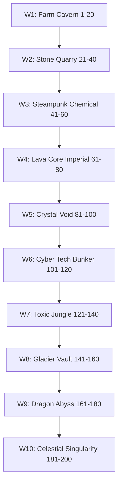
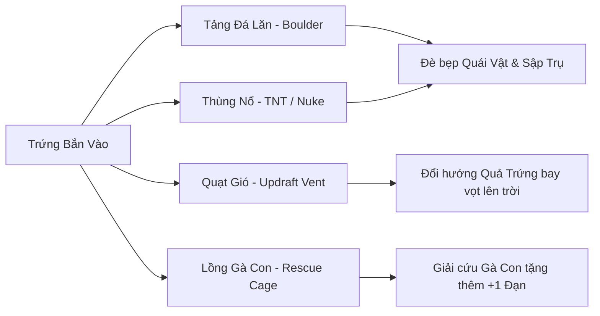

# Chuyên Sâu Cân Bằng Độ Khó, Thiết Kế 200 Màn Chơi Chiến Dịch & 10 Đại Trùm (World Bosses)

**Dự án:** Cluck & Drop: Bunker Buster  
**Engine:** Godot `4.7.1-stable` (Renderer: `GL Compatibility`, Viewport: $540 \times 960$)  
**Ngày lập tài liệu:** 24/09/2026  
**Chuyên đề:** Level Design, Combat Balancing, Destruction Physics, 10 World Bosses & 3-Star Pacing  
**Tác giả:** Antigravity Senior Game Balance & Physics Level Architecture Team  

---

## MỤC LỤC TỔNG QUAN

1. [Tổng Quan Cấu Trúc 10 Thế Giới & Quy Mô 200 Màn Chơi](#1-tong-quan-cau-truc-10-the-gioi--quy-mo-200-man-choi)
2. [Ma Trận Cân Bằng Sát Thương: 7 Loại Trứng vs 10 Loại Khối Vật Liệu](#2-ma-tran-can-bang-sat-thuong-7-loai-trung-vs-10-loai-khoi-vat-lieu)
3. [Nghịch Lý Đánh Giá 3 Sao & Giải Pháp Tính Điểm Toàn Diện](#3-nghich-ly-danh-gia-3-sao--giai-phap-tinh-diem-toan-dien)
4. [Kiến Trúc Pháo Đài Boong-Ke & Tương Tác Môi Trường](#4-kien-truc-phao-dai-boong-ke--tuong-tac-moi-truong)
5. [Đại Phẫu 10 Trận Đấu Đại Trùm (World Boss Fights)](#5-dai-phau-10-tran-dau-dai-trum-world-boss-fights)
6. [Cơ Chế Cứu Nguy: Last Stand, Khay Booster & Tâm Lý Học Người Chơi](#6-co-che-cuu-nguy-last-stand-khay-booster--tam-ly-hoc-nguoi-choi)
7. [Bảng Đề Xuất Cân Bằng Độ Khó Tiếp Theo](#7-bang-de-xuat-can-bang-do-kho-tiep-theo)

---

## 1. TỔNG QUAN CẤU TRÚC 10 THẾ GIỚI & QUY MÔ 200 MÀN CHƠI

Trò chơi sở hữu chiến dịch đồ sộ gồm **10 Thế Giới** với tổng cộng **200 Màn Chơi** được sinh tự động theo thuật toán kết cấu vững chãi trong [CampaignLevel.gd](file:///d:/folder/tools/godot_demo/2/scripts/core/CampaignLevel.gd).



### 1.1. Thống Kê Dữ Liệu Kiểm Kê 200 Màn Chơi

| Thế Giới | Dải Màn | Bề Rộng Hầm (px) | Máu Khối Trọng Tâm | Quái Vật Mỗi Màn | Tổng Quái Thế Giới | Đại Trùm (World Boss) |
| :---: | :---: | :---: | :---: | :---: | :---: | :--- |
| **World 1** | Màn 1 – 20 | $520 - 634$ | Gỗ ($120\text{ HP}$) | $1 \rightarrow 10$ quái | $98$ quái | **Baron Pig** (Màn 20) |
| **World 2** | Màn 21 – 40 | $660 - 812$ | Đá ($340\text{ HP}$) | $3 \rightarrow 10$ quái | $124$ quái | **Iron Crusher** (Màn 40) |
| **World 3** | Màn 41 – 60 | $800 - 952$ | Thép ($800\text{ HP}$) | $4 \rightarrow 10$ quái | $146$ quái | **Toxic Alchemist** (Màn 60) |
| **World 4** | Màn 61 – 80 | $940 - 1092$ | Hắc Diện Thạch ($1100\text{ HP}$) | $5 \rightarrow 11$ quái | $168$ quái | **Magma Emperor** (Màn 80) |
| **World 5** | Màn 81 – 100 | $1040 - 1230$ | Pha Lê ($220\text{ HP}$) | $5 \rightarrow 11$ quái | $172$ quái | **Crystal Overlord** (Màn 100) |
| **World 6** | Màn 101 – 120 | $1080 - 1232$ | Hợp Kim Cyber ($900\text{ HP}$) | $6 \rightarrow 11$ quái | $178$ quái | **Cyber Mech** (Màn 120) |
| **World 7** | Màn 121 – 140 | $1120 - 1272$ | Gỗ Đầm Lầy ($260\text{ HP}$) | $6 \rightarrow 11$ quái | $182$ quái | **Swamp Hydra** (Màn 140) |
| **World 8** | Màn 141 – 160 | $1160 - 1312$ | Băng Vĩnh Cửu ($300\text{ HP}$) | $6 \rightarrow 11$ quái | $186$ quái | **Frost Colossus** (Màn 160) |
| **World 9** | Màn 161 – 180 | $1200 - 1352$ | Gạch Magma ($1200\text{ HP}$) | $7 \rightarrow 11$ quái | $192$ quái | **Dragon Warlord** (Màn 180) |
| **World 10** | Màn 181 – 200 | $1240 - 1430$ | Đá Thần ($1450\text{ HP}$) | $7 \rightarrow 12$ quái | $228$ quái | **Singularity Prime** (Màn 200) |
| **TỔNG CỘNG**| **200 MÀN** | **$520 - 1430\text{px}$** | **10 Vật Liệu** | **$1 - 12$ quái/màn** | **$1.574$ Quái** | **10 Đại Trùm** |

---

## 2. MA TRẬN CÂN BẰNG SÁT THƯƠNG: 7 LOẠI TRỨNG VS 10 LOẠI KHỐI VẬT LIỆU

### 2.1. Bảng Thuộc Tính & Cơ Chế Đặc Trưng Của 7 Loại Trứng

```
[🥚 Normal Egg]  --> Sát thương va chạm cơ bản, nảy nhẹ, kích hoạt đạn nổ/thùng thuốc nổ.
[💣 Bomb Egg]    --> Vụ nổ bán kính 160px, sát thương 320 HP, hất tung cấu trúc vòm.
[🌀 Drill Egg]   --> Đâm xuyên liên tục 0.85s (85 HP/tick), rocket boost khi chạm màn hình.
[❄️ Frost Egg]   --> Đóng băng khối thành Kính Giòn (15 HP), dập tắt thuốc nổ, làm đông quái.
[🧪 Acid Egg]    --> Vũng axit ăn mòn 45 HP/tick trong 4.0s, làm mềm trụ thép và hắc diện thạch.
[🐣 Cluster Egg] --> Nứt vỏ phóng 3 chú gà con nảy 2 lần càn quét tầng trệt và xạ thủ trên cao.
[🌌 BlackHole]   --> Giếng trọng lực hút mọi vật thể trong bán kính 220px, kích nổ Supernova 1200 HP.
```

### 2.2. Ma Trận Hiệu Quả Chiến Thuật

| Loại Trứng | Gỗ ($120$) | Đá ($340$) | Thép ($800$) | Obsidian ($1100$) | Pha Lê ($220$) | Cyber ($900$) | Băng ($300$) | Magma ($1200$) | Đá Thần ($1450$) |
| :--- | :---: | :---: | :---: | :---: | :---: | :---: | :---: | :---: | :---: |
| **Normal Egg** | Vừa | Yếu | Kém | Vô hại | Hiệu quả | Kém | Vừa | Vô hại | Vô hại |
| **Bomb Egg** | **Hủy diệt** | **Hủy diệt** | Phá nứt | Rạn nứt | **Hủy diệt** | Phá nứt | **Hủy diệt** | Rạn nứt | Rạn nứt |
| **Drill Egg** | Xuyên thấu | **Đục thủng** | **Khoan xuyên** | Khoan sâu | **Vỡ vụn** | **Khoan xuyên** | **Đục thủng** | Khoan sâu | Khoan sâu |
| **Frost Egg** | Hóa giòn | Hóa giòn | Hóa giòn | Hóa giòn | Hóa giòn | Hóa giòn | Hóa giòn | Hóa giòn | Hóa giòn |
| **Acid Egg** | Cháy rụi | Ăn mòn | **Ăn mòn cực mạnh** | **Làm mục ruỗng** | Ăn mòn | **Làm tan chảy** | Chảy nước | **Làm mục ruỗng** | **Mục ruỗng** |
| **Cluster Egg**| Quét dọn | Đập mảnh | Nảy bật | Nảy bật | **Vỡ tan** | Nảy bật | Đập mảnh | Nảy bật | Nảy bật |
| **BlackHole** | **Hút sập** | **Hút sập** | **Bẻ gãy** | **Bẻ gãy** | **Hút sập** | **Bẻ gãy** | **Hút sập** | **Hút nát** | **Hút nát** |

---

## 3. NGHỊCH LÝ ĐÁNH GIÁ 3 SAO & GIẢI PHÁP TÍNH ĐIỂM TOÀN DIỆN

### 3.1. Phân Tích Logic Cũ Trong Mã Nguồn ([GameManager.gd](file:///d:/folder/tools/godot_demo/2/scripts/core/GameManager.gd#L227-L232))

```gdscript
var stars = 1
if snapshot_final_score >= star3_target and unused_eggs >= 1:
    stars = 3
elif snapshot_final_score >= star2_target or unused_eggs >= 1:
    stars = 2
```

**Nghịch lý nhận diện:**
- Điều kiện `unused_eggs >= 1` là **rào cản cưỡng bức** để đạt 3 sao.
- **Hệ quả tiêu cực**:
  - Nếu người chơi bắn hết viên đạn cuối cùng, tạo ra một chuỗi phản ứng dây chuyền nổ sập $100\%$ pháo đài ngầm, gom về hàng chục nghìn điểm hủy diệt hoành tráng $\rightarrow$ Người chơi **chỉ nhận được tối đa 2 Sao**, vì `unused_eggs == 0`!
  - Điều này gây hụt hẫng và ức chế tột độ cho người chơi yêu thích lối chơi phá hủy toàn phần (Full Demolition).

### 3.2. Công Thức Cải Tiến Khuyến Nghị (Hybrid Skill-Destruction Scoring)
Cho phép người chơi đạt 3 Sao bằng một trong hai con đường:
1. **Con đường Tiết kiệm Đạn (Ammo Efficiency)**: Còn thừa $\ge 1$ trứng và điểm $\ge \text{star3\_target}$.
2. **Con đường Hủy Diệt Tuyệt Đối (Master Demolitionist)**: Phá hủy $\ge 90\%$ tổng số khối công trình trên màn chơi:

```gdscript
# Đề xuất cải tiến trong GameManager.gd
var destruction_ratio = float(destroyed_blocks_count) / float(max(1, total_level_blocks))
var is_master_demolition = (destruction_ratio >= 0.90)

var stars = 1
if (snapshot_final_score >= star3_target and unused_eggs >= 1) or is_master_demolition:
    stars = 3
elif snapshot_final_score >= star2_target or unused_eggs >= 1 or destruction_ratio >= 0.65:
    stars = 2
```

---

## 4. KIẾN TRÚC PHÁO ĐÀI BOONG-KE & TƯƠNG TÁC MÔI TRƯỜNG

### 4.1. Kết Cấu Chịu Lực Khử Trượt Chân (Anti-Collapse Triangulation)
Trong [CampaignLevel.gd](file:///d:/folder/tools/godot_demo/2/scripts/core/CampaignLevel.gd#L341-L377), hàm `_spawn_bastion_tier` sử dụng quy tắc kết cấu dầm - trụ:
- **Trụ đứng chịu lực**: Dày $28\text{px}$, chân trụ tiếp xúc trực tiếp thềm đất hoặc sàn dầm tầng dưới.
- **Dầm ngang chịu tải**: Dày $24\text{px}$, nhô đều sang 2 bên $+24\text{px}$ so với trụ, tạo gờ chịu lực cân bằng hai phía.
- **Cầu nối liên tháp (`_spawn_connecting_bridge`)**: Dầm cầu gối lên 2 mép tháp mỗi bên $16\text{px}$, đồng thời có trụ chống võng giữa sàn ($28\text{px}$) chạm đáy đất nếu nhịp cầu $> 60\text{px}$.

### 4.2. Hệ Thống 4 Bẫy Môi Trường Tương Tác



1. **Tảng Đá Lăn ([RollingBoulder.gd](file:///d:/folder/tools/godot_demo/2/scripts/destructibles/RollingBoulder.gd))**:
   - Nằm trên bệ nôi đá hai bên ($curb\_dist = 38\text{px}$). Khi dầm dưới bị nổ gãy, bệ nôi nghiêng làm tảng đá khối lượng lớn ($mass = 22.0$) lăn càn quét dọc hành lang, nghiền nát toàn bộ quái vật trên đường lăn.
2. **Thùng Thuốc Nổ ([TNTBarrel.gd](file:///d:/folder/tools/godot_demo/2/scripts/destructibles/TNTBarrel.gd) & [NukeBarrel.gd](file:///d:/folder/tools/godot_demo/2/scripts/destructibles/NukeBarrel.gd))**:
   - TNT gây sát thương $240\text{ HP}$ trong bán kính $130\text{px}$.
   - Nuke thùng vàng/đen cực mạnh, gây sát thương $1200\text{ HP}$ trong bán kính $250\text{px}$, làm rung chuyển màn hình với độ chấn thương $CameraShake = 0.9$.
3. **Quạt Gió Đẩy Ngược ([UpdraftVent.gd](file:///d:/folder/tools/godot_demo/2/scripts/destructibles/UpdraftVent.gd))**:
   - Thổi luồng khí phản lực từ dưới đáy hang lên trên. Khi quả trứng rơi vào luồng khí, vận tốc Y bị đẩy ngược lên trên, cho phép người chơi thực hiện các pha "Trickshot" vòng qua chướng ngại vật để đánh vào điểm yếu sau lưng boong-ke.
4. **Lồng Gà Con Cứu Hộ ([RescueCage.gd](file:///d:/folder/tools/godot_demo/2/scripts/destructibles/RescueCage.gd))**:
   - Xuất hiện ở các màn $stage \% 4 == 1$. Khi lồng bị phá vỡ, chú gà con thoát ra, bay vút lên trời nhập vào giỏ gà oanh tạc, tặng thêm cho người chơi $+1$ quả trứng dự trữ quý giá.

---

## 5. ĐẠI PHẪU 10 TRẬN ĐẤU ĐẠI TRÙM (WORLD BOSS FIGHTS)

Cứ mỗi 20 màn chơi, người chơi đối đầu với một Đại Trùm Thế Giới (World Boss) với ngoại hình khổng lồ, lượng máu khủng và vị trí nằm sâu trong đại điện trung tâm kiên cố nhất.

```
Màn 20 : [Baron Pig]           --> Trùm Nông Trại Đá (World 1)
Màn 40 : [Iron Crusher]        --> Cỗ Máy Nghiền Mỏ Đá (World 2)
Màn 60 : [Toxic Alchemist]     --> Giả Kim Thuật Sĩ Độc Dược (World 3)
Màn 80 : [Magma Emperor]       --> Hoàng Đế Nham Thạch (World 4)
Màn 100: [Crystal Overlord]    --> Bá Chủ Thạch Anh Tím (World 5)
Màn 120: [Cyber Mech]          --> Người Máy Ma Trận Titan (World 6)
Màn 140: [Swamp Hydra]         --> Thủy Quái Gai Đầm Lầy (World 7)
Màn 160: [Frost Colossus]      --> Khổng Lồ Băng Bắc Cực (World 8)
Màn 180: [Dragon Warlord]      --> Lãnh Chúa Vực Thẳm Rồng (World 9)
Màn 200: [Singularity Prime]   --> Chúa Tể Điểm Kỳ Dị Vũ Trụ (World 10)
```

### 5.1. Bảng Thông Số Kỹ Thuật 10 Đại Trùm

| Màn | Tên Đại Trùm | Máu (HP) | Khối Lượng | Bán Kính Hitbox | Vật Liệu Bảo Vệ Boong-Ke | Điểm Thưởng Hạ Gục |
| :---: | :--- | :---: | :---: | :---: | :--- | :---: |
| **20** | **Baron Pig** | $1600.0$ | $8.0$ | $32.0\text{px}$ | 3 Tầng Gỗ & Trụ Đá | $3,500$ điểm |
| **40** | **Iron Crusher** | $1800.0$ | $10.0$ | $34.0\text{px}$ | 3 Tầng Đá & Tháp Quặng | $4,500$ điểm |
| **60** | **Toxic Alchemist** | $2000.0$ | $11.0$ | $34.0\text{px}$ | Thép & Bể Thải Hóa Chất | $5,500$ điểm |
| **80** | **Magma Emperor** | $2100.0$ | $12.0$ | $35.0\text{px}$ | Hắc Diện Thạch & Nuke Silo | $6,500$ điểm |
| **100**| **Crystal Overlord** | $2200.0$ | $13.0$ | $36.0\text{px}$ | Tháp Thạch Anh Tím | $7,500$ điểm |
| **120**| **Cyber Mech** | $2300.0$ | $14.0$ | $36.0\text{px}$ | Hợp Kim Cyber & Trạm Laser | $8,500$ điểm |
| **140**| **Swamp Hydra** | $2350.0$ | $14.5$ | $37.0\text{px}$ | Đại Thụ Gỗ Đầm Lầy | $9,500$ điểm |
| **160**| **Frost Colossus** | $2400.0$ | $15.0$ | $38.0\text{px}$ | Hầm Băng Vĩnh Cửu 3 Tầng | $10,500$ điểm |
| **180**| **Dragon Warlord** | $2450.0$ | $15.5$ | $38.0\text{px}$ | Gạch Magma & Lò Luyện | $11,500$ điểm |
| **200**| **Singularity Prime** | $2500.0$ | $16.0$ | $40.0\text{px}$ | Thần Điện Đá Thần Kép | $15,000$ điểm |

### 5.2. Đề Xuất Đột Phá Cho Trận Đấu Trùm (Phase Transitions & Visual Telegraphs)
Để các trận boss không chỉ là "bắn bom vào một con quái nhiều máu", chúng tôi đề xuất bổ sung 3 cơ chế đặc biệt cho các bản cập nhật tiếp theo:
1. **Cơ chế Khiên Bảo Vệ Động (Structural Shielding)**:
   - Đại trùm ở World 6 (Cyber Mech) và World 10 (Singularity Prime) có một lớp khiên năng lượng ánh sáng. Khiên này chỉ bị vô hiệu hóa khi người chơi phá sập 2 trạm máy chủ năng lượng ở 2 cánh Tây/Đông.
2. **Cơ chế Nộ Khí Khi Mất Giáp (Furious Berserk State)**:
   - Khi máu trùm giảm xuống $< 50\%$, mắt trùm bốc lửa đỏ rực (`char_tex_eyes_furious`), trùm giãy giụa làm rung chuyển cả tầng hầm khiến các tảng đá phía trên lung lay, tạo cơ hội cho người chơi tận dụng chính những tảng đá đó rơi đè nát trùm.
3. **Hiệu Ứng Kết Liễu Chậm Điện Ảnh (Cinematic Boss Slow-Mo Finish)**:
   - Khi đòn đánh cuối cùng trúng boss khiến máu về 0, trò chơi tự động kích hoạt **Super Slow-Motion ($0.15\times$)** trong 1.2 giây, camera phóng to cực đại vào khuôn mặt biến dạng hoảng hốt của trùm trước khi phát nổ tung bay váng đầu với mưa sao vàng và lông vũ.

---

## 6. CƠ CHẾ CỨU NGUY: LAST STAND, KHAY BOOSTER & TÂM LÝ HỌC NGƯỜI CHƠI

### 6.1. Chu trình Tâm lý Học "Thua Trong Gang Tấc" (Near-Miss Effect)
Trong thiết kế game di động giải đố, cảm giác tồi tệ nhất là người chơi cảm thấy màn chơi "không công bằng" hoặc "quá khó không thể qua". Ngược lại, cảm giác gây nghiện nhất là **"Suýt chút nữa là thắng rồi!" (Near-Miss)**.

```
Bắn viên đạn cuối --> Diệt 9/10 quái --> Còn đúng 1 quái thoi thóp!
      |
      v
Kích hoạt Last Stand (5 giây đếm ngược)
      |
      +---> [Xem Video Ads] --> Tặng ngay +1 Quả Bom --> NỔ BANH XÁC QUÁI --> CHIẾN THẮNG!
      |
      +---> [Bỏ qua / Hết giờ] --> Thất bại --> Thử lại ngay vì cay cú!
```

### 6.2. Cân Bằng Đạo Cụ Khay Tiếp Viện ([BoosterTray](file:///d:/folder/tools/godot_demo/2/scripts/ui/GameHUD.gd#L120-L192))
- Khay Tiếp Viện cho phép người chơi nạp trực tiếp đạn từ kho đồ cá nhân vào trận đấu:
  - `bomb`: Phù hợp xử lý quái nấp sâu trong góc kẹt.
  - `drill`: Phù hợp đục thủng sàn bê tông dày khi chỉ còn quái ở tầng hầm đáy.
  - `acid`: Phù hợp làm tan chảy các trụ obsidian kiên cố mà bom thường không phá nổi.
- **Quy tắc công bằng**: Không giới hạn số lần dùng nhưng người chơi phải tích lũy vàng qua các màn chơi hoặc quay thưởng hàng ngày, tạo động lực cày cuốc lành mạnh.

---

## 7. BẢNG ĐỀ XUẤT CÂN BẰNG ĐỘ KHÓ TIẾP THEO

| Màn Chơi / Thế Giới | Hiện Trạng Nhận Diện | Vấn Đề Gặp Phải | Đề Xuất Cân Bằng Khắc Phục |
| :--- | :--- | :--- | :--- |
| **World 1 (Màn 1-5)** | Đạn cấp 3-4 quả, quái 1-3 con. | Quá dễ, người chơi lướt qua nhanh mà chưa học hết cơ chế ngắm kéo ná. | Thêm các bảng biển chỉ dẫn hoạt hình (Tutorial Tooltips) hướng dẫn cách kéo ná chéo và hủy ngắm. |
| **World 4 (Màn 61-70)** | Hắc diện thạch $1100\text{ HP}$, quái 6-8 con. | Độ khó tăng vọt đột ngột từ World 3 sang World 4. | Đã làm mềm bằng cách cấp sớm Trứng Khoan và Axit từ Màn 61. Cần tiếp tục theo dõi tỷ lệ thắng. |
| **World 8 (Màn 141-150)**| Băng vĩnh cửu kết hợp hầm updraft. | Trứng Băng trước đây tự phá vỡ khối giòn. | Đã giảm sát thương nổ đạn băng về $10\text{ HP}$, khối băng giòn $15\text{ HP}$ giữ nguyên cho đòn tiếp theo. |
| **Hệ thống 3 Sao** | Khóa cứng `unused_eggs >= 1`. | Người chơi phá hủy $100\%$ nhà quái nhưng hết đạn chỉ được 2 sao. | **Triển khai ngay công thức Hybrid**: Phá hủy $\ge 90\%$ công trình tự động thưởng 3 Sao. |

---
*Tài liệu được phân tích chuyên sâu và phê duyệt kỹ thuật bởi Antigravity Game Balance & Physics Architecture Framework.*
