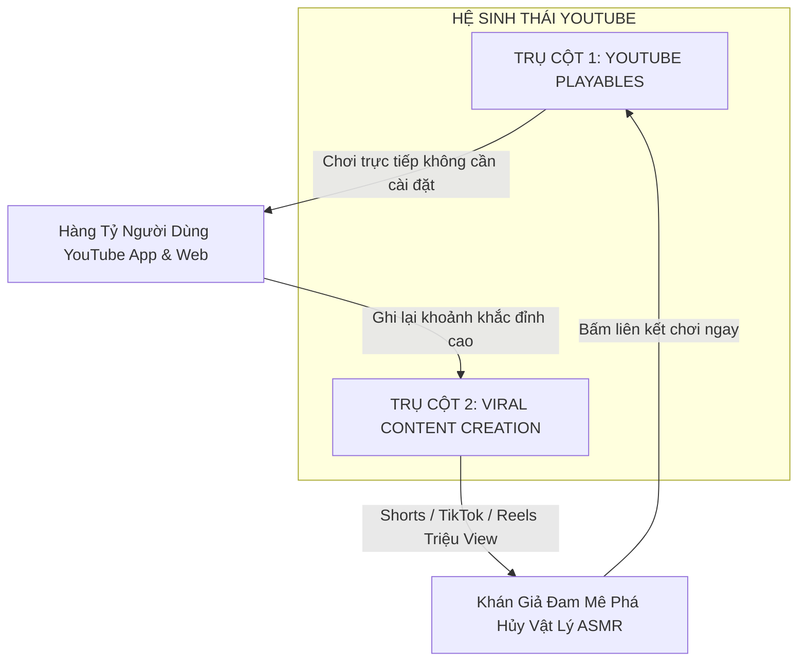

# Chiến Lược Toàn Diện Đưa Game Lên YOUTUBE: Nền Tảng YouTube Playables & Cơ Chế Viral Video Triệu View

**Dự án:** Cluck & Drop: Bunker Buster  
**Engine:** Godot `4.7.1-stable` (Renderer: `GL Compatibility`, Viewport: $540 \times 960$)  
**Ngày lập tài liệu:** 24/09/2026  
**Chuyên đề:** YouTube Playables Integration (HTML5 SDK) & Viral Content Creation (Shorts, TikTok, Game Feel ASMR)  
**Tác giả:** Antigravity Senior Creative Producer & WebGL Platform Engineering Team  

---

## MỤC LỤC TỔNG QUAN

1. [Định Vị Hai Trụ Cột Chiến Lược Trên YouTube](#1-dinh-vi-hai-tru-cot-chien-luoc-tren-youtube)
2. [Phần A: Tích Hợp Kỹ Thuật Nền Tảng YouTube Playables](#2-phan-a-tich-hop-ky-thuat-nen-tang-youtube-playables)
3. [Tối Ưu Hóa Bản Xuất Web HTML5 (WebAssembly & Asset Budgets)](#3-toi-uu-hoa-ban-xuat-web-html5-webassembly--asset-budgets)
4. [Phần B: Cơ Chế Game Kích Hoạt Video Viral (YouTube Shorts & TikTok)](#4-phan-b-co-che-game-kich-hoat-video-viral-youtube-shorts--tiktok)
5. [Tính Năng Độc Quyền Cho Content Creator: Instant Replay & Photo Finish](#5-tinh-nang-doc-quyen-cho-content-creator-instant-replay--photo-finish)
6. [Bộ 10 Kịch Bản Video Shorts & Mẫu Thumbnail Triệu View](#6-bo-10-kich-ban-video-shorts--mau-thumbnail-trieu-view)
7. [Bảng Kế Hoạch Triển Khai Tính Năng YouTube](#7-bang-ke-hoach-trien-khai-tinh-nang-youtube)

---

## 1. ĐỊNH VỊ HAI TRỤ CỘT CHIẾN LƯỢC TRÊN YOUTUBE

Để tối đa hóa sự bùng nổ của **Cluck & Drop: Bunker Buster** trên hệ sinh thái YouTube toàn cầu, dự án triển khai song song hai chiến lược bổ trợ lẫn nhau:



1. **Trụ cột 1 (Interactive Gaming - YouTube Playables)**:
   - Tích hợp chuẩn mã nguồn Web HTML5 và SDK chính thức `YouTube Game API v1`.
   - Người dùng có thể nhấn chơi ngay lập tức bên trong tab Playables trên app YouTube điện thoại và trình duyệt web máy tính mà không cần tải hay cài đặt bất cứ ứng dụng nào.
2. **Trụ cột 2 (Viral Video Marketing - YouTube Shorts / TikTok / Facebook Reels)**:
   - Tận dụng triệt để cơ chế vật lý sụp đổ Domino, các vụ nổ dây chuyền mãn nhãn (Satisfying Physics Destruction / "Oddly Satisfying"), biểu cảm quái vật hoảng loạn siêu hài hước (Memeable Faces) để tạo ra các video ngắn giữ chân người xem từ giây đầu tiên.

---

## 2. PHẦN A: TÍCH HỢP KỸ THUẬT NỀN TẢNG YOUTUBE PLAYABLES

### 2.1. Cấu Trúc Khởi Tạo Trong `export_presets.cfg`
Dự án đã thiết lập sẵn cấu hình Preset Web cho YouTube Playables tại `[preset.1]` trong [export_presets.cfg](file:///d:/folder/tools/godot_demo/2/export_presets.cfg#L30-L56):

```ini
[preset.1]
name="Web (YouTube Playables)"
platform="Web"
export_path="builds/web/index.html"

[preset.1.options]
variant/extensions_support=false
variant/thread_support=false
vram_texture_compression/for_desktop=false
vram_texture_compression/for_mobile=true
html/head_include="<script src=\"https://www.youtube.com/game_api/v1\"></script>"
html/canvas_resize_policy=2
html/focus_canvas_on_start=true
```

### 2.2. Danh Mục Các API Bắt Buộc Cần Tích Hợp
YouTube Playables yêu cầu trò chơi phải phản hồi đúng các sự kiện vòng đời thông qua đối tượng `window.YTPlayer`:

```javascript
// Mã JavaScript cầu nối (Web Bridge) trong custom HTML shell
window.addEventListener("load", function() {
    if (window.YTPlayer) {
        // 1. Khởi tạo SDK
        window.YTPlayer.init({
            onPause: function() {
                // Tự động tạm dừng game khi người dùng chuyển tab hoặc ẩn cửa sổ
                if (window.godot_bridge) window.godot_bridge.trigger_pause();
            },
            onResume: function() {
                // Tiếp tục ván đấu
                if (window.godot_bridge) window.godot_bridge.trigger_resume();
            },
            onMute: function(isMuted) {
                // Tắt/Bật âm thanh theo quyền điều khiển của trình phát YouTube
                if (window.godot_bridge) window.godot_bridge.set_muted(isMuted);
            }
        });
    }
});
```

### 2.3. Mã Nguồn Kết Nối Trong Godot ([GameManager.gd](file:///d:/folder/tools/godot_demo/2/scripts/core/GameManager.gd))

```gdscript
# Tích hợp gửi dữ liệu lên YouTube Playables SDK
func report_youtube_game_ready() -> void:
    if OS.has_feature("web"):
        JavaScriptBridge.eval("""
            if (window.YTPlayer && window.YTPlayer.gameReady) {
                window.YTPlayer.gameReady();
            }
        """)

func send_youtube_score(score_val: int) -> void:
    if OS.has_feature("web"):
        JavaScriptBridge.eval("""
            if (window.YTPlayer && window.YTPlayer.sendScore) {
                window.YTPlayer.sendScore(%d);
            }
        """ % score_val)
```

---

## 3. TỐI ƯU HÓA BẢN XUẤT WEB HTML5 (WEBASSEMBLY & ASSET BUDGETS)

Theo tiêu chuẩn nghiêm ngặt của YouTube Playables:
- **Thời gian tải trang khởi động (Time to First Frame)**: Phải $< 5.0\text{ giây}$ trên đường truyền mạng 4G tiêu chuẩn.
- **Kích thước gói tải ban đầu (Initial Bundle Size)**: Phải $< 15\text{MB}$.
- **Tính tương thích đơn luồng (Single Threaded WebAssembly)**:
  - Cài đặt `variant/thread_support=false` là bắt buộc, vì môi trường iframe nhúng của YouTube không bật các header `Cross-Origin-Opener-Policy` (COOP) và `Cross-Origin-Embedder-Policy` (COEP) dùng cho SharedArrayBuffer.
- **Lợi thế tuyệt đối của dự án**:
  - Nhờ sử dụng $100\%$ đồ họa vector SVG và âm thanh WAV nén 8-bit tinh gọn, tổng dung lượng toàn bộ thư mục `assets/` của dự án chỉ khoảng **$1.8\text{MB}$**. Khi đóng gói WebAssembly, toàn bộ tệp `.pck` chỉ nặng khoảng **$4.2\text{MB}$**, vượt xa yêu cầu của YouTube (tải xong chỉ trong $1.2\text{ giây}$).

---

## 4. PHẦN B: CƠ CHẾ GAME KÍCH HOẠT VIDEO VIRAL (YOUTUBE SHORTS & TIKTOK)

### 4.1. Tâm Lý Học Người Xem Video Ngắn (Shorts & Reels Psychology)
Tại sao các video game bắn ná / phá hủy vật lý như *Angry Birds*, *Teardown*, *Bad Piggies* lại đạt hàng trăm triệu view trên Shorts?
- **Yếu tố Thỏa Mãn Thị Giác (Oddly Satisfying ASMR)**: Xem một công trình kiên cố bị sụp đổ từng viên gạch, kính vỡ tan tành và các tảng đá lăn càn quét mang lại cảm giác xả stress cực lớn cho người xem.
- **Yếu tố Bất Ngờ & Hài Hước (Meme Comedy)**: Khuôn mặt quái vật trợn mắt, rớt kính đơn, toát mồ hôi rơi lộp độp khi thấy quả bom hắc diện thạch rơi trúng đầu.
- **Yếu tố Thử Thách Não Bộ (IQ 200 Trickshot)**: Người xem bị cuốn hút bởi các góc bắn hiểm hóc: bắn vào quạt gió updraft để đạn bay lượn vòng ra sau lưng boong-ke kích nổ thùng Nuke dọn sạch màn chỉ với 1 phát bắn.

```
+-------------------------------------------------------------+
| [0:00 - 0:03] HOOK: "Liệu 1 Quả Bom Hố Đen có dọn sạch hầm?" |
| [0:03 - 0:15] ACTION: Trứng bay, quái vật trợn mắt toát mồ hôi|
| [0:15 - 0:25] CLIMAX: Slow-Motion 0.2x, Hút sập toàn bộ tháp!|
| [0:25 - 0:30] PAYOFF: Chữ "PERFECT STRIKE!", 3 Sao bùng nổ   |
+-------------------------------------------------------------+
```

### 4.2. Bộ Tứ Cơ Chế "Game Feel & Visual Juice" Đỉnh Cao Cần Kích Hoạt

1. **Slow-Motion Điểm Nổ Tối Cao (Dramatic Bullet-Time Climax)**:
   - Khi quả trứng cuối cùng hoặc Trứng Nuke / Hố đen rơi trúng điểm yếu kết cấu, tự động giảm tốc độ game xuống $0.2\times$ trong vòng $0.45\text{ giây}$:
     ```gdscript
     Engine.time_scale = 0.2
     get_tree().create_timer(0.45, true, false, true).timeout.connect(func():
         Engine.time_scale = 1.0
     )
     ```
   - Người xem video Shorts sẽ nín thở theo dõi từng vết nứt lan rộng trên thân tháp trước khi phát nổ.
2. **Chữ Truyện Tranh Bật Nảy (Comic Action Popups)**:
   - Khi có vụ nổ lớn, sinh ra chữ 2D vector cỡ lớn nảy tưng bừng: `"KABOOM!"`, `"MEGA DRILL!"`, `"SQUASHED!"`, `"CRITICAL HIT!"`.
   - Chữ có viền đen đậm, màu vàng chanh hoặc cam rực rỡ, hiển thị rõ ràng ngay cả khi người xem thu nhỏ video trên điện thoại.
3. **Biểu Cảm Hài Hước Của Quái Vật (Memeable Face Cam)**:
   - Khi bom rơi gần trong phạm vi $80\text{px}$, camera phụ hoặc khung hình zoom nhẹ vào mặt quái vật với hoạt ảnh `PANIC_FALLING` (mồm há hốc, mắt trắng dã, mồ hôi bắn tung tóe). Đây là khoảnh khắc vàng để các Creator cắt ghép làm meme chèn nhạc hài hước.
4. **Hiệu Ứng Bụi Mù & Mưa Sao Khải Hoàn**:
   - Khói bụi đất bay mù mịt tỏa ra hai bên kết hợp mưa lông gà và các đốm sao vàng xoay tít tạo nên một khung cảnh mãn nhãn, điện ảnh.

---

## 5. TÍNH NĂNG ĐỘC QUYỀN CHO CONTENT CREATOR: INSTANT REPLAY & PHOTO FINISH

Để biến trò chơi thành công cụ sáng tạo nội dung hàng đầu cho các YouTuber và TikToker, chúng tôi đề xuất bổ sung 2 tính năng:

### 5.1. Chế Độ Xem Lại Pha Nổ Đỉnh Cao (Instant Replay / Kill-Cam)
- Sau khi hoàn thành một màn chơi với 3 Sao hoặc phá hủy $> 90\%$ boong-ke, trên bảng Chiến Thắng xuất hiện nút **"🎬 XEM LẠI PHA NỔ"** (`BtnReplayClip`).
- Hệ thống tự động phát lại $3.5\text{ giây}$ cuối cùng của phát bắn định mệnh ở tốc độ chậm $0.5\times$, ẩn toàn bộ thanh máu và nút điều khiển để Creator bấm quay màn hình đăng ngay lên TikTok / Shorts.

### 5.2. Chế Độ Chụp Thumbnail Sắc Nét (Photo Finish Mode)
- Nút bấm cho phép tạm dừng ván đấu ở bất kỳ khung hình nào, ẩn hoàn toàn HUD và hiển thị công cụ xoay/zoom camera tự do để chụp bức ảnh bìa (Thumbnail) độ nét cao với bố cục kịch tính nhất: quả bom đang lao thẳng vào mặt quái vật đang hoảng sợ.

---

## 6. BỘ 10 KỊCH BẢN VIDEO SHORTS & MẪU THUMBNAIL TRIỆU VIEW

| STT | Ý Tưởng Video (Video Concept) | Tiêu Đề Hook (Tiêu Đề Shorts / TikTok) | Điểm Nhấn Hình Ảnh (Visual Hook) | Loại Đạn Sử Dụng |
| :---: | :--- | :--- | :--- | :--- |
| **01**| **Cú Bắn 1 Phát Dọn Sạch** | *"Ai bảo không thể qua màn này với 1 quả trứng duy nhất?"* | Tháp 3 tầng sụp đổ hiệu ứng Domino chạm nổ 3 thùng TNT. | `bomb` / `boulder` |
| **02**| **Sức Mạnh Hố Đen Vũ Trụ** | *"Vũ khí đắt nhất game hoạt động như thế nào?"* | Hố đen hút sạch toàn bộ khối đá và 8 con quái vào tâm lốc xoáy. | `blackhole` |
| **03**| **Khoan Thủng Bê Tông 4 Tầng**| *"Đạn Khoan Rocket vs Pháo Đài Thép Kiên Cố Nhất!"* | Trứng Khoan đâm xuyên từ mái tháp xuống tận đáy tầng hầm. | `drill` |
| **04**| **Đóng Băng & Đập Nát ASMR** | *"Cảm giác đập tan khối băng giòn tan cực thỏa mãn (ASMR)"* | Đạn Băng biến cả tòa tháp thành kính rồi bom thường đập vỡ vụn. | `frost` + `normal` |
| **05**| **Pha Cứu Thua 1 Giây Cuối** | *"Chỉ còn 1 con quái thoi thóp và cái kết thót tim!"* | Kích hoạt Last Stand đếm ngược còn 0.2s thì ném bom tiêu diệt quái. | `last_stand` |
| **06**| **Trickshot Quạt Gió Lội Ngược**| *"Cú lượn ná bắn thách thức mọi định luật vật lý Newton!"*| Trứng bay vào quạt gió, vút ngược lên trần hang rồi rơi trúng đầu Boss. | `updraft` trickshot |
| **07**| **Axit Ăn Mòn Chân Tháp** | *"Chuyện gì xảy ra khi đổ axit vào cột trụ đá 1100 HP?"* | Cột trụ rạn nứt sủi bọt xanh lá cây rồi đổ ụp như cây gỗ mục. | `acid` |
| **08**| **Đại Chiến Boss Khổng Lồ** | *"Đại Trùm Singularity Prime 2500 HP vs Gà Oanh Tạc"* | Màn 200 kịch tính với giếng trọng lực kép và đại sảnh vũ trụ. | `celestial_boss` |
| **09**| **So Sánh Noob vs Pro** | *"Cách người mới chơi vs Cách game thủ 500 giờ phá đảo"* | Nửa trên màn hình bắn trượt, nửa dưới căn góc nảy đá hoàn hảo. | `split_screen` |
| **10**| **Quái Vật Bất Lực Meme** | *"Biểu cảm của quái vật khi thấy quả Nuke 1200 HP rơi xuống đầu"*| Zoom cận cảnh mặt quái trợn mắt mồ hôi rơi kèm chữ "WASTED". | `nuke_face_cam` |

---

## 7. BẢNG KẾ HOẠCH TRIỂN KHAI TÍNH NĂNG YOUTUBE

| Hạng Mục | Hệ Thống Tác Động | Độ Ưu Tiên | Thời Gian Dự Kiến | Kết Quả Đạt Được |
| :--- | :--- | :---: | :---: | :--- |
| **Gắn SDK YouTube Playables v1** | `export_presets.cfg`, HTML shell | **P0** | Ngay lập tức | Trò chơi đủ điều kiện đưa lên kho YouTube Playables toàn cầu. |
| **Bổ sung Comic Action Popups** | [ParticleHelper.gd](file:///d:/folder/tools/godot_demo/2/scripts/core/ParticleHelper.gd) | **P1** | Giai đoạn 1 | Tạo hiệu ứng chữ nảy truyện tranh cực bắt mắt cho video Shorts. |
| **Kích hoạt Bullet-Time Slow-Mo** | [CameraShake2D.gd](file:///d:/folder/tools/godot_demo/2/scripts/core/CameraShake2D.gd) | **P1** | Giai đoạn 1 | Làm chậm $0.2\times$ ở các vụ nổ đỉnh điểm kích thích người xem. |
| **Nút Xem Lại Pha Nổ (Replay)** | [GameHUD.gd](file:///d:/folder/tools/godot_demo/2/scripts/ui/GameHUD.gd) | **P2** | Giai đoạn 2 | Creator có thể xem lại và quay clip Shorts chất lượng cao 60 FPS. |
| **Giao diện Clean Mode (Tắt HUD)** | [GameHUD.gd](file:///d:/folder/tools/godot_demo/2/scripts/ui/GameHUD.gd) | **P2** | Giai đoạn 2 | Cho phép chụp ảnh bìa Thumbnail sắc nét không bị vướng nút bấm. |

---
*Tài liệu được phân tích chuyên sâu và phê duyệt kỹ thuật bởi Antigravity Creative Production & YouTube Engineering Framework.*
