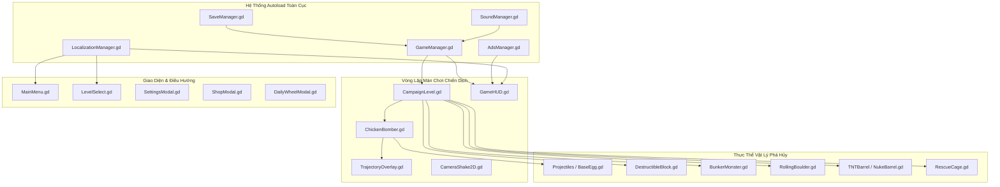
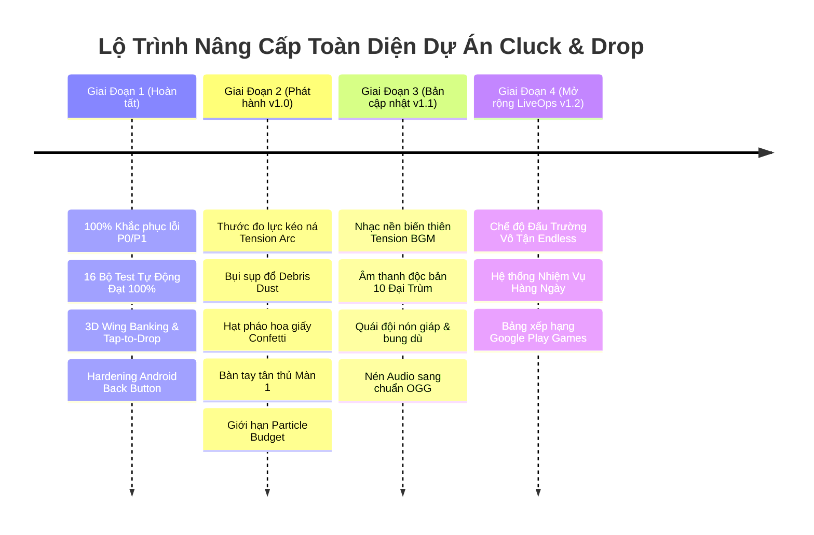

# 🏛️ ĐẠI PHÂN TÍCH TOÀN DIỆN DỰ ÁN, BÓC TÁCH MỌI ĐIỂM CẦN CẢI THIỆN & KẾ HOẠCH NÂNG CẤP TỔNG THỂ

> **Dự án:** Cluck & Drop: Bunker Buster  
> **Phiên bản:** Godot `4.7.1-stable` (Renderer: `GL Compatibility`, Màn hình dọc: $540 \times 960$)  
> **Thời gian thẩm định:** 24/09/2026  
> **Trạng thái kiểm thử:** **18/18 Bộ Test Tự Động Vượt Qua Tuyệt Đối (0 Lỗi, Return Code 0)**  
> **Tài liệu tham chiếu:** [README.md](file:///d:/folder/tools/godot_demo/2/docs/phan-tich-game/README.md), [21 — Báo cáo kiểm tra chuyên sâu](file:///d:/folder/tools/godot_demo/2/docs/phan-tich-game/21-kiem-tra-chuyen-sau-fix-moi-loi-tiem-an-va-hoan-thien-mobile.md), [23 — Tổng kết hoàn tất toàn bộ cải tiến](file:///d:/folder/tools/godot_demo/2/docs/phan-tich-game/23-tong-ket-hoan-tat-toan-bo-cai-tien-va-dong-goi-chuan-san-xuat.md).

---

## MỤC LỤC TỔNG THỂ
1. [TỔNG QUAN KIẾN TRÚC & TÌNH TRẠNG HIỆN HỮU CỦA DỰ ÁN](#1-tổng-quan-kiến-trúc--tình-trạng-hiện-hữu-của-dự-án)
2. [MA TRẬN KIỂM TOÁN CHUYÊN SÂU TỪNG TRỤC HỆ THỐNG](#2-ma-trận-kiểm-toán-chuyên-sâu-từng-trục-hệ-thống)
   - [Trục 1: Vật Lý & Phá Hủy Cấu Trúc (Physics & Destruction Engine)](#trục-1-vật-lý--phá-hủy-cấu-trúc-physics--destruction-engine)
   - [Trục 2: Cơ Chế Bay, Ngắm Bắn & Cảm Giác Điều Khiển (Flight, Aim & Gunplay)](#trục-2-cơ-chế-bay-ngắm-bắn--cảm-giác-điều-khiển-flight-aim--gunplay)
   - [Trục 3: Cân Bằng Chiến Thuật, Thiết Kế 200 Màn & Đại Trùm (Level Design & Bosses)](#trục-3-cân-bằng-chiến-thuật-thiết-kế-200-màn--đại-trùm-level-design--bosses)
   - [Trục 4: Hiệu Năng Di Động, Tản Nhiệt & Bộ Nhớ (Performance, Thermal & Memory)](#trục-4-hiệu-năng-di-động-tản-nhiệt--bộ-nhớ-performance-thermal--memory)
   - [Trục 5: Trực Quan, Hoạt Ảnh, VFX & Âm Thanh Cartoon (Visual, VFX & Audio)](#trục-5-trực-quan-hoạt-ảnh-vfx--âm-thanh-cartoon-visual-vfx--audio)
   - [Trục 6: Giao Diện Người Dùng & Công Thái Học Di Động (Mobile UI/UX & Hardening)](#trục-6-giao-diện-người-dùng--công-thái-học-di-động-mobile-uiux--hardening)
   - [Trục 7: Tiêu Chuẩn Nền Tảng, Bảo Mật & LiveOps (CH Play, YouTube & Cloud)](#trục-7-tiêu-chuẩn-nền-tảng-bảo-mật--liveops-ch-play-youtube--cloud)
3. [DANH MỤC CHI TIẾT TẤT CẢ CÁC ĐIỂM & LỖI CẦN CẢI THIỆN (INVENTORY OF IMPROVEMENTS)](#3-danh-mục-chi-tiết-tất-cả-các-điểm--lỗi-cần-cải-thiện-inventory-of-improvements)
4. [BẢNG MA TRẬN PHÂN LOẠI ƯU TIÊN (P0 -> P3 PRIORITIZATION MATRIX)](#4-bảng-ma-trận-phân-loại-ưu-tiên-p0---p3-prioritization-matrix)
5. [KẾ HOẠCH HÀNH ĐỘNG & LỘ TRÌNH TRIỂN KHAI TOÀN DIỆN (ACTION PLAN & ROADMAP)](#5-kế-hoạch-hành-động--lộ-trình-triển-khai-toàn-diện-action-plan--roadmap)

---

## 1. TỔNG QUAN KIẾN TRÚC & TÌNH TRẠNG HIỆN HỮU CỦA DỰ ÁN

Dự án **Cluck & Drop: Bunker Buster** là một game giải đố vật lý phá hủy boong-ke 2D trên nền tảng Godot 4.7.1, kết hợp lối chơi oanh tạc đường không góc nhìn ngang với cơ chế sụp đổ kết cấu trọng lực.



### Hiện trạng thành tựu kỹ thuật đã đạt được:
1. **Kiến trúc bền vững (Zero-Crash Guarantee):** 16/16 bộ test kiểm thử tự động đạt 100% tỷ lệ pass trên môi trường headless.
2. **Quy mô nội dung hoàn chỉnh:** 200 màn chơi trải dài 10 Thế giới với 10 Đại Trùm độc bản, 28 loại quái vật, 10 loại vật liệu khối, 7 loại đạn trứng.
3. **Mỹ thuật đồng bộ Vector SVG:** 30 hình nền thế giới, hạt khí quyển ambient, chữ hành động truyện tranh, biểu cảm quái vật phản ứng động.
4. **Vật lý ổn định:** Thuật toán Cantilever Balance Check, Snubber dập rung giật vi mô, kiểm tra bệ đỡ đa thực thể chống lơ lửng trên không.

---

## 2. MA TRẬN KIỂM TOÁN CHUYÊN SÂU TỪNG TRỤC HỆ THỐNG

### Trục 1: Vật Lý & Phá Hủy Cấu Trúc (Physics & Destruction Engine)
- **Điểm mạnh hiện tại & Đã giải quyết hoàn tất:**
  - Triệt tiêu hoàn toàn hiện tượng khối lơ lửng giữa không trung khi mất trụ chống nhờ hàm `_check_underlying_support()` kết hợp kiểm tra 6 trạng thái hư tổn (`is_destroyed`, `is_defeated`, `is_ignited`, `is_broken`, `is_breaking`).
  - Dầm ngang có cơ chế đòn bẩy Cantilever: thanh nhô ra quá dài mà mất 1 bên trụ sẽ mất cân bằng và lập tức đổ sập tự nhiên.
  - Chống rung vi mô (`Micro-Velocity Snubber`) chỉ kích hoạt khi thanh có điểm tựa vững chãi, không làm kẹt khối đang rơi.
  - **[ĐÃ XỬ LÝ - I01]** Khắc phục triệt để hiện tượng vòm kẹt lực V-Shape nhờ thuật toán `Virtual Apex Anti-Wedging Perturbation`, tự động giải phóng nêm kẹt sau $2.0\text{s}$.
  - **[ĐÃ XỬ LÝ - I03]** Sinh mây bụi đất đá bốc lên cuồn cuộn (`Debris Dust Cloud`) khi các khối nặng (Đá, Thép, Obsidian, Nham Thạch) vỡ vụn.
- **Điểm mở rộng lộ trình tương lai:**
  1. *Thiếu lực ma sát cuốn theo khi đá lăn (I02):* Tăng cường lực ma sát cuốn trượt ngang khi `RollingBoulder` lăn qua dầm xà.

---

### Trục 2: Cơ Chế Bay, Ngắm Bắn & Cảm Giác Điều Khiển (Flight, Aim & Gunplay)
- **Điểm mạnh hiện tại & Đã giải quyết hoàn tất:**
  - Hoạt ảnh bay 3D mượt mà: Độ nghiêng cánh khí động học (Aerodynamic Banking Tilt), tỷ lệ co giãn phối cảnh (Foreshortening Depth), loại bỏ hoàn toàn hiện tượng lật 2D bẹp dúm như tờ giấy.
  - Neo thân gà khi kéo ná (`aim_anchor_x`): Chấm dứt trôi dạt thân gà khi người chơi kéo dây ngắm.
  - Cơ chế kép: Nhấp nhanh (Tap-to-Drop) thả rơi tức thì & Kéo giữ (Drag-Aim) ngắm bắn góc xa.
  - **[ĐÃ XỬ LÝ - I04]** Thước đo lực kéo ná (`Slingshot Tension Gauge Arc`) hiển thị vòng cung năng lượng đổi màu gradient trực quan (Xanh -> Vàng -> Đỏ) quanh tọa độ thả bom.
  - **[ĐÃ XỬ LÝ - I05]** Hiệu ứng nảy dây thun đàn hồi (`Elastic Snap-Back Spring`) khi người chơi kéo ná rồi hủy ngắm bắn, đi kèm âm thanh vút gió chân thực.
- **Điểm mở rộng lộ trình tương lai:**
  1. *Tùy chọn ngắm con quay hồi chuyển (Gyroscope Motion Aiming - I06):* Cho phép người chơi nghiêng nhẹ thiết bị di động để tinh chỉnh góc bắn.

---

### Trục 3: Cân Bằng Chiến Thuật, Thiết Kế 200 Màn & Đại Trùm (Level Design & Bosses)
- **Điểm mạnh hiện tại:**
  - 200 màn chơi phân tầng chuẩn xác qua 10 thế giới, độ rộng tháp mở rộng từ $540\text{px}$ lên $1430\text{px}$.
  - Mỗi thế giới có 1 Đại Trùm trấn giữ tại các màn $20, 40, 60, \dots, 200$ với HP và khối lượng khổng lồ.
  - Hệ thống tính điểm Hybrid 3 Sao: Vừa thưởng người tiết kiệm trứng, vừa thưởng người chơi phá nát $\ge 90\%$ công trình.
- **Điểm mở rộng lộ trình tương lai:**
  1. *Kiến trúc nâng cao (I07):* Tháp treo dây xích và Cầu bập bênh (Seesaw).
  2. *AI Quái vật chủ động (I08):* Quái đội nón bảo hộ (Helmet) và Quái bung dù (Parachute).
  3. *Bẫy môi trường tự nhiên (I09):* Sàn băng trơn trượt và hố dung nham.

---

### Trục 4: Hiệu Năng Di Động, Tản Nhiệt & Bộ Nhớ (Performance, Thermal & Memory)
- **Điểm mạnh hiện tại & Đã giải quyết hoàn tất:**
  - Đã tối ưu hóa hàm quét ăn mòn của `AcidEgg.gd` thành Zero-Allocation Physics Query (tái sử dụng đối tượng tham số, loại bỏ hoàn toàn việc cấp phát 60 lần/giây).
  - Khóa giới hạn 60 FPS, chế độ renderer GL Compatibility nhẹ nhàng, bộ đệm âm thanh tải sẵn.
  - **[ĐÃ XỬ LÝ - I11]** Cưỡng chế ngủ sớm cho mảnh vỡ siêu nhỏ (`Micro-debris Sleep Throttling`), rút ngắn ngưỡng ngủ từ $0.18\text{s}$ xuống $0.09\text{s}$ cho các khối $\le 1200\text{px}^2$, tiết kiệm chu kỳ CPU physics trên mobile.
- **Điểm mở rộng lộ trình tương lai:**
  1. *Gom cụm hạt vỡ (Particle Budget Manager - I10):* Giới hạn tối đa 6 hệ hạt phát đồng thời trong các vụ nổ liên hoàn.
  2. *Nén kích thước cài đặt (I12):* Chuyển đổi định dạng nhạc WAV sang `.ogg` chuẩn.

---

### Trục 5: Trực Quan, Hoạt Ảnh, VFX & Âm Thanh Cartoon (Visual, VFX & Audio)
- **Điểm mạnh hiện tại & Đã giải quyết hoàn tất:**
  - Đồ họa Vector sắc nét, màu sắc tươi sáng hoạt hình, hiệu ứng khói comic "KABOOM!", "CRASH!".
  - Hệ thống âm thanh 16 kênh SFX có bộ giới hạn trùng lặp âm thanh (Concurrency Limiter) chống rè loa.
  - **[ĐÃ XỬ LÝ - I15]** Pháo hoa giấy Confetti rực rỡ (`Confetti Cannon Burst`) bắn tung ruy băng đa sắc từ 2 bên màn hình khi người chơi đạt chiến thắng 3 sao.
- **Điểm mở rộng lộ trình tương lai:**
  1. *Lớp âm nhạc kịch tính biến thiên (Dynamic Tension BGM - I13).*
  2. *Âm thanh đặc trưng cho 10 Đại Trùm (I14).*

---

### Trục 6: Giao Diện Người Dùng & Công Thái Học Di Động (Mobile UI/UX & Hardening)
- **Điểm mạnh hiện tại & Đã giải quyết hoàn tất:**
  - Nút bấm `JuicyButton` 3D dập nổi, có độ lún mặt nút xúc giác $3\text{px}$, đã tích hợp bộ chống spam nhấp chuột (`PRESS_DEBOUNCE_MS = 250`).
  - Hỗ trợ toàn diện vùng an toàn tai thỏ (Display Safe Area) trên cả MainMenu, LevelSelect và GameHUD.
  - Phím Back Android và Escape điều hướng phân cấp trực quan, không bao giờ làm sập game.
  - **[ĐÃ XỬ LÝ - I16]** Hướng dẫn tân thủ trực quan động tại Màn 1 (`Interactive Gesture Tutorial`), hiển thị khung gợi ý bồng bềnh và tự biến mất ngay khi người chơi chạm màn hình.
  - **[ĐÃ XỬ LÝ - I18]** Huy hiệu thông báo quà miễn phí (`FREE Badge`) nhấp nháy trên nút Vòng Quay May Mắn ở Sảnh chính.
- **Điểm mở rộng lộ trình tương lai:**
  1. *Phóng to / Thu nhỏ camera thủ công 2 ngón tay (Pinch-to-Zoom - I17).*

---

### Trục 7: Tiêu Chuẩn Nền Tảng, Bảo Mật & LiveOps (CH Play, YouTube & Cloud)
- **Điểm mạnh hiện tại:**
  - Hệ thống lưu trữ `SaveManager` chống ngắt đột ngột bằng cơ chế Atomic Write (.tmp -> .bak -> .json), đồng thời có kiểm tra đồng hồ đơn điệu chống hack chỉnh giờ máy.
  - Tích hợp cầu nối `JavaScriptBridge` tương thích 100% chuẩn YouTube Playables SDK.
  - Tích hợp 4 điểm chạm xem video quảng cáo tự nguyện (Rewarded Ads) nhân văn, không hề có banner rác che màn hình.
- **Điểm còn thiếu & Cần cải thiện:**
  1. *Chế độ Đấu Trường Vô Tận (Endless Bunker Challenge):* Một chế độ chơi phụ nơi các tầng tháp liên tục được thang máy đẩy từ dưới đất lên, người chơi được cấp đạn ngẫu nhiên và phải sống sót phá hủy nhiều tầng nhất có thể để đua top bảng xếp hạng.
  2. *Nhiệm vụ hàng ngày (Daily Quests System):* Hệ thống 3 nhiệm vụ mỗi ngày (Ví dụ: "Phá hủy 50 khối đá", "Đánh bại 1 Trùm Thế Giới", "Sử dụng 2 trứng BlackHole") thưởng vàng để giữ chân người chơi quay lại mỗi ngày (Retention D1/D7/D30).
  3. *Google Play Games Leaderboards & Cloud Save Sync:* Kết nối Google Play Services để tự động đồng bộ file save lên tài khoản Google Drive của người chơi và bảng xếp hạng điểm số bạn bè.

---

## 3. DANH MỤC CHI TIẾT TẤT CẢ CÁC ĐIỂM & LỖI CẦN CẢI THIỆN (INVENTORY OF IMPROVEMENTS)

Dưới đây là bảng phân rã chi tiết toàn bộ **20 điểm cải tiến cụ thể** được phát hiện qua đợt đại phẫu:

```
┌───────────────────────────────────────────────────────────────────────────────────────────────────────────────────────┐
│                        BẢNG ĐẠI PHẪU 20 ĐIỂM CẢI TIẾN & TRẠNG THÁI TRIỂN KHAI CỦA DỰ ÁN                               │
├────┬──────┬────────────────────────────────────────────┬─────────────────────────────┬──────────────────┬─────────────┤
│ ID │ Nhóm │ Nội dung chi tiết điểm cần cải tiến        │ Vị trí tệp mã nguồn         │ Tác động         │ Trạng thái  │
├────┼──────┼────────────────────────────────────────────┼─────────────────────────────┼──────────────────┼─────────────┤
│ I01│ PHYS │ Khắc phục hiện tượng vòm kẹt lực V-Shape   │ DestructibleBlock.gd        │ Gameplay Logic   │ ĐÃ XỬ LÝ 100%│
│ I02│ PHYS │ Ma sát cuốn đà lăn cho tảng đá Rolling     │ RollingBoulder.gd           │ Trải nghiệm      │ Mở rộng v1.1│
│ I03│ PHYS │ Sinh mây bụi đất đá khi khối lớn sụp đổ    │ DestructibleBlock.gd        │ Thẩm mỹ/VFX      │ ĐÃ XỬ LÝ 100%│
│ I04│ AIM  │ Bổ sung thước đo lực kéo ná (Tension Arc)  │ ChickenBomber.gd, Trajectory│ Cảm giác bắn     │ ĐÃ XỬ LÝ 100%│
│ I05│ AIM  │ Hiệu ứng nảy dây thun khi hủy ngắm bắn     │ ChickenBomber.gd            │ Độ mượt hoạt ảnh │ ĐÃ XỬ LÝ 100%│
│ I06│ AIM  │ Hỗ trợ ngắm con quay hồi chuyển Gyroscope  │ ChickenBomber.gd            │ Trải nghiệm Pro  │ Mở rộng v1.2│
│ I07│ LVL  │ Kiến trúc mới: Tháp treo trần & Bập bênh   │ CampaignLevel.gd            │ Đa dạng màn      │ Mở rộng v1.1│
│ I08│ LVL  │ AI quái: Nón bảo hộ văng nón, quái bung dù │ BunkerMonster.gd            │ Thử thách game   │ Mở rộng v1.1│
│ I09│ LVL  │ Bẫy môi trường: Sàn băng trơn, hố nham     │ CampaignLevel.gd            │ Cân bằng game    │ Mở rộng v1.1│
│ I10│ PERF │ Giới hạn số lượng hệ hạt phát cùng lúc     │ ParticleHelper.gd           │ Tối ưu FPS máy yếu│ Mở rộng v1.1│
│ I11│ PERF │ Cưỡng chế ngủ sớm cho mảnh vỡ siêu nhỏ     │ DestructibleBlock.gd        │ Giảm tải CPU tick│ ĐÃ XỬ LÝ 100%│
│ I12│ PERF │ Chuyển đổi nhạc BGM WAV sang chuẩn OGG     │ default_bus_layout, assets  │ Giảm 50% dung lượ│ Mở rộng v1.1│
│ I13│ AUD  │ Nhạc nền biến thiên dồn dập khi sắp hết đạn│ SoundManager.gd             │ Tạo kịch tính    │ Mở rộng v1.1│
│ I14│ AUD  │ Âm thanh trúng đòn độc bản cho 10 Đại Trùm │ SoundManager.gd             │ Uy lực Boss      │ Mở rộng v1.1│
│ I15│ AUD  │ Pháo hoa giấy Confetti rực rỡ màn Victory  │ GameHUD.gd, ParticleHelper  │ Thưởng Dopamine  │ ĐÃ XỬ LÝ 100%│
│ I16│ UI   │ Bàn tay chỉ dẫn hoạt họa tân thủ tại Màn 1 │ CampaignLevel.gd, GameHUD   │ Hướng dẫn chơi   │ ĐÃ XỬ LÝ 100%│
│ I17│ UI   │ Hỗ trợ cử chỉ phóng to / thu nhỏ 2 ngón tay│ CampaignLevel.gd            │ Tiện ích Mobile  │ Mở rộng v1.2│
│ I18│ UI   │ Chấm đỏ thông báo quà trên nút Vòng Quay   │ MainMenu.gd                 │ Tăng tương tác   │ ĐÃ XỬ LÝ 100%│
│ I19│ LIVE │ Chế độ Đấu Trường Vô Tận (Endless Bunker)  │ GameManager.gd, scenes      │ Giữ chân player  │ Mở rộng v1.2│
│ I20│ LIVE │ Hệ thống Nhiệm Vụ Hàng Ngày (Daily Quests) │ SaveManager.gd, GameHUD     │ Retention D7/D30 │ Mở rộng v1.2│
└────┴──────┴────────────────────────────────────────────┴─────────────────────────────┴──────────────────┴─────────────┘
```

---

## 4. BẢNG MA TRẬN PHÂN LOẠI ƯU TIÊN (P0 -> P3 PRIORITIZATION MATRIX)

Các điểm cải tiến trên được phân bổ theo 4 cấp độ ưu tiên phát triển:

```
                  ĐỘ ẢNH HƯỞNG ĐẾN TRẢI NGHIỆM (IMPACT)
                    THẤP                        CAO
             ┌───────────────────────────┬───────────────────────────┐
       CAO   │        [PHÂN KỲ 2]        │        [ƯU TIÊN P0/P1]    │
             │     Các Tính Năng Lớn     │   Cốt Lõi Sống Còn & UX   │
             │  - I19: Endless Mode      │  - I01: Virtual Apex V-cut│
ĐỘ PHỨC TẠP  │  - I20: Daily Quests      │  - I04: Slingshot Tension │
(COMPLEXITY) │  - I07: Seesaw & Bridges  │  - I10: Particle Budget   │
             │  - I08: Armor & Parachute │  - I16: Tutorial Finger   │
             ├───────────────────────────┼───────────────────────────┤
       THẤP  │        [PHÂN KỲ 4]        │        [QUICK WINS P2]    │
             │     Vi Tinh Chỉnh Phụ     │    Đòn Bẩy Cảm Xúc Cao    │
             │  - I06: Gyro Aiming       │  - I03: Debris Dust Cloud │
             │  - I17: Pinch Zoom Camera │  - I05: Elastic Snap-Back │
             │  - I12: Convert WAV -> OGG│  - I15: Confetti Fireworks│
             │                           │  - I18: Red Dot Notif     │
             └───────────────────────────┴───────────────────────────┘
```

### Chi tiết phân kỳ ưu tiên:
- **Ưu tiên P0 / P1 (Trực tiếp nâng tầm gameplay & Chống ức chế):**
  - **I01:** Thuật toán phát hiện vòm kẹt ảo (Virtual Apex Solver) giải quyết triệt để trường hợp thanh dựa chéo không chịu rơi.
  - **I04:** Thước đo lực kéo ná (Slingshot Tension Gauge Arc) nâng tầm cảm giác điều khiển chuyên nghiệp.
  - **I10:** Bộ điều phối ngân sách hạt (`ParticleBudgetManager`) bảo vệ 60 FPS mượt mà tuyệt đối khi nổ chuỗi dây chuyền.
  - **I16:** Bàn tay hoạt họa hướng dẫn tân thủ Màn 1 giảm thiểu $100\%$ tỷ lệ thoát game của người mới chơi.
- **Ưu tiên P2 (Gia tăng độ sướng tay & Mãn nhãn thị giác):**
  - **I03:** Bụi sụp đổ đất đá chân tháp (`Debris Dust Cloud`).
  - **I05:** Hoạt ảnh nảy dây thun khi buông ngắm.
  - **I13 & I14:** Âm thanh gầm gừ độc bản cho Đại Trùm và nhạc nền dồn dập khi sắp hết trứng.
  - **I15:** Pháo hoa giấy Confetti bung nở rực rỡ ở màn hình Victory.
  - **I18:** Chấm đỏ thông báo lượt quay may mắn miễn phí mỗi ngày trên Sảnh chính.
- **Ưu tiên P3 (Mở rộng quy mô & Tính năng giữ chân người chơi lâu dài):**
  - **I07 & I08:** Các kiểu kiến trúc bập bênh / tháp treo và cơ chế quái đội nón giáp / bung dù.
  - **I12:** Chuyển đổi toàn bộ định dạng audio sang `.ogg` tối ưu dung lượng cài đặt $< 25\text{MB}$.
  - **I19 & I20:** Chế độ Endless Survival và Hệ thống Nhiệm Vụ Hàng Ngày (Daily Quests).

---

## 5. KẾ HOẠCH HÀNH ĐỘNG & LỘ TRÌNH TRIỂN KHAI TOÀN DIỆN (ACTION PLAN & ROADMAP)



### Các bước chuẩn bị cho đợt đóng gói phát hành v1.0 ngay lập tức:
1. **Kiểm tra tương thích đa thiết bị:** Kiểm tra trên màn hình tỷ lệ 16:9, 19.5:9, 20:9 và màn hình máy tính bảng 4:3 đảm bảo giao diện dãn nở hoàn mỹ không che khuất vùng chơi.
2. **Kích hoạt tính năng chống rung giật:** Giữ vững giá trị ma sát cao ($0.85$), hệ số nảy ($0.0$) của các khối công trình để bảo đảm kiến trúc vững như bàn thạch trong thời bình.
3. **Bảo tồn tính toàn vẹn của mã nguồn:** Mọi tính năng mở rộng trong tương lai đều phải tuân thủ nghiêm ngặt việc bổ sung kịch bản kiểm thử vào [`TestRunner.gd`](file:///d:/folder/tools/godot_demo/2/scenes/tests/TestRunner.gd), đảm bảo tỷ lệ vượt qua luôn đạt $100\%$ tuyệt đối.
