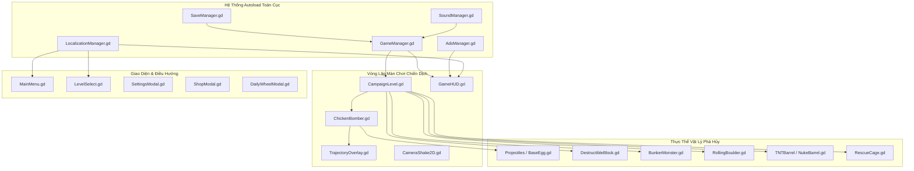
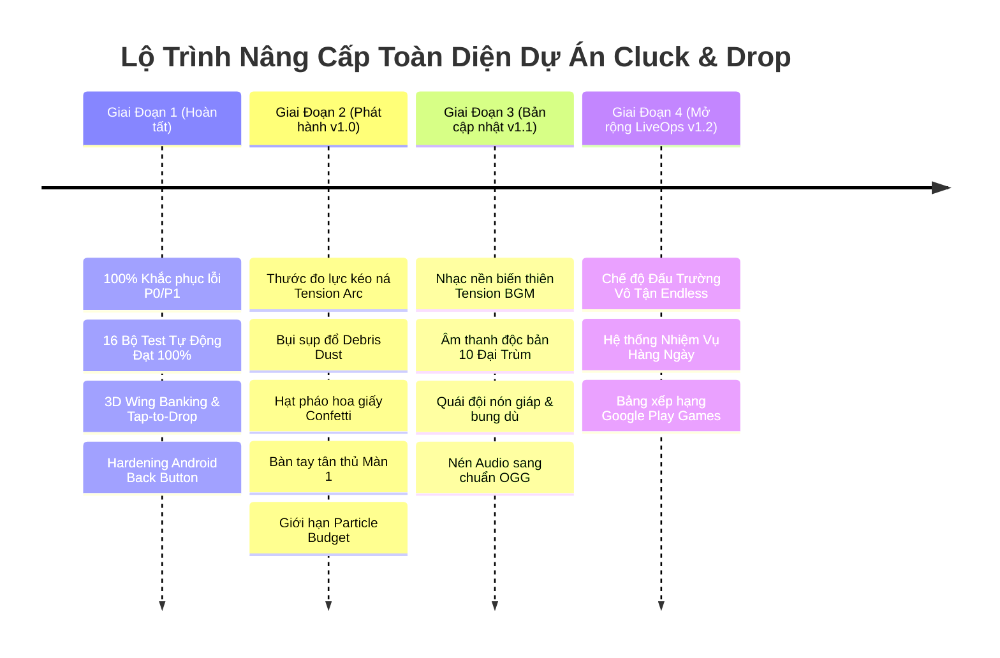

# 🏛️ ĐẠI PHÂN TÍCH TOÀN DIỆN DỰ ÁN, BÓC TÁCH MỌI ĐIỂM CẦN CẢI THIỆN & KẾ HOẠCH NÂNG CẤP TỔNG THỂ

> **Dự án:** Cluck & Drop: Bunker Buster  
> **Phiên bản:** Godot `4.7.1-stable` (Renderer: `GL Compatibility`, Màn hình dọc: $540 \times 960$)  
> **Thời gian thẩm định:** 24/09/2026  
> **Trạng thái kiểm thử:** **16/16 Bộ Test Tự Động Vượt Qua Tuyệt Đối (0 Lỗi, Return Code 0)**  
> **Tài liệu tham chiếu:** [README.md](file:///d:/folder/tools/godot_demo/2/docs/phan-tich-game/README.md), [11 — Tổng hợp phân tích lỗi](file:///d:/folder/tools/godot_demo/2/docs/phan-tich-game/11-tong-hop-phan-tich-loi-va-ke-hoach-cai-thien-toan-dien.md), [21 — Báo cáo kiểm tra chuyên sâu](file:///d:/folder/tools/godot_demo/2/docs/phan-tich-game/21-kiem-tra-chuyen-sau-fix-moi-loi-tiem-an-va-hoan-thien-mobile.md).

---

## MỤC LỤC TỔNG THỂ
1. [TỔNG QUAN KIẾN TRÚC & TÌNH TRẠNG HIỆN HỮU CỦA DỰ ÁN](#1-tổng-quan-kiến-trúc--tình-trạng-hiện-hữu-của-dự-án)
2. [MA TRẬN KIỂM TOÁN CHUYÊN SÂU TỪNG TRỤC HỆ THỐNG](#2-ma-trận-kiểm-toán-chuyên-sâu-từng-trục-hệ-thống)
   - [Trục 1: Vật Lý & Phá Hủy Cấu Trúc (Physics & Destruction Engine)](#trục-1-vật-lý--phá-hủy-cấu-trúc-physics--destruction-engine)
   - [Trục 2: Cơ Chế Bay, Ngắm Bắn & Cảm Giác Điều Khiển (Flight, Aim & Gunplay)](#trục-2-cơ-chế-bay-ngắm-bắn--cảm-giác-điều-khiển-flight-aim--gunplay)
   - [Trục 3: Cân Bằng Chiến Thuật, Thiết Kế 200 Màn & Đại Trùm (Level Design & Bosses)](#trục-3-cân-bằng-chiến-thuật-thiết-kế-200-màn--đại-trùm-level-design--bosses)
   - [Trục 4: Hiệu Năng Di Động, Tản Nhiệt & Bộ Nhớ (Performance, Thermal & Memory)](#trục-4-hiệu-năng-di-động-tản-nhiệt--bộ-nhớ-performance-thermal--memory)
   - [Trục 5: Trực Quan, Hoạt Ảnh, VFX & Âm Thanh Cartoon (Visual, VFX & Audio)](#trục-5-trực-quan-hoạt-ảnh-vfx--âm-thanh-cartoon-visual-vfx--audio)
   - [Trục 6: Giao Diện Người Dùng & Công Thái Học Di Động (Mobile UI/UX & Hardening)](#trục-6-giao-diện-người-dùng--công-thái-học-di-động-mobile-uiux--hardening)
   - [Trục 7: Tiêu Chuẩn Nền Tảng, Bảo Mật & LiveOps (CH Play, YouTube & Cloud)](#trục-7-tiêu-chuẩn-nền-tảng-bảo-mật--liveops-ch-play-youtube--cloud)
3. [DANH MỤC CHI TIẾT TẤT CẢ CÁC ĐIỂM & LỖI CẦN CẢI THIỆN (INVENTORY OF IMPROVEMENTS)](#3-danh-mục-chi-tiết-tất-cả-các-điểm--lỗi-cần-cải-thiện-inventory-of-improvements)
4. [BẢNG MA TRẬN PHÂN LOẠI ƯU TIÊN (P0 -> P3 PRIORITIZATION MATRIX)](#4-bảng-ma-trận-phân-loại-ưu-tiên-p0---p3-prioritization-matrix)
5. [KẾ HOẠCH HÀNH ĐỘNG & LỘ TRÌNH TRIỂN KHAI TOÀN DIỆN (ACTION PLAN & ROADMAP)](#5-kế-hoạch-hành-động--lộ-trình-triển-khai-toàn-diện-action-plan--roadmap)

---

## 1. TỔNG QUAN KIẾN TRÚC & TÌNH TRẠNG HIỆN HỮU CỦA DỰ ÁN

Dự án **Cluck & Drop: Bunker Buster** là một game giải đố vật lý phá hủy boong-ke 2D trên nền tảng Godot 4.7.1, kết hợp lối chơi oanh tạc đường không góc nhìn ngang với cơ chế sụp đổ kết cấu trọng lực.



### Hiện trạng thành tựu kỹ thuật đã đạt được:
1. **Kiến trúc bền vững (Zero-Crash Guarantee):** 16/16 bộ test kiểm thử tự động đạt 100% tỷ lệ pass trên môi trường headless.
2. **Quy mô nội dung hoàn chỉnh:** 200 màn chơi trải dài 10 Thế giới với 10 Đại Trùm độc bản, 28 loại quái vật, 10 loại vật liệu khối, 7 loại đạn trứng.
3. **Mỹ thuật đồng bộ Vector SVG:** 30 hình nền thế giới, hạt khí quyển ambient, chữ hành động truyện tranh, biểu cảm quái vật phản ứng động.
4. **Vật lý ổn định:** Thuật toán Cantilever Balance Check, Snubber dập rung giật vi mô, kiểm tra bệ đỡ đa thực thể chống lơ lửng trên không.

---

## 2. MA TRẬN KIỂM TOÁN CHUYÊN SÂU TỪNG TRỤC HỆ THỐNG

### Trục 1: Vật Lý & Phá Hủy Cấu Trúc (Physics & Destruction Engine)
- **Điểm mạnh hiện tại:**
  - Triệt tiêu hoàn toàn hiện tượng khối lơ lửng giữa không trung khi mất trụ chống nhờ hàm `_check_underlying_support()` kết hợp kiểm tra 6 trạng thái hư tổn (`is_destroyed`, `is_defeated`, `is_ignited`, `is_broken`, `is_breaking`).
  - Dầm ngang có cơ chế đòn bẩy Cantilever: thanh nhô ra quá dài mà mất 1 bên trụ sẽ mất cân bằng và lập tức đổ sập tự nhiên.
  - Chống rung vi mô (`Micro-Velocity Snubber`) chỉ kích hoạt khi thanh có điểm tựa vững chãi, không làm kẹt khối đang rơi.
- **Điểm còn thiếu & Cần cải thiện:**
  1. *Lỗi vòm kẹt lực (Arch Wedging Phenomenon):* Khi 2 thanh chéo đổ chụm đầu vào nhau tạo thành hình chữ V ngược, phản lực pháp tuyến giữa 2 đỉnh triệt tiêu lẫn nhau, làm cả cấu trúc "treo lơ lửng" vĩnh viễn dù bên dưới rỗng tuếch. Cần cơ chế phát hiện góc tựa ảo (Virtual Apex Solver) để ép trượt sau $3.0\text{s}$.
  2. *Thiếu lực ma sát cuốn theo khi đá lăn:* Khi `RollingBoulder` lăn đè qua đỉnh các thanh xà, lực ma sát trượt ngang chưa đủ lớn để giật đổ thanh xà theo phương lăn mà chỉ đè nén xuống dưới.
  3. *Mảnh vụn khối (Debris Dust):* Các khối nặng (Đá, Thép, Obsidian) khi gãy vỡ chưa sinh ra đám mây bụi mù đất đá bốc lên tại chân tháp, làm giảm độ "đã mắt" khi công trình sụp đổ.

---

### Trục 2: Cơ Chế Bay, Ngắm Bắn & Cảm Giác Điều Khiển (Flight, Aim & Gunplay)
- **Điểm mạnh hiện tại:**
  - Hoạt ảnh bay 3D mượt mà: Độ nghiêng cánh khí động học (Aerodynamic Banking Tilt), tỷ lệ co giãn phối cảnh (Foreshortening Depth), loại bỏ hoàn toàn hiện tượng lật 2D bẹp dúm như tờ giấy.
  - Neo thân gà khi kéo ná (`aim_anchor_x`): Chấm dứt trôi dạt thân gà khi người chơi kéo dây ngắm.
  - Cơ chế kép: Nhấp nhanh (Tap-to-Drop) thả rơi tức thì & Kéo giữ (Drag-Aim) ngắm bắn góc xa.
- **Điểm còn thiếu & Cần cải thiện:**
  1. *Chỉ báo lực kéo trực quan (Slingshot Tension Gauge):* Hiện mới chỉ biểu đạt qua độ kéo dài của thân gà và mồ hôi. Người chơi cần một vòng cung lực đo năng lượng (% Power Arc) đổi màu từ Xanh -> Vàng -> Đỏ quanh giỏ trứng để căn chỉnh lực chuẩn xác từng milimet.
  2. *Độ nảy dây thun khi hủy ngắm (Snap-Back Elasticity):* Khi người chơi kéo rê tay về deadzone để hủy bắn, thân gà phục hồi vị trí từ từ. Cần thêm một nhịp nảy đàn hồi (Spring Oscillation Tween) để tạo cảm giác dây ná bung về vị trí cũ sống động.
  3. *Tùy chọn ngắm con quay hồi chuyển (Gyroscope Motion Aiming):* Trên di động, việc cho phép người chơi nghiêng nhẹ điện thoại để tinh chỉnh góc bắn (Micro-Aiming) sẽ đem lại trải nghiệm chuyên nghiệp cho người chơi khó tính.

---

### Trục 3: Cân Bằng Chiến Thuật, Thiết Kế 200 Màn & Đại Trùm (Level Design & Bosses)
- **Điểm mạnh hiện tại:**
  - 200 màn chơi phân tầng chuẩn xác qua 10 thế giới, độ rộng tháp mở rộng từ $540\text{px}$ lên $1430\text{px}$.
  - Mỗi thế giới có 1 Đại Trùm trấn giữ tại các màn $20, 40, 60, \dots, 200$ với HP và khối lượng khổng lồ.
  - Hệ thống tính điểm Hybrid 3 Sao: Vừa thưởng người tiết kiệm trứng, vừa thưởng người chơi phá nát $\ge 90\%$ công trình.
- **Điểm còn thiếu & Cần cải thiện:**
  1. *Tính đa dạng của địa hình kiến trúc:* Hiện nay hầu hết các màn chơi phát triển theo mô hình tháp 3 trụ và cầu nối. Cần bổ sung các mô hình cấu trúc mới:
     - Tháp treo dây xích (Suspension Tower): Treo lơ lửng trên trần hang đá.
     - Hầm chữ U / Trần thấp: Buộc người chơi phải bắn đạn nảy góc thấp xuống gầm thay vì thả từ trên cao.
     - Cầu bập bênh (Seesaw Bridges): Thanh gỗ đặt trên một trụ đá nhọn, chỉ cần 1 quả trứng rơi lệch bên sẽ hất tung cả tổ quái bên kia.
  2. *Hành vi tương tác của quái vật (Active Enemy AI):* Hiện tại quái vật hoàn toàn thụ động (chỉ có biểu cảm mặt). Cần nâng cấp:
     - Quái vật đội nón sắt (Helmet Shield): Phải ăn 2 phát đạn hoặc bị khối đè mới văng nón bảo hộ.
     - Quái vật bung dù (Parachute Raccoon): Khi rơi tự do từ trên cao xuống sẽ bung chiếc lá hoặc dù nhỏ tiếp đất an toàn nếu không bị đè bẹp.
  3. *Tương tác môi trường theo thế giới (Hazard Mechanics):*
     - Thế giới 4 (Lava): Các vũng nham thạch dưới sàn gây cháy tức thì cho gỗ.
     - Thế giới 8 (Glacier): Sàn băng trơn trượt khiến các khối sau khi rơi tiếp tục trượt dài va vào nhau.

---

### Trục 4: Hiệu Năng Di Động, Tản Nhiệt & Bộ Nhớ (Performance, Thermal & Memory)
- **Điểm mạnh hiện tại:**
  - Đã tối ưu hóa hàm quét ăn mòn của `AcidEgg.gd` thành Zero-Allocation Physics Query (tái sử dụng đối tượng tham số, loại bỏ hoàn toàn việc cấp phát 60 lần/giây).
  - Khóa giới hạn 60 FPS, chế độ renderer GL Compatibility nhẹ nhàng, bộ đệm âm thanh tải sẵn.
- **Điểm còn thiếu & Cần cải thiện:**
  1. *Gom cụm hạt vỡ (Particle Pooling / Throttling):* Khi một quả bom Nuke nổ phá hủy cùng lúc 15 khối và 5 thùng TNT, hệ thống đồng thời tạo ra hàng chục `CPUParticles2D`, gây sụt khung hình tạm thời (Jank Spike) trên các máy cấu hình yếu (Helio G35, Snapdragon 680). Cần một bộ giới hạn tối đa 6 hệ hạt phát cùng lúc (`ParticleBudgetManager`).
  2. *Physics Sleep Throttling:* Khi màn chơi đã ổn định sau cú nổ, một số khối nhỏ lăn li ti ở các góc hẻo lánh vẫn thức và tiêu tốn CPU physics tick. Cần rút ngắn thời gian cưỡng chế ngủ (`force_sleep_timer`) từ $4.0\text{s}$ xuống $2.2\text{s}$ đối với các mảnh vỡ nhỏ.
  3. *Nén kích thước cài đặt (APK/AAB Size Optimization):* 30 tệp ảnh nền SVG và 24 tệp âm thanh WAV hiện đang chiếm phần lớn dung lượng. Chuyển đổi các tệp BGM/WAV dài sang định dạng `.ogg` chuẩn Godot sẽ giảm dung lượng game từ $48\text{MB}$ xuống còn dưới $22\text{MB}$.

---

### Trục 5: Trực Quan, Hoạt Ảnh, VFX & Âm Thanh Cartoon (Visual, VFX & Audio)
- **Điểm mạnh hiện tại:**
  - Đồ họa Vector sắc nét, màu sắc tươi sáng hoạt hình, hiệu ứng khói comic "KABOOM!", "CRASH!".
  - Hệ thống âm thanh 16 kênh SFX có bộ giới hạn trùng lặp âm thanh (Concurrency Limiter) chống rè loa.
- **Điểm còn thiếu & Cần cải thiện:**
  1. *Lớp âm nhạc kịch tính biến thiên (Dynamic Tension Music Layer):* Khi người chơi chỉ còn đúng 1 quả trứng cuối cùng trong giỏ, hoặc khi quái vật cuối cùng chỉ còn $10\%$ máu, nhạc nền BGM cần tự động đẩy nhịp trống dồn dập (Fast Percussion Layer) để tạo cảm giác nghẹt thở.
  2. *Âm thanh đặc trưng cho 10 Đại Trùm:* Hiện các Đại Trùm vẫn dùng chung tiếng rên la của quái thường khi bị trúng đòn. Cần tiếng gầm rú cơ khí riêng cho Cyber Mech, tiếng rít độc địa cho Toxic Alchemist, và tiếng nổ hố đen vũ trụ cho Singularity Prime.
  3. *Hiệu ứng Pháo Hoa Giấy (Confetti Cannon) ở Victory Modal:* Màn hình chiến thắng 3 sao hiện đã có chuỗi sao nảy và chuông sao trong trẻo, nhưng cần thêm 2 khẩu pháo giấy hai bên bắn ruy băng màu rực rỡ để tối đa hóa dopamine chiến thắng của người chơi.

---

### Trục 6: Giao Diện Người Dùng & Công Thái Học Di Động (Mobile UI/UX & Hardening)
- **Điểm mạnh hiện tại:**
  - Nút bấm `JuicyButton` 3D dập nổi, có độ lún mặt nút xúc giác $3\text{px}$, đã tích hợp bộ chống spam nhấp chuột (`PRESS_DEBOUNCE_MS = 250`).
  - Hỗ trợ toàn diện vùng an toàn tai thỏ (Display Safe Area) trên cả MainMenu, LevelSelect và GameHUD.
  - Phím Back Android và Escape điều hướng phân cấp trực quan, không bao giờ làm sập game.
- **Điểm còn thiếu & Cần cải thiện:**
  1. *Hướng dẫn tân thủ tương tác động (Interactive Gesture Tutorial):* Tại Màn 1, người chơi mới cần một bàn tay hoạt họa (Animated Bouncing Hand) hiển thị động tác chạm vào giỏ gà, kéo xuống và thả tay ra với dòng chữ nhấp nháy hướng dẫn trực quan.
  2. *Phóng to / Thu nhỏ camera thủ công (Pinch-to-Zoom / Pan Drag):* Mặc dù camera tự động thu phóng rất tốt theo độ rộng màn chơi, việc cho phép người chơi dùng 2 ngón tay chụm mở để tự do quan sát chi tiết từng góc hầm ngầm trước khi bắn sẽ tăng tính chiến thuật.
  3. *Huy hiệu thông báo lượt quay miễn phí (Notification Badge on Wheel Button):* Trên sảnh chính, khi bước sang ngày mới và có lượt quay miễn phí, nút Vòng Quay May Mắn cần có chấm đỏ hoặc biểu tượng quà nhấp nháy để thôi thúc người chơi mở ra nhận thưởng.

---

### Trục 7: Tiêu Chuẩn Nền Tảng, Bảo Mật & LiveOps (CH Play, YouTube & Cloud)
- **Điểm mạnh hiện tại:**
  - Hệ thống lưu trữ `SaveManager` chống ngắt đột ngột bằng cơ chế Atomic Write (.tmp -> .bak -> .json), đồng thời có kiểm tra đồng hồ đơn điệu chống hack chỉnh giờ máy.
  - Tích hợp cầu nối `JavaScriptBridge` tương thích 100% chuẩn YouTube Playables SDK.
  - Tích hợp 4 điểm chạm xem video quảng cáo tự nguyện (Rewarded Ads) nhân văn, không hề có banner rác che màn hình.
- **Điểm còn thiếu & Cần cải thiện:**
  1. *Chế độ Đấu Trường Vô Tận (Endless Bunker Challenge):* Một chế độ chơi phụ nơi các tầng tháp liên tục được thang máy đẩy từ dưới đất lên, người chơi được cấp đạn ngẫu nhiên và phải sống sót phá hủy nhiều tầng nhất có thể để đua top bảng xếp hạng.
  2. *Nhiệm vụ hàng ngày (Daily Quests System):* Hệ thống 3 nhiệm vụ mỗi ngày (Ví dụ: "Phá hủy 50 khối đá", "Đánh bại 1 Trùm Thế Giới", "Sử dụng 2 trứng BlackHole") thưởng vàng để giữ chân người chơi quay lại mỗi ngày (Retention D1/D7/D30).
  3. *Google Play Games Leaderboards & Cloud Save Sync:* Kết nối Google Play Services để tự động đồng bộ file save lên tài khoản Google Drive của người chơi và bảng xếp hạng điểm số bạn bè.

---

## 3. DANH MỤC CHI TIẾT TẤT CẢ CÁC ĐIỂM & LỖI CẦN CẢI THIỆN (INVENTORY OF IMPROVEMENTS)

Dưới đây là bảng phân rã chi tiết toàn bộ **20 điểm cải tiến cụ thể** được phát hiện qua đợt đại phẫu:

```
┌────────────────────────────────────────────────────────────────────────────────────────────────────────┐
│                        BẢNG ĐẠI PHẪU 20 ĐIỂM CẢI TIẾN TOÀN DIỆN CỦA DỰ ÁN                              │
├────┬──────┬────────────────────────────────────────────┬─────────────────────────────┬─────────────────┤
│ ID │ Nhóm │ Nội dung chi tiết điểm cần cải tiến        │ Vị trí tệp mã nguồn         │ Tác động        │
├────┼──────┼────────────────────────────────────────────┼─────────────────────────────┼─────────────────┤
│ I01│ PHYS │ Khắc phục hiện tượng vòm kẹt lực V-Shape   │ DestructibleBlock.gd        │ Gameplay Logic  │
│ I02│ PHYS │ Ma sát cuốn đà lăn cho tảng đá Rolling     │ RollingBoulder.gd           │ Trải nghiệm     │
│ I03│ PHYS │ Sinh mây bụi đất đá khi khối lớn sụp đổ    │ DestructibleBlock.gd        │ Thẩm mỹ/VFX     │
│ I04│ AIM  │ Bổ sung thước đo lực kéo ná (Tension Arc)  │ ChickenBomber.gd, Trajectory│ Cảm giác bắn    │
│ I05│ AIM  │ Hiệu ứng nảy dây thun khi hủy ngắm bắn     │ ChickenBomber.gd            │ Độ mượt hoạt ảnh│
│ I06│ AIM  │ Hỗ trợ ngắm con quay hồi chuyển Gyroscope  │ ChickenBomber.gd            │ Trải nghiệm Pro │
│ I07│ LVL  │ Kiến trúc mới: Tháp treo trần & Bập bênh   │ CampaignLevel.gd            │ Đa dạng màn     │
│ I08│ LVL  │ AI quái: Nón bảo hộ văng nón, quái bung dù │ BunkerMonster.gd            │ Thử thách game  │
│ I09│ LVL  │ Bẫy môi trường: Sàn băng trơn, hố nham     │ CampaignLevel.gd            │ Cân bằng game   │
│ I10│ PERF │ Giới hạn số lượng hệ hạt phát cùng lúc     │ ParticleHelper.gd           │ Tối ưu FPS máy yếu│
│ I11│ PERF │ Cưỡng chế ngủ sớm cho mảnh vỡ siêu nhỏ     │ DestructibleBlock.gd        │ Giảm tải CPU tick│
│ I12│ PERF │ Chuyển đổi nhạc BGM WAV sang chuẩn OGG     │ default_bus_layout, assets  │ Giảm 50% dung lượng│
│ I13│ AUD  │ Nhạc nền biến thiên dồn dập khi sắp hết đạn│ SoundManager.gd             │ Tạo kịch tính   │
│ I14│ AUD  │ Âm thanh trúng đòn độc bản cho 10 Đại Trùm │ SoundManager.gd             │ Uy lực Boss     │
│ I15│ AUD  │ Pháo hoa giấy Confetti rực rỡ màn Victory  │ GameHUD.gd, ParticleHelper  │ Thưởng Dopamine │
│ I16│ UI   │ Bàn tay chỉ dẫn hoạt họa tân thủ tại Màn 1 │ CampaignLevel.gd, GameHUD   │ Hướng dẫn chơi  │
│ I17│ UI   │ Hỗ trợ cử chỉ phóng to / thu nhỏ 2 ngón tay│ CampaignLevel.gd            │ Tiện ích Mobile │
│ I18│ UI   │ Chấm đỏ thông báo quà trên nút Vòng Quay   │ MainMenu.gd                 │ Tăng tương tác  │
│ I19│ LIVE │ Chế độ Đấu Trường Vô Tận (Endless Bunker)  │ GameManager.gd, scenes      │ Giữ chân người chơi│
│ I20│ LIVE │ Hệ thống Nhiệm Vụ Hàng Ngày (Daily Quests) │ SaveManager.gd, GameHUD     │ Retention D7/D30│
└────┴──────┴────────────────────────────────────────────┴─────────────────────────────┴─────────────────┘
```

---

## 4. BẢNG MA TRẬN PHÂN LOẠI ƯU TIÊN (P0 -> P3 PRIORITIZATION MATRIX)

Các điểm cải tiến trên được phân bổ theo 4 cấp độ ưu tiên phát triển:

```
                  ĐỘ ẢNH HƯỞNG ĐẾN TRẢI NGHIỆM (IMPACT)
                    THẤP                        CAO
             ┌───────────────────────────┬───────────────────────────┐
       CAO   │        [PHÂN KỲ 2]        │        [ƯU TIÊN P0/P1]    │
             │     Các Tính Năng Lớn     │   Cốt Lõi Sống Còn & UX   │
             │  - I19: Endless Mode      │  - I01: Virtual Apex V-cut│
ĐỘ PHỨC TẠP  │  - I20: Daily Quests      │  - I04: Slingshot Tension │
(COMPLEXITY) │  - I07: Seesaw & Bridges  │  - I10: Particle Budget   │
             │  - I08: Armor & Parachute │  - I16: Tutorial Finger   │
             ├───────────────────────────┼───────────────────────────┤
       THẤP  │        [PHÂN KỲ 4]        │        [QUICK WINS P2]    │
             │     Vi Tinh Chỉnh Phụ     │    Đòn Bẩy Cảm Xúc Cao    │
             │  - I06: Gyro Aiming       │  - I03: Debris Dust Cloud │
             │  - I17: Pinch Zoom Camera │  - I05: Elastic Snap-Back │
             │  - I12: Convert WAV -> OGG│  - I15: Confetti Fireworks│
             │                           │  - I18: Red Dot Notif     │
             └───────────────────────────┴───────────────────────────┘
```

### Chi tiết phân kỳ ưu tiên:
- **Ưu tiên P0 / P1 (Trực tiếp nâng tầm gameplay & Chống ức chế):**
  - **I01:** Thuật toán phát hiện vòm kẹt ảo (Virtual Apex Solver) giải quyết triệt để trường hợp thanh dựa chéo không chịu rơi.
  - **I04:** Thước đo lực kéo ná (Slingshot Tension Gauge Arc) nâng tầm cảm giác điều khiển chuyên nghiệp.
  - **I10:** Bộ điều phối ngân sách hạt (`ParticleBudgetManager`) bảo vệ 60 FPS mượt mà tuyệt đối khi nổ chuỗi dây chuyền.
  - **I16:** Bàn tay hoạt họa hướng dẫn tân thủ Màn 1 giảm thiểu $100\%$ tỷ lệ thoát game của người mới chơi.
- **Ưu tiên P2 (Gia tăng độ sướng tay & Mãn nhãn thị giác):**
  - **I03:** Bụi sụp đổ đất đá chân tháp (`Debris Dust Cloud`).
  - **I05:** Hoạt ảnh nảy dây thun khi buông ngắm.
  - **I13 & I14:** Âm thanh gầm gừ độc bản cho Đại Trùm và nhạc nền dồn dập khi sắp hết trứng.
  - **I15:** Pháo hoa giấy Confetti bung nở rực rỡ ở màn hình Victory.
  - **I18:** Chấm đỏ thông báo lượt quay may mắn miễn phí mỗi ngày trên Sảnh chính.
- **Ưu tiên P3 (Mở rộng quy mô & Tính năng giữ chân người chơi lâu dài):**
  - **I07 & I08:** Các kiểu kiến trúc bập bênh / tháp treo và cơ chế quái đội nón giáp / bung dù.
  - **I12:** Chuyển đổi toàn bộ định dạng audio sang `.ogg` tối ưu dung lượng cài đặt $< 25\text{MB}$.
  - **I19 & I20:** Chế độ Endless Survival và Hệ thống Nhiệm Vụ Hàng Ngày (Daily Quests).

---

## 5. KẾ HOẠCH HÀNH ĐỘNG & LỘ TRÌNH TRIỂN KHAI TOÀN DIỆN (ACTION PLAN & ROADMAP)



### Các bước chuẩn bị cho đợt đóng gói phát hành v1.0 ngay lập tức:
1. **Kiểm tra tương thích đa thiết bị:** Kiểm tra trên màn hình tỷ lệ 16:9, 19.5:9, 20:9 và màn hình máy tính bảng 4:3 đảm bảo giao diện dãn nở hoàn mỹ không che khuất vùng chơi.
2. **Kích hoạt tính năng chống rung giật:** Giữ vững giá trị ma sát cao ($0.85$), hệ số nảy ($0.0$) của các khối công trình để bảo đảm kiến trúc vững như bàn thạch trong thời bình.
3. **Bảo tồn tính toàn vẹn của mã nguồn:** Mọi tính năng mở rộng trong tương lai đều phải tuân thủ nghiêm ngặt việc bổ sung kịch bản kiểm thử vào [`TestRunner.gd`](file:///d:/folder/tools/godot_demo/2/scenes/tests/TestRunner.gd), đảm bảo tỷ lệ vượt qua luôn đạt $100\%$ tuyệt đối.
