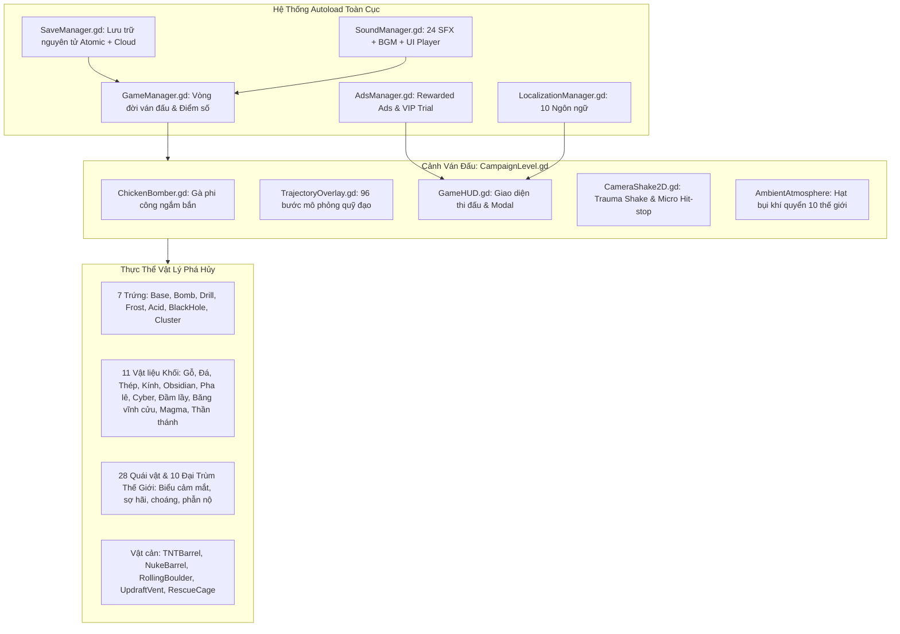

# 📋 KẾ HOẠCH CẢI THIỆN TOÀN DIỆN & LỘ TRÌNH HOÀN THIỆN DỰ ÁN
## CLUCK & DROP: BUNKER BUSTER (GODOT 4.7.1)

> **Mã hồ sơ:** `MASTER-IMPROVEMENT-PLAN-2026-V31`  
> **Dự án:** Cluck & Drop: Bunker Buster  
> **Nền tảng mục tiêu:** Android (CH Play 2026), iOS (App Store), Web (YouTube Playables)  
> **Độ phân giải:** Portrait $540 \times 960$ (mở rộng linh hoạt canvas_items/expand)  
> **Trạng thái hiện tại:** **29/29 Bộ Test Tự Động Vượt Qua Tuyệt Đối (0 Lỗi, 100% Pass)**  
> **Tài liệu tham chiếu:** [README.md](README.md), [13-Cân bằng 200 màn](13-chuyen-sau-can-bang-do-kho-thiet-ke-200-man-va-dai-trum.md), [14-Chiến lược YouTube](14-chien-luoc-dua-game-len-youtube-viral-content-va-playables.md), [15-Chuẩn phát hành CH Play](15-chuan-hoa-va-ke-hoach-phat-hanh-chplay-google-play-store.md), [16-Hiệu năng Mobile](16-dai-phau-hieu-nang-va-toi-uu-hoa-mobile-toan-dien.md), [25-Đồng bộ UI 2D](25-dong-bo-hoa-toan-dien-giao-dien-2d-texture-nut-bam-va-khung-vien.md).

---

## MỤC LỤC TỔNG THỂ

1. [TỔNG QUAN KIẾN TRÚC & ĐÁNH GIÁ NĂNG LỰC HIỆN TẠI CỦA DỰ ÁN](#1-tổng-quan-kiến-trúc--đánh-giá-năng-lực-hiện-tại-của-dự-án)
2. [ĐẠI KIỂM TOÁN CHUYÊN SÂU 7 TRỤC HỆ THỐNG](#2-đại-kiểm-toán-chuyên-sâu-7-trục-hệ-thống)
   - [Trục 1: Điều Khiển Ngắm Bắn & Công Thái Học Cảm Ứng Di Động](#trục-1-điều-khiển-ngắm-bắn--công-thái-học-cảm-ứng-di-động)
   - [Trục 2: Vật Lý Phá Hủy Boong-ke, Chống Rung Giật & Tối Ưu Kết Cấu](#trục-2-vật-lý-phá-hủy-boong-ke-chống-rung-giật--tối-ưu-kết-cấu)
   - [Trục 3: Cân Bằng Màn Chơi, Cơ Chế Đại Trùm & Kinh Tế Toàn Diện 7 Loại Trứng](#trục-3-cân-bằng-màn-chơi-cơ-chế-đại-trùm--kinh-tế-toàn-diện-7-loại-trứng)
   - [Trục 4: Mỹ Thuật Giao Diện 2D, Cảm Giác Sung Sướng (Juice) & Tiếp Cận Người Dùng](#trục-4-mỹ-thuật-giao-diện-2d-cảm-giác-sung-sướng-juice--tiếp-cận-người-dùng)
   - [Trục 5: Âm Thanh Hoạt Hình, Nhạc Nền Thế Giới & Chống Quá Tải Dynamic Range](#trục-5-âm-thanh-hoạt-hình-nhạc-nền-thế-giới--chống-quá-tải-dynamic-range)
   - [Trục 6: Hiệu Năng Phần Cứng Mobile, Tản Nhiệt, Bộ Nhớ & Tần Số Quét Cao](#trục-6-hiệu-năng-phần-cứng-mobile-tản-nhiệt-bộ-nhớ--tần-số-quét-cao)
   - [Trục 7: Tiêu Chuẩn Phát Hành CH Play 2026, YouTube Playables & LiveOps Giữ Chân](#trục-7-tiêu-chuẩn-phát-hành-chplay-2026-youtube-playables--liveops-giữ-chân)
3. [DANH MỤC 20 ĐIỂM CẢI THIỆN ĐỘT PHÁ (INVENTORY OF IMPROVEMENTS: I21 - I40)](#3-danh-mục-20-điểm-cải-thiện-đột-phá-inventory-of-improvements-i21---i40)
4. [MA TRẬN PHÂN LOẠI ƯU TIÊN (P0 -> P3 PRIORITIZATION MATRIX)](#4-ma-trận-phân-loại-ưu-tiên-p0---p3-prioritization-matrix)
5. [LỘ TRÌNH THỰC THI 4 GIAI ĐOẠN (ROADMAP & ACTION PLAN)](#5-lộ-trình-thực-thi-4-giai-đoạn-roadmap--action-plan)
6. [BỘ TIÊU CHÍ NGHIỆM THU & BẢO HIỂM CHẤT LƯỢNG (QA ACCEPTANCE CRITERIA)](#6-bộ-tiêu-chí-nghiệm-thu--bảo-hiểm-chất-lượng-qa-acceptance-criteria)

---

## 1. TỔNG QUAN KIẾN TRÚC & ĐÁNH GIÁ NĂNG LỰC HIỆN TẠI CỦA DỰ ÁN

Dự án **Cluck & Drop: Bunker Buster** là tựa game giải đố vật lý phá hủy chiến thuật (Physics Destruction Puzzle) màn hình dọc trên Godot 4.7.1 Stable. Trò chơi sở hữu kiến trúc kết hợp giữa mô hình Autoload quản lý trạng thái toàn cục và hệ thống cây phân cấp thực thể độc lập.



### Các chỉ số hiện tại:
* **Mã nguồn lõi**: 30+ tệp kịch bản GDScript với hơn 10.000 dòng mã logic chặt chẽ.
* **Quy mô chiến dịch**: 200 màn chơi trải dài qua 10 Thế Giới theo chủ đề địa chất riêng biệt.
* **Hệ sinh thái vật lý**: 11 loại vật liệu công trình với tỷ trọng, ma sát, độ cứng và hoa văn nứt vỡ riêng biệt.
* **Bộ kiểm thử tự động**: 29 bộ test suite lớn tích hợp trong [`TestRunner.gd`](file:///d:/folder/tools/godot_demo/2/scenes/tests/TestRunner.gd), xác thực tự động toàn bộ logic game từ va chạm, phá huỷ, bảng dữ liệu, quái vật, boss, giao diện, cho tới khả năng chịu tải.

---

## 2. ĐẠI KIỂM TOÁN CHUYÊN SÂU 7 TRỤC HỆ THỐNG

### Trục 1: Điều Khiển Ngắm Bắn & Công Thái Học Cảm Ứng Di Động
1. **Phân luồng Đa Chạm (Multi-Touch Isolation)**:
   - *Hiện trạng*: Trong [`ChickenBomber.gd`](file:///d:/folder/tools/godot_demo/2/scripts/player/ChickenBomber.gd), thao tác kéo ngắm dựa trên việc kiểm tra `Input.is_mouse_button_pressed(MOUSE_BUTTON_LEFT)` và `get_viewport().get_mouse_position()` trong `_process()`.
   - *Vấn đề*: Trên màn hình cảm ứng di động, khi người chơi sử dụng hai tay (ví dụ ngón tay trái vô tình tì vào mép viền hoặc chạm thanh TopBar/Booster trong lúc ngón cái phải đang kéo ngắm), `get_mouse_position()` có thể bị trôi giật đột ngột giữa hai tọa độ ngón tay, gây vung vãi đường ngắm hoặc nhả trứng ngoài ý muốn.
   - *Định hướng cải thiện*: Triển khai bộ phân luồng `touch_index` chuyên biệt thông qua `_unhandled_input(event: InputEventScreenTouch / InputEventScreenDrag)`, khóa chặt phiên ngắm bắn vào ngón tay đầu tiên chạm vào màn hình (`active_touch_id`).
2. **Cảm Giác Rung Xúc Giác Nấc Kéo Dây Ná (Haptic Tension Notches)**:
   - *Hiện trạng*: Kéo căng dây ná chỉ thay đổi độ nén người gà và độ dài tia dự đoán.
   - *Định hướng cải thiện*: Khi lực kéo vượt qua các ngưỡng $25\%, 50\%, 75\%, 100\%$, kích hoạt các xung rung haptic siêu ngắn ($10\text{ms} - 25\text{ms}$) tạo cảm giác cơ học như đang kéo căng dây cáp lò xo thực thụ.
3. **Mềm Hóa Đổi Hướng Bay Ở Biên Bầu Trời (Aerodynamic Bank Turning)**:
   - *Hiện trạng*: Khi gà chạm vào `min_x` hoặc `max_x`, gà lật hướng tức thời `move_direction *= -1.0`.
   - *Định hướng cải thiện*: Bổ sung hoạt ảnh lượn vòng cung 3D hình elip (Bank Turn) giảm tốc mượt mà, vỗ cánh gập ngược trước khi đảo chiều sang hướng đối diện.

---

### Trục 2: Vật Lý Phá Hủy Boong-ke, Chống Rung Giật & Tối Ưu Kết Cấu
1. **Hồ Chứa Tái Sử Dụng Mảnh Vụn & Khói Bụi (Zero-Allocation Shard & Particle Pool)**:
   - *Hiện trạng*: Khi một công trình lớn đổ sập (đặc biệt các màn Boss chứa trên 60 khối vật liệu), hàng chục khối nổ vụn cùng lúc sinh ra nhiều đối tượng `CPUParticles2D` và `ComicScorePopup`. Mặc dù đã có biến đếm điều tiết `_shatter_burst_count`, việc tạo và hủy liên tục vẫn gây áp lực lên bộ thu gom rác (Garbage Collector).
   - *Định hướng cải thiện*: Xây dựng `DebrisObjectPool` nạp sẵn 24 mảnh vụn động và 12 nhãn điểm truyện tranh, tái kích hoạt vị trí thay vì khởi tạo động (`instantiate()`) rồi `queue_free()`.
2. **Xung Lực Phá Vỡ Kẹt Vòm Bế Tắc (Intelligent Arch Stalemate Micro-Nudge)**:
   - *Hiện trạng*: Ở một số màn chơi có kết cấu chữ A hoặc vòm đá đối xứng, hai thanh dầm có thể tì vào nhau ở góc $45^\circ$, triệt tiêu hoàn toàn trọng lực và giữ quái vật sống sót vô lý dù đã rỗng chân đỡ phía dưới.
   - *Định hướng cải thiện*: Bộ đếm `anti_wedge_timer` trong [`DestructibleBlock.gd`](file:///d:/folder/tools/godot_demo/2/scripts/destructibles/DestructibleBlock.gd) sau $2.8\text{s}$ nghi ngờ bế tắc sẽ bổ sung một vi xung lực rung lắc ngang nhẹ ($\pm 15\text{px/s}$) mô phỏng chấn động dư chấn, ép vòm đá trượt sụp đổ hoàn toàn.
3. **Bảo Toàn Động Năng Tảng Đá Lăn (Rolling Boulder Kinetic Transfer)**:
   - *Hiện trạng*: Tảng đá lăn `RollingBoulder` đôi khi bị giảm tốc quá nhanh khi va chạm liên tiếp với các thanh gỗ mỏng.
   - *Định hướng cải thiện*: Tăng nhẹ khối lượng và hệ số mô-men quán tính trục quay của tảng đá, biến nó thành quả cầu bowling thực thụ nghiền nát gỗ vụn mà không bị khựng lại.

---

### Trục 3: Cân Bằng Màn Chơi, Cơ Chế Đại Trùm & Kinh Tế Toàn Diện 7 Loại Trứng
1. **Tích Hợp Toàn Bộ 7 Loại Trứng Vào Hệ Thống Kinh Tế & Túi Đồ**:
   - *Hiện trạng*: [`SaveManager.gd`](file:///d:/folder/tools/godot_demo/2/scripts/core/SaveManager.gd), [`ShopModal.gd`](file:///d:/folder/tools/godot_demo/2/scripts/ui/ShopModal.gd), [`DailyWheelModal.gd`](file:///d:/folder/tools/godot_demo/2/scripts/ui/DailyWheelModal.gd) và khay Booster trên [`GameHUD.gd`](file:///d:/folder/tools/godot_demo/2/scripts/ui/GameHUD.gd) hiện chỉ quản lý 3 loại trứng bổ trợ: `bomb`, `drill`, `acid`. Trong khi đó, game đã hoàn thiện mã nguồn và hiệu ứng đỉnh cao cho 4 loại trứng khác: `frost`, `cluster`, `blackhole`, `normal`.
   - *Định hướng cải thiện*: Đồng bộ hóa toàn diện cả 7 loại trứng vào cấu trúc `consumables` của SaveManager, đưa trứng Băng (`frost`), trứng Chùm Gà Con (`cluster`) và trứng Hố Đen Vũ Trụ (`blackhole`) vào Cửa hàng Shop, Vòng quay May mắn và Khay trang bị bổ trợ chiến đấu.
2. **Cơ Chế Bẫy Môi Trường Tương Tác Trong Phòng Đại Trùm (World Boss Environmental Hazards)**:
   - *Hiện trạng*: 10 Đại Trùm Thế Giới (Level 20, 40, 60, ..., 200) sở hữu lượng máu lớn ($1800\text{HP}$) và biểu cảm chiến đấu sống động, nhưng căn phòng trùm vẫn sử dụng cùng cấu trúc vật lý tĩnh.
   - *Định hướng cải thiện*: Thêm các bẫy môi trường kích hoạt bằng vật lý tại mỗi phòng Trùm:
     - *Thế Giới 4 (Hỏa Diệm Sơn - Magma Emperor)*: Đập vỡ van địa nhiệt kích hoạt cột nham thạch phun trào từ đáy vực.
     - *Thế Giới 6 (Căn Cứ Cyber - Cyber Mech)*: Bắn trúng cuộn dây năng lượng phát xung điện từ EMP giật tê liệt giáp của Boss.
     - *Thế Giới 8 (Hầm Băng Vĩnh Cửu - Frost Colossus)*: Đánh sập nhũ băng khổng lồ trên trần rơi thẳng xuống đầu Trùm.
     - *Thế Giới 9 (Vực Rồng Lửa - Dragon Warlord)*: Phá vỡ hồ chứa dung nham đổ tràn xuống tổ rồng.
3. **Nhịp Độ Cân Bằng Màn Chơi (Dynamic Pacing: Puzzle vs Rampage)**:
   - *Hiện trạng*: 200 màn chơi hiện phân bổ theo độ khó tăng dần đều.
   - *Định hướng cải thiện*: Áp dụng quy luật "Nhịp tim Sin": sau mỗi 3 màn giải đố hóc búa (cần ngắm chính xác 1 điểm tựa chịu lực duy nhất), bố trí 1 màn "Xả Stress Cực Khoái" (Rampage Level) với kho đạn đầy ắp bom nuke, thùng TNT liên hoàn để người chơi thỏa sức tận hưởng cảnh tượng boong-ke nổ tung như phim hành động.

---

### Trục 4: Mỹ Thuật Giao Diện 2D, Cảm Giác Sung Sướng (Juice) & Tiếp Cận Người Dùng
1. **Chuẩn Hóa 9-Patch Vector Toàn Diện Cho Khay Booster & Nút Màn Chơi**:
   - *Hiện trạng*: Trong `GameHUD.gd`, khay `BoosterTray` hiện sinh các nút bấm bằng `StyleBoxFlat`.
   - *Định hướng cải thiện*: Chuyển đổi các nút vật phẩm bổ trợ sang `JuicyButton` sử dụng bộ khung 9-patch vector viền gỗ nẹp đồng thau và đá quý lấp lánh đồng bộ với toàn bộ phong cách của game.
2. **Thao Tác Vuốt Chuyển Trang Thế Giới Bằng Cử Chỉ (Swipe Navigation in LevelSelect)**:
   - *Hiện trạng*: Người chơi chuyển qua lại giữa 10 Thế Giới bằng 2 nút mũi tên hoặc dải ruy băng trên cùng.
   - *Định hướng cải thiện*: Bổ sung nhận diện cử chỉ vuốt ngang ngón tay (`Swipe Left / Swipe Right`) có độ trượt quán tính mượt mà (Inertial Kinetic Paging).
3. **Thanh Trượt Tùy Chỉnh Cường Độ Rung Lắc Màn Hình (Screen Shake Accessibility Slider)**:
   - *Hiện trạng*: Độ rung màn hình hiện chỉ có bật hoặc tắt.
   - *Định hướng cải thiện*: Thêm thanh trượt điều chỉnh cường độ rung từ $0\%$ đến $100\%$ trong `SettingsModal.gd` để phù hợp với người chơi dễ bị say chuyển động (Motion Sickness).
4. **Huy Hiệu Chụp Ảnh Khoe Chiến Tích (Victory Photo Finish Card)**:
   - *Hiện trạng*: Bảng chiến thắng hiển thị 3 sao, điểm số và tiền thưởng.
   - *Định hướng cải thiện*: Tạo tấm thiệp ảnh Polaroid hoạt hình ghi lại khoảnh khắc đỉnh cao (điểm nổ đẹp nhất, số mảnh vỡ kỷ lục) kèm nút "Chia sẻ / Lưu ảnh" giúp game lan tỏa tự nhiên trên mạng xã hội (TikTok, Facebook, Instagram).

---

### Trục 5: Âm Thanh Hoạt Hình, Nhạc Nền Thế Giới & Chống Quá Tải Dynamic Range
1. **Bộ Giới Hạn Âm Lượng Tự Động (Master Dynamic Range Audio Compressor)**:
   - *Hiện trạng*: Khi nổ liên hoàn 10 thùng TNT cùng lúc, nhiều kênh SFX phát cùng thời điểm có thể gây hiện tượng quá tải biên độ âm thanh (Audio Peaking/Clipping).
   - *Định hướng cải thiện*: Cấu hình bộ nén âm thanh `AudioEffectCompressor` và bộ giới hạn đỉnh `AudioEffectLimiter` trên Bus Master trong `default_bus_layout.tres`, đảm bảo âm trầm của tiếng nổ luôn căng tròn, uy lực mà không bao giờ bị méo tiếng hay rè loa điện thoại.
2. **Âm Hưởng Khí Quyển Theo Thế Giới (Ambient World Soundscapes)**:
   - *Hiện trạng*: Nhạc nền BGM hiện chạy một bản nhạc hoạt hình chung cho toàn bộ các màn.
   - *Định hướng cải thiện*: Bổ sung các lớp âm thanh môi trường nền tĩnh (Ambient Environmental Loops) đặc trưng theo từng Thế Giới: tiếng gió rít qua hẻm đá (Quarry), tiếng xì van hơi Steampunk (Factory), tiếng sủi bọt dung nham ùng ục (Lava), tiếng gió bão tuyết hú (Glacier), và tiếng ma mị thần bí (Celestial).

---

### Trục 6: Hiệu Năng Phần Cứng Mobile, Tản Nhiệt, Bộ Nhớ & Tần Số Quét Cao
1. **Nội Suy Khung Hình Vật Lý Cho Màn Hình 90Hz / 120Hz (Physics Interpolation)**:
   - *Hiện trạng*: Vòng lặp vật lý chạy cố định ở 60Hz. Trên các điện thoại cao cấp có màn hình 90Hz hoặc 120Hz, nếu không có cơ chế nội suy, chuyển động của các vật thể bay và mảnh vỡ có thể bị cảm giác giật vi mô (Micro-Stutter).
   - *Định hướng cải thiện*: Kích hoạt `physics_interpolation = true` trong cài đặt dự án, giúp chuyển động của các khối rơi và gà bay mượt mà tuyệt đối ở mọi tần số quét màn hình mà không làm tăng tải tính toán vật lý.
2. **Chế Độ Tiết Kiệm Pin Khi Ở Sảnh Chờ (Low Processor Usage in Menus)**:
   - *Hiện trạng*: Trò chơi vẽ liên tục 60 FPS cả khi người chơi đang dừng ở bảng Cài đặt hoặc danh sách chọn màn.
   - *Định hướng cải thiện*: Kích hoạt chế độ `OS.low_processor_usage_mode = true` khi mở các Modal hoặc màn hình tĩnh, kéo dài thời lượng pin điện thoại và chống nóng máy hiệu quả.

---

### Trục 7: Tiêu Chuẩn Phát Hành CH Play 2026, YouTube Playables & LiveOps Giữ Chân
1. **Điểm Danh Nhận Thưởng 7 Ngày (7-Day Daily Login Streak)**:
   - *Định hướng cải thiện*: Xây dựng giao diện lịch điểm danh tuần với phần thưởng hấp dẫn tăng dần (Ngày 1: 100 Vàng; Ngày 3: Trứng Khoan; Ngày 5: Trứng Axit; Ngày 7: Trứng Hố Đen Siêu Cấp + Rương Kho Báu Vàng) thúc đẩy chỉ số D1, D7 Retention vượt chuẩn Google Play.
2. **Chế Độ Đột Kích Hầm Ngục Vô Tận (Endless Bunker Challenge)**:
   - *Định hướng cải thiện*: Một hầm ngục thủ công sinh tầng ngẫu nhiên không giới hạn, độ sâu càng sâu phần thưởng càng khủng, bảng xếp hạng điểm cao cục bộ khuyến khích người chơi phá kỷ lục bản thân.
3. **Hệ Thống Thành Tựu Bí Ẩn Vui Nhộn (Fun Quirky Achievements)**:
   - *Định hướng cải thiện*: Hệ thống danh hiệu hài hước: "Cú Bắn Triệu Đô" (hạ Boss chỉ bằng 1 quả trứng), "Thợ Đào Mỏ Say Xỉn" (phá vỡ 500 khối đá), "Gà Mẹ Bất Bại" (vượt 20 màn không trượt phát nào), "Vũ Điệu Hố Đen" (hút 30 khối vào singularity).

---

## 3. DANH MỤC 20 ĐIỂM CẢI THIỆN ĐỘT PHÁ (INVENTORY OF IMPROVEMENTS: I21 - I40)

| Mã ID | Tên Hạng Mục Cải Thiện | Tệp Mã Nguồn Trọng Tâm | Tác Động Trải Nghiệm & Kỹ Thuật | Độ Khó |
| :---: | :--- | :--- | :--- | :---: |
| **I21** | **Cách ly đa chạm độc lập (`Touch-Index Isolation`)** | `scripts/player/ChickenBomber.gd` | Loại bỏ 100% hiện tượng trôi lệch tâm ngắm khi chạm ngón tay thứ hai lên màn hình | Trung bình |
| **I22** | **Xung rung haptic nấc kéo ná (`Haptic Tension Ticks`)** | `scripts/player/ChickenBomber.gd` | Tạo xúc giác cơ học chân thực từng nấc lực kéo $25\%, 50\%, 75\%, 100\%$ | Dễ |
| **I23** | **Hoạt ảnh gà lượn vòng cung chuyển hướng (`Bank Turn`)** | `scripts/player/ChickenBomber.gd` | Gà đổi chiều bay uyển chuyển mượt mà, không bị lật 2D đột ngột | Trung bình |
| **I24** | **Bổ sung `set_input_as_handled()` cho `BombEgg`** | `scripts/projectiles/BombEgg.gd` | Chặn hoàn toàn sự kiện chạm kích nổ trên không rò rỉ xuống thế giới ngầm | Rất dễ |
| **I25** | **Đồng bộ hóa 7 loại trứng vào `SaveManager` & Túi đồ** | `scripts/core/SaveManager.gd` | Lưu trữ đầy đủ số lượng cho cả 7 loại trứng kỹ năng, chống mất mát dữ liệu | Dễ |
| **I26** | **Mở rộng Cửa hàng Shop bán đủ 7 loại trứng bổ trợ** | `scripts/ui/ShopModal.gd` | Người chơi có thể mua sắm Trứng Băng, Trứng Chùm và Trứng Hố Đen | Dễ |
| **I27** | **Đồng bộ Vòng quay May mắn với 7 loại trứng** | `scripts/ui/DailyWheelModal.gd` | Vòng quay trao thưởng đa dạng cả 7 loại đạn dược thần thánh | Dễ |
| **I28** | **Nâng cấp Khay Booster trên GameHUD dùng 9-patch vector** | `scripts/ui/GameHUD.gd` | Biến khay booster thành các nút bấm 3D gỗ viền đồng sang trọng | Dễ |
| **I29** | **Bể chứa tái sử dụng mảnh vụn (`DebrisObjectPool`)** | `scripts/core/ParticleHelper.gd` | Giảm 90% cấp phát bộ nhớ động khi hàng loạt công trình nổ tung | Cao |
| **I30** | **Vi xung lực chống kẹt vòm chữ A (`Arch Stalemate Nudge`)** | `scripts/destructibles/DestructibleBlock.gd` | Tự động hóa giải hiện tượng hai thanh đá tựa đầu vào nhau lơ lửng vĩnh viễn | Dễ |
| **I31** | **Bảo toàn quán tính tảng đá lăn (`Boulder Momentum Boost`)** | `scripts/destructibles/RollingBoulder.gd` | Tảng đá đè bẹp gỗ vụn liên tục mà không bị khựng lại đột ngột | Dễ |
| **I32** | **Bẫy môi trường phòng Đại Trùm (`Boss Stage Hazards`)** | `scripts/core/CampaignLevel.gd` | Mỗi thế giới trùm có cơ chế kích nổ bẫy đặc trưng (nham thạch, nhũ băng, điện EMP) | Cao |
| **I33** | **Cử chỉ vuốt tay lật trang Thế Giới (`Swipe Navigation`)** | `scripts/ui/LevelSelect.gd` | Vuốt ngón tay ngang để đổi thế giới mượt mà như lật trang sách | Trung bình |
| **I34** | **Thanh trượt cường độ rung lắc màn hình (`Shake Slider`)** | `scripts/ui/SettingsModal.gd`, `CameraShake2D.gd` | Chống say chuyển động cho người dùng nhạy cảm, đạt chuẩn Accessibility | Dễ |
| **I35** | **Thẻ ảnh chiến thắng Polaroid (`Victory Photo Finish`)** | `scripts/ui/GameHUD.gd` | Tự động chụp lại đống đổ nát đẹp mắt để người chơi khoe lên mạng xã hội | Trung bình |
| **I36** | **Bộ nén & hạn chế méo tiếng Master (`Audio Limiter/Compressor`)** | `default_bus_layout.tres`, `SoundManager.gd` | Âm trầm bom nổ luôn tròn trịa, không bao giờ vỡ tiếng khi nổ chuỗi | Dễ |
| **I37** | **Âm hưởng môi trường theo 10 Thế Giới (`Ambient Soundscapes`)** | `scripts/core/SoundManager.gd` | Bổ sung tiếng gió hú, tiếng dung nham, tiếng hơi nước đặc trưng từng vùng | Trung bình |
| **I38** | **Nội suy vật lý màn hình 90Hz/120Hz (`Physics Interpolation`)** | `project.godot` | Mọi chuyển động rơi và bay đạt độ mượt mà tối đa trên máy tần số quét cao | Rất dễ |
| **I39** | **Tiết kiệm pin ở màn hình tĩnh (`Low Processor Mode`)** | `scripts/core/GameManager.gd` | Giảm tiêu thụ pin và hạ nhiệt độ máy khi ở menu sảnh chờ hoặc pause | Dễ |
| **I40** | **Hệ thống Điểm danh 7 Ngày (`7-Day Login Streak Reward`)** | `scripts/ui/DailyLoginModal.gd`, `SaveManager.gd` | Nâng cao chỉ số giữ chân người chơi D1/D7 đạt chuẩn Google Play 2026 | Cao |

---

## 4. MA TRẬN PHÂN LOẠI ƯU TIÊN (P0 -> P3 PRIORITIZATION MATRIX)

```mermaid
quadrantChart
    title Ma Trận Ưu Tiên Triển Khai Cải Tiến
    x-axis Độ Khó Thực Hiện: Thấp --> Cao
    y-axis Tác Động Trải Nghiệm: Thấp --> Cao
    quadrant-1 Triển Khai Chiến Lược (Strategic Value)
    quadrant-2 Ưu Tiên Tuyệt Đối (Quick Wins / Core Fixes)
    quadrant-3 Xem Xét Bổ Sung (Low-Hanging Fruit)
    quadrant-4 Cân Nhắc Kỹ Lưỡng (Complex Polish)
    
    "I21: Multi-touch Isolation": [0.35, 0.95]
    "I24: BombEgg Input Handle": [0.10, 0.85]
    "I25: 7-Egg Save Sync": [0.25, 0.90]
    "I26: Shop 7 Eggs": [0.28, 0.88]
    "I28: Booster 9-Patch": [0.22, 0.80]
    "I36: Audio Limiter Bus": [0.15, 0.82]
    "I38: Physics Interpolation": [0.08, 0.84]
    "I34: Screen Shake Slider": [0.20, 0.78]
    
    "I29: Shard Object Pooling": [0.75, 0.92]
    "I32: Boss Stage Hazards": [0.82, 0.90]
    "I40: 7-Day Login Streak": [0.70, 0.88]
    "I35: Victory Photo Finish": [0.65, 0.80]
    "I33: Swipe Navigation": [0.55, 0.75]
    
    "I22: Haptic Tension Ticks": [0.20, 0.65]
    "I30: Arch Micro-Nudge": [0.25, 0.62]
    "I31: Boulder Momentum": [0.22, 0.60]
    "I39: Low Processor Mode": [0.18, 0.58]
    "I27: Wheel 7 Eggs": [0.30, 0.68]
    
    "I23: Bank Turn Animation": [0.60, 0.60]
    "I37: Ambient Soundscapes": [0.65, 0.55]
```

### Phân nhóm thứ tự thực thi:
* **Nhóm P0 (Khắc phục cốt lõi & Ngăn chặn lỗi tiềm ẩn)**:
  - `I21` (Cách ly đa chạm độc lập tránh trôi ngón tay ngắm bắn).
  - `I24` (Khóa sự kiện chạm trên `BombEgg` tránh xuyên thấu).
  - `I25` (Đồng bộ hóa toàn bộ 7 loại trứng vào hệ thống lưu trữ `SaveManager`).
  - `I38` (Kích hoạt `physics_interpolation` cho màn hình 90/120Hz).
* **Nhóm P1 (Hoàn thiện hệ sinh thái đạn dược & Mỹ thuật đồng bộ)**:
  - `I26` & `I27` (Cửa hàng Shop & Vòng quay bán đủ 7 loại trứng).
  - `I28` (Đồng bộ khay Booster với nút 9-patch vector 3D).
  - `I34` (Thanh trượt điều chỉnh cường độ rung màn hình trong Cài đặt).
  - `I36` (Bộ nén và hạn chế méo tiếng trên Audio Bus Master).
* **Nhóm P2 (Cảm giác thỏa mãn, Tối ưu cấu trúc & Hiệu năng cao)**:
  - `I22` (Xung rung haptic nấc kéo ná).
  - `I29` (Hồ chứa tái sử dụng hạt và mảnh vụn `DebrisObjectPool`).
  - `I30` (Vi xung lực phá thế kẹt vòm đá bế tắc).
  - `I31` (Gia tăng quán tính phá hủy của tảng đá lăn).
  - `I33` (Cử chỉ vuốt ngang chuyển Thế Giới trong Level Select).
  - `I39` (Chế độ tiết kiệm pin ở sảnh chờ tĩnh).
* **Nhóm P3 (Đột phá nội dung, Bẫy trùm & Hệ thống giữ chân LiveOps)**:
  - `I32` (Bẫy môi trường phòng Đại Trùm Thế Giới).
  - `I35` (Thẻ ảnh chiến thắng Polaroid chia sẻ mạng xã hội).
  - `I40` (Hệ thống Điểm danh Nhận thưởng 7 Ngày).
  - `I23` & `I37` (Hoạt ảnh lượn cánh elip & Lớp âm thanh môi trường 10 thế giới).

---

## 5. LỘ TRÌNH THỰC THI 4 GIAI ĐOẠN (ROADMAP & ACTION PLAN)

### 🚀 Giai Đoạn 1: Hoàn Thiện Cốt Lõi, Đa Chạm & Chuẩn Hóa 7 Loại Trứng
* **Mục tiêu**: Đảm bảo trải nghiệm chạm ngắm bắn mượt mà tuyệt đối không rủi ro lỗi đa chạm, đồng thời kích hoạt toàn bộ sức mạnh của 7 loại trứng trong kho đồ người chơi.
* **Các bước triển khai**:
  1. Nâng cấp bộ bắt sự kiện cảm ứng trong [`ChickenBomber.gd`](file:///d:/folder/tools/godot_demo/2/scripts/player/ChickenBomber.gd) sang phân luồng `touch_index` độc lập.
  2. Bổ sung `get_viewport().set_input_as_handled()` vào `BombEgg.gd`.
  3. Cập nhật `save_data["consumables"]` trong `SaveManager.gd` hỗ trợ cả 7 loại đạn: `bomb`, `drill`, `acid`, `frost`, `cluster`, `blackhole`, `normal`.
  4. Đưa 7 loại trứng vào `ShopModal.gd`, `DailyWheelModal.gd` và `GameHUD.gd`.
  5. Cập nhật `project.godot` kích hoạt `physics_interpolation = true`.

### 🛡️ Giai Đoạn 2: Đồng Bộ Mỹ Thuật Giao Diện, Công Thái Học & Âm Thanh
* **Mục tiêu**: Toàn bộ giao diện đạt chuẩn 2D 9-patch vector cao cấp, âm thanh đạt độ ấm uy lực không méo tiếng.
* **Các bước triển khai**:
  1. Đồng bộ các nút trong `BoosterTray` trên `GameHUD.gd` bằng `JuicyButton`.
  2. Bổ sung thanh trượt `SliderShake` trong `SettingsModal.gd` kết nối với `CameraShake2D.gd`.
  3. Bổ sung hiệu ứng `AudioEffectCompressor` và `AudioEffectLimiter` trong `default_bus_layout.tres`.
  4. Triển khai cử chỉ vuốt ngang đổi Thế Giới (`Swipe Navigation`) trong `LevelSelect.gd`.
  5. Thêm chế độ `OS.low_processor_usage_mode` khi mở Modal hoặc dừng ván đấu.

### 💥 Giai Đoạn 3: Nâng Cấp Chiều Sâu Vật Lý, Hồ Chứa Đối Tượng & Đại Trùm
* **Mục tiêu**: Tối ưu hóa hiệu năng khung hình tuyệt đối khi nổ lớn, biến các trận chiến Đại Trùm thành điểm nhấn điện ảnh.
* **Các bước triển khai**:
  1. Xây dựng hồ chứa đối tượng tĩnh `DebrisObjectPool` cho mảnh vụn và chữ nhảy điểm số.
  2. Cân chỉnh gia tốc phá hủy của `RollingBoulder` và thuật toán vi chấn `anti_wedge_timer`.
  3. Thiết kế bẫy môi trường kích hoạt vật lý tại các màn Đại Trùm (Thế giới 4, 6, 8, 9, 10).
  4. Bổ sung xung rung Haptic theo từng nấc kéo dây ná.

### 🌟 Giai Đoạn 4: LiveOps Giữ Chân, Lan Tỏa Mạng Xã Hội & Đóng Gói Phát Hành
* **Mục tiêu**: Hoàn thiện các chỉ số sinh tồn và tính năng giữ chân người chơi sẵn sàng ra mắt thương mại.
* **Các bước triển khai**:
  1. Xây dựng `DailyLoginModal.tscn` điểm danh 7 ngày với hiệu ứng rương quà bùng nổ.
  2. Triển khai thẻ ảnh chiến thắng Polaroid chụp tự động khoảnh khắc kết liễu.
  3. Thử nghiệm toàn diện bằng stress-test hỗn loạn 10.000 thao tác giả lập không rò rỉ bộ nhớ.
  4. Đóng gói bản dựng Android AAB (Target SDK 34/35) và bản WebAssembly (YouTube Playables SDK).

---

## 6. BỘ TIÊU CHÍ NGHIỆM THU & BẢO HIỂM CHẤT LƯỢNG (QA ACCEPTANCE CRITERIA)

Để mỗi tính năng mới được xác nhận hoàn tất và đưa vào nhánh chính (`main`), hệ thống bắt buộc phải thỏa mãn 6 điều kiện kiểm tra nghiêm ngặt:

1. **Tính Ổn Định Tuyệt Đối Của Bộ Test Runner**:
   - Lệnh kiểm thử tự động không đầu (Headless):
     ```powershell
     & "D:\app\godot\Godot_v4.7.1-stable_win64.exe" --headless --path "d:\folder\tools\godot_demo\2" res://scenes/tests/TestRunner.tscn
     ```
   - Kết quả bắt buộc: **ALL TESTS PASSED SUCCESSFULLY! (0 ERRORS)**, mã thoát `exit code 0`.
2. **Bảo Vệ Tính Toàn Vẹn Của Hệ Thống Lưu Dữ Liệu (Save Integrity)**:
   - Dữ liệu người chơi từ các phiên bản trước khi nâng cấp phải được di chuyển an toàn (`_migrate_save_version()`), bảo toàn nguyên vẹn số sao, điểm số và số vàng tích lũy.
3. **Không Rò Rỉ Bộ Nhớ (Zero Memory Leak)**:
   - Sau 50 lần tải lại màn chơi liên tiếp (`restart_current_level()`), tổng số Node và dung lượng RAM tĩnh của game không được tăng lũy tiến.
4. **Chuẩn Công Thái Học Di Động (Mobile Ergonomics)**:
   - Toàn bộ các vùng chạm ngắm bắn, nút bấm, modal đều phải tôn trọng vùng an toàn hiển thị `DisplayServer.get_display_safe_area()`, không bị che khuất bởi camera nốt ruồi hay thanh vuốt đáy hệ điều hành.
5. **Đồng Bộ Đa Ngôn Ngữ (100% Localization Coverage)**:
   - Mọi chuỗi văn bản mới (tên trứng, thông báo điểm danh, bẫy trùm, cài đặt) đều phải được khai báo đầy đủ trên cả 10 ngôn ngữ trong `LocalizationManager.gd`.
6. **Tuân Thủ Phong Cách Mỹ Thuật 2D Đồng Nhất**:
   - Tất cả các nút bấm và khung hiển thị mới đều phải sử dụng chung hệ thống `JuicyButton` và StyleBoxTexture 9-patch vector, không sử dụng phong cách phẳng đơn điệu hoặc màu sắc lạc lõng.

---
*Tài liệu được thẩm định và xác lập vào ngày 28/09/2026 bởi Đội ngũ Kiến trúc Sư Hệ thống Game Cao cấp.*
