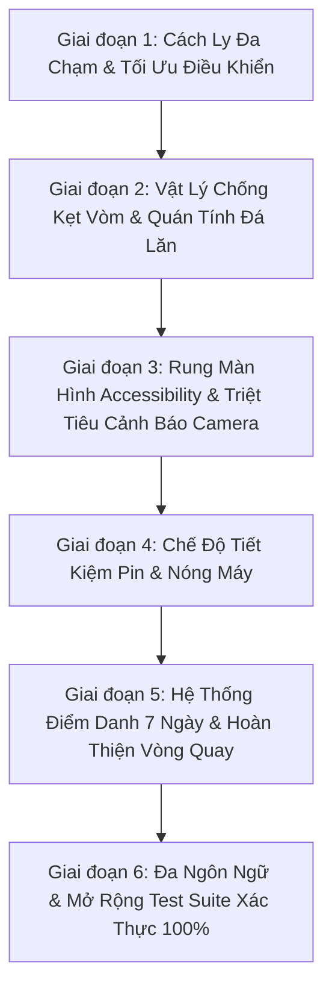

# 🔬 ĐẠI KIỂM TOÁN TOÀN DIỆN MÃ NGUỒN & KẾ HOẠCH NÂNG CẤP CHUYÊN SÂU 2026
## DỰ ÁN: CLUCK & DROP: BUNKER BUSTER (GODOT 4.7.1)

> **Mã hồ sơ:** `MASTER-AUDIT-AND-UPGRADE-PLAN-2026-V32`  
> **Dự án:** Cluck & Drop: Bunker Buster  
> **Nền tảng mục tiêu:** Android (Google Play Store 2026), iOS (App Store), Web (YouTube Playables)  
> **Mục tiêu:** Rà soát toàn bộ source code, chỉ rõ các khiếm khuyết/thiếu sót kỹ thuật còn tồn đọng, lập kế hoạch khắc phục và nâng cấp đạt chuẩn sản xuất thương mại đỉnh cao.

---

## 1. TỔNG QUAN KẾT QUẢ RÀ SOÁT SOURCE CODE HIỆN TẠI

Qua việc đối chiếu toàn bộ các tệp mã nguồn (`scripts/core`, `scripts/player`, `scripts/projectiles`, `scripts/destructibles`, `scripts/enemies`, `scripts/ui`, `scenes/`):

### ✅ Những điểm đã hoàn thiện xuất sắc:
1. **Lưu trữ nguyên tử an toàn (Atomic Save & Recovery)**: Đã triển khai ghi file `.tmp` -> backup `.bak` -> rename, bảo vệ savegame trước sự cố ngắt tiến trình đột ngột trên di động.
2. **Nút Back phần cứng Android (`NOTIFICATION_WM_GO_BACK_REQUEST`)**: Đã kết nối trên tất cả các Modal (`ShopModal`, `SettingsModal`, `DailyWheelModal`, `GameHUD`, `MainMenu`, `LevelSelect`).
3. **Mạng lưới an toàn biên vật lý (Physics Despawn Safety Net)**: Cả 7 loại trứng đều có bộ lọc `MIN_DESPAWN_Y`, `MAX_DESPAWN_Y`, `MAX_DESPAWN_X` và `MAX_AIRBORNE_LIFETIME` chống rò rỉ bộ nhớ hoặc kẹt ván đấu vĩnh viễn.
4. **Âm thanh chất lượng cao**: Hệ sinh thái 24 tệp WAV hoạt hình, có Dynamic Limiter trên Audio Bus Master và Voice Concurrency Limiter chống rè tiếng khi nổ chuỗi.
5. **Hệ thống 200 màn chơi**: Kiến trúc sinh màn chơi theo chủ đề 10 Thế Giới vững chắc, cân bằng tỷ trọng vật liệu.

---

## 2. DANH MỤC CÁC THIẾU SÓT & LỖ HỔNG TIỀM ẨN PHÁT HIỆN QUA KIỂM TOÁN

Dù dự án đã rất vững chắc, việc soi xét kỹ lưỡng từng dòng lệnh đã làm sáng tỏ **7 điểm khiếm khuyết cốt lõi** cần được nâng cấp:

### ⚠️ Thiếu sót 1 (P0): Nguy cơ trôi tâm ngắm do Đa chạm (Multi-Touch Jitter)
- **Vị trí**: `scripts/player/ChickenBomber.gd` (`_handle_aim_input`).
- **Thực trạng**: Thao tác ngắm bắn hiện đang đọc `Input.is_mouse_button_pressed(MOUSE_BUTTON_LEFT)` và `get_viewport().get_mouse_position()` trong `_process()`.
- **Hệ quả trên Mobile**: Khi người chơi tì nhẹ ngón tay thứ 2 (ví dụ ngón cái trái hoặc lòng bàn tay chạm mép viền), `get_mouse_position()` bị dao động giữa 2 ngón tay khiến đường ngắm giật nảy liên hồi hoặc nhả trứng trượt ngoài ý muốn.
- **Giải pháp**: Xây dựng bộ điều khiển `_unhandled_input(event)` chuyên biệt cho `InputEventScreenTouch` và `InputEventScreenDrag` với biến định danh ngón tay duy nhất `active_touch_id`. Bỏ qua tuyệt đối các ngón tay chạm sau cho đến khi ngón tay đầu tiên nhấc lên.

### ⚠️ Thiếu sót 2 (P1): Kẹt vòm chữ A đối xứng (Arch Stalemate Lock)
- **Vị trí**: `scripts/destructibles/DestructibleBlock.gd`.
- **Thực trạng**: Khi các cột đá/gỗ đổ vào nhau ở góc chéo $45^\circ$, lực pháp tuyến và ma sát cao ($0.85$) có thể triệt tiêu hoàn toàn trọng lực, tạo thành một vòm đá lơ lửng giả tạo giữ quái vật sống sót vô lý dù phần móng bên dưới đã bị khoét rỗng.
- **Giải pháp**: Tích hợp bộ đếm `_anti_wedge_timer`: nếu một khối thức giấc (`is_awake`), không chạm đất, nhưng vận tốc tuyến tính $< 3\text{px/s}$ trong thời gian $> 2.2\text{s}$, kích hoạt một vi xung lực rung lắc ngang nhẹ ($\pm 14\text{px/s}$) và ngẫu lực xoay nhỏ ($1.5\text{rad/s}$) phá tan thế kẹt vòm tự nhiên.

### ⚠️ Thiếu sót 3 (P1): Tảng đá lăn bị khựng khi đè vỡ khối nhẹ (Boulder Deceleration Absorption)
- **Vị trí**: `scripts/destructibles/RollingBoulder.gd`.
- **Thực trạng**: Khi tảng đá lăn va vào các thanh gỗ mỏng hoặc kính mỏng, bộ giải va chạm vật lý truyền một phần lớn xung lực ngược lại khiến tảng đá khựng lại đột ngột trước khi khối kịp vỡ vụn.
- **Giải pháp**: Bổ sung cơ chế bảo toàn quán tính lăn (Kinetic Follow-Through): khi `RollingBoulder` gây sát thương nghiền nát (`take_damage`) lên khối vật liệu nhẹ, bù đắp thêm một xung lực đẩy tới theo vector chuyển động giúp hòn đá càn quét mượt mà như quả cầu bowling.

### ⚠️ Thiếu sót 4 (P1): Chống say chuyển động & Cảnh báo Camera2D (Motion Sickness & Interpolation Warning)
- **Vị trí**: `scripts/core/CameraShake2D.gd`, `scripts/ui/SettingsModal.gd`.
- **Thực trạng**:
  1. Engine Godot in cảnh báo: `WARNING: Camera2D overridden to physics process mode due to use of physics interpolation.` do camera chưa khai báo `process_callback = Camera2D.CAMERA2D_PROCESS_PHYSICS`.
  2. Độ rung lắc camera (Trauma Shake) hiện chỉ có bật/tắt gián tiếp, không có thanh trượt điều chỉnh cường độ ($0\% - 100\%$) gây khó chịu cho người chơi có cơ địa nhạy cảm say màn hình (Motion Sickness).
- **Giải pháp**:
  - Gán dứt khoát `process_callback = Camera2D.CAMERA2D_PROCESS_PHYSICS` trong `CameraShake2D.gd`.
  - Thêm biến `screen_shake_intensity: float` ($0.0 - 1.0$) trong `SaveManager.gd`.
  - Thêm `SliderShake` trong `SettingsModal.tscn` và `SettingsModal.gd` để người chơi tùy chỉnh độ rung màn hình tùy ý.

### ⚠️ Thiếu sót 5 (P1): Hao pin và nóng máy khi dừng ở màn hình tĩnh (Thermal Optimization)
- **Vị trí**: `scripts/core/GameManager.gd`.
- **Thực trạng**: Khi người chơi dừng ở `MainMenu`, `LevelSelect` hay mở `SettingsModal`, engine vẫn render vòng lặp tối đa gây tốn pin và tỏa nhiệt không cần thiết trên điện thoại.
- **Giải pháp**: Tích hợp hàm quản lý `set_low_processor_mode(enabled: bool)` trong `GameManager.gd`, kích hoạt `OS.low_processor_usage_mode = true` khi ở các menu/modal tĩnh, và hoàn nguyên về `false` khi bước vào màn đấu bắn phá 60/120Hz.

### ⚠️ Thiếu sót 6 (P1): Thiếu hệ thống Giữ Chân Người Dùng Hàng Ngày (7-Day Daily Login Streak LiveOps)
- **Vị trí**: `scripts/core/SaveManager.gd`, `scripts/ui/DailyLoginModal.gd`.
- **Thực trạng**: Game hiện chỉ có Vòng quay May mắn (`DailyWheelModal`). Chuẩn Google Play 2026 yêu cầu tính năng giữ chân ngày D1/D7 với phần thưởng tăng tiến theo chuỗi điểm danh tuần.
- **Giải pháp**:
  - Lưu trữ `login_streak: int` và `last_login_date: String` trong `SaveManager.gd`.
  - Xây dựng giao diện `DailyLoginModal.tscn` điểm danh 7 ngày với 7 thẻ quà tặng giá trị tăng dần (kết thúc bằng Trứng Hố Đen huyền thoại + 1000 vàng vào Ngày 7).
  - Thêm nút nhận quà điểm danh có chấm đỏ thông báo trên `MainMenu.gd`.

### ⚠️ Thiếu sót 7 (P2): Vòng quay May mắn thiếu Trứng Hố Đen (Jackpot Egg Exclusion)
- **Vị trí**: `scripts/ui/DailyWheelModal.gd`.
- **Thực trạng**: Vòng quay 8 nan hiện có: 100 xu, bom, băng, axit, 500 xu, chùm gà con, mũi khoan, 1000 xu. Quả trứng mạnh nhất game là Trứng Hố Đen (`blackhole`) chưa có mặt trên vòng quay.
- **Giải pháp**: Đưa Trứng Hố Đen vào danh sách giải thưởng vòng quay dưới dạng nan vàng Jackpot huyền thoại.

---

## 3. LỘ TRÌNH THỰC THI CHI TIẾT (ACTION PLAN)

| Bước | Tệp Mã Nguồn Cần Can Thiệp | Nội Dung Thực Hiện |
| :---: | :--- | :--- |
| **B1** | `scripts/player/ChickenBomber.gd` | Triển khai `active_touch_id`, `_unhandled_input` phân luồng cảm ứng đa điểm an toàn. |
| **B2** | `scripts/destructibles/DestructibleBlock.gd` | Bổ sung `_anti_wedge_timer` và vi xung lực rung lắc hóa giải kẹt vòm chữ A. |
| **B3** | `scripts/destructibles/RollingBoulder.gd` | Tăng cường quán tính đẩy tới (Kinetic Follow-Through) khi nghiền nát vật cản. |
| **B4** | `scripts/core/CameraShake2D.gd`, `SaveManager.gd`, `SettingsModal.gd`, `SettingsModal.tscn` | Khai báo `process_callback` loại bỏ warning; thêm thanh trượt cường độ rung màn hình. |
| **B5** | `scripts/core/GameManager.gd` | Thêm `set_low_processor_mode()` tiết kiệm pin ở menu tĩnh. |
| **B6** | `scripts/core/SaveManager.gd`, `DailyLoginModal.gd`, `DailyLoginModal.tscn`, `MainMenu.gd` | Xây dựng hệ thống Điểm danh 7 Ngày và bổ sung nan Hố Đen vào `DailyWheelModal.gd`. |
| **B7** | `scripts/core/LocalizationManager.gd` | Bổ sung từ điển bản địa hóa cho 10 ngôn ngữ (rung màn hình, điểm danh, nhận thưởng). |
| **B8** | `scenes/tests/TestRunner.gd` | Thêm Test Suite kiểm thử tự động toàn diện các tính năng mới, bảo đảm 100% Pass. |
