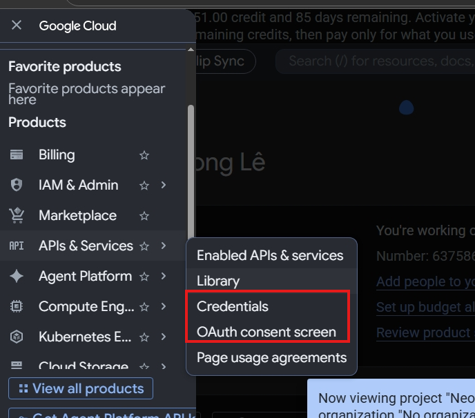
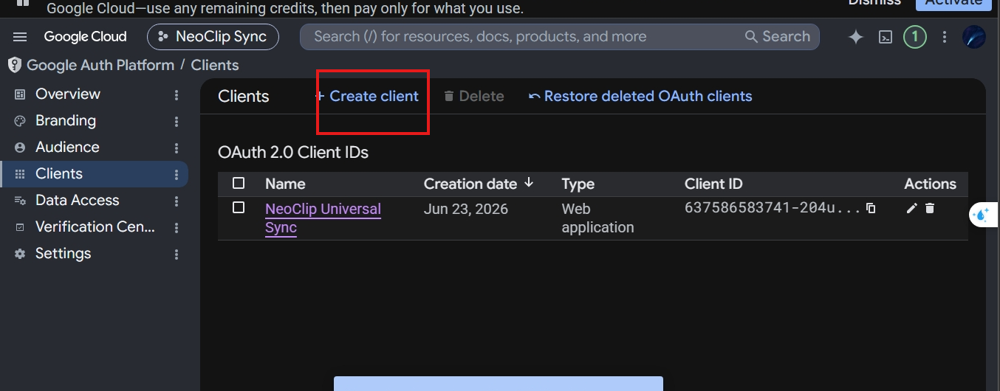

# Hướng Dẫn Triển Khai Website & Tên Miền (Cho Extension)

Tài liệu này ghi chú lại toàn bộ quy trình từ A-Z để thiết lập một trang Landing Page chuyên nghiệp, tốc độ cao và bảo mật tuyệt đối cho một Extension mới (hoặc bất kỳ dự án nào) sử dụng GitHub Pages và Cloudflare. Chi phí: **$0**.

---

## 1. Mua tên miền miễn phí (Namecheap)

Nếu bạn có tài khoản GitHub Education (Student Developer Pack):

1. Truy cập Namecheap (hoặc nc.me).
2. Tìm và đăng ký một tên miền `.me` miễn phí 1 năm.
3. Thanh toán với giá $0. Tên miền sẽ xuất hiện trong bảng điều khiển Namecheap.

## 2. Thiết lập Cloudflare (Quản lý DNS & Bảo mật)

Thay vì dùng Namecheap quản lý DNS (chậm và ít tính năng), chúng ta dùng Cloudflare làm cầu nối.

### Bước 2.1: Thêm Website vào Cloudflare

1. Đăng nhập [Cloudflare](https://dash.cloudflare.com/), bấm **Add a Site**.
2. Nhập tên miền (vd: `neoclip-app.me`).
3. Chọn gói **Free ($0)**.
4. Cloudflare sẽ quét các bản ghi DNS cũ (có thể giữ hoặc xóa các bản ghi MX/TXT liên quan đến email rác).
5. Cloudflare sẽ cấp cho bạn 2 cái **Nameservers** (vd: `galilea.ns.cloudflare.com` và `skip.ns.cloudflare.com`).

### Bước 2.2: Trỏ Nameservers từ Namecheap sang Cloudflare

1. Đăng nhập Namecheap, vào **Domain List** > **Manage** tên miền vừa mua.
2. Tại mục **Nameservers**, chọn **Custom DNS**.
3. Dán 2 cái Nameservers của Cloudflare vào.
4. Bấm dấu tick xanh 🟢 để lưu. Chờ 10-30 phút để mạng internet toàn cầu cập nhật. Trạng thái trên Cloudflare sẽ chuyển từ `Pending` sang `Active`.

---

## 3. Lưu trữ Web tĩnh trên GitHub Pages

GitHub Pages là nơi lý tưởng để lưu trữ trang web tĩnh (HTML/CSS/JS) hoàn toàn miễn phí.

### Bước 3.1: Tạo kho chứa (Repository)

1. Tạo (hoặc tận dụng) một Public Repository trên GitHub (vd: `lelongc/neoclip`).
2. Tải toàn bộ source code của thư mục `website` lên nhánh `main` của kho chứa này.

*Lưu ý: Để code web nằm gọn gàng, chúng ta đã tách hẳn web ra khỏi source code của extension (magic-clip), chỉ dùng repo `neoclip` cũ để chứa web.*

### Bước 3.2: Kích hoạt GitHub Pages

1. Vào mục **Settings** của kho chứa trên GitHub > chọn **Pages**.
2. Tại phần **Build and deployment**:
   - Source: `Deploy from a branch`
   - Branch: `main` > `/(root)` > **Save**.
3. Tại phần **Custom domain**, nhập tên miền của bạn (vd: `neoclip-app.me`) > **Save**.
   *(Lưu ý: Nếu bị báo lỗi Domain already taken, hãy sang các kho cũ gỡ tên miền đó ra trước).*

### Bước 3.3: Trỏ DNS từ Cloudflare về GitHub

Tại mục **DNS** của Cloudflare, đảm bảo có các bản ghi sau (đám mây bật màu Cam - Proxied):

- 4 bản ghi `A` trỏ về IP của GitHub:
  - `185.199.108.153`
  - `185.199.109.153`
  - `185.199.110.153`
  - `185.199.111.153`
- 1 bản ghi `CNAME` cho `www` trỏ về `tên-miền-của-bạn` (vd: `neoclip-app.me` hoặc `lelongc.github.io`).

---

## 4. Tối ưu Bảo Mật & Tốc Độ (Cloudflare)

Đây là các cấu hình "Trùm cuối" để web tải siêu tốc và chống hacker:

1. **Security > Settings**:
   - `Security Level`: **Medium** *(Tuyệt đối không dùng "I'm under attack mode" vì sẽ chặn cả khách hàng thật).*
2. **Security > Bots**:
   - `Bot Fight Mode`: **BẬT** (Chặn bot rác cào dữ liệu).
3. **SSL/TLS > Edge Certificates**:
   - `Always Use HTTPS`: **BẬT** (Bắt buộc dùng ổ khóa xanh).
   - `Automatic HTTPS Rewrites`: **BẬT**.
4. **Speed > Optimization > Content Optimization**:
   - `Brotli`: **BẬT** (Nén siêu tốc).
   - `Auto Minify`: Tích chọn **HTML, CSS, JS** (Thu gọn code).
5. **Scrape Shield**:
   - `Email Address Obfuscation`: **BẬT** (Chống bot quét trộm email).
   - `Hotlink Protection`: **BẬT** (Ngăn web khác xài chùa băng thông ảnh).

---

## 5. Quy trình Cập nhật Website Nhanh

Để không phải upload thủ công mỗi lần sửa giao diện web, một Script tự động đã được tạo sẵn: `deploy_website.ps1`.

**Cách dùng:**

1. Sửa code trong thư mục `d:\folder\tools\money\magic-clip\website`.
2. Mở Terminal (PowerShell), chạy file script:
   ```powershell
   .\deploy_website.ps1
   ```
3. Script sẽ tự động: clone kho `neoclip` tạm, chép đè file mới, commit và push lên GitHub. GitHub Pages sẽ tự build lại web trong vòng vài phút.

# Hướng Dẫn Đóng Gói Và Phát Hành NeoClip Lên Production 🚀

Tài liệu này hướng dẫn chi tiết từng bước từ khâu đóng gói mã nguồn, cấu hình API Production, phát hành tiện ích lên Chrome Web Store / Edge Add-ons, cho đến việc deploy website bán hàng và thiết lập cổng thanh toán Lemon Squeezy chính thức.

---

## MỤC LỤC

1. [Đóng gói Tiện ích mở rộng (Packaging)](#1-đóng-gói-tiện-ích-mở-rộng-packaging)
2. [Cấu hình Google Cloud Console (OAuth Client ID cho Production)](#2-cấu-hình-google-cloud-console-oauth-client-id-cho-production)
3. [Phát hành lên Chrome Web Store](#3-phát-hành-lên-chrome-web-store)
4. [Phát hành lên Microsoft Edge Add-ons](#4-phát-hành-lên-microsoft-edge-add-ons)
5. [Deploy Website bán hàng lên Vercel / GitHub Pages](#5-deploy-website-bán-hàng-lên-vercel--github-pages)
6. [Cấu hình cổng thanh toán Lemon Squeezy (Production Mode)](#6-cấu-hình-cổng-thanh-toán-lemon-squeezy-production-mode)

---

## 1. Đóng gói Tiện ích mở rộng (Packaging)

Trước khi tải mã nguồn lên các chợ ứng dụng, bạn bắt buộc phải nén và mã hóa (obfuscate/minify) mã nguồn để bảo mật logic bản quyền và giảm dung lượng tải.

### Các bước thực hiện:

1. Mở terminal tại thư mục gốc của dự án (`d:/folder/tools/money/magic-clip`).
2. Chạy lệnh đóng gói:
   ```bash
   node build.js
   ```
3. **Cơ chế hoạt động của `build.js`:**
   * Dọn dẹp thư mục tạm `.build` cũ nếu có.
   * Sao chép toàn bộ thư mục cần thiết (`background`, `content`, `icons`, `lens`, `libs`, `popup`, `manifest.json`).
   * Sử dụng thư viện `Terser` để **Minify** (thu gọn code, xóa comment, xóa lệnh console.log) và **Mangle** (làm rối tên biến cục bộ) đối với tất cả các file JavaScript để tránh bị xem trộm và bẻ khóa mã nguồn (cracking).
   * Chạy lệnh PowerShell `Compress-Archive` để nén thư mục `.build` thành tệp tin **`neoclip-release.zip`**.
   * Xóa thư mục tạm `.build`.
4. **Kết quả:** File zip đóng gói cuối cùng sẽ nằm tại đường dẫn: [neoclip-release.zip](file:///d:/folder/tools/money/magic-clip/neoclip-release.zip). Đây là file duy nhất bạn sẽ dùng để upload lên Chrome Web Store và Edge Add-ons.

---

## 2. Cấu hình Google Cloud Console (Thiết lập Đăng nhập & Đồng bộ)

Tính năng đồng bộ đám mây (Cloud Sync) yêu cầu kết nối với tài khoản Google Drive của người dùng thông qua Google OAuth 2.0. Giao diện Google Cloud Console hiện tại đã được cập nhật.

### Bước 1: Tạo Thông tin xác thực (Credentials)

1. Truy cập [Google Cloud Console](https://console.cloud.google.com/) và tạo một dự án mới (ví dụ `NeoClip`).
2. Đi đến mục **APIs & Services** -> **Credentials**.
3. 
4. Bấm **Create Credentials** -> Chọn **OAuth client ID**.
5. Chọn loại ứng dụng là **Web application**.
6. Đặt tên là `NeoClip Production`.
7. Tại mục **Authorized redirect URIs**, lấy URL của extension trên máy của bạn (chạy `chrome.identity.getRedirectURL()` trong Console, ví dụ: `https://<extension-id>.chromiumapp.org/`).
8. Dán link này vào, bấm **Create** và copy dãy **Client ID** được sinh ra.

### Bước 2: Cấu hình Màn hình xin quyền (OAuth Consent Screen) - Data Access

1. Chuyển sang tab **Data Access**.
2. Thêm quyền (Scope) vào mục **Non-sensitive scopes**: Chọn `.../auth/drive.appdata`.
3. *(Quyền này cho phép ứng dụng chỉ tạo, xem và xóa dữ liệu cấu hình của riêng nó trong một thư mục ẩn trên Google Drive, không đụng chạm đến các file cá nhân khác của người dùng).*

### Bước 3: Cấu hình Thương hiệu (Branding)

1. Chuyển sang tab **Branding**.
2. Điền **App name**: NeoClip.
3. Điền **User support email**: Email hỗ trợ của bạn (VD: lelong190110@gmail.com).
4. **App logo**: Tải lên logo hình vuông nền trong suốt. *Lưu ý: Ngay khi tải logo lên, Google sẽ bắt đầu yêu cầu bạn phải xác minh ứng dụng.*
5. **QUY ĐỊNH NGHIÊM NGẶT CỦA GOOGLE VỀ TÊN MIỀN (DOMAIN):**
   * Trái ngược với Lemon Squeezy (cho phép dùng `vercel.app`), Google OAuth **cấm tuyệt đối** các tên miền phụ miễn phí từ nền tảng thứ 3 (như `vercel.app`, `github.io`).
   * Bạn **bắt buộc phải mua một tên miền riêng** (Custom Domain, ví dụ: `neoclip.com`, `neoclip.net`, `neoclip.app`). Khuyên dùng Namecheap hoặc Porkbun (giá khoảng 250k - 300k VNĐ/năm).
   * **Đặc quyền Sinh viên:** Nếu bạn có email `.edu.vn`, bạn có thể lấy gói GitHub Student Developer Pack để nhận tên miền `.me` hoặc `.tech` miễn phí 1 năm.
6. Sau khi có tên miền riêng và trỏ về Vercel, hãy khai báo 3 đường link chính sách:
   * **Application home page**: `https://ten-mien-cua-ban.com/`
   * **Application privacy policy link**: `https://ten-mien-cua-ban.com/privacy.html`
   * **Application terms of service link**: `https://ten-mien-cua-ban.com/terms.html`
7. Tại mục **Authorized domains**, thêm chính xác tên miền riêng của bạn: `ten-mien-cua-ban.com`.

### Bước 4: Xác minh Tên miền với Google Search Console

Google cần bằng chứng bạn là chủ sở hữu thực sự của tên miền đó:

1. Mở **Google Search Console** bằng tài khoản Google của bạn.
2. Thêm tài sản mới bằng phương pháp **Tiền tố URL (URL prefix)** với link `https://ten-mien-cua-ban.com/`.
3. Chọn phương pháp xác minh bằng **Thẻ HTML (HTML tag)**.
4. Copy đoạn mã `<meta name="google-site-verification" content="..." />`.
5. Dán đoạn mã này vào thẻ `<head>` trong file code `index.html` của website NeoClip, push lên GitHub để Vercel tự động cập nhật.
6. Quay lại Search Console bấm **Xác minh thành công**.
7. Trở lại Google Cloud Console (mục Verification Center), chọn **I have fixed the issues** và gửi yêu cầu xác minh lại.

### Bước 5: Gửi xác minh ứng dụng (Submit for Verification)

1. Bấm nút **Submit for verification** ở tab Verification Center.
2. Tại ô **Additional info**, hãy dán đoạn giải trình sau:
   *"NeoClip is a premium Chrome Extension clipboard manager. We request the non-sensitive 'drive.appdata' scope solely to allow users to securely sync their encrypted clipboard history to a hidden, app-specific folder in their own Google Drive. We do not access any other personal files. The provided custom domain and logo belong to us. Thank you!"*
3. Trả lời **Verification Questionnaire**:
   * Is your application for personal use only? -> **No**
   * Is your application for Internal use only? -> **No**
   * Is your application for Development/Testing/Staging use only? -> **No**
   * Is your application a Gmail SMTP Plugin...? -> **No**
   * Tích chọn CẢ HAI ô cuối cùng để xác nhận đồng ý các điều khoản.
4. Bấm **Submit** và chờ Google duyệt (1-3 ngày).

### Bước 6: CHIẾN THUẬT "100 USER HACK" DÀNH CHO FOUNDER ÍT VỐN

Nếu bạn chưa có tiền mua tên miền riêng và bị Google từ chối xác minh, bạn vẫn CÓ THỂ ra mắt sản phẩm và kiếm tiền ngay lập tức nhờ "Cửa hậu" của Google:

1. **Chấp nhận rủi ro:** Đừng rep email từ chối của Google. Trong Google Cloud, chuyển trạng thái Publishing Status sang **In Production (Phát hành)**.
2. **Luật 100 User của Google:** Mặc dù bị từ chối xác minh, Google vẫn cho phép tối đa **100 người dùng đầu tiên** đăng nhập thành công vào app của bạn! 100 User bản Pro là quá đủ để bạn kiếm được hàng nghìn đô la khởi nghiệp.
3. **Màn hình cảnh báo đỏ:** Đổi lại, 100 khách hàng này khi đăng nhập sẽ gặp màn hình đỏ *"Google hasn't verified this app"*.
4. **Cách xử lý:** Thêm một dòng ghi chú nhỏ trên Web hoặc Extension hướng dẫn khách: *"Note: Cloud Sync is currently in Beta pending Google Verification. When logging in, if you see a warning screen, please click **Advanced (Nâng cao) -> Go to NeoClip (unsafe)** to proceed."*
5. Bán được 1-2 đơn hàng đầu tiên, lấy tiền đó mua ngay tên miền `.com` và quay lại Bước 3 để xác minh chính thức!

### Bước 7: Dán Client ID vào Code

1. Mở file [sync.js](file:///d:/folder/tools/money/magic-clip/background/sync.js) trong dự án.
2. Tìm biến `CLIENT_ID` ở dòng số 6 và thay bằng Client ID Production của bạn:
   ```javascript
   const CLIENT_ID = 'Dãy_Client_ID_Production_Của_Bạn_Tại_Đây';
   ```
3. Sau khi cập nhật, hãy chạy lại lệnh đóng gói `node build.js` để tệp ZIP nhận ID mới này.

---

## 3. Phát hành lên Chrome Web Store

### Bước 1: Khai báo Hồ sơ Nhà xuất bản (Publisher Profile)

Mục tiêu của phần này là đăng ký danh tính để được phép thu tiền người dùng hợp pháp.

1. Truy cập [Chrome Web Store Developer Console](https://chrome.google.com/webstore/devconsole/).
2. Đăng nhập bằng tài khoản Google của bạn và thanh toán $5 phí đăng ký (nếu chưa có).
3. Điền **Tên hiển thị của nhà xuất bản** (Long Lê hoặc NeoClip).
4. Thêm **Địa chỉ email liên hệ** (lelong190110@gmail.com).
5. Tại mục Khai báo tình trạng thương mại, tích chọn **"Đây là tài khoản thương mại"** (bắt buộc đối với extension có thu phí).
6. Tích chọn ô đồng ý tuân thủ các quy tắc của trang web.

### Bước 2: Xác minh Hồ sơ Thanh toán (Google Pay)

1. Bấm vào đường link **Quản lý** hoặc **Hồ sơ thanh toán trên Google** tại mục Xác minh tài khoản.
2. Thiết lập tên trùng khớp 100% với tên trên Căn cước công dân.
3. Điền chính xác địa chỉ theo đúng giấy tờ chứng minh: *Đội 1, Thôn Thượng, An Vĩ, Khoái Châu, Hưng Yên* (Mã bưu chính: 170000).
4. Tải lên ảnh chụp mặt trước và mặt sau của Thẻ Căn cước (để xác minh danh tính).
5. Tải lên file PDF **Sao kê ngân hàng điện tử MBBank** (để xác minh địa chỉ).

### Bước 2: Tạo Item mới và Upload

1. Bấm nút **Add new item** (Thêm mục mới).
2. Kéo thả tệp [neoclip-release.zip](file:///d:/folder/tools/money/magic-clip/neoclip-release.zip) vào ô tải lên.

### Bước 3: Điền thông tin Store Listing

1. **Description (Mô tả):** Mô tả chi tiết các tính năng chính của NeoClip (Lịch sử clipboard, bộ sưu tập, đồng bộ Google Drive, lấy chữ từ ảnh).
2. **Icons:** Tải lên tệp icon kích thước `128x128` pixel.
3. **Screenshots:** Tải lên tối thiểu 1 ảnh chụp màn hình kích thước chuẩn `1280x800` hoặc `640x400` pixel.
4. **Promo tiles:** Chuẩn bị ảnh quảng bá kích thước `440x280` pixel.

### Bước 4: Khai báo Quyền riêng tư (Privacy & Permissions Justification)

Trình duyệt sẽ yêu cầu giải trình lý do sử dụng các quyền trong `manifest.json`. Dưới đây là nội dung mẫu để bạn điền nhằm giúp kiểm duyệt nhanh hơn:

* `storage`: "Used to store extension settings and dark/light mode preferences locally."
* `clipboardRead`: "Required to capture clipboard content when the user performs a copy operation inside the browser."
* `clipboardWrite`: "Required to restore saved text/images back to the system clipboard when the user clicks the copy button."
* `identity`: "Used to securely authenticate the user's Google Account to access their private Google Drive AppData folder."
* `offscreen`: "Required to create an offscreen document to monitor clipboard copy events in the background without stealing window focus."
* `alarms`: "Used to trigger periodic background sync intervals to backup clipboard data to Google Drive."
* `activeTab`: "Required to inject user interface helper bubbles and panel elements into the currently active tab."

Bấm **Submit for review** để gửi đi. Thời gian kiểm duyệt thông thường từ **24h đến 72h**.

---

## 4. Phát hành lên Microsoft Edge Add-ons

Microsoft Edge sử dụng cùng mã nguồn nhân Chromium nên bạn có thể sử dụng nguyên bản tệp ZIP của Chrome.

### Các bước thực hiện:

1. Truy cập [Microsoft Partner Center](https://partner.microsoft.com/en-us/dashboard/microsoftedge).
2. Đăng ký tài khoản nhà phát triển Edge (Hoàn toàn **Miễn phí**).
3. Bấm **Create new extension** -> Chọn upload tệp [neoclip-release.zip](file:///d:/folder/tools/money/magic-clip/neoclip-release.zip).
4. Khai báo các thông tin mô tả, ảnh chụp màn hình tương tự như Chrome Web Store.
5. Bấm gửi phê duyệt. Thời gian duyệt của Microsoft thường là **1 - 3 ngày**.

---

## 5. Deploy Website bán hàng lên Vercel / GitHub Pages

Thư mục `website/` trong dự án chứa toàn bộ mã nguồn của trang giới thiệu sản phẩm và cổng thanh toán.

### Tùy chọn 1: Deploy lên Vercel (Khuyên dùng - Rất nhanh và miễn phí)

1. Đăng ký tài khoản [Vercel](https://vercel.com/) miễn phí bằng tài khoản GitHub của bạn.
2. Cài đặt Vercel CLI trên máy tính:
   ```bash
   npm install -g vercel
   ```
3. Mở terminal tại thư mục website (`d:/folder/tools/money/magic-clip/website`).
4. Chạy lệnh:
   ```bash
   vercel
   ```
5. Làm theo hướng dẫn trên màn hình (Chọn tạo dự án mới, giữ cấu hình mặc định).
6. Trang web của bạn sẽ được deploy và cung cấp một tên miền con miễn phí dạng `neoclip.vercel.app`.
7. Bạn có thể trỏ domain cá nhân của mình vào Vercel dễ dàng trong mục **Settings -> Domains** trên Dashboard của Vercel.

---

## 6. Cấu hình cổng thanh toán Lemon Squeezy (Production Mode)

Khi đã sẵn sàng bán hàng thực tế:

### Bước 1: Kích hoạt cửa hàng (Go Live)

1. Đăng nhập vào [Lemon Squeezy](https://www.lemonsqueezy.com/).
2. Chuyển nút gạt ở góc trên cùng từ **Test Mode** sang **Live Mode** (Bạn cần khai báo thông tin cá nhân/doanh nghiệp và tài khoản ngân hàng để nhận tiền).
3. **LƯU Ý QUAN TRỌNG VỀ XÉT DUYỆT (VERIFICATION):**
   * Sau khi đăng ký, quá trình duyệt có thể mất từ vài ngày đến hơn 1 tuần.
   * Hãy **thường xuyên kiểm tra Email (cả hộp thư Spam)**. Đội ngũ hỗ trợ của Lemon Squeezy (thường là người thật, ví dụ: Shahan) sẽ gửi email yêu cầu bạn cung cấp thêm thông tin về sản phẩm.
   * **Nếu họ yêu cầu "Pricing Information" và "Product Overview", hãy reply lại bằng mẫu tiếng Anh sau:**
     > **Hi Team,**
     >
     > **1. Product Overview:**
     > NeoClip is a premium clipboard manager Chrome Extension. It saves copied text, links, and images locally. Key features include instant search, image text extraction (OCR), and 100% private cloud sync via the user's own Google Drive. You can view our website here: [Thay-bằng-link-vercel-của-bạn]
     >
     > **2. Pricing Information:**
     >
     > - Free Tier: $0
     > - Pro Monthly Subscription: $2.99 / month
     > - Pro Yearly Subscription: $19.99 / year
     > - Pro Lifetime (One-time payment): $49.00
     >
     > **Please let me know if you need a demo video or anything else.**
     > **Best regards,**
     >

### Bước 2: Tạo sản phẩm chính thức

1. Tạo 3 biến thể sản phẩm tương ứng với 3 mức giá đã hiển thị trên website:
   * **Pro Monthly:** Giá `$2.99 / tháng` (Subscription).
   * **Pro Yearly:** Giá `$19.99 / năm` (Subscription).
   * **Lifetime:** Giá `$49.00 / mua đứt` (Single Payment).
2. Bật tính năng **Generate License Keys** (Tự động sinh mã Key kích hoạt) trong phần cấu hình sản phẩm của Lemon Squeezy.

### Bước 3: Lấy link thanh toán thực tế (Live Checkout URL)

1. Lấy Checkout Link chính thức của từng sản phẩm.
2. Mở file [index.html](file:///d:/folder/tools/money/magic-clip/website/index.html).
3. Cập nhật các thẻ liên kết `href` mua hàng bằng Checkout Link chính thức mới:
   * Nút mua Monthly (Dòng ~145):
     ```html
     href="https://neoclip.lemonsqueezy.com/checkout/buy/id-thực-tế-gói-tháng"
     ```
   * Nút mua Yearly (Dòng ~157):
     ```html
     href="https://neoclip.lemonsqueezy.com/checkout/buy/id-thực-tế-gói-năm"
     ```
   * Nút mua Lifetime (Dòng ~168):
     ```html
     href="https://neoclip.lemonsqueezy.com/checkout/buy/id-thực-tế-gói-lifetime"
     ```
4. Đẩy (push) thay đổi của file `index.html` lên Vercel để cập nhật website bán hàng chính thức.
